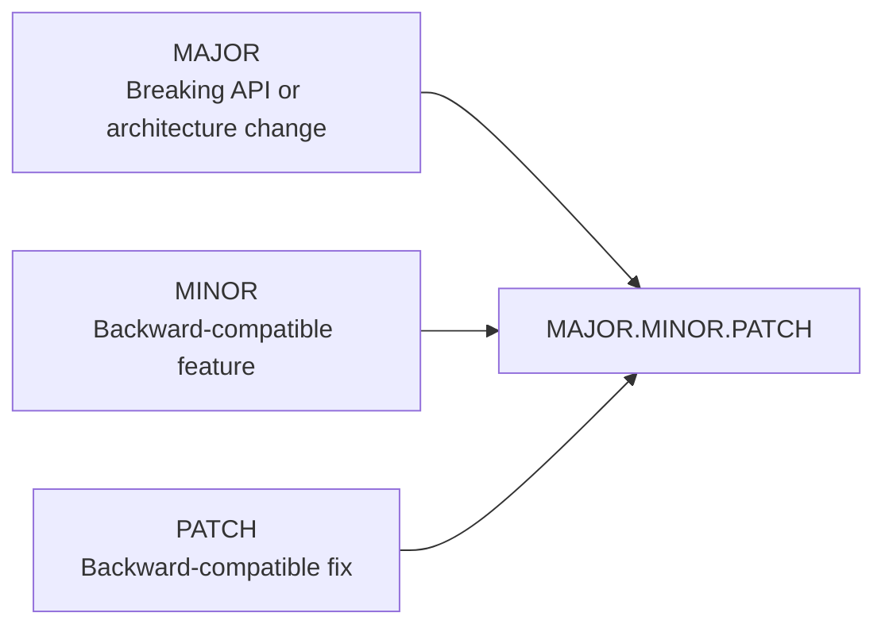
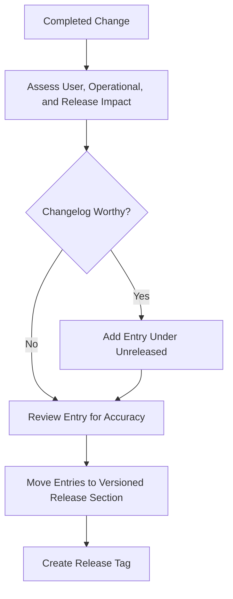

# CHANGELOG.md

> **Document Purpose**
>
> This changelog records user-visible, engineering-significant, and release-relevant changes to the Cryptocurrency Price API.
>
> It provides a concise historical record of what changed between versions.
>
> This document does not replace Git commit history, implementation task tracking, architecture records, or release certification. Those responsibilities belong to Git, `IMPLEMENTATION_WORK_BREAKDOWN.md`, `ENGINEERING_JOURNAL.md`, and `RELEASE_CHECKLIST.md`.

---

# Table of Contents

1. Changelog Policy
2. Versioning Strategy
3. Change Categories
4. Unreleased
5. Version 1.0.0 — Interview Release
6. Pre-Release Documentation Foundation
7. Release Entry Template
8. Change Classification Rules
9. Maintenance Requirements
10. Related Documentation

---

# 1. Changelog Policy

This changelog follows the principles of [Keep a Changelog](https://keepachangelog.com/) while remaining tailored to this repository.

A changelog entry should help a reviewer, recruiter, interviewer, maintainer, or future contributor understand:

- What changed.
- Why the change matters.
- Whether application behaviour changed.
- Whether configuration, infrastructure, testing, or documentation changed.
- Whether an upgrade or migration action is required.

The changelog should remain concise.

Detailed implementation reasoning belongs in:

```text
docs/ENGINEERING_JOURNAL.md
```

Detailed work-item status belongs in:

```text
development/IMPLEMENTATION_WORK_BREAKDOWN.md
```

---

# 2. Versioning Strategy

The project uses Semantic Versioning principles.



## Version Format

```text
MAJOR.MINOR.PATCH
```

Example:

```text
1.0.0
```

## Version Meaning

| Segment | Meaning                                                                       | Example |
| ------- | ----------------------------------------------------------------------------- | ------- |
| `MAJOR` | Backward-incompatible API, contract, or major architecture change.            | `2.0.0` |
| `MINOR` | Backward-compatible feature or meaningful capability addition.                | `1.1.0` |
| `PATCH` | Backward-compatible bug fix, documentation correction, or maintenance update. | `1.0.1` |

## Pre-Release Labels

Pre-release versions may be used before final interview submission.

Examples:

```text
0.1.0
0.5.0
0.9.0
1.0.0-rc.1
```

| Label          | Intended Use                                                      |
| -------------- | ----------------------------------------------------------------- |
| `0.x.x`        | Active implementation before first stable release.                |
| `-alpha.x`     | Early incomplete implementation not ready for review.             |
| `-beta.x`      | Feature-complete candidate requiring wider validation.            |
| `-rc.x`        | Release candidate pending final certification.                    |
| Stable version | Approved release ready for interview demonstration or deployment. |

---

# 3. Change Categories

Every meaningful change should be grouped under one of the following headings.

| Category   | Use When                                                                                              |
| ---------- | ----------------------------------------------------------------------------------------------------- |
| Added      | A new feature, component, endpoint, test capability, document, or operational workflow is introduced. |
| Changed    | Existing behaviour, configuration, architecture, or documentation is modified.                        |
| Deprecated | A supported feature or approach is planned for removal.                                               |
| Removed    | A feature, dependency, endpoint, configuration value, or document is removed.                         |
| Fixed      | A defect, reliability issue, incorrect behaviour, or documentation error is corrected.                |
| Security   | A vulnerability, unsafe configuration, credential-handling issue, or security control is addressed.   |

Use only the sections that contain changes.

Do not create empty category headings.

---

# 4. Unreleased

> Changes listed here have been completed on the working branch but are not yet included in a tagged release.

## Added

- Initial repository documentation architecture under `docs/` and `development/`.
- `README.md` as the project entry point and technical documentation index.
- `PROJECT_SPECIFICATIONS.md` as the authoritative project requirements document.
- `ARCHITECTURE.md` defining system boundaries, dependency direction, cache-first reads, background refresh flow, and graceful-degradation behaviour.
- `DATABASE.md` defining the `CryptoPrice` persistence model, decimal storage strategy, composite uniqueness scope, indexing expectations, and migration principles.
- `API.md` defining the `GET /prices/:symbol` contract, response format, validation rules, status codes, and error envelope.
- `BACKGROUND_JOBS.md` defining scheduled price refresh, job boundaries, retry principles, failure handling, and operational expectations.
- `TESTING.md` defining RSpec test boundaries, required resilience scenarios, coverage expectations, and CI quality gates.
- `JUNIOR_DEVELOPER_GUIDE.md` defining a reconstruction workflow from an empty repository.
- `ENGINEERING_JOURNAL.md` defining architecture decision records and initial accepted design decisions.
- `CONTRIBUTING.md` defining contribution workflow, branch strategy, code-review standards, testing requirements, and secret-management rules.
- `CHANGELOG.md` defining release-history and version-management conventions.

## Planned

- Rails API-only application foundation.
- PostgreSQL persistence configuration.
- Redis cache and background queue infrastructure.
- CoinGecko provider client.
- Cache-first price query service.
- Scheduled background price-refresh job.
- `GET /prices/:symbol` endpoint implementation.
- RSpec test suite.
- Docker Compose local development environment.
- GitHub Actions continuous integration workflow.
- Version `1.0.0` release certification.

---

# 5. Version 1.0.0 — Interview Release

> **Status:** Planned
> **Release Date:** To be assigned after all release gates pass.

## Added

### API

- `GET /prices/:symbol` endpoint.
- Normalized cryptocurrency symbol handling.
- Stable JSON response containing:
  - `symbol`
  - `price`
  - `currency`
  - `last_updated_at`

- Consistent JSON error envelope.
- Error responses for invalid symbols, unsupported symbols, unavailable stored prices, and unexpected server errors.

### Price Retrieval

- Cache-first price retrieval.
- PostgreSQL fallback when cache is unavailable or empty.
- Cache repopulation from persisted values after cache misses.
- Cache-independent public API read path.

### Provider Integration

- CoinGecko provider client.
- Provider-specific symbol mapping.
- Provider response validation.
- Connection and read timeout configuration.
- Controlled provider error translation.
- Secret-safe CoinGecko API-key configuration.

### Persistence

- `CryptoPrice` model.
- Decimal price storage.
- Persisted `fetched_at` timestamp.
- Composite unique record identity based on symbol, currency, and provider.
- Upsert-oriented persistence behaviour.
- Durable last-known valid price retention.

### Background Processing

- Scheduled price refresh every minute.
- Background job delegation through ActiveJob.
- Sidekiq-backed execution, subject to final scheduler decision verification.
- Configurable symbol and currency refresh scope.
- Bounded retry behaviour for transient failures.
- Controlled handling of provider, cache, and persistence failures.

### Resilience

- Last-known valid value fallback when CoinGecko is unavailable.
- Preservation of valid database records after provider failure.
- Prevention of cache overwrite when persistence fails.
- API continuity when a previously stored price exists.
- Safe not-found response when no valid historical value exists.

### Testing

- Model specifications.
- Repository specifications.
- Cache specifications.
- CoinGecko client specifications.
- Query service specifications.
- Refresh service specifications.
- Background job specifications.
- Request specifications.
- Integration specifications for critical cross-layer flows.
- Provider-outage fallback coverage.
- Cache-miss database-recovery coverage.
- Duplicate refresh and idempotency coverage.
- SimpleCov coverage reporting and configured threshold.

### Developer Experience

- Dockerfile for Rails application runtime.
- Docker Compose environment for Rails, PostgreSQL, Redis, and background worker processes.
- `.env.example` with safe configuration placeholders.
- `.gitignore` and `.dockerignore` secret and artifact protections.
- Junior developer reconstruction guide.

### Quality and Security

- RuboCop static code-quality checks.
- Brakeman Rails security scanning.
- GitHub Actions continuous integration workflow.
- Automated test, coverage, lint, and security quality gates.
- Secret-management rules for local, CI, and deployed environments.

### Documentation

- Complete public and internal project documentation set.
- Mermaid architecture, sequence, data-flow, and workflow diagrams.
- Engineering decision records.
- Contribution standards.
- Release certification checklist.

---

# 6. Pre-Release Documentation Foundation

## 0.1.0 — Documentation and Governance Foundation

> **Status:** Completed documentation milestone
> **Date:** 2026-07-07

## Added

- Initial project specification and implementation governance.
- Engineering principles and delivery-quality standards.
- Detailed implementation roadmap.
- Detailed work breakdown structure.
- High-level feature and progress checklist.
- Release certification checklist.
- Repository-facing documentation structure.
- Architecture, database, API, background-jobs, testing, onboarding, contribution, decision-record, and changelog documents.

## Changed

- Standardized documentation naming and ownership boundaries.
- Established `docs/` for repository-facing technical documentation.
- Established `development/` for implementation governance and delivery tracking.
- Replaced ambiguous document responsibilities with explicit single-responsibility documentation.

## Notes

This milestone establishes the documentation and governance baseline only.

It does not indicate that Rails code, Docker configuration, background jobs, tests, CI, or external-provider integration are complete.

---

# 7. Release Entry Template

Copy this template when preparing a future release.

```markdown
# [X.Y.Z] — YYYY-MM-DD

> **Release Status:** Draft | Candidate | Released
>
> **Release Type:** Major | Minor | Patch
>
> **Release Summary:** One or two sentences describing the purpose of the release.

## Added

- ...

## Changed

- ...

## Deprecated

- ...

## Removed

- ...

## Fixed

- ...

## Security

- ...

## Verification

- [ ] Full RSpec suite passed.
- [ ] Coverage threshold passed.
- [ ] RuboCop passed.
- [ ] Brakeman passed.
- [ ] Docker build passed.
- [ ] Docker runtime verification passed.
- [ ] GitHub Actions passed.
- [ ] Documentation review completed.
- [ ] Release checklist completed.

## Upgrade Notes

Describe required environment, configuration, database, or deployment actions.

## Related References

- Pull Request:
- Tag:
- Engineering Journal Entries:
- Release Checklist:
```

---

# 8. Change Classification Rules

## Add an `Added` Entry When

- A new endpoint is introduced.
- A new supported cryptocurrency symbol is introduced.
- A new background job is introduced.
- A new provider capability is introduced.
- A new configuration option is introduced.
- A new test category is introduced.
- A new operational process is introduced.
- A new document is introduced.

## Add a `Changed` Entry When

- Endpoint behaviour changes without breaking compatibility.
- Cache expiry or refresh configuration changes.
- Retry logic changes.
- A database query is optimized.
- Docker setup changes.
- CI workflow changes.
- Documentation is materially improved or reorganized.

## Add a `Fixed` Entry When

- A cache miss incorrectly returns an error despite persisted data.
- A provider timeout incorrectly causes public API failure.
- A duplicate refresh creates duplicate current records.
- An API response violates the documented contract.
- A migration, test, Docker workflow, or CI process is corrected.

## Add a `Security` Entry When

- A dependency vulnerability is addressed.
- A secret-handling issue is corrected.
- Input validation is strengthened.
- Unsafe error output is removed.
- Authentication, authorization, rate limiting, or secure transport is introduced.

## Do Not Add an Entry For

- Whitespace-only changes.
- Local-only file changes.
- Temporary debugging output that is removed before merge.
- Unreleased experimental work that is discarded.
- Commit-message corrections with no repository behaviour impact.

---

# 9. Maintenance Requirements

Update this changelog when a change is:

- Included in a tagged version.
- Relevant to API consumers.
- Relevant to a reviewer or interviewer.
- Relevant to deployment or local development.
- Relevant to reliability, security, performance, or compatibility.
- Relevant to configuration, infrastructure, or release procedures.
- A material correction to previously documented behaviour.

## Changelog Workflow



## Release Workflow

When a release is approved:

1. Review all entries under `Unreleased`.
2. Group entries under the appropriate change category.
3. Replace `Unreleased` entries with a versioned release heading.
4. Add the release date.
5. Add verification results.
6. Confirm related documentation and release checklist completion.
7. Create the Git tag.
8. Keep a new empty `Unreleased` section at the top.

---

# 10. Related Documentation

| Document                                                                                       | Relationship                                               |
| ---------------------------------------------------------------------------------------------- | ---------------------------------------------------------- |
| [`README.md`](README.md)                                                                       | Project overview, quick start, and current project status. |
| [`docs/PROJECT_SPECIFICATIONS.md`](docs/PROJECT_SPECIFICATIONS.md)                             | Authoritative requirements governing feature changes.      |
| [`docs/ARCHITECTURE.md`](docs/ARCHITECTURE.md)                                                 | Architecture changes that may require changelog entries.   |
| [`docs/API.md`](docs/API.md)                                                                   | Public API compatibility and contract changes.             |
| [`docs/DATABASE.md`](docs/DATABASE.md)                                                         | Schema and persistence changes.                            |
| [`docs/BACKGROUND_JOBS.md`](docs/BACKGROUND_JOBS.md)                                           | Scheduling, retry, and background-processing changes.      |
| [`docs/TESTING.md`](docs/TESTING.md)                                                           | Test-strategy and quality-gate changes.                    |
| [`docs/ENGINEERING_JOURNAL.md`](docs/ENGINEERING_JOURNAL.md)                                   | Detailed rationale for material decisions.                 |
| [`CONTRIBUTING.md`](CONTRIBUTING.md)                                                           | Contribution workflow and change-submission standards.     |
| [`development/RELEASE_CHECKLIST.md`](development/RELEASE_CHECKLIST.md)                         | Final release certification.                               |
| [`development/IMPLEMENTATION_WORK_BREAKDOWN.md`](development/IMPLEMENTATION_WORK_BREAKDOWN.md) | Detailed implementation status and work tracking.          |

---

# Changelog Maintenance Statement

The changelog is a release communication artifact.

It should answer what changed without forcing readers to inspect every commit.

Keep entries accurate, concise, meaningful, and focused on changes that matter to users, reviewers, operators, and future maintainers.
