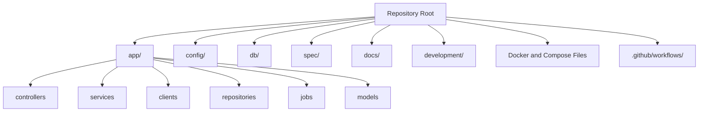
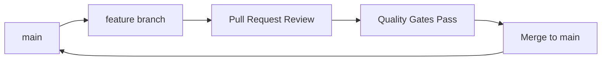
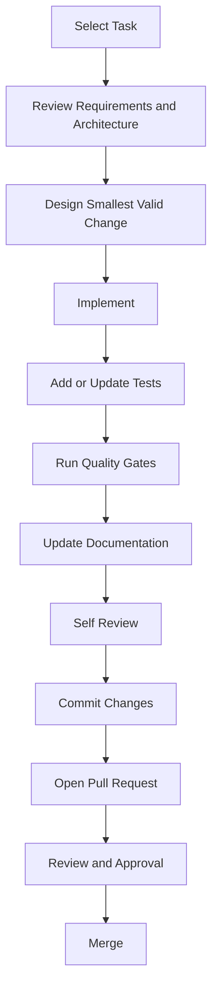
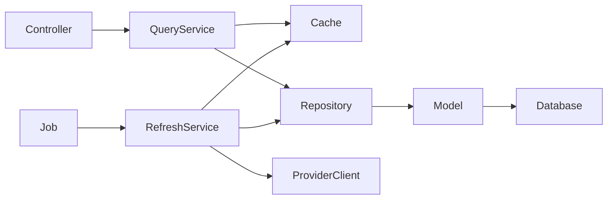
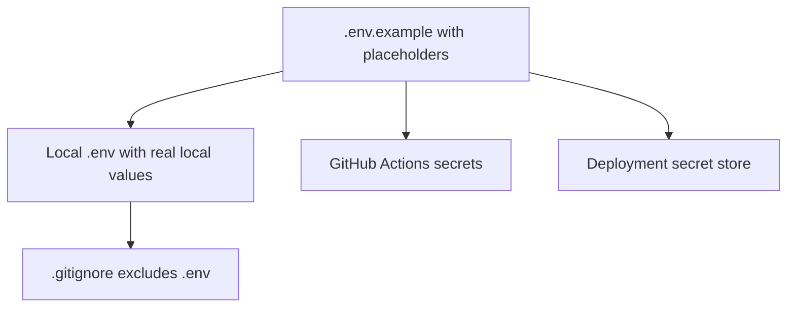
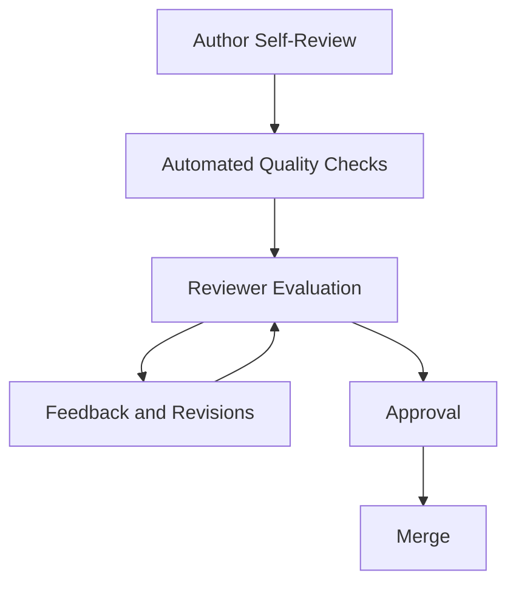
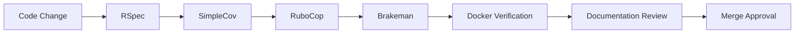
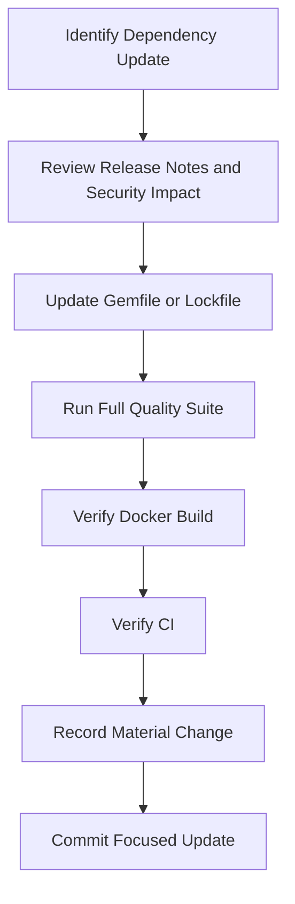

# CONTRIBUTING.md

> **Document Purpose**
>
> This document defines how contributors should propose, implement, test, document, and submit changes to the Cryptocurrency Price API.
>
> It establishes contribution expectations for code, tests, documentation, Git history, quality checks, reviews, and engineering decisions.
>
> This document does not define project requirements or architecture. Those responsibilities belong to `docs/PROJECT_SPECIFICATIONS.md` and `docs/ARCHITECTURE.md`.

---

# Table of Contents

1. Contribution Principles
2. Before You Begin
3. Repository Orientation
4. Development Setup
5. Selecting Work
6. Branching Strategy
7. Contribution Workflow
8. Code Standards
9. Architecture Boundaries
10. Testing Requirements
11. Documentation Requirements
12. Configuration and Secret Management
13. Git Commit Standards
14. Pull Request Standards
15. Review Expectations
16. Quality Gates
17. Reporting Defects
18. Proposing Enhancements
19. Updating Dependencies
20. Release Contributions
21. Contributor Checklist
22. Related Documentation

---

# 1. Contribution Principles

Every contribution must improve the repository without weakening its architecture, tests, documentation, reliability, or operational readiness.

The project follows these principles:

- Prefer simple, readable solutions.
- Preserve documented architectural boundaries.
- Add tests for every meaningful behaviour change.
- Update documentation with implementation changes.
- Treat external-provider failures as expected conditions.
- Keep the repository in a releasable state.
- Do not introduce speculative abstractions.
- Do not commit secrets, credentials, generated artifacts, or local machine configuration.

The complete engineering charter is defined in:

```text
development/ENGINEERING_PRINCIPLES.md
```

---

# 2. Before You Begin

Before beginning work, read the documents relevant to the change.

| Change Type                               | Required Reading                                         |
| ----------------------------------------- | -------------------------------------------------------- |
| Any implementation change                 | `docs/PROJECT_SPECIFICATIONS.md`                         |
| Architecture or component-boundary change | `docs/ARCHITECTURE.md` and `docs/ENGINEERING_JOURNAL.md` |
| Database change                           | `docs/DATABASE.md`                                       |
| API contract change                       | `docs/API.md`                                            |
| Background-job or scheduler change        | `docs/BACKGROUND_JOBS.md`                                |
| Test change                               | `docs/TESTING.md`                                        |
| Project workflow or milestone change      | `development/IMPLEMENTATION_ROADMAP.md`                  |
| Detailed feature implementation           | `development/IMPLEMENTATION_WORK_BREAKDOWN.md`           |
| Release work                              | `development/RELEASE_CHECKLIST.md`                       |

Do not begin implementation until the relevant requirements and acceptance criteria are understood.

---

# 3. Repository Orientation

The repository separates production application code, public technical documentation, and development-governance artifacts.



## Important Directories

| Directory            | Responsibility                                                            |
| -------------------- | ------------------------------------------------------------------------- |
| `app/controllers/`   | HTTP request handling and response rendering.                             |
| `app/services/`      | Application workflow and business orchestration.                          |
| `app/clients/`       | CoinGecko communication and provider-specific parsing.                    |
| `app/repositories/`  | ActiveRecord query and persistence boundaries.                            |
| `app/jobs/`          | Background-job orchestration.                                             |
| `app/models/`        | Persisted domain entities and validations.                                |
| `spec/`              | Automated test suite organized by architectural boundary.                 |
| `docs/`              | Documentation explaining the completed system.                            |
| `development/`       | Engineering workflow, quality standards, planning, and release artifacts. |
| `docker/`            | Docker-related support files, if required.                                |
| `.github/workflows/` | Continuous integration workflows.                                         |

---

# 4. Development Setup

## Prerequisites

You need:

- Git
- Docker and Docker Compose
- Ruby version defined in `.ruby-version`
- Bundler
- A valid local `.env` file
- A CoinGecko API key for manual provider verification only

## Initial Setup

Clone the repository:

```bash
git clone git@github.com:JoelBright/crypto-price-api.git
cd crypto-price-api
```

Create local environment configuration:

```bash
cp .env.example .env
```

Update `.env` with valid local values.

Do not commit `.env`.

Start the local environment:

```bash
docker compose up --build
```

Prepare the database:

```bash
docker compose exec web bin/rails db:prepare
```

Run the test suite:

```bash
docker compose run --rm web bundle exec rspec
```

Run static analysis:

```bash
docker compose run --rm web bundle exec rubocop
docker compose run --rm web bundle exec brakeman
```

A contribution should not begin until the current branch can pass the project quality checks.

---

# 5. Selecting Work

All planned work is tracked in:

```text
development/IMPLEMENTATION_WORK_BREAKDOWN.md
```

The high-level delivery state is tracked in:

```text
development/FEATURE_CHECKLIST.md
```

## Work Selection Rules

Before starting a task:

1. Identify the relevant task ID.
2. Review its dependencies.
3. Review related requirements.
4. Review associated documentation.
5. Confirm the expected verification method.
6. Mark the task as in progress only when implementation begins.

Do not start a task from a later phase while its dependency phase remains incomplete unless the deviation is explicitly recorded in `ENGINEERING_JOURNAL.md`.

---

# 6. Branching Strategy

Use short-lived branches for focused changes.



## Branch Naming

Use one of the following prefixes.

| Prefix      | Use Case                                            | Example                          |
| ----------- | --------------------------------------------------- | -------------------------------- |
| `feature/`  | New implementation work                             | `feature/price-query-service`    |
| `fix/`      | Defect correction                                   | `fix/cache-miss-fallback`        |
| `test/`     | Test-only improvements                              | `test/provider-timeout-coverage` |
| `docs/`     | Documentation-only change                           | `docs/update-api-errors`         |
| `chore/`    | Tooling, dependency, or maintenance work            | `chore/configure-rubocop`        |
| `refactor/` | Structural change without intended behaviour change | `refactor/extract-price-cache`   |

## Branch Rules

- One branch should address one logical concern.
- Do not combine unrelated refactoring with a feature unless required for correctness.
- Keep branches short-lived.
- Rebase or merge from `main` before requesting review when needed.
- Do not commit directly to `main` for material implementation work.

---

# 7. Contribution Workflow

Every contribution follows the same lifecycle.



## Required Workflow Steps

### Step 1: Review

Review the relevant requirements, architecture, and task checklist before editing code.

### Step 2: Design

Describe the change in one or two sentences before implementation.

If the responsibility cannot be stated clearly, simplify the design or create an engineering decision record.

### Step 3: Implement

Implement only the behaviour needed to satisfy the documented task.

Avoid unrelated cleanup unless it is required for correctness or clearly isolated.

### Step 4: Test

Add or update tests before considering the work complete.

### Step 5: Verify

Run focused tests, then the full quality suite.

### Step 6: Document

Update technical and operational documentation that describes the changed behaviour.

### Step 7: Review

Perform a self-review before opening a pull request.

---

# 8. Code Standards

## General Standards

Code should be:

- Readable.
- Explicit.
- Small in scope.
- Consistent with Rails conventions.
- Easy to test.
- Free from dead code.
- Free from commented-out production code.
- Free from unresolved `TODO` comments unless explicitly approved and documented.

## Naming Standards

Use names that communicate intent.

Preferred:

```ruby
price_record = repository.find_latest(symbol: symbol, currency: currency)
```

Avoid:

```ruby
record = repo.find(symbol, currency)
```

Preferred:

```ruby
raise ProviderTimeoutError, "CoinGecko request timed out"
```

Avoid:

```ruby
raise StandardError, "failed"
```

## Method Standards

Methods should:

- Have one primary responsibility.
- Use descriptive names.
- Avoid excessive argument lists.
- Avoid hidden global dependencies.
- Return values that communicate useful outcomes.
- Raise controlled application exceptions only when appropriate.

## Class Standards

Every production class must have:

1. A clearly defined responsibility.
2. A documented architectural location.
3. Corresponding automated tests.
4. Documentation updates where behaviour or architecture changes.

---

# 9. Architecture Boundaries

The following dependency direction must be preserved.



## Controller Rules

Controllers may:

- Read request parameters.
- Invoke application services.
- Render JSON.
- Map application errors to HTTP responses.

Controllers must not:

- Call CoinGecko directly.
- Query ActiveRecord directly.
- Read or write cache directly.
- Implement price fallback behaviour.
- Contain business orchestration.

## Service Rules

Services may:

- Coordinate repositories, clients, and cache abstractions.
- Implement cache-first lookup and fallback behaviour.
- Coordinate provider refresh and persistence flow.
- Return stable application-level result objects.

Services must not:

- Render HTTP responses.
- Depend on route definitions.
- Contain raw provider HTTP configuration.
- Use raw ActiveRecord query logic directly.

## Repository Rules

Repositories may:

- Find persisted prices.
- Upsert current prices.
- Encapsulate ActiveRecord query details.

Repositories must not:

- Call external providers.
- Update cache.
- Render responses.
- Decide retry or fallback policy.

## Background Job Rules

Jobs may:

- Invoke application services.
- Participate in configured retries.
- Log job lifecycle events.

Jobs must not:

- Reimplement refresh logic.
- Query models directly.
- Call CoinGecko directly.
- Write cache entries directly.

---

# 10. Testing Requirements

Every contribution that changes behaviour must include appropriate automated tests.

The full testing strategy is defined in:

```text
docs/TESTING.md
```

## Required Test Scope

| Change Type                         | Required Test Coverage                            |
| ----------------------------------- | ------------------------------------------------- |
| Model validation or normalization   | Model specs.                                      |
| Repository behaviour                | Repository specs.                                 |
| Cache behaviour                     | Cache specs and relevant service specs.           |
| Provider parsing or failure mapping | Client specs.                                     |
| Query or refresh behaviour          | Service specs.                                    |
| Job execution or retry behaviour    | Job specs.                                        |
| API endpoint or error response      | Request specs.                                    |
| Cross-layer user-visible flow       | Focused integration spec.                         |
| Production defect                   | Regression test proving the defect remains fixed. |

## Test Rules

Tests must:

- Be deterministic.
- Avoid live CoinGecko calls.
- Avoid real one-minute scheduling waits.
- Avoid dependency on execution order.
- Use controlled time where timestamps matter.
- Use factories or explicit fixtures for persisted data.
- Verify observable behaviour rather than private methods.

## Required Commands

Run focused tests first:

```bash
docker compose run --rm web bundle exec rspec spec/services/price_query_service_spec.rb
```

Then run the complete test suite:

```bash
docker compose run --rm web bundle exec rspec
```

---

# 11. Documentation Requirements

Documentation is part of the implementation.

Update documentation whenever a change affects:

- Requirements.
- Architecture.
- Database schema.
- API contract.
- Background scheduling.
- Retry or fallback behaviour.
- Test strategy.
- Environment configuration.
- Docker workflow.
- Release process.

## Documentation Ownership

| Change                                      | Documentation to Review                                                               |
| ------------------------------------------- | ------------------------------------------------------------------------------------- |
| New or changed route                        | `docs/API.md`, `README.md`, `docs/TESTING.md`                                         |
| New service or changed dependency direction | `docs/ARCHITECTURE.md`, `docs/ENGINEERING_JOURNAL.md`                                 |
| New migration or index                      | `docs/DATABASE.md`, `docs/JUNIOR_DEVELOPER_GUIDE.md`                                  |
| Background-job change                       | `docs/BACKGROUND_JOBS.md`, `docs/TESTING.md`                                          |
| Test approach change                        | `docs/TESTING.md`                                                                     |
| Docker or local setup change                | `README.md`, `docs/JUNIOR_DEVELOPER_GUIDE.md`                                         |
| Material design decision                    | `docs/ENGINEERING_JOURNAL.md`                                                         |
| New work package or milestone               | `development/IMPLEMENTATION_WORK_BREAKDOWN.md` and `development/FEATURE_CHECKLIST.md` |

Do not duplicate the same content across multiple documents. Update the document that owns the information and link to it from related documents when necessary.

---

# 12. Configuration and Secret Management

## Secret Rules

Never commit:

- `.env`
- Real CoinGecko API keys
- `config/master.key`
- Production database credentials
- Redis credentials
- GitHub access tokens
- Session keys
- Any copied output containing secrets

## Safe Configuration Workflow



## Environment Variables

When adding a new environment variable:

1. Add a placeholder to `.env.example`.
2. Document its purpose in the relevant documentation.
3. Add a safe default only if appropriate.
4. Ensure tests configure it explicitly when needed.
5. Never add a real secret to the repository.

---

# 13. Git Commit Standards

Commits should communicate one logical, reviewable, verifiable change.

## Commit Format

Use conventional-style commit prefixes.

| Prefix      | Purpose                             | Example                                          |
| ----------- | ----------------------------------- | ------------------------------------------------ |
| `feat:`     | New application capability          | `feat: add cached price query service`           |
| `fix:`      | Behaviour correction                | `fix: preserve stored price on provider timeout` |
| `test:`     | Test additions or corrections       | `test: cover cache miss database fallback`       |
| `docs:`     | Documentation changes               | `docs: describe price refresh failure handling`  |
| `refactor:` | Internal structural improvement     | `refactor: isolate cache key generation`         |
| `chore:`    | Tooling, configuration, maintenance | `chore: configure GitHub Actions quality gates`  |
| `ci:`       | Continuous integration change       | `ci: add PostgreSQL service to test workflow`    |
| `release:`  | Release tagging or release notes    | `release: prepare interview submission v1.0`     |

## Commit Rules

A commit should:

- Leave the repository in a working state.
- Include tests when code behaviour changes.
- Include documentation when public, architectural, or operational behaviour changes.
- Avoid unrelated formatting changes.
- Avoid generated files unless required by the project.
- Have a message that states what changed.

Avoid messages such as:

```text
updates
fix
changes
work in progress
final
```

---

# 14. Pull Request Standards

A pull request should contain one coherent change set.

## Required Pull Request Description

Use this structure:

```markdown
## Summary

Describe the change in one or two concise paragraphs.

## Related Requirement or Task

- Requirement IDs:
- Work Breakdown Task IDs:

## Design Notes

Explain relevant architecture or implementation decisions.

## Tests Added or Updated

List test files and scenarios.

## Documentation Updated

List documentation files changed.

## Verification Performed

- [ ] Focused tests
- [ ] Full RSpec suite
- [ ] RuboCop
- [ ] Brakeman
- [ ] Docker verification, if applicable

## Risks or Follow-Up Work

List known limitations, deferred work, or implementation risks.
```

## Pull Request Scope Rules

A pull request should not mix:

- A feature and an unrelated refactor.
- A dependency upgrade and unrelated behaviour changes.
- A documentation reorganization and an API contract change.
- Multiple independent features.

Split unrelated work into separate pull requests or commits.

---

# 15. Review Expectations

Code review is a quality activity, not a formality.



## Reviewer Checklist

### Requirements

- Does the change satisfy the documented requirement?
- Is the scope limited to the intended task?
- Is there a clear acceptance criterion?

### Architecture

- Are controller, service, repository, cache, provider, and job boundaries preserved?
- Does the new class have one clear responsibility?
- Does dependency direction remain correct?

### Reliability

- Does the change handle expected failure conditions?
- Does it preserve the last known valid value when appropriate?
- Does it avoid exposing provider failures directly to API consumers?

### Tests

- Do tests verify behaviour?
- Are failure scenarios covered?
- Are tests deterministic?
- Does the test suite avoid real provider calls?

### Documentation

- Are relevant documents updated?
- Do examples and diagrams remain accurate?
- Are new configuration values documented?

### Security

- Are secrets protected?
- Are user inputs validated?
- Are errors safe for consumers?
- Does Brakeman remain clean?

---

# 16. Quality Gates

Every contribution must satisfy these checks before merge.



## Required Commands

```bash
docker compose run --rm web bundle exec rspec
docker compose run --rm web bundle exec rubocop
docker compose run --rm web bundle exec brakeman
docker compose build
```

Run additional checks when relevant:

```bash
docker compose exec web bin/rails db:prepare
curl --include http://localhost:3000/prices/btc
```

A contributor must not mark work complete if any required quality gate fails.

---

# 17. Reporting Defects

A defect report should describe reproducible behaviour, not only a general impression.

## Defect Report Template

```markdown
## Summary

Describe the observed defect.

## Environment

- Branch or commit:
- Ruby version:
- Docker version:
- Rails environment:

## Steps to Reproduce

1. ...
2. ...
3. ...

## Expected Behaviour

Describe the correct expected result.

## Actual Behaviour

Describe the observed result.

## Logs or Error Output

Include sanitized output only. Do not include credentials or secrets.

## Suggested Test Coverage

Describe the regression test that should prevent recurrence.
```

## Defect Handling Rule

Every corrected production defect requires an automated regression test unless the defect is strictly documentation-only or configuration-only and a test is not technically meaningful.

---

# 18. Proposing Enhancements

Version 1.0 has intentionally limited scope.

Before proposing an enhancement, verify whether it belongs in:

- Current project requirements.
- Deferred future considerations.
- A new approved scope change.

## Enhancement Proposal Template

```markdown
## Problem

What current limitation does the enhancement address?

## Proposed Change

Describe the smallest useful enhancement.

## Requirement Impact

Which existing requirements change or which new requirement is proposed?

## Architecture Impact

Which components, dependencies, or boundaries are affected?

## Testing Impact

Which tests must be added or changed?

## Documentation Impact

Which documents need updates?

## Alternatives Considered

List simpler or lower-risk alternatives.

## Scope Decision

Is this required for Version 1.0, deferred, or rejected?
```

## Scope Rule

Do not implement an enhancement only because it is technically interesting.

The enhancement must solve a documented requirement, reliability concern, security issue, or approved engineering need.

---

# 19. Updating Dependencies

Dependency updates can change security posture, runtime behaviour, and CI compatibility.

## Dependency Update Workflow



## Dependency Rules

- Update one logical dependency group at a time when practical.
- Review release notes for major upgrades.
- Do not update dependencies solely to obtain the latest version.
- Record material upgrades in `ENGINEERING_JOURNAL.md`.
- Run all quality gates after dependency changes.
- Update Docker images only after validating compatibility.

---

# 20. Release Contributions

Release-related changes require additional verification.

Before contributing release work, review:

```text
development/RELEASE_CHECKLIST.md
```

## Release Contribution Requirements

Release work must verify:

- Functional requirements are complete.
- Non-functional requirements are complete.
- Requirements Traceability Matrix is complete.
- Full test suite passes.
- Coverage threshold is met.
- RuboCop passes.
- Brakeman passes.
- Docker build succeeds.
- CI passes.
- Documentation is complete.
- Junior Developer Guide has been validated from a clean environment.
- Repository history is clean and understandable.

No new features should be introduced during release certification.

---

# 21. Contributor Checklist

Use this checklist before opening a pull request.

## Implementation

- [ ] I reviewed the relevant requirements and task ID.
- [ ] My change has a clear and limited responsibility.
- [ ] I preserved architectural boundaries.
- [ ] I did not introduce unrelated changes.
- [ ] I did not add unnecessary dependencies or abstractions.

## Tests

- [ ] I added or updated meaningful tests.
- [ ] I included relevant success and failure scenarios.
- [ ] My tests do not call live CoinGecko endpoints.
- [ ] My tests are deterministic.
- [ ] Focused tests pass.
- [ ] Full RSpec suite passes.

## Quality

- [ ] RuboCop passes.
- [ ] Brakeman passes.
- [ ] Coverage requirements remain satisfied.
- [ ] Docker build succeeds when relevant.

## Documentation

- [ ] I updated the relevant documentation.
- [ ] I updated `ENGINEERING_JOURNAL.md` if the decision is material.
- [ ] I updated `.env.example` if configuration changed.
- [ ] I did not duplicate content across documents.

## Security

- [ ] I did not commit secrets.
- [ ] I validated external input where needed.
- [ ] I did not expose internal details through errors or logs.

## Git

- [ ] My commit messages are clear.
- [ ] My branch is focused.
- [ ] My working tree contains only intended changes.

---

# 22. Related Documentation

| Document                                                                                       | Relationship                                        |
| ---------------------------------------------------------------------------------------------- | --------------------------------------------------- |
| [`README.md`](README.md)                                                                       | Project overview, local setup, and quick start.     |
| [`docs/PROJECT_SPECIFICATIONS.md`](docs/PROJECT_SPECIFICATIONS.md)                             | Authoritative requirements.                         |
| [`docs/ARCHITECTURE.md`](docs/ARCHITECTURE.md)                                                 | Layer responsibilities and dependency rules.        |
| [`docs/DATABASE.md`](docs/DATABASE.md)                                                         | Persistence and migration responsibilities.         |
| [`docs/API.md`](docs/API.md)                                                                   | Public API contract.                                |
| [`docs/BACKGROUND_JOBS.md`](docs/BACKGROUND_JOBS.md)                                           | Scheduled refresh and job behaviour.                |
| [`docs/TESTING.md`](docs/TESTING.md)                                                           | Detailed test strategy.                             |
| [`docs/ENGINEERING_JOURNAL.md`](docs/ENGINEERING_JOURNAL.md)                                   | Material architecture and implementation decisions. |
| [`docs/JUNIOR_DEVELOPER_GUIDE.md`](docs/JUNIOR_DEVELOPER_GUIDE.md)                             | Full project recreation guide.                      |
| [`development/ENGINEERING_PRINCIPLES.md`](development/ENGINEERING_PRINCIPLES.md)               | Engineering charter and quality principles.         |
| [`development/IMPLEMENTATION_WORK_BREAKDOWN.md`](development/IMPLEMENTATION_WORK_BREAKDOWN.md) | Detailed engineering work items.                    |
| [`development/RELEASE_CHECKLIST.md`](development/RELEASE_CHECKLIST.md)                         | Final release certification process.                |

---

# Contribution Statement

Contributions are accepted only when they improve the repository in a measurable way.

A completed contribution is not merely code that runs. It is a change that:

- Satisfies a documented requirement.
- Preserves the project architecture.
- Includes meaningful automated verification.
- Maintains documentation accuracy.
- Passes required quality gates.
- Leaves the repository easier for the next engineer to understand and maintain.
