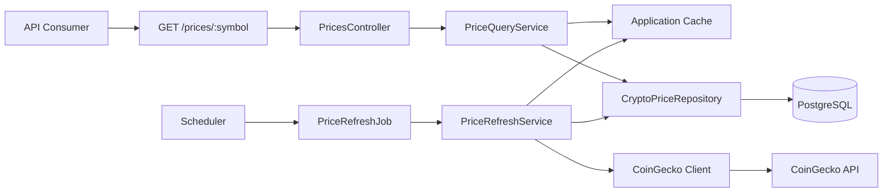
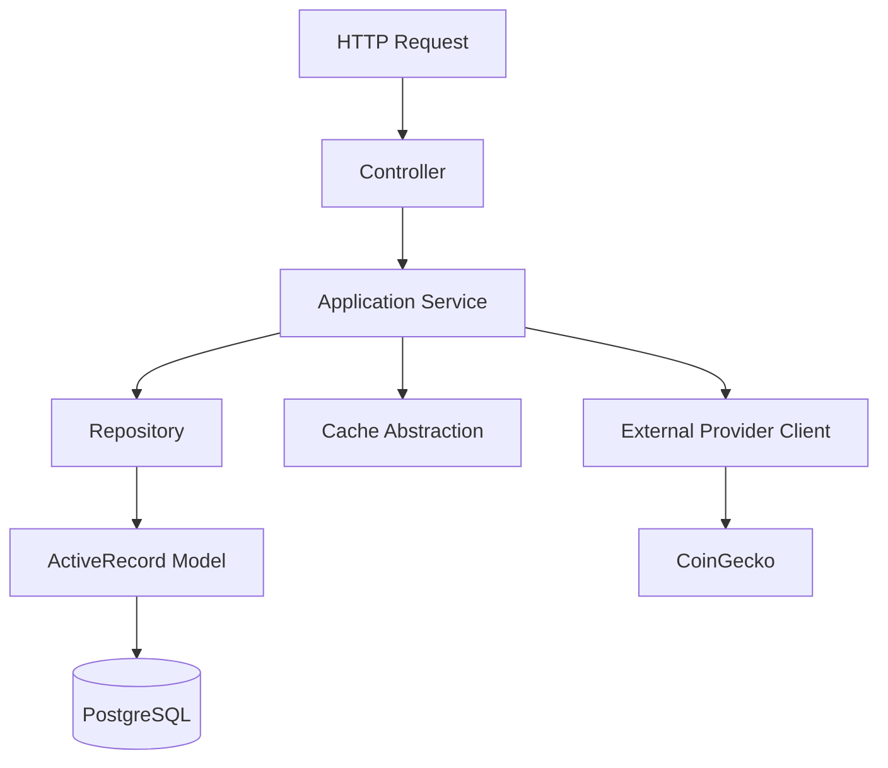
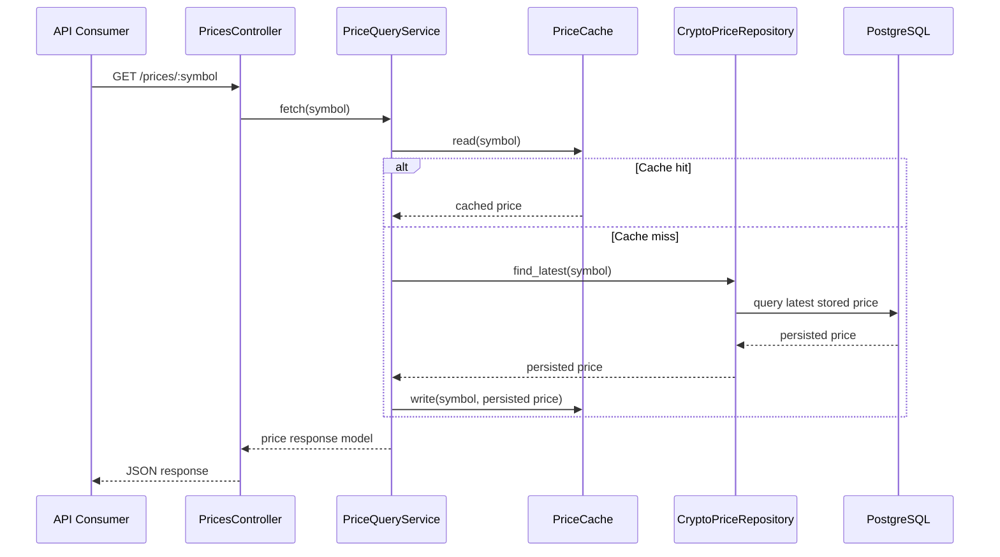
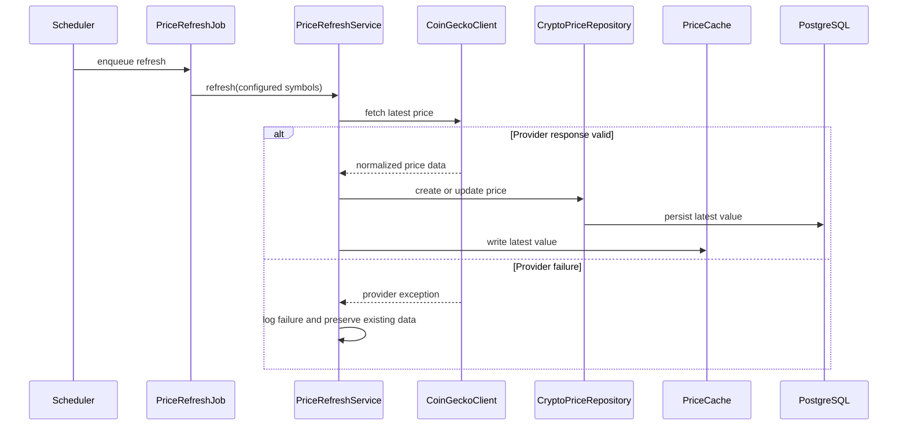
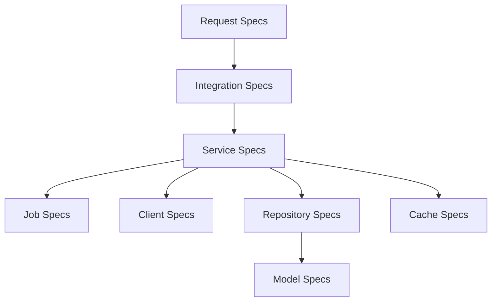
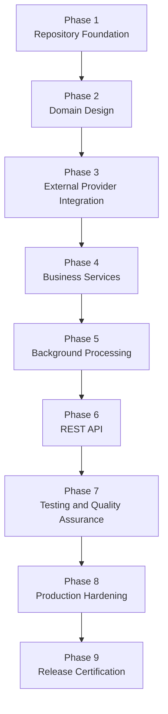

# Cryptocurrency Price API

A planned production-oriented Ruby on Rails API that will retrieve cryptocurrency prices from CoinGecko, store the latest known values, serve cached responses, and remain available when the external provider is temporarily unavailable.

> **Project Status:** Rails API foundation, Docker, CI, and repository governance complete; background infrastructure decision validated (Solid Queue with recurring scheduling); domain, provider, API endpoint remain deferred
> **Target Release:** Version 1.0.0 — Interview Release
> **Primary Use Case:** Demonstrate production-quality Rails API design, background processing, caching, graceful degradation, automated testing, containerization, and developer documentation.

---

## Table of Contents

- [Cryptocurrency Price API](#cryptocurrency-price-api)
  - [Table of Contents](#table-of-contents)
- [Project Overview](#project-overview)
- [Problem Statement](#problem-statement)
- [Solution Overview](#solution-overview)
- [Core Capabilities](#core-capabilities)
  - [Cached Price Retrieval](#cached-price-retrieval)
  - [Background Price Refresh](#background-price-refresh)
  - [Graceful Degradation](#graceful-degradation)
  - [Consistent API Responses](#consistent-api-responses)
- [Architecture Overview](#architecture-overview)
  - [Layer Responsibilities](#layer-responsibilities)
- [Request and Refresh Flows](#request-and-refresh-flows)
  - [API Read Flow](#api-read-flow)
  - [Background Refresh Flow](#background-refresh-flow)
- [Technology Stack](#technology-stack)
- [Repository Structure](#repository-structure)
- [Quick Start](#quick-start)
  - [Prerequisites](#prerequisites)
  - [Clone the Repository](#clone-the-repository)
  - [Configure Environment Variables](#configure-environment-variables)
  - [Docker](#docker)
  - [Start without Docker](#start-without-docker)
  - [Run the Test Suite](#run-the-test-suite)
- [Configuration](#configuration)
  - [Required Environment Variables](#required-environment-variables)
  - [Secret Management](#secret-management)
- [API Overview](#api-overview)
  - [Target Endpoint](#target-endpoint)
- [Testing and Quality](#testing-and-quality)
  - [Required Test Coverage](#required-test-coverage)
  - [Quality Gates](#quality-gates)
- [Documentation Index](#documentation-index)
  - [Start Here](#start-here)
  - [Technical Documentation](#technical-documentation)
  - [Development Governance](#development-governance)
- [Engineering Standards](#engineering-standards)
- [Project Roadmap](#project-roadmap)
- [Known Scope Boundaries](#known-scope-boundaries)
- [Interview Discussion Topics](#interview-discussion-topics)
  - [Why are prices refreshed in the background?](#why-are-prices-refreshed-in-the-background)
  - [Why persist prices as well as cache them?](#why-persist-prices-as-well-as-cache-them)
  - [Why use a repository layer in Rails?](#why-use-a-repository-layer-in-rails)
  - [Why isolate CoinGecko behind a client?](#why-isolate-coingecko-behind-a-client)
  - [Why test fallback logic explicitly?](#why-test-fallback-logic-explicitly)
- [Contributing](#contributing)
- [License](#license)

---

# Project Overview

The repository currently contains the Rails API-only foundation, PostgreSQL configuration, Ruby and Bundler dependency manifests, RSpec smoke verification, SimpleCov, RuboCop, Brakeman, FactoryBot, safe environment placeholders, Docker configuration, CI configuration, and project documentation. It does not yet contain domain models, provider clients, service/repository layers, the `/prices/:symbol` endpoint, or background-processing infrastructure.

The target Cryptocurrency Price API is a Rails API-only application designed to provide a reliable endpoint for retrieving the latest known price of a cryptocurrency.

The target application separates external provider communication from client-facing API requests.

Instead of calling CoinGecko whenever an API consumer requests a price, the target application refreshes prices in the background, persists the latest successful value, updates a cache, and serves that stored value through the public API.

This approach improves response time, reduces dependency on external-provider availability during user requests, and allows the application to continue serving the last known price when CoinGecko is unavailable.

---

# Problem Statement

Build a small Rails API that fetches cryptocurrency prices from a public API such as CoinGecko.

The project must satisfy the following functional requirements:

- Expose `GET /prices/:symbol`.
- Return a cached price for a requested cryptocurrency symbol.
- Fetch and store prices through a background job that runs every minute.
- Continue serving the last known price if the external provider fails.
- Include automated tests for job logic, fallback logic, and caching behaviour.

The project must also demonstrate production-quality engineering practices, including clear architecture, maintainability, testability, Docker support, continuous integration, security scanning, and comprehensive documentation.

---

# Solution Overview

The target API follows a cache-first, background-refresh architecture. This is an intended design shape, not an implemented application state.



In the target design, the API request path does not depend on a live CoinGecko response.

This design ensures that a temporary upstream outage does not unnecessarily make the public API unavailable.

---

# Core Capabilities

## Cached Price Retrieval

The public endpoint returns the most recently available price for a supported cryptocurrency symbol.

The read path follows this order:

1. Read from the cache.
2. Fall back to persisted data when the cache is empty or expired.
3. Repopulate the cache when persisted data is available.
4. Return a predictable response or a documented not-found response when no price has ever been stored.

---

## Background Price Refresh

The target design requires a scheduled background job (Solid Queue recurring task) to retrieve prices from CoinGecko every minute. The scheduler, queue adapter, and worker process layout have been validated (see ADR-017 in ENGINEERING_JOURNAL.md).

A successful refresh performs the following actions:

1. Requests the latest provider price.
2. Validates the provider response.
3. Persists the latest valid value.
4. Updates the application cache.
5. Records structured operational logs.

---

## Graceful Degradation

When CoinGecko is unavailable, slow, malformed, or otherwise fails:

- Existing database records remain unchanged.
- Existing cache entries remain available until normal cache-expiration behaviour applies.
- The next scheduled refresh attempts to retrieve updated data.
- API consumers continue receiving the most recently known valid value when one exists.
- The provider failure is logged with relevant operational context.

---

## Consistent API Responses

The target API returns predictable JSON responses for successful requests and failure conditions.

Target successful response:

```json
{
  "symbol": "btc",
  "price": 109283.12,
  "currency": "usd",
  "last_updated_at": "2026-07-07T10:35:00Z"
}
```

Target error response:

```json
{
  "error": {
    "code": "price_not_found",
    "message": "No stored price is available for symbol 'btc'."
  }
}
```

The final response contract, status codes, validation rules, and error schema are defined in [`docs/API.md`](docs/API.md).

---

# Architecture Overview

The project uses explicit architectural layers to keep responsibilities clear and independently testable.



## Layer Responsibilities

| Layer           | Responsibility                                                                                                 |
| --------------- | -------------------------------------------------------------------------------------------------------------- |
| Controller      | Accept HTTP requests, validate transport-level input, invoke services, and render responses.                   |
| Service         | Coordinate application behaviour, caching, persistence, provider interaction, and fallback behaviour.          |
| Repository      | Encapsulate persistence operations and isolate ActiveRecord queries.                                           |
| Model           | Represent persisted domain data and enforce persistence-level validations.                                     |
| Cache           | Encapsulate cache reads, writes, expiry, and invalidation behaviour.                                           |
| External Client | Encapsulate CoinGecko HTTP communication, parsing, validation, timeout handling, and provider-specific errors. |
| Background Job  | Trigger scheduled refresh behaviour without containing business logic.                                         |
| Scheduler       | Enqueue refresh jobs at the configured interval.                                                               |

For detailed design decisions and dependency boundaries, see [`docs/ARCHITECTURE.md`](docs/ARCHITECTURE.md).

---

# Request and Refresh Flows

## API Read Flow



---

## Background Refresh Flow



---

# Technology Stack

| Category               | Technology                                       | Purpose                                                                            |
| ---------------------- | ------------------------------------------------ | ---------------------------------------------------------------------------------- |
| Language               | Ruby                                             | Primary application language.                                                      |
| Framework              | Ruby on Rails API Mode                           | API framework, ActiveRecord, routing, configuration, and conventions.              |
| Database               | PostgreSQL                                       | Durable storage for the latest known cryptocurrency prices.                        |
| Background Processing  | Solid Queue 1.4+ (Accepted)                 | Database-backed Active Job backend with built-in recurring scheduling.              |
| Scheduling             | Solid Queue built-in recurring tasks             | One-minute refresh schedule managed by Solid Queue's recurring task scheduler.      |
| HTTP Client            | Deferred                                         | CoinGecko provider integration belongs to a later issue.                           |
| Cache                  | Rails Cache Store                                | Cache-first price retrieval.                                                       |
| Test Framework         | RSpec                                            | Unit, service, request, repository, client, and job testing.                       |
| Test Data              | FactoryBot                                       | Repeatable model creation for domain tests.                                        |
| Coverage               | SimpleCov                                        | Test coverage reporting and threshold enforcement.                                 |
| Linting                | RuboCop                                          | Ruby style and static analysis.                                                    |
| Security Scanning      | Brakeman                                         | Rails-focused static security analysis.                                            |
| Containers             | Docker and Docker Compose                        | Reproducible local development environment.                                        |
| Continuous Integration | GitHub Actions                                   | Automated test, lint, and security verification.                                   |

Exact dependency versions are recorded in `Gemfile.lock`.

---

# Repository Structure

The repository now contains the Rails foundation structure. The target tree below still includes future directories and files that remain deferred until their owning issues are implemented.

```text
crypto-price-api/
├── app/
│   ├── clients/
│   ├── controllers/
│   ├── jobs/
│   ├── models/
│   ├── repositories/
│   ├── services/
│   └── serializers/
│
├── config/
│   ├── environments/
│   ├── initializers/
│   ├── routes.rb
│   └── schedule configuration
│
├── db/
│   ├── migrate/
│   └── seeds.rb
│
├── docs/
│   ├── API.md
│   ├── ARCHITECTURE.md
│   ├── BACKGROUND_JOBS.md
│   ├── DATABASE.md
│   ├── ENGINEERING_JOURNAL.md
│   ├── JUNIOR_DEVELOPER_GUIDE.md
│   ├── PROJECT_SPECIFICATIONS.md
│   └── TESTING.md
│
├── development/
│   ├── ENGINEERING_PRINCIPLES.md
│   ├── FEATURE_CHECKLIST.md
│   ├── IMPLEMENTATION_ROADMAP.md
│   ├── IMPLEMENTATION_WORK_BREAKDOWN.md
│   └── RELEASE_CHECKLIST.md
│
├── docker/
├── spec/
│   ├── clients/
│   ├── jobs/
│   ├── models/
│   ├── repositories/
│   ├── requests/
│   ├── services/
│   └── support/
│
├── .github/
│   ├── workflows/
│   ├── ISSUE_TEMPLATE/
│   ├── dependabot.yml
│   └── pull_request_template.md
│
├── Gemfile
├── Gemfile.lock
├── README.md
└── .rubocop.yml
```

The final structure may include small Rails-conventional additions as implementation proceeds. Any material architecture changes will be recorded in [`docs/ENGINEERING_JOURNAL.md`](docs/ENGINEERING_JOURNAL.md).

---

# Quick Start

> The host-based Rails foundation commands in this section are executable after Issue #2. Docker, background processing, provider integration, and the public price endpoint remain deferred.

## Prerequisites

Install the following tools before running the current Rails foundation locally:

- Git
- Ruby version defined in `.ruby-version`
- Bundler
- PostgreSQL

Recommended verification commands:

```bash
git --version
ruby --version
bundle --version
psql --version
```

---

## Clone the Repository

```bash
git clone git@github.com:JoelBright/crypto-price-api.git
cd crypto-price-api
```

Replace the repository URL if the final GitHub repository uses a different organization or name.

---

## Configure Environment Variables

Create a local environment file from the supplied placeholder example:

```bash
cp .env.example .env
```

Keep placeholder values out of committed files. CoinGecko integration is deferred, so `COINGECKO_API_KEY` is a placeholder until the provider-client issue implements it.

Never commit `.env`, credentials, API keys, tokens, or production secrets.

---

## Docker

Build and start the application with Docker Compose:

```bash
docker compose build
docker compose up -d
```

The Rails application is available at `http://localhost:3001`. The health check endpoint is at `/up`.

Prepare the database:

```bash
docker compose exec web bin/rails db:prepare
```

Run the test suite:

```bash
docker compose exec web bundle exec rspec
```

Run static analysis:

```bash
docker compose exec web bundle exec rubocop
docker compose exec web bundle exec brakeman
```

To stop the services:

```bash
docker compose down
```

To remove the database volume:

```bash
docker compose down -v
```

---

## Start without Docker

Run the current host-based Rails API foundation with:

```bash
bundle install
bin/rails db:prepare
bin/rails server
```

The application exposes the Rails health check at `/up`. The `/prices/:symbol` endpoint is not implemented in Issue #2.

---

## Run the Test Suite

```bash
bundle exec rspec
```

Run static analysis:

```bash
bundle exec rubocop
bundle exec brakeman
```

Generate or inspect coverage:

```bash
open coverage/index.html
```

The exact coverage-report path may differ by operating system.

---

# Configuration

## Required Environment Variables

| Variable                 |                               Required | Description                                                                           |
| ------------------------ | -------------------------------------: | ------------------------------------------------------------------------------------- |
| `COINGECKO_API_KEY`      | Placeholder until provider integration | CoinGecko API key for the future external provider client.                            |
| `DATABASE_NAME`          |                                     No | Development database name. Defaults to `crypto_price_api_development`.                |
| `TEST_DATABASE_NAME`     |                                     No | Test database name. Defaults to `crypto_price_api_test`.                              |
| `DATABASE_HOST`          |                                     No | PostgreSQL host when local socket defaults are not used.                              |
| `DATABASE_PORT`          |                                     No | PostgreSQL port when local defaults are not used.                                     |
| `DATABASE_USERNAME`      |                                     No | PostgreSQL username when local defaults are not used.                                 |
| `DATABASE_PASSWORD`      |                                     No | PostgreSQL password when local defaults are not used.                                 |
| `DATABASE_URL`           |                  Environment-dependent | Full PostgreSQL connection string override when discrete variables are not used.      |
| `TEST_DATABASE_URL`      |                  Environment-dependent | Full test PostgreSQL connection string override when discrete variables are not used. |
| `RAILS_ENV`              |                                     No | Rails environment. Defaults to `development` for local execution.                     |
| `RAILS_LOG_LEVEL`        |                                     No | Application log level.                                                                |
| `PRICE_REFRESH_SYMBOLS`  |                               Deferred | Future scheduled-refresh configuration; not used by the Issue #2 foundation.          |
| `PRICE_REFRESH_CURRENCY` |                               Deferred | Future quote-currency configuration; not used by the Issue #2 foundation.             |

The current foundation configuration is represented by `.env.example`, `config/database.yml`, and the Rails environment files. Background-job configuration remains deferred.

---

## Secret Management

The application follows these secret-management rules:

- API keys are supplied through environment variables or Rails credentials.
- Secret values are never written to application logs.
- Secret values are never committed to source control.
- `.env` and credentials key files remain excluded by `.gitignore`.
- `.env.example` contains placeholders only.

---

# API Overview

## Target Endpoint

```http
GET /prices/:symbol
```

Example:

```http
GET /prices/btc
```

Target response:

```json
{
  "symbol": "btc",
  "price": 109283.12,
  "currency": "usd",
  "last_updated_at": "2026-07-07T10:35:00Z"
}
```

The endpoint is intended to return the latest cached or persisted value. It does not synchronously call CoinGecko during the request.

For full endpoint behaviour, supported status codes, error formats, and curl examples, see [`docs/API.md`](docs/API.md).

---

# Testing and Quality

The project uses multiple levels of automated verification.



## Required Test Coverage

The completed application will include:

- Model specifications
- Repository specifications
- Cache specifications
- CoinGecko client specifications
- Application service specifications
- Background job specifications
- Request specifications
- Fallback and graceful-degradation specifications
- Integration-flow verification

The project target is at least **95% line coverage**, with emphasis on meaningful behavioural tests rather than coverage percentage alone.

For the detailed testing strategy, see [`docs/TESTING.md`](docs/TESTING.md).

---

## Quality Gates

The repository is not considered production-ready until all of the following pass:

```bash
bundle exec rspec
bundle exec rubocop
bundle exec brakeman
```

GitHub Actions will run the defined quality gates automatically once continuous integration is configured in a later issue.

---

# Documentation Index

## Start Here

| Document                                                           | Purpose                                                                         |
| ------------------------------------------------------------------ | ------------------------------------------------------------------------------- |
| [`README.md`](README.md)                                           | High-level project overview, quick start, and navigation hub.                   |
| [`docs/PROJECT_SPECIFICATIONS.md`](docs/PROJECT_SPECIFICATIONS.md) | Authoritative functional and non-functional project requirements.               |
| [`docs/ARCHITECTURE.md`](docs/ARCHITECTURE.md)                     | Architecture, layers, request flows, dependencies, and design rationale.        |
| [`docs/JUNIOR_DEVELOPER_GUIDE.md`](docs/JUNIOR_DEVELOPER_GUIDE.md) | Complete step-by-step guide for rebuilding the project from an empty directory. |

## Technical Documentation

| Document                                                     | Purpose                                                                  |
| ------------------------------------------------------------ | ------------------------------------------------------------------------ |
| [`docs/API.md`](docs/API.md)                                 | Public endpoint contract, JSON payloads, errors, and examples.           |
| [`docs/DATABASE.md`](docs/DATABASE.md)                       | Data model, migrations, indexes, validations, and persistence decisions. |
| [`docs/BACKGROUND_JOBS.md`](docs/BACKGROUND_JOBS.md)         | Scheduled refresh process, job behaviour, retries, and failure handling. |
| [`docs/TESTING.md`](docs/TESTING.md)                         | Testing strategy, test structure, commands, and coverage expectations.   |
| [`docs/ENGINEERING_JOURNAL.md`](docs/ENGINEERING_JOURNAL.md) | Material engineering decisions, alternatives considered, and trade-offs. |

## Development Governance

| Document                                                                                       | Purpose                                                           |
| ---------------------------------------------------------------------------------------------- | ----------------------------------------------------------------- |
| [`development/IMPLEMENTATION_ROADMAP.md`](development/IMPLEMENTATION_ROADMAP.md)               | Planned implementation phases, milestones, and exit criteria.     |
| [`development/IMPLEMENTATION_WORK_BREAKDOWN.md`](development/IMPLEMENTATION_WORK_BREAKDOWN.md) | Detailed task-by-task engineering execution plan.                 |
| [`development/ENGINEERING_PRINCIPLES.md`](development/ENGINEERING_PRINCIPLES.md)               | Engineering standards, decision rules, and quality expectations.  |
| [`development/FEATURE_CHECKLIST.md`](development/FEATURE_CHECKLIST.md)                         | High-level delivery and progress dashboard.                       |
| [`development/RELEASE_CHECKLIST.md`](development/RELEASE_CHECKLIST.md)                         | Final release certification and interview-readiness verification. |
| [`CONTRIBUTING.md`](CONTRIBUTING.md)                                                           | Contribution workflow, branch strategy, and governance settings.  |
| [`CODEOWNERS`](CODEOWNERS)                                                                     | Code ownership and PR review routing.                             |
| [Issue Templates](.github/ISSUE_TEMPLATE/)                                                     | Standard templates for bug reports and feature requests.          |
| [Pull Request Template](.github/pull_request_template.md)                                      | Standard pull request description template.                       |
| [Dependabot Configuration](.github/dependabot.yml)                                             | Automated dependency update configuration.                        |

---

# Engineering Standards

The project is governed by the following principles:

- Prefer the simplest solution that satisfies documented requirements.
- Keep controllers thin and transport-focused.
- Keep business orchestration inside application services.
- Isolate persistence queries within repositories.
- Isolate third-party API communication within dedicated clients.
- Treat external dependencies as unreliable.
- Write automated tests for every production behaviour.
- Update documentation alongside implementation.
- Keep secrets outside source control.
- Leave the repository in a releasable state after every completed milestone.

The full engineering charter is available in [`development/ENGINEERING_PRINCIPLES.md`](development/ENGINEERING_PRINCIPLES.md).

---

# Project Roadmap

The project is implemented through the following phases.



Detailed phase deliverables, acceptance criteria, and completion conditions are defined in [`development/IMPLEMENTATION_ROADMAP.md`](development/IMPLEMENTATION_ROADMAP.md).

---

# Known Scope Boundaries

The Version 1.0 interview release intentionally excludes the following capabilities:

- User authentication and authorization
- Cryptocurrency trading
- Portfolio management
- Historical charting
- WebSocket streaming
- Rate limiting
- Multi-provider price aggregation
- Distributed caching
- Kubernetes deployment manifests
- Full observability stack with metrics and tracing

These items may be documented as future enhancements but are not required to satisfy the current project specification.

---

# Interview Discussion Topics

This repository is designed to support discussion of practical backend-engineering decisions.

## Why are prices refreshed in the background?

Background refreshes isolate API consumers from third-party availability and latency. The public endpoint remains fast and can return the last known value even when CoinGecko is unavailable.

---

## Why persist prices as well as cache them?

The cache provides fast reads. PostgreSQL provides durable fallback storage. If a cache entry expires or the cache is cleared, the application can restore its cached response from the latest persisted record.

---

## Why use a repository layer in Rails?

ActiveRecord is appropriate for persistence, but a repository isolates persistence operations from application services. This keeps service logic focused on behaviour and makes persistence dependencies easier to test and evolve.

---

## Why isolate CoinGecko behind a client?

A dedicated client centralizes provider-specific details such as authentication, request construction, response parsing, timeouts, retries, and exception mapping. The rest of the application remains independent of CoinGecko's API format.

---

## Why test fallback logic explicitly?

The key reliability requirement is not merely that the application can fetch prices. It is that it remains useful when the provider fails. Explicit fallback tests prove that stored values remain available during provider outages.

---

# Contributing

This project is maintained as an interview-quality engineering artifact.

Before contributing:

1. Read [`docs/PROJECT_SPECIFICATIONS.md`](docs/PROJECT_SPECIFICATIONS.md).
2. Review [`development/ENGINEERING_PRINCIPLES.md`](development/ENGINEERING_PRINCIPLES.md).
3. Select a task from [`development/IMPLEMENTATION_WORK_BREAKDOWN.md`](development/IMPLEMENTATION_WORK_BREAKDOWN.md).
4. Add or update automated tests.
5. Update affected documentation.
6. Run the quality gates before committing.

Detailed contribution rules are maintained in [`CONTRIBUTING.md`](CONTRIBUTING.md).

---

# License

A license has not yet been selected. Until then, all rights are reserved by the project owner.
