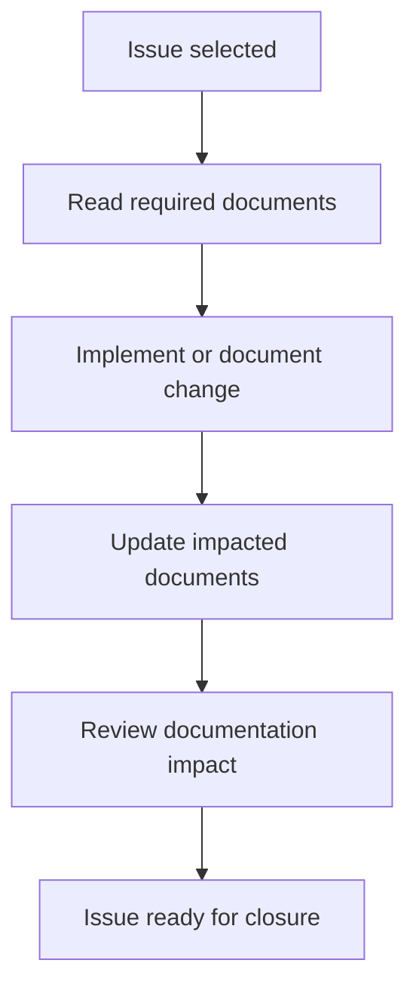
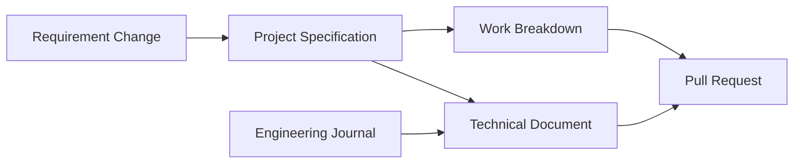

# DOCUMENT_RESPONSIBILITY_MATRIX.md

> **Document Purpose**
>
> This document defines which project documents must be read, updated, or referenced for each GitHub issue type and implementation phase.
>
> It exists to keep documentation updates intentional, complete, and proportional. It does not define project requirements, implementation tasks, release criteria, or engineering decisions.

---

## Table of Contents

- [DOCUMENT\_RESPONSIBILITY\_MATRIX.md](#document_responsibility_matrixmd)
  - [Table of Contents](#table-of-contents)
  - [1. Purpose](#1-purpose)
  - [2. Usage Rules](#2-usage-rules)
    - [2.1 Before Starting Work](#21-before-starting-work)
    - [2.2 During Work](#22-during-work)
    - [2.3 Before Closing Work](#23-before-closing-work)
  - [3. Document Ownership Model](#3-document-ownership-model)
  - [4. Matrix by Issue Type](#4-matrix-by-issue-type)
  - [5. Matrix by Implementation Phase](#5-matrix-by-implementation-phase)
  - [6. Required Documents to Read Before Starting Each Issue](#6-required-documents-to-read-before-starting-each-issue)
  - [7. Required Documents to Update Before Closing Each Issue](#7-required-documents-to-update-before-closing-each-issue)
  - [8. Rules for Avoiding Documentation Drift](#8-rules-for-avoiding-documentation-drift)
  - [9. Rules for Not Over-Reading Unrelated Documents](#9-rules-for-not-over-reading-unrelated-documents)
  - [10. PR Checklist for Documentation Impact](#10-pr-checklist-for-documentation-impact)
  - [11. Relationship to Core Governance Documents](#11-relationship-to-core-governance-documents)
    - [11.1 Relationship to `README.md`](#111-relationship-to-readmemd)
    - [11.2 Relationship to `docs/PROJECT_SPECIFICATIONS.md`](#112-relationship-to-docsproject_specificationsmd)
    - [11.3 Relationship to `development/IMPLEMENTATION_WORK_BREAKDOWN.md`](#113-relationship-to-developmentimplementation_work_breakdownmd)
    - [11.4 Relationship to `docs/ENGINEERING_JOURNAL.md`](#114-relationship-to-docsengineering_journalmd)
    - [11.5 Relationship to `development/RELEASE_CHECKLIST.md`](#115-relationship-to-developmentrelease_checklistmd)
  - [12. Maintenance Requirements](#12-maintenance-requirements)

---

## 1. Purpose

The project contains multiple documents with different responsibilities. This matrix defines how contributors should decide which documents to consult and which documents may require updates for a given issue.

The goals are to:

- preserve each document's single responsibility;
- prevent implementation issues from overlooking required documentation updates;
- avoid treating planning documents as implementation evidence;
- reduce unnecessary reading of unrelated documents;
- make documentation impact reviewable in pull requests;
- keep requirements, decisions, execution tasks, and release certification synchronized.

This document is a responsibility map. It is not a substitute for the issue acceptance criteria, the project specification, the implementation work breakdown, or the release checklist.

---

## 2. Usage Rules

Use this matrix at three points in every issue lifecycle.

### 2.1 Before Starting Work

Before starting an issue:

1. Identify the issue type.
2. Identify the implementation phase, if applicable.
3. Read the documents marked **Required Read** for that issue type and phase.
4. Read optional documents only when the issue scope directly touches them.
5. Do not infer current implementation state from planned or target-state documentation.

### 2.2 During Work

During work:

1. Keep the issue acceptance criteria as the immediate scope boundary.
2. Update only documents whose ownership area is changed by the issue.
3. Record material engineering decisions in the decision record rather than burying them in implementation guides.
4. Preserve traceability between requirements, work-breakdown IDs, implementation changes, tests, and documentation.

### 2.3 Before Closing Work

Before closing an issue:

1. Verify that every required documentation update has been made.
2. Confirm that unchanged documents do not contradict the new state.
3. Confirm that planned, proposed, accepted, completed, and deferred language remains accurate.
4. Include documentation impact in the pull request summary.

---

## 3. Document Ownership Model

Each document has one primary responsibility. A document may reference another document, but it should not duplicate that document's authority.

| Document                                                                             | Primary Ownership                                                                                          | Update When                                                                                                   |
| ------------------------------------------------------------------------------------ | ---------------------------------------------------------------------------------------------------------- | ------------------------------------------------------------------------------------------------------------- |
| [`README.md`](../README.md)                                                          | Project overview, current state, navigation, and quick-start expectations.                                 | The public project status, setup entry points, documentation index, or high-level capability summary changes. |
| [`docs/PROJECT_SPECIFICATIONS.md`](../docs/PROJECT_SPECIFICATIONS.md)                | Authoritative functional requirements, non-functional requirements, traceability, and completion criteria. | Requirements, constraints, accepted target technologies, traceability, or definition of done changes.         |
| [`docs/API.md`](../docs/API.md)                                                      | Public HTTP contract, request format, responses, status codes, and API examples.                           | Endpoint routes, payloads, validation, status codes, or error envelopes change.                               |
| [`docs/ARCHITECTURE.md`](../docs/ARCHITECTURE.md)                                    | System boundaries, layers, dependency direction, and architectural flow.                                   | Layer responsibilities, dependency direction, request flow, refresh flow, or architecture boundaries change.  |
| [`docs/DATABASE.md`](../docs/DATABASE.md)                                            | Data model, persistence rules, indexes, validations, migrations, and query patterns.                       | Schema, constraints, indexes, persistence behaviour, or data-retention rules change.                          |
| [`docs/BACKGROUND_JOBS.md`](../docs/BACKGROUND_JOBS.md)                              | Background refresh behaviour, job boundaries, scheduling expectations, retries, and operational handling.  | Job responsibilities, scheduling, retry policy, worker behaviour, or failure handling changes.                |
| [`docs/TESTING.md`](../docs/TESTING.md)                                              | Test strategy, test boundaries, required scenarios, coverage expectations, and quality gates.              | Test architecture, required scenarios, tooling, coverage expectations, or verification commands change.       |
| [`docs/ENGINEERING_JOURNAL.md`](../docs/ENGINEERING_JOURNAL.md)                      | Material engineering decisions, alternatives considered, trade-offs, and decision status.                  | A significant technical decision is proposed, accepted, superseded, rejected, deprecated, or deferred.        |
| [`docs/JUNIOR_DEVELOPER_GUIDE.md`](../docs/JUNIOR_DEVELOPER_GUIDE.md)                | Step-by-step reconstruction and onboarding workflow.                                                       | A developer must perform different setup, implementation, verification, or troubleshooting steps.             |
| [`CONTRIBUTING.md`](../CONTRIBUTING.md)                                              | Contribution workflow, branch rules, pull request expectations, quality gates, and review standards.       | Contributor process, quality gates, review expectations, or documentation-update policy changes.              |
| [`CHANGELOG.md`](../CHANGELOG.md)                                                    | Release communication and user-visible or engineering-significant change history.                          | A completed change is release-relevant or planned release scope needs clarification.                          |
| [`development/IMPLEMENTATION_ROADMAP.md`](IMPLEMENTATION_ROADMAP.md)                 | Phase sequence, milestones, phase objectives, and phase exit criteria.                                     | Phase ordering, objectives, dependencies, or phase exit criteria change.                                      |
| [`development/IMPLEMENTATION_WORK_BREAKDOWN.md`](IMPLEMENTATION_WORK_BREAKDOWN.md)   | Task-level implementation checklist and work-breakdown traceability.                                       | Task IDs, dependencies, task status, task verification, or task scope changes.                                |
| [`development/ENGINEERING_PRINCIPLES.md`](ENGINEERING_PRINCIPLES.md)                 | Engineering standards, quality philosophy, and design principles.                                          | Project-wide engineering standards or decision rules change.                                                  |
| [`development/FEATURE_CHECKLIST.md`](FEATURE_CHECKLIST.md)                           | High-level feature and progress dashboard.                                                                 | Feature-level completion or visible delivery status changes.                                                  |
| [`development/RELEASE_CHECKLIST.md`](RELEASE_CHECKLIST.md)                           | Final release certification and interview-readiness verification.                                          | Release gates, certification criteria, or final verification expectations change.                             |
| [`development/DOCUMENT_RESPONSIBILITY_MATRIX.md`](DOCUMENT_RESPONSIBILITY_MATRIX.md) | Document responsibility mapping by issue type and implementation phase.                                    | Document ownership, issue-type reading rules, phase mapping, or documentation impact process changes.         |

---

## 4. Matrix by Issue Type

The following matrix defines the normal documentation responsibilities for each issue type. Issue acceptance criteria may add stricter requirements.

Legend:

- **Read** means the document should be reviewed before work starts.
- **Update If Impacted** means update only if the issue changes that document's ownership area.
- **Usually Update** means most issues of that type should update the document.
- **Reference** means cite or use the document for context, but do not duplicate it.

| Issue Type                           | Required Read                                                                                                                | Usually Update                                        | Update If Impacted                                                                                                                    | Reference                                      |
| ------------------------------------ | ---------------------------------------------------------------------------------------------------------------------------- | ----------------------------------------------------- | ------------------------------------------------------------------------------------------------------------------------------------- | ---------------------------------------------- |
| Documentation normalization          | `README.md`, `docs/PROJECT_SPECIFICATIONS.md`, `development/IMPLEMENTATION_WORK_BREAKDOWN.md`, `docs/ENGINEERING_JOURNAL.md` | Changed documents only                                | `CHANGELOG.md`, `CONTRIBUTING.md`, `docs/JUNIOR_DEVELOPER_GUIDE.md`, this matrix                                                      | `development/IMPLEMENTATION_ROADMAP.md`        |
| Requirements change                  | `docs/PROJECT_SPECIFICATIONS.md`, `development/IMPLEMENTATION_WORK_BREAKDOWN.md`, `docs/ENGINEERING_JOURNAL.md`              | `docs/PROJECT_SPECIFICATIONS.md`                      | `README.md`, `docs/API.md`, `docs/ARCHITECTURE.md`, `docs/TESTING.md`, `development/IMPLEMENTATION_WORK_BREAKDOWN.md`, `CHANGELOG.md` | `development/RELEASE_CHECKLIST.md`             |
| Architecture change                  | `docs/PROJECT_SPECIFICATIONS.md`, `docs/ARCHITECTURE.md`, `docs/ENGINEERING_JOURNAL.md`                                      | `docs/ARCHITECTURE.md`, `docs/ENGINEERING_JOURNAL.md` | `docs/TESTING.md`, `docs/JUNIOR_DEVELOPER_GUIDE.md`, `development/IMPLEMENTATION_WORK_BREAKDOWN.md`                                   | `development/ENGINEERING_PRINCIPLES.md`        |
| API contract change                  | `docs/PROJECT_SPECIFICATIONS.md`, `docs/API.md`, `docs/TESTING.md`                                                           | `docs/API.md`                                         | `README.md`, `docs/ARCHITECTURE.md`, `docs/PROJECT_SPECIFICATIONS.md`, `docs/JUNIOR_DEVELOPER_GUIDE.md`, `CHANGELOG.md`               | `development/IMPLEMENTATION_WORK_BREAKDOWN.md` |
| Database or persistence change       | `docs/PROJECT_SPECIFICATIONS.md`, `docs/DATABASE.md`, `docs/ARCHITECTURE.md`, `docs/TESTING.md`                              | `docs/DATABASE.md`                                    | `docs/ENGINEERING_JOURNAL.md`, `development/IMPLEMENTATION_WORK_BREAKDOWN.md`, `docs/JUNIOR_DEVELOPER_GUIDE.md`                       | `development/RELEASE_CHECKLIST.md`             |
| Background job or scheduler change   | `docs/PROJECT_SPECIFICATIONS.md`, `docs/BACKGROUND_JOBS.md`, `docs/ENGINEERING_JOURNAL.md`, `docs/TESTING.md`                | `docs/BACKGROUND_JOBS.md`                             | `docs/ARCHITECTURE.md`, `docs/JUNIOR_DEVELOPER_GUIDE.md`, `development/IMPLEMENTATION_WORK_BREAKDOWN.md`, `CHANGELOG.md`              | `development/RELEASE_CHECKLIST.md`             |
| Provider integration change          | `docs/PROJECT_SPECIFICATIONS.md`, `docs/ARCHITECTURE.md`, `docs/TESTING.md`                                                  | `docs/ARCHITECTURE.md`                                | `docs/API.md`, `docs/ENGINEERING_JOURNAL.md`, `docs/JUNIOR_DEVELOPER_GUIDE.md`, `development/IMPLEMENTATION_WORK_BREAKDOWN.md`        | `docs/BACKGROUND_JOBS.md`                      |
| Testing or quality change            | `docs/PROJECT_SPECIFICATIONS.md`, `docs/TESTING.md`, `CONTRIBUTING.md`                                                       | `docs/TESTING.md`                                     | `CONTRIBUTING.md`, `development/RELEASE_CHECKLIST.md`, `docs/JUNIOR_DEVELOPER_GUIDE.md`, `CHANGELOG.md`                               | `development/ENGINEERING_PRINCIPLES.md`        |
| Docker or local setup change         | `README.md`, `CONTRIBUTING.md`, `docs/JUNIOR_DEVELOPER_GUIDE.md`                                                             | `README.md`, `docs/JUNIOR_DEVELOPER_GUIDE.md`         | `docs/ENGINEERING_JOURNAL.md`, `docs/TESTING.md`, `development/RELEASE_CHECKLIST.md`, `CHANGELOG.md`                                  | `development/IMPLEMENTATION_WORK_BREAKDOWN.md` |
| CI change                            | `CONTRIBUTING.md`, `docs/TESTING.md`, `development/RELEASE_CHECKLIST.md`                                                     | `CONTRIBUTING.md`, `docs/TESTING.md`                  | `README.md`, `docs/JUNIOR_DEVELOPER_GUIDE.md`, `CHANGELOG.md`                                                                         | `docs/PROJECT_SPECIFICATIONS.md`               |
| Security or secret-management change | `docs/PROJECT_SPECIFICATIONS.md`, `CONTRIBUTING.md`, `development/RELEASE_CHECKLIST.md`                                      | `CONTRIBUTING.md`                                     | `README.md`, `docs/JUNIOR_DEVELOPER_GUIDE.md`, `docs/ENGINEERING_JOURNAL.md`, `CHANGELOG.md`                                          | `docs/TESTING.md`                              |
| Release preparation                  | `development/RELEASE_CHECKLIST.md`, `CHANGELOG.md`, `README.md`, `docs/PROJECT_SPECIFICATIONS.md`                            | `development/RELEASE_CHECKLIST.md`, `CHANGELOG.md`    | `README.md`, `docs/JUNIOR_DEVELOPER_GUIDE.md`, `development/FEATURE_CHECKLIST.md`                                                     | `development/IMPLEMENTATION_WORK_BREAKDOWN.md` |

---

## 5. Matrix by Implementation Phase

Use this phase matrix together with the issue-type matrix. If the two matrices disagree, read the union of required documents but update only documents whose ownership area actually changes.

| Phase                                   | Phase Focus                                                             | Required Read                                                                                                                                               | Usually Update                                                                         | Update If Impacted                                                                                              |
| --------------------------------------- | ----------------------------------------------------------------------- | ----------------------------------------------------------------------------------------------------------------------------------------------------------- | -------------------------------------------------------------------------------------- | --------------------------------------------------------------------------------------------------------------- |
| Phase 0 — Documentation Normalization   | Documentation consistency, decision states, ownership boundaries.       | `README.md`, `docs/PROJECT_SPECIFICATIONS.md`, `docs/ENGINEERING_JOURNAL.md`, `development/IMPLEMENTATION_WORK_BREAKDOWN.md`, this matrix                   | Documents named by the issue                                                           | `CHANGELOG.md`, `CONTRIBUTING.md`, `docs/JUNIOR_DEVELOPER_GUIDE.md`, `development/IMPLEMENTATION_ROADMAP.md`    |
| Phase 1 — Repository Foundation         | Rails foundation, repository structure, local setup, initial tooling.   | `docs/PROJECT_SPECIFICATIONS.md`, `development/IMPLEMENTATION_ROADMAP.md`, `development/IMPLEMENTATION_WORK_BREAKDOWN.md`, `docs/JUNIOR_DEVELOPER_GUIDE.md` | `README.md`, `docs/JUNIOR_DEVELOPER_GUIDE.md`, `CONTRIBUTING.md`                       | `docs/ENGINEERING_JOURNAL.md`, `docs/TESTING.md`, `CHANGELOG.md`                                                |
| Phase 2 — Domain Design                 | Data model, persistence, repository boundary, cache abstraction.        | `docs/PROJECT_SPECIFICATIONS.md`, `docs/DATABASE.md`, `docs/ARCHITECTURE.md`, `docs/TESTING.md`                                                             | `docs/DATABASE.md`, `docs/ARCHITECTURE.md`                                             | `docs/ENGINEERING_JOURNAL.md`, `development/IMPLEMENTATION_WORK_BREAKDOWN.md`, `docs/JUNIOR_DEVELOPER_GUIDE.md` |
| Phase 3 — External API Integration      | CoinGecko client, provider mapping, timeouts, response validation.      | `docs/PROJECT_SPECIFICATIONS.md`, `docs/ARCHITECTURE.md`, `docs/TESTING.md`                                                                                 | `docs/ARCHITECTURE.md`, `docs/TESTING.md`                                              | `docs/API.md`, `docs/ENGINEERING_JOURNAL.md`, `docs/JUNIOR_DEVELOPER_GUIDE.md`, `CHANGELOG.md`                  |
| Phase 4 — Business Services             | Query service, refresh service, fallback orchestration.                 | `docs/PROJECT_SPECIFICATIONS.md`, `docs/ARCHITECTURE.md`, `docs/TESTING.md`, `docs/DATABASE.md`                                                             | `docs/ARCHITECTURE.md`, `docs/TESTING.md`                                              | `docs/ENGINEERING_JOURNAL.md`, `docs/BACKGROUND_JOBS.md`, `docs/JUNIOR_DEVELOPER_GUIDE.md`                      |
| Phase 5 — Background Processing         | Job boundary, scheduling, retry behaviour, worker execution.            | `docs/PROJECT_SPECIFICATIONS.md`, `docs/BACKGROUND_JOBS.md`, `docs/ENGINEERING_JOURNAL.md`, `docs/TESTING.md`                                               | `docs/BACKGROUND_JOBS.md`, `docs/ENGINEERING_JOURNAL.md`                               | `docs/ARCHITECTURE.md`, `docs/JUNIOR_DEVELOPER_GUIDE.md`, `CHANGELOG.md`                                        |
| Phase 6 — REST API                      | Controller, route, request validation, response contract.               | `docs/PROJECT_SPECIFICATIONS.md`, `docs/API.md`, `docs/TESTING.md`, `docs/ARCHITECTURE.md`                                                                  | `docs/API.md`, `docs/TESTING.md`                                                       | `README.md`, `docs/JUNIOR_DEVELOPER_GUIDE.md`, `CHANGELOG.md`                                                   |
| Phase 7 — Testing and Quality Assurance | Test completion, coverage, linting, security scanning.                  | `docs/PROJECT_SPECIFICATIONS.md`, `docs/TESTING.md`, `CONTRIBUTING.md`, `development/RELEASE_CHECKLIST.md`                                                  | `docs/TESTING.md`, `CONTRIBUTING.md`                                                   | `README.md`, `docs/JUNIOR_DEVELOPER_GUIDE.md`, `CHANGELOG.md`                                                   |
| Phase 8 — Production Hardening          | Operational readiness, security, configuration, container verification. | `docs/PROJECT_SPECIFICATIONS.md`, `README.md`, `CONTRIBUTING.md`, `development/RELEASE_CHECKLIST.md`                                                        | `README.md`, `CONTRIBUTING.md`, `docs/JUNIOR_DEVELOPER_GUIDE.md`                       | `docs/ENGINEERING_JOURNAL.md`, `docs/TESTING.md`, `CHANGELOG.md`                                                |
| Phase 9 — Release Preparation           | Release certification, changelog, final documentation review.           | `development/RELEASE_CHECKLIST.md`, `CHANGELOG.md`, `README.md`, `docs/PROJECT_SPECIFICATIONS.md`, `development/IMPLEMENTATION_WORK_BREAKDOWN.md`           | `development/RELEASE_CHECKLIST.md`, `CHANGELOG.md`, `development/FEATURE_CHECKLIST.md` | All public documentation if final review finds inconsistency                                                    |

---

## 6. Required Documents to Read Before Starting Each Issue

Every issue must begin with the issue body and acceptance criteria. After that, read the minimum set below.

| Issue Condition                                       | Minimum Required Reading                                                                                  |
| ----------------------------------------------------- | --------------------------------------------------------------------------------------------------------- |
| Any issue                                             | Issue body, acceptance criteria, `README.md`, this matrix.                                                |
| Any implementation issue                              | `docs/PROJECT_SPECIFICATIONS.md`, relevant WBS section in `development/IMPLEMENTATION_WORK_BREAKDOWN.md`. |
| Any issue tied to a phase                             | Relevant phase section in `development/IMPLEMENTATION_ROADMAP.md` and relevant WBS phase section.         |
| Any issue changing architecture or technology choices | `docs/ARCHITECTURE.md`, `docs/ENGINEERING_JOURNAL.md`.                                                    |
| Any issue changing public behaviour                   | `docs/API.md`, `docs/TESTING.md`, relevant requirements in `docs/PROJECT_SPECIFICATIONS.md`.              |
| Any issue changing persistence                        | `docs/DATABASE.md`, `docs/ARCHITECTURE.md`, `docs/TESTING.md`.                                            |
| Any issue changing background processing              | `docs/BACKGROUND_JOBS.md`, `docs/ENGINEERING_JOURNAL.md`, `docs/TESTING.md`.                              |
| Any issue changing setup or contributor workflow      | `README.md`, `CONTRIBUTING.md`, `docs/JUNIOR_DEVELOPER_GUIDE.md`.                                         |
| Any issue changing release criteria                   | `development/RELEASE_CHECKLIST.md`, `CHANGELOG.md`, `docs/PROJECT_SPECIFICATIONS.md`.                     |
| Documentation-only issue                              | The documents named by the issue, plus this matrix when ownership or reading rules are affected.          |

Do not read every document by default. Read additional documents only when the issue touches their ownership area or when a required document references them as authoritative for the change.

---

## 7. Required Documents to Update Before Closing Each Issue

Before closing an issue, update documents according to actual impact rather than broad topic similarity.

| Change Made                                                     | Required Documentation Update                                                                                    |
| --------------------------------------------------------------- | ---------------------------------------------------------------------------------------------------------------- |
| Requirement added, removed, or changed                          | `docs/PROJECT_SPECIFICATIONS.md`; update WBS traceability if task scope changes.                                 |
| Work-breakdown task added, removed, split, merged, or completed | `development/IMPLEMENTATION_WORK_BREAKDOWN.md`; update roadmap only if phase sequencing or exit criteria change. |
| Material architecture decision made                             | `docs/ENGINEERING_JOURNAL.md`; update architecture or technical docs affected by the decision.                   |
| API contract changed                                            | `docs/API.md`; update tests and public examples that describe the contract.                                      |
| Database schema or persistence rule changed                     | `docs/DATABASE.md`; update requirements or decision records if the change affects accepted design.               |
| Background processing behaviour changed                         | `docs/BACKGROUND_JOBS.md`; update decision records if adapter, scheduler, retry, or worker strategy changes.     |
| Test strategy or required quality gate changed                  | `docs/TESTING.md`; update `CONTRIBUTING.md` or release checklist if contributor or release commands change.      |
| Setup, Docker, configuration, or local workflow changed         | `README.md` and `docs/JUNIOR_DEVELOPER_GUIDE.md`; update `CONTRIBUTING.md` if contributor workflow changes.      |
| Release-relevant completed change made                          | `CHANGELOG.md`.                                                                                                  |
| Final release criterion changed                                 | `development/RELEASE_CHECKLIST.md`; update specification if completion criteria change.                          |
| Document ownership or responsibility mapping changed            | This document.                                                                                                   |

A pull request may state that no documentation update was required only when the matrix was checked and the changed behaviour does not alter any document ownership area.

---

## 8. Rules for Avoiding Documentation Drift

Documentation drift occurs when two documents describe different requirements, states, decisions, or commands for the same subject.

To prevent drift:

1. Keep the source of authority singular.
2. Link to the owning document instead of copying large sections.
3. Use **must** and **shall** only for required behaviour.
4. Use **target** for intended design shape.
5. Use **proposed** for unresolved decisions.
6. Use **accepted** for approved decisions.
7. Use **deferred** for future or out-of-scope work.
8. Do not mark planned work as completed.
9. Do not describe files, services, commands, or infrastructure as existing until they exist in the repository.
10. Update traceability when requirements, WBS items, tests, or documentation ownership changes.
11. Record material trade-offs in `docs/ENGINEERING_JOURNAL.md` rather than scattering rationale across multiple documents.
12. Verify cross-document consistency before requesting review.

The preferred documentation flow is:

---

## 9. Rules for Not Over-Reading Unrelated Documents

Reading every document for every issue creates review fatigue and increases the risk of unnecessary edits. Contributors should read enough documentation to act safely, but no more than the issue requires.

Use these rules:

1. Start with the issue body and the matrix rows that match the issue type and phase.
2. Read documents marked **Required Read** before implementation.
3. Read documents marked **Reference** only when context is needed.
4. Do not update a document merely because it mentions the topic.
5. Do not read release certification documents for early implementation work unless release criteria are affected.
6. Do not read API documentation for internal-only changes unless public behaviour or examples change.
7. Do not read database documentation for changes that do not affect schema, persistence, query behaviour, or data integrity.
8. Do not read background-job documentation for request-path-only changes unless scheduling, job execution, retries, or refresh flow are affected.
9. Do not broaden the issue scope because another document contains related future work.
10. If uncertainty remains, read the owning document rather than every adjacent document.

---

## 10. PR Checklist for Documentation Impact

Every pull request should answer the following documentation-impact questions.

| Question                                                      | Required Answer                                                                                      |
| ------------------------------------------------------------- | ---------------------------------------------------------------------------------------------------- |
| Which issue type and phase does this PR address?              | Name the issue type and phase, or state that no phase applies.                                       |
| Which required documents were read?                           | List the documents from this matrix that were consulted.                                             |
| Which documents were updated?                                 | List changed documents, or state that no documentation update was required.                          |
| Why were unchanged related documents left unchanged?          | Briefly explain when nearby documents were reviewed but not modified.                                |
| Were decision states changed?                                 | State whether any decision became proposed, accepted, deferred, superseded, deprecated, or rejected. |
| Were requirements or WBS IDs changed?                         | State whether traceability changed.                                                                  |
| Were setup, command, or infrastructure claims changed?        | Confirm that documentation does not claim missing files or services exist.                           |
| Was `CHANGELOG.md` updated if the change is release-relevant? | Answer yes, no, or not applicable.                                                                   |
| Were Markdown links and `git diff --check` verified?          | Provide exact validation commands and results.                                                       |

A documentation-impact section is required even for code-only pull requests. The correct answer may be that no document ownership area changed.

---

## 11. Relationship to Core Governance Documents

### 11.1 Relationship to `README.md`

[`README.md`](../README.md) is the project entry point and navigation hub. This matrix does not replace the README documentation index. It explains when the README itself must be read or updated.

Update `README.md` when the public project overview, current repository state, quick-start path, documentation index, or high-level capability summary changes.

### 11.2 Relationship to `docs/PROJECT_SPECIFICATIONS.md`

[`docs/PROJECT_SPECIFICATIONS.md`](../docs/PROJECT_SPECIFICATIONS.md) is the authoritative source for requirements, constraints, traceability, and completion criteria. This matrix must not redefine those requirements.

Use this matrix to decide when the specification must be read or updated. If another document conflicts with the specification, update the conflicting document or revise the specification before implementation continues.

### 11.3 Relationship to `development/IMPLEMENTATION_WORK_BREAKDOWN.md`

[`development/IMPLEMENTATION_WORK_BREAKDOWN.md`](IMPLEMENTATION_WORK_BREAKDOWN.md) owns task-level execution planning and work-breakdown IDs. This matrix must not create, rename, or complete WBS tasks.

Use this matrix to determine when a task change requires WBS updates and when WBS traceability should be referenced in a pull request.

### 11.4 Relationship to `docs/ENGINEERING_JOURNAL.md`

[`docs/ENGINEERING_JOURNAL.md`](../docs/ENGINEERING_JOURNAL.md) owns material engineering decisions and their status. This matrix does not accept or reject decisions.

Use this matrix to identify when a decision record is required. If an issue selects technology, changes architecture, changes operational behaviour, or resolves a trade-off, update the Engineering Journal before closing the issue.

### 11.5 Relationship to `development/RELEASE_CHECKLIST.md`

[`development/RELEASE_CHECKLIST.md`](RELEASE_CHECKLIST.md) owns final release certification. This matrix does not certify release readiness.

Use this matrix to identify when release gates or final verification expectations need updates. Release checklist changes should be rare before release preparation unless an issue changes the definition of release readiness.

---

## 12. Maintenance Requirements

This document shall be updated when:

- a new project document is added;
- a document's ownership changes;
- issue types or labels change in a way that affects required documentation review;
- implementation phases are added, removed, split, or merged;
- pull request documentation-impact expectations change;
- repeated review feedback shows that contributors are reading too little or too much documentation.

Maintenance changes to this matrix should remain focused on responsibility mapping. Do not copy large requirement, architecture, testing, or release sections into this document.
