# ENGINEERING_PRINCIPLES.md

> **Document Purpose**
>
> This document defines the engineering principles that govern the implementation, maintenance, and evolution of the Cryptocurrency Price API project.
>
> These principles are intended to establish a consistent engineering culture throughout the project lifecycle.
>
> Every technical decision should be evaluated against the principles defined within this document.
>
> Project-specific requirements are defined within `PROJECT_SPECIFICATIONS.md`. This document instead defines **how engineering decisions are made**.

---

# Table of Contents

1. Purpose
2. Engineering Philosophy
3. Engineering Values
4. Decision Framework
5. Design Principles
6. Code Quality Standards
7. Simplicity First
8. Maintainability
9. Readability
10. Consistency
11. Responsibility Assignment
12. Engineering Workflow
13. Continuous Improvement
14. Definition of Engineering Excellence

---

# 1. Purpose

Engineering principles exist to provide consistency.

Without clearly defined principles, software quality gradually becomes dependent upon individual developer preference rather than deliberate engineering practice.

This document establishes the shared expectations for every contributor to the repository.

The principles described herein are intended to:

- improve maintainability;
- encourage predictable engineering decisions;
- reduce unnecessary complexity;
- improve software quality;
- minimise architectural drift;
- establish long-term consistency.

Whenever implementation alternatives exist, preference shall be given to the solution most closely aligned with these principles.

---

# 2. Engineering Philosophy

Software should be engineered rather than merely written.

Engineering requires deliberate planning, measurable quality standards, repeatable processes, and continuous verification.

Every contribution to the repository should improve one or more of the following characteristics:

- correctness;
- reliability;
- maintainability;
- readability;
- operational stability.

The objective is not simply to produce working software.

The objective is to produce software that remains understandable and maintainable long after its original implementation.

---

## Engineering Philosophy Overview

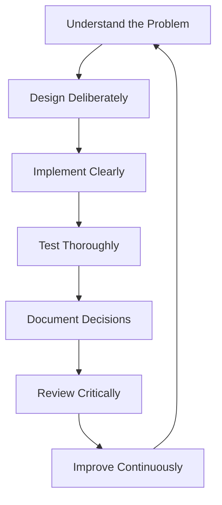

Engineering is a continuous improvement process rather than a linear implementation activity.

---

# 3. Engineering Values

The following values guide every implementation decision.

These values are intentionally ordered by priority.

## 3.1 Correctness

Software should first behave correctly.

Features shall not be considered complete until behaviour matches the project specification.

Correctness takes precedence over optimisation.

---

## 3.2 Reliability

Applications should continue operating under adverse conditions whenever practical.

Failures should be anticipated during design rather than addressed after deployment.

Graceful degradation is preferred over catastrophic failure.

---

## 3.3 Simplicity

The simplest solution capable of satisfying the requirements shall normally be preferred.

Complexity introduces additional maintenance cost, testing effort, and implementation risk.

Complexity should therefore require explicit justification.

---

## 3.4 Maintainability

Every implementation should be understandable by engineers unfamiliar with the project.

Maintainability shall always be considered a functional requirement.

---

## 3.5 Testability

Every significant behaviour shall be independently verifiable.

Engineering decisions that reduce testability should generally be avoided.

---

## 3.6 Documentation

Documentation is part of the implementation.

An undocumented feature is considered incomplete.

---

# 4. Engineering Decision Framework

Every technical decision should follow the same evaluation process.

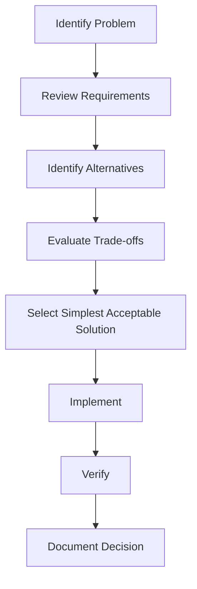

The objective is to make engineering decisions explicit rather than implicit.

Where multiple solutions satisfy the requirements, preference should be given to the solution that maximises readability, maintainability, and long-term flexibility.

---

# 5. Design Principles

The following design principles apply throughout the project.

## Single Responsibility

Every production class shall have one clearly defined responsibility.

A class should have one reason to change.

Responsibilities shall never overlap unnecessarily.

---

## Separation of Concerns

Presentation, business logic, persistence, infrastructure, and external communication shall remain independent.

Mixing responsibilities increases coupling and reduces maintainability.

---

## Explicit Dependencies

Dependencies should be visible.

Objects should clearly communicate what collaborators they require.

Hidden dependencies reduce readability and increase implementation risk.

---

## Composition over Inheritance

Inheritance introduces tight coupling.

Where practical, behaviour should be assembled through composition.

Inheritance should be reserved for genuine "is-a" relationships.

---

## Convention over Configuration

Rails conventions shall be followed unless a documented engineering decision requires otherwise.

Custom implementation should be justified by measurable benefit.

---

# 6. Code Quality Standards

Quality is evaluated by characteristics rather than line count.

Good code should demonstrate:

- clarity;
- predictability;
- consistency;
- low coupling;
- high cohesion;
- meaningful naming;
- straightforward control flow.

Cleverness is not considered a quality attribute.

---

## Code Quality Characteristics

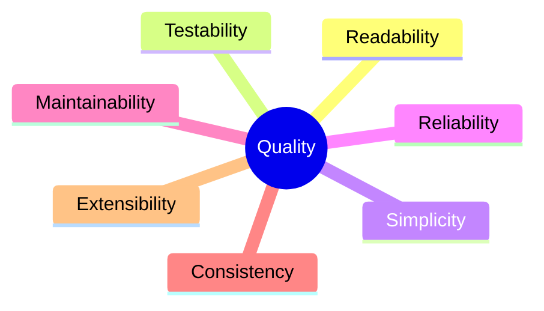

Every implementation should improve one or more of these characteristics.

---

# 7. Simplicity First

Whenever multiple valid solutions exist:

Choose the simplest implementation capable of satisfying the documented requirements.

Avoid implementing speculative functionality.

Avoid introducing abstractions before they become necessary.

Avoid premature optimisation.

Software should evolve in response to demonstrated requirements rather than anticipated future possibilities.

---

# 8. Maintainability

Maintainability is considered a first-class engineering objective.

Future developers should be able to:

- understand implementation intent;
- locate business logic quickly;
- modify behaviour confidently;
- extend functionality safely.

Engineering effort invested in maintainability reduces long-term project cost.

---

# 9. Readability

Code is read significantly more often than it is written.

Implementation should therefore optimise for readers rather than authors.

Meaningful names should eliminate unnecessary comments.

Functions should communicate intent through structure.

Control flow should remain obvious.

Every implementation should answer:

- What does this code do?
- Why does it exist?
- Why was this approach selected?

without requiring external explanation.

---

# 10. Consistency

Consistency reduces cognitive load.

The project should demonstrate consistent:

- naming;
- directory structure;
- class organisation;
- error handling;
- logging;
- testing style;
- documentation style.

Consistency is preferred over personal preference.

Inconsistent code increases maintenance effort even when functionally correct.

---

# 11. Responsibility Assignment

Responsibilities shall remain clearly separated.

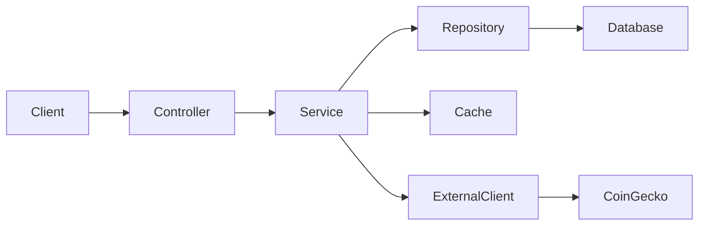

Each layer should communicate only with the layers for which it is explicitly responsible.

Responsibilities should never leak between architectural boundaries.

No component should assume responsibilities assigned to another layer.

---

# 12. Engineering Workflow

Every implementation task shall follow the same workflow.

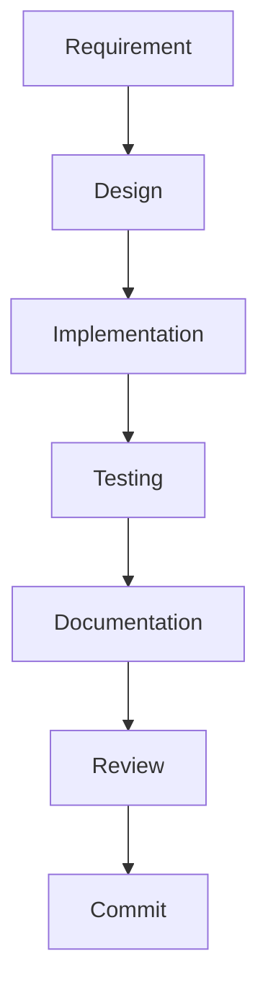

Skipping workflow stages introduces unnecessary project risk.

The workflow applies equally to major features and minor improvements.

---

# 13. Continuous Improvement

Engineering quality is achieved through continuous refinement.

Every contribution should leave the repository in an improved state.

Possible improvements include:

- simplifying implementation;
- improving naming;
- strengthening tests;
- reducing duplication;
- improving documentation;
- increasing consistency.

Incremental improvement is preferred over large-scale rewrites.

---

# 14. Definition of Engineering Excellence

Engineering excellence is achieved when software demonstrates:

- correctness;
- simplicity;
- maintainability;
- reliability;
- testability;
- consistency;
- documentation quality;
- operational readiness.

Every engineering decision should contribute positively to one or more of these characteristics.

Excellence is not measured by the amount of code produced.

It is measured by the long-term quality of the system.

---

# 15. Architectural Integrity

Architecture exists to reduce complexity by assigning clear responsibilities to well-defined components.

Every component within the application shall have:

- a clearly defined responsibility;
- explicit dependencies;
- a well-defined public interface;
- comprehensive automated tests;
- supporting documentation where appropriate.

Architectural consistency shall take precedence over individual implementation preferences.

---

## Architectural Boundaries

The application architecture shall enforce strict separation between layers.

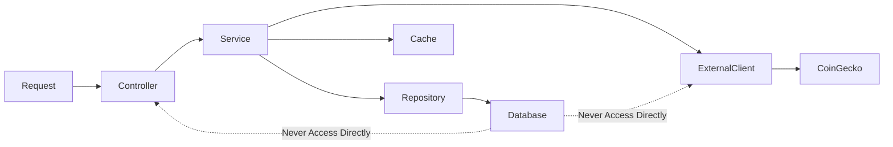

Each layer communicates only through approved interfaces.

Layers shall never bypass intermediate layers.

---

## Layer Responsibilities

| Layer      | Responsibility                                  |
| ---------- | ----------------------------------------------- |
| Controller | Accept requests and coordinate application flow |
| Service    | Implement business rules                        |
| Repository | Manage persistence                              |
| Client     | Communicate with external systems               |
| Cache      | Manage cached data                              |
| Job        | Execute asynchronous business operations        |
| Model      | Represent domain entities                       |

Responsibilities shall remain exclusive.

No component shall assume the responsibilities of another layer.

---

# 16. Production Class Standards

Every production class introduced into the repository shall satisfy the following requirements.

## Clearly Defined Responsibility

Every production class must exist because it has a clearly defined responsibility documented within `PROJECT_SPECIFICATIONS.md`.

If a responsibility cannot be clearly described in a single concise sentence, the class likely violates the Single Responsibility Principle.

---

## Architectural Justification

Every production class should answer:

- Why does this class exist?
- Which layer owns this responsibility?
- Which components depend upon it?
- Which requirements does it satisfy?

Classes without a documented purpose should not be introduced.

---

## Required Test Coverage

Every production class shall have corresponding automated tests before it is considered complete.

Tests should verify:

- expected behaviour;
- edge cases;
- failure scenarios;
- invalid inputs;
- error handling.

No production class is complete without verification.

---

## Documentation Requirement

If a production class introduces:

- new behaviour;
- new architecture;
- new operational processes;
- new public interfaces;

the relevant documentation shall be updated before implementation is considered complete.

Documentation is part of implementation.

---

## Traceability

Every production class should be traceable to:

- one or more Functional Requirements;
- one or more Non-Functional Requirements;
- an implementation phase;
- corresponding automated tests.

No production code should exist without traceability.

---

# 17. Testing Philosophy

Testing verifies behaviour rather than implementation.

Tests should provide confidence that the application behaves correctly under expected and unexpected conditions.

---

## Testing Pyramid

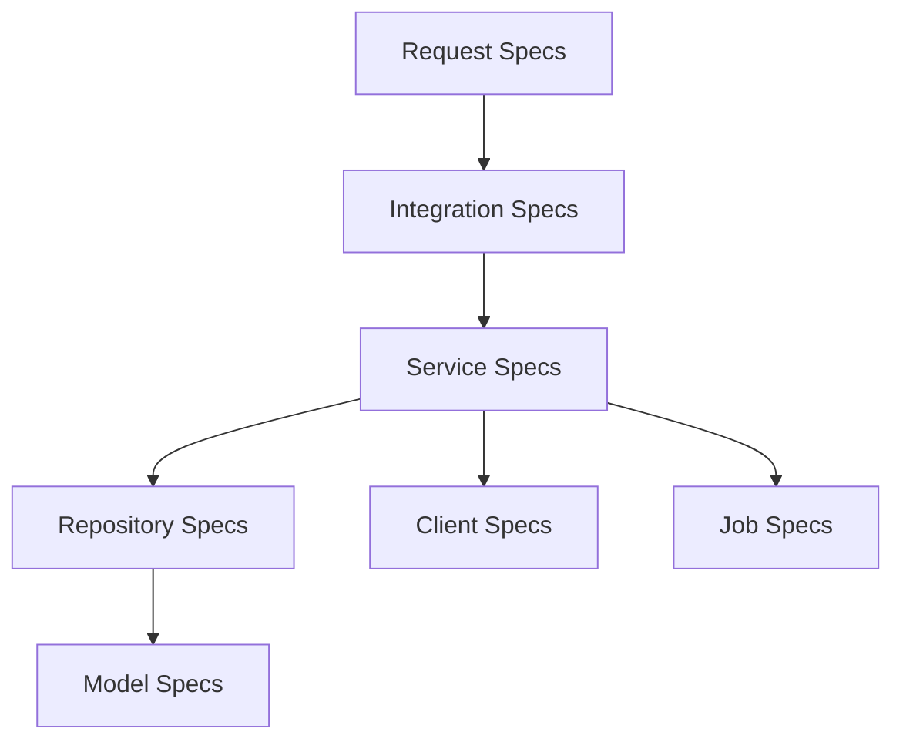

Each testing layer validates a different level of behaviour.

Redundant testing should be avoided.

---

## Characteristics of Good Tests

Automated tests should be:

- deterministic;
- isolated;
- readable;
- repeatable;
- maintainable;
- expressive.

Tests should communicate intent rather than implementation.

---

## Behaviour-Driven Verification

Tests should describe expected outcomes rather than internal implementation.

Preferred style:

"When the provider is unavailable, the application returns the most recently stored value."

Avoid tests that merely verify private implementation details.

---

## Regression Prevention

Every resolved defect should be accompanied by an automated regression test.

The repository should become more resilient after every bug fix.

---

# 18. Documentation Philosophy

Documentation exists to transfer knowledge.

Its purpose is to reduce the time required for another engineer to understand, modify, and extend the system.

---

## Documentation Hierarchy

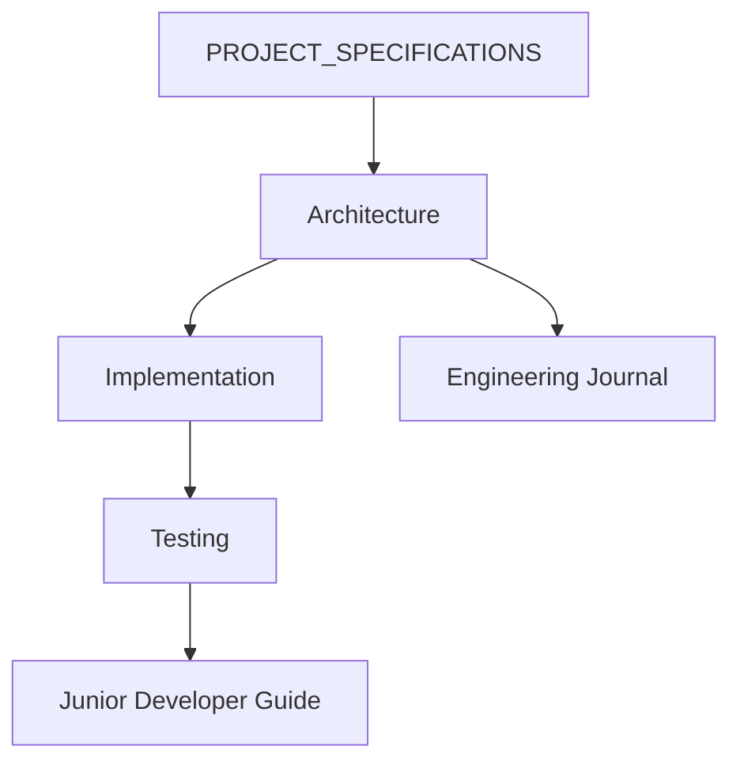

Each document has a single responsibility.

Information should not be duplicated unnecessarily.

Instead, documents should reference one another.

---

## Documentation Standards

Documentation should always explain:

- what exists;
- why it exists;
- how it works;
- when it should change.

Documentation should avoid repeating implementation details already visible in code.

---

## Living Documentation

Documentation shall evolve alongside implementation.

Whenever implementation changes:

- architecture should be reviewed;
- testing documentation should be updated;
- API documentation should be verified;
- Engineering Journal should record significant decisions.

Documentation drift shall be treated as a defect.

---

# 19. Error Handling Principles

Errors are expected.

Applications should anticipate failure rather than assume success.

---

## Error Classification

Errors shall be classified as:

- validation errors;
- infrastructure errors;
- persistence errors;
- external provider errors;
- unexpected internal errors.

Different categories require different handling strategies.

---

## Error Handling Strategy

```mermaid
flowchart TD

Failure

--> Detect

--> Classify

--> Recover

--> Log

--> Return Predictable Response

--> Continue Operation
```

Applications should recover gracefully whenever possible.

---

## Exception Management

Exceptions should:

- communicate intent;
- preserve context;
- remain meaningful;
- avoid exposing sensitive information.

Generic exceptions should be avoided.

---

# 20. Logging Principles

Logs exist to support engineers rather than applications.

Every log entry should provide sufficient context to understand what occurred without reproducing the issue.

---

## Logging Objectives

Logging should answer:

- What happened?
- When did it happen?
- Why did it happen?
- Which component was involved?
- What action was taken?

---

## Logging Standards

Logs should be:

- structured;
- meaningful;
- searchable;
- free of sensitive information.

Sensitive values shall never be logged.

---

# 21. Security Principles

Security is considered a continuous engineering responsibility.

Every implementation should minimise unnecessary risk.

---

## Secret Management

Secrets shall never be committed to source control.

Configuration requiring sensitive values shall use:

- environment variables;
- Rails credentials;
- secure deployment configuration.

---

## External Communication

All communication with external providers should:

- use encrypted transport;
- validate responses;
- enforce reasonable timeouts;
- handle failures predictably.

---

## Input Validation

Every external input shall be considered untrusted until validated.

Validation should occur as early as practical.

---

# 22. Performance Principles

Performance optimisation should be deliberate.

Premature optimisation introduces unnecessary complexity.

---

## Performance Priorities

The project should prioritise:

1. Correctness
2. Reliability
3. Readability
4. Maintainability
5. Performance

Performance improvements should preserve the first four priorities.

---

## Optimisation Strategy

Optimisation should be based upon:

- measurement;
- profiling;
- demonstrated bottlenecks.

Engineering assumptions should not drive optimisation efforts.

---

# 23. Engineering Rules

The following rules apply throughout the project.

## Rule 1

Every production class shall have one clearly defined responsibility.

---

## Rule 2

Every production class shall satisfy at least one documented project requirement.

---

## Rule 3

Every production class shall have corresponding automated tests.

---

## Rule 4

Every production class shall be referenced within the architecture documentation where appropriate.

---

## Rule 5

No feature is complete until:

- implementation;
- testing;
- documentation;
- review

have all been completed.

---

## Rule 6

Controllers shall never contain business logic.

---

## Rule 7

Repositories shall never contain business rules.

---

## Rule 8

Services shall remain independent of HTTP implementation.

---

## Rule 9

Business logic shall never depend directly upon external providers.

---

## Rule 10

The repository shall remain in a releasable state after every completed implementation phase.

---

# 24. Quality Gates

Every pull request, feature branch, or implementation milestone shall satisfy the following quality gates before completion.

```mermaid
flowchart LR

Implementation

--> Tests

--> Documentation

--> Static Analysis

--> Review

--> Approval

--> Commit
```

Failure to satisfy any quality gate shall block completion of the implementation activity.

Engineering quality is achieved through consistent adherence to these gates rather than isolated review efforts.

# 25. Engineering Governance

Engineering governance ensures that technical decisions remain consistent throughout the lifetime of the project.

Governance exists to preserve architectural integrity, maintain implementation quality, and prevent gradual degradation of engineering standards.

Every implementation activity shall comply with the engineering principles defined within this document.

Engineering governance is considered a continuous responsibility rather than a periodic review activity.

---

## Governance Model

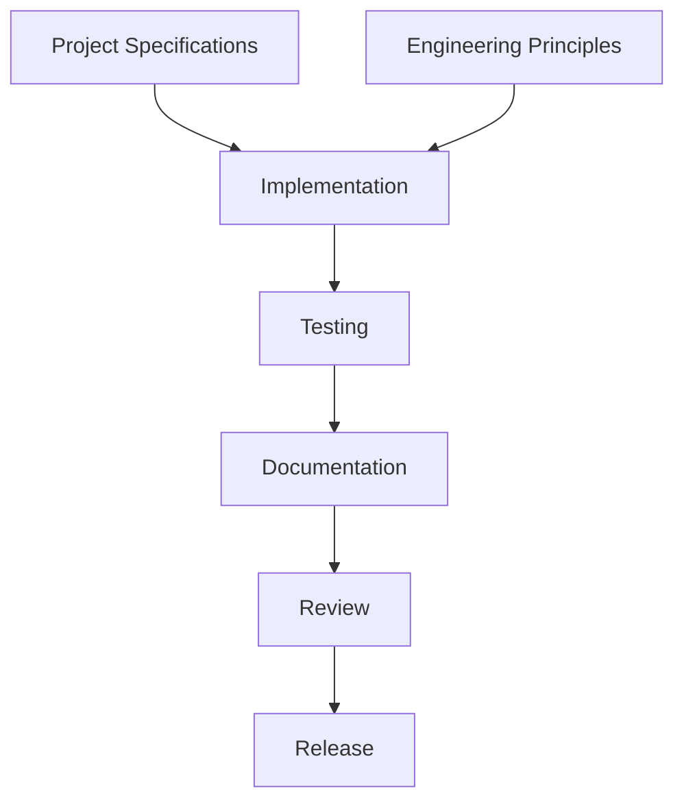

Every implementation decision shall ultimately trace back to:

- documented requirements;
- documented engineering principles;
- documented architectural decisions.

No implementation should exist without governance.

---

# 26. Decision Records

Engineering decisions should be explicit.

Whenever implementation requires a significant architectural decision, the rationale shall be recorded within the Engineering Journal.

Significant decisions include:

- introducing new abstractions;
- modifying application architecture;
- changing persistence strategy;
- changing dependency management;
- introducing new infrastructure;
- changing testing strategy.

---

## Decision Evaluation Process

Before introducing a significant technical decision, engineers should evaluate:

1. What problem is being solved?
2. Which alternatives were considered?
3. Why was the chosen solution selected?
4. What trade-offs were accepted?
5. How does the decision align with project principles?
6. Can the decision be reversed if necessary?

Engineering decisions should favour long-term maintainability over short-term convenience.

---

# 27. Code Review Philosophy

Code review is an engineering activity rather than an approval activity.

Its purpose is to improve software quality through collaborative evaluation.

Reviews should focus on:

- correctness;
- maintainability;
- readability;
- architectural consistency;
- operational behaviour;
- testing quality.

Personal coding preferences should not override documented engineering standards.

---

## Code Review Flow

```mermaid
flowchart LR

Implementation

--> Self Review

--> Automated Tests

--> Documentation Review

--> Architecture Review

--> Final Approval

--> Merge
```

Every review should improve the quality of the repository.

---

## Code Review Checklist

Every implementation should answer the following questions before approval.

### Requirements

- Does the implementation satisfy the documented requirements?
- Is every requirement traceable?

---

### Architecture

- Are architectural boundaries preserved?
- Does the implementation respect layer responsibilities?

---

### Quality

- Is the implementation readable?
- Are names meaningful?
- Is complexity justified?

---

### Testing

- Are automated tests comprehensive?
- Do tests verify behaviour?
- Are failure scenarios covered?

---

### Documentation

- Has relevant documentation been updated?
- Does the documentation accurately describe implementation?

---

### Operational Behaviour

- Does the implementation fail gracefully?
- Are logs meaningful?
- Are errors handled predictably?

---

# 28. Technical Debt Management

Technical debt should be actively managed rather than ignored.

Accepting technical debt is occasionally appropriate when:

- implementation deadlines exist;
- trade-offs are explicitly documented;
- repayment has been scheduled.

Undocumented technical debt shall be treated as an engineering defect.

---

## Technical Debt Categories

```mermaid
mindmap
root((Technical Debt))

Implementation

Architecture

Testing

Documentation

Infrastructure

Dependencies
```

Each category should be reviewed throughout development.

---

## Debt Evaluation

Before accepting technical debt, evaluate:

- implementation impact;
- maintenance cost;
- operational risk;
- future engineering effort.

Debt should be intentional rather than accidental.

---

# 29. Continuous Improvement

Every contribution should improve the repository.

Examples include:

- improving naming;
- reducing duplication;
- simplifying implementation;
- strengthening automated tests;
- improving documentation;
- improving logging;
- reducing coupling.

Small improvements performed consistently have greater long-term impact than infrequent large refactoring efforts.

---

## Improvement Cycle

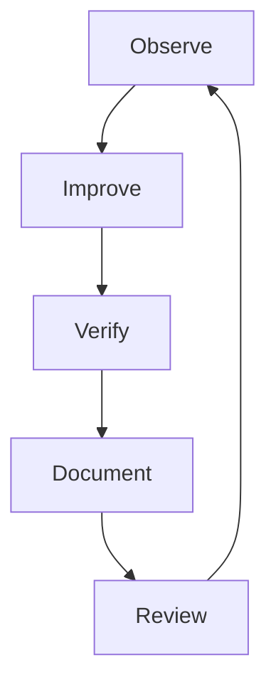

Engineering improvement never concludes.

---

# 30. Knowledge Sharing

Knowledge should remain within the repository rather than individual engineers.

Knowledge sharing occurs through:

- documentation;
- meaningful commit history;
- engineering journals;
- automated tests;
- architecture documentation.

The repository should remain understandable even if the original author is unavailable.

---

# 31. Git Philosophy

Version control exists to communicate engineering progress rather than simply preserve history.

Every commit should represent:

- one logical change;
- one verifiable improvement;
- one stable repository state.

Commits should remain small enough to review effectively.

---

## Commit Characteristics

Every commit should be:

- atomic;
- buildable;
- testable;
- documented;
- reviewable.

---

## Commit Lifecycle

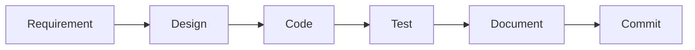

No commit should introduce a broken repository state.

---

# 32. Branching Philosophy

Development should favour short-lived feature branches.

Long-running branches increase:

- merge complexity;
- review effort;
- implementation drift.

Features should be integrated as soon as quality gates have been satisfied.

---

# 33. Repository Health

Repository health shall be continuously monitored.

Healthy repositories demonstrate:

- passing tests;
- passing static analysis;
- current documentation;
- low duplication;
- consistent architecture;
- meaningful commit history.

Repository quality should improve throughout development.

---

# 34. Engineering Culture

The engineering culture of this repository is founded upon:

## Ownership

Every engineer owns the quality of the entire repository.

---

## Accountability

Every implementation decision should be defensible.

---

## Curiosity

Engineers should continually seek better solutions while respecting documented engineering principles.

---

## Humility

Engineering decisions should be based upon evidence rather than personal preference.

---

## Collaboration

Software quality improves through shared understanding.

Knowledge should never become isolated.

---

## Professionalism

Production-quality software is characterised by discipline rather than complexity.

Engineering professionalism is demonstrated through consistency, attention to detail, and continuous improvement.

---

# 35. Engineering Manifesto

The following statements define the engineering philosophy of this repository.

We value:

- simplicity over cleverness;
- readability over brevity;
- maintainability over premature optimisation;
- correctness over speed of implementation;
- documentation over tribal knowledge;
- explicit design over accidental architecture;
- testing over assumption;
- consistency over personal preference;
- deliberate engineering over rapid coding.

Every implementation should leave the repository in a better state than it was found.

---

# 36. Engineering Charter

Every contribution to this repository shall satisfy the following commitments.

### We will understand requirements before implementation.

### We will preserve architectural boundaries.

### We will introduce only purposeful abstractions.

### We will write code that is understandable.

### We will automate verification wherever practical.

### We will document engineering decisions.

### We will continuously improve the repository.

### We will keep the repository releasable.

### We will leave future engineers with a codebase that is easier to understand than the one we inherited.

---

# Final Statement

This document establishes the engineering principles governing the Cryptocurrency Price API project.

These principles are intentionally independent of programming language, framework, or infrastructure.

As the implementation evolves, these principles shall remain stable and continue to guide every engineering decision, ensuring that the repository demonstrates consistency, maintainability, reliability, and production-quality software engineering throughout its lifecycle.
