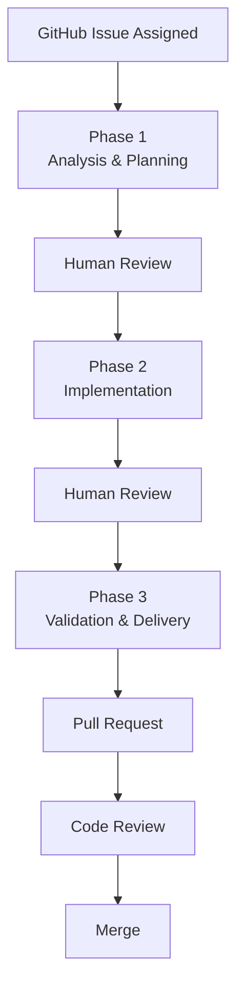

# Hermes Implementation Workflow

**Document Owner:** Repository Maintainers
**Status:** Active
**Version:** 1.0
**Last Updated:** 2026-07-07

---

# Purpose

This document defines the mandatory engineering workflow that Hermes must follow when contributing to this repository.

It standardizes every implementation session to ensure:

- Predictable engineering quality
- Minimal scope creep
- Complete requirements traceability
- Consistent Pull Requests
- High documentation quality
- Enterprise-grade Git history

This workflow is mandatory for every implementation issue.

---

# Scope

This document governs:

- GitHub Issues
- Feature branches
- Pull Requests
- Documentation updates
- Validation
- Commit preparation

This document does **not** define application architecture or technical implementation details. Those remain the responsibility of:

- PROJECT_SPECIFICATIONS.md
- DOCUMENT_RESPONSIBILITY_MATRIX.md
- ENGINEERING_PRINCIPLES.md

---

# Workflow Overview



---

# Mandatory Workflow Rules

Every implementation must satisfy the following principles.

- One GitHub Issue.
- One feature branch.
- One Hermes conversation.
- One Pull Request.
- One merge.
- One completed issue.

No Pull Request may implement multiple issues.

No issue may silently expand its scope.

No implementation may bypass planning.

---

# Repository Bootstrap Sequence

Every new Hermes conversation must begin with the following sequence.

## Step 1

Read:

```
development/HERMES_BOOTSTRAP.md
```

---

## Step 2

Read:

```
development/DOCUMENT_RESPONSIBILITY_MATRIX.md
```

Determine which documentation is required for the assigned issue.

Only load documentation relevant to the current issue.

---

## Step 3

Read the assigned GitHub Issue.

Confirm:

- objectives
- acceptance criteria
- dependencies
- blockers
- scope boundaries

---

## Step 4

Verify repository state.

Run:

```bash
pwd
git branch --show-current
git status --short --branch
```

Stop immediately if:

- incorrect repository
- incorrect branch
- dirty working tree
- detached HEAD

---

# Phase 1 — Analysis & Planning

## Objective

Understand the problem completely before writing code.

No implementation occurs during this phase.

---

## Inputs

Required:

- HERMES_BOOTSTRAP.md
- DOCUMENT_RESPONSIBILITY_MATRIX.md
- GitHub Issue

Load only the documentation identified by the responsibility matrix.

---

## Activities

Analyse:

- requirements
- exclusions
- dependencies
- engineering principles
- implementation risks
- assumptions

Inspect:

- repository structure
- existing files
- current implementation

Determine:

- files to create
- files to modify
- validation strategy
- rollback strategy

---

## Deliverables

Produce:

- Issue Summary
- Repository Verification
- Documentation Summary
- Scope Confirmation
- File Impact Analysis
- Ordered Implementation Plan
- Validation Plan
- Rollback Strategy
- Risk Assessment

---

## Stop Condition

Wait for explicit approval.

No files may be modified.

---

# Phase 2 — Implementation

## Objective

Implement the approved plan exactly as approved.

---

## Responsibilities

Implement only:

- approved scope
- approved files
- approved documentation updates

Maintain issue boundaries.

---

## Progress Reporting

Report progress after each major milestone.

Suggested milestones:

- Repository verification
- Branch creation
- Framework generation
- Configuration
- Dependency installation
- Documentation updates
- Validation

---

## Long Running Commands

If any command:

- exceeds 90 seconds
- requires approval
- fails unexpectedly

Stop immediately.

Report:

- exact command
- why it is executing
- current status
- expected next step
- proposed remediation

Do not continue automatically.

---

## Scope Protection

Never implement work belonging to another GitHub Issue.

If additional work is discovered:

Document it.

Do not implement it.

---

## Documentation

Update only documentation identified by:

DOCUMENT_RESPONSIBILITY_MATRIX.md

---

## Validation

Execute every validation command defined by:

- GitHub Issue
- PROJECT_SPECIFICATIONS.md
- RELEASE_CHECKLIST.md

Do not commit.

Wait for review.

---

# Phase 3 — Validation & Delivery

## Objective

Prepare production-quality work for review.

---

## Repository Review

Review:

```bash
git status
git diff --stat
git diff --check
git diff --name-only
```

---

## Scope Review

Confirm:

- issue boundaries maintained
- no scope creep
- no debugging artefacts
- no temporary files
- no secrets
- no unrelated documentation

---

## Validation Review

Summarize:

- passed validations
- failed validations
- known risks
- remaining technical debt

---

## Commit

Stage only intended files.

Suggested format:

```
type: short description
```

Examples:

```
feat:
fix:
docs:
test:
ci:
chore:
refactor:
```

---

## Push

Push feature branch.

Never push directly to main.

---

## Pull Request

Create Pull Request.

Required:

- issue reference
- implementation summary
- validation summary
- known limitations

Example:

```
Closes #7
```

---

## Stop Condition

Stop immediately after PR creation.

Never merge.

Never begin another issue.

---

# Standard Prompt Templates

For standard prompts, see:

development/HERMES_PROMPTING_GUIDE.md

---

# Recovery Procedure

If implementation becomes blocked:

1. Stop.
2. Report blocker.
3. Do not invent a workaround.
4. Await approval.
5. Resume from the last completed milestone.

---

# Engineering Principles

Hermes must always:

- Prefer correctness over speed.
- Prefer maintainability over cleverness.
- Prefer explicit behaviour over implicit behaviour.
- Keep commits focused.
- Keep Pull Requests small.
- Keep documentation synchronized.
- Maintain complete requirements traceability.

---

# Definition of Done

An issue is complete only when:

- Implementation satisfies acceptance criteria.
- Documentation is synchronized.
- Tests pass.
- Validation passes.
- Git history is clean.
- Pull Request has been created.
- GitHub Issue is referenced.
- No known blockers remain.

Only then may the issue be considered complete.

---

# Continuous Improvement

This document is intentionally living documentation.

Whenever Hermes encounters:

- a repeated mistake,
- a missing engineering rule,
- an inefficient workflow,
- a better validation strategy,

a proposal should be made to update this document through a dedicated documentation Pull Request.

The workflow itself is treated as part of the project's engineering standards and evolves alongside the codebase.
