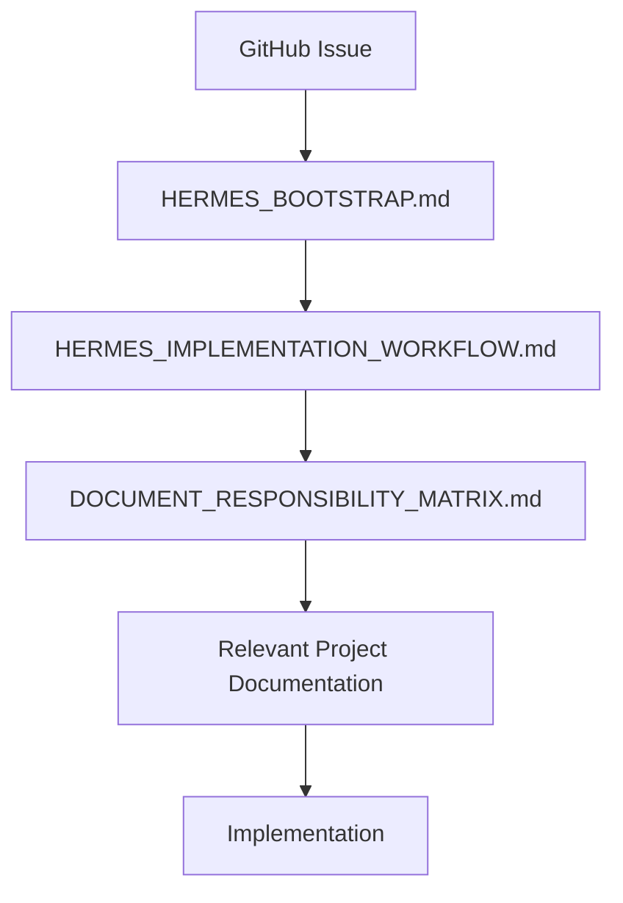
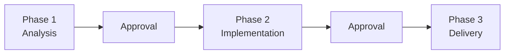

# Hermes Prompting Guide

**Document Owner:** Repository Maintainers
**Status:** Active
**Version:** 1.0
**Last Updated:** 2026-07-07

---

# Purpose

This document defines how engineers should interact with Hermes throughout the lifecycle of this repository.

Unlike `HERMES_IMPLEMENTATION_WORKFLOW.md`, which defines **what Hermes must do**, this document defines **how humans should communicate those expectations**.

The objective is to keep prompts:

- short
- consistent
- reusable
- repository-centric

The engineering process belongs in repository documentation—not in conversation prompts.

---

# Guiding Philosophy

Conversation prompts should orchestrate work.

Repository documentation should define work.

Prompts should therefore become progressively shorter as repository governance matures.

A prompt should never duplicate engineering workflow already documented elsewhere.

---

# Repository Governance Hierarchy

Every Hermes conversation follows this hierarchy.



---

# Conversation Lifecycle

Every GitHub Issue is completed using three conversations phases.



---

# Prompt Design Principles

A prompt should:

- identify the GitHub Issue
- identify the repository
- identify the required phase
- reference repository governance

A prompt should **not**:

- redefine engineering workflow
- redefine Git workflow
- restate validation procedures
- duplicate documentation

---

# Standard Prompt Templates

## Phase 1 — Analysis & Planning

```text
You are the implementation engineer assigned to GitHub Issue #<number>.

Repository:

/home/joel/projects/crypto-price-api

Begin by following the repository engineering workflow.

Read in order:

1. development/HERMES_BOOTSTRAP.md

2. development/HERMES_IMPLEMENTATION_WORKFLOW.md

3. development/DOCUMENT_RESPONSIBILITY_MATRIX.md

Determine which project documents apply to this GitHub Issue.

Read only those documents.

Read the complete GitHub Issue.

Execute Phase 1 exactly as defined by the repository workflow.

Do not modify files.

Wait for approval.
```

---

## Phase 2 — Implementation

```text
The implementation plan has been approved.

Execute Phase 2 exactly as defined in:

development/HERMES_IMPLEMENTATION_WORKFLOW.md

Follow all repository governance.

Do not expand issue scope.

Do not commit.

Stop after validation.
```

---

## Phase 3 — Delivery

```text
Implementation has been approved.

Execute Phase 3 exactly as defined in:

development/HERMES_IMPLEMENTATION_WORKFLOW.md

Perform:

- final review
- validation
- staging
- commit
- push
- Pull Request creation

Do not merge.

Stop after providing:

- commit hash
- branch
- PR URL
- validation summary
- remaining risks
```

---

# Long Running Commands

If Hermes reports:

- command approval required
- command exceeds 90 seconds
- repeated retries
- infrastructure failure

The engineer should investigate the environment.

The workflow should never be modified merely to bypass local infrastructure problems.

---

# Recovery Workflow

If implementation stops unexpectedly:

1. Resolve the environmental issue.
2. Resume from the last completed milestone.
3. Do not restart the issue unnecessarily.
4. Preserve the feature branch.
5. Continue using the same Pull Request.

---

# Prompt Evolution

Prompts should become shorter over time.

Whenever repository documentation gains a new engineering rule:

Move that rule into repository governance.

Remove it from future prompts.

---

# Anti-Patterns

Avoid prompts that:

- redefine Git workflow
- repeat implementation workflow
- duplicate validation commands
- describe repository architecture
- contain issue-specific engineering decisions unrelated to the current issue

These belong in repository documentation.

---

# Engineering Philosophy

Hermes should behave like a senior implementation engineer.

The repository should behave like the engineering handbook.

The GitHub Issue should behave like the sprint work item.

The conversation should simply connect the three.

---

# Continuous Improvement

Whenever Hermes:

- misunderstands instructions
- repeats mistakes
- requires repeated prompt additions

Determine whether the improvement belongs in:

- HERMES_BOOTSTRAP.md
- HERMES_IMPLEMENTATION_WORKFLOW.md
- DOCUMENT_RESPONSIBILITY_MATRIX.md
- this document

If so, update the repository instead of expanding future prompts.

This keeps the prompting strategy maintainable as the project grows.
