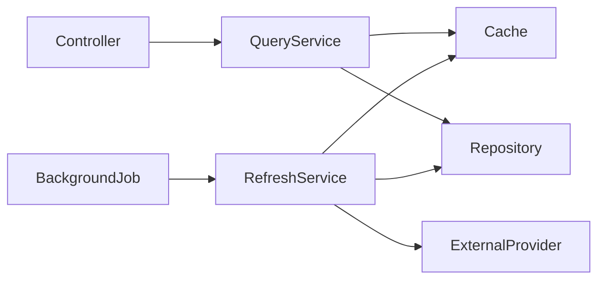
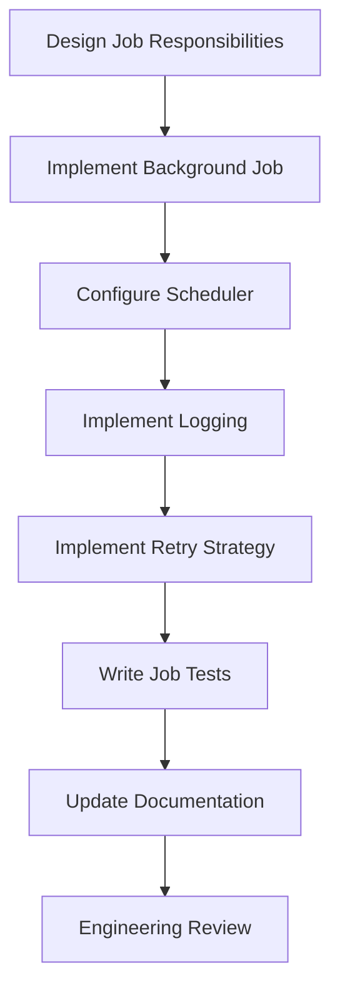
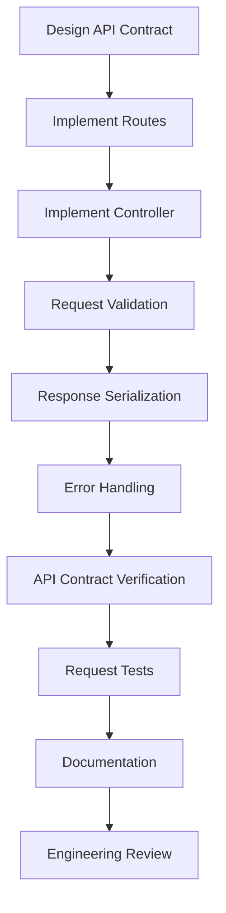
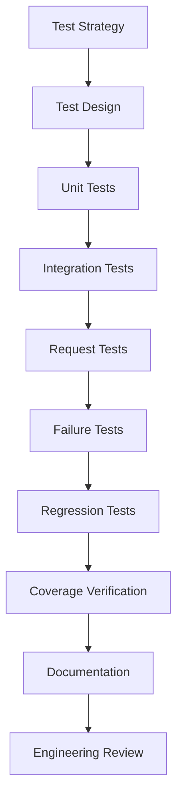
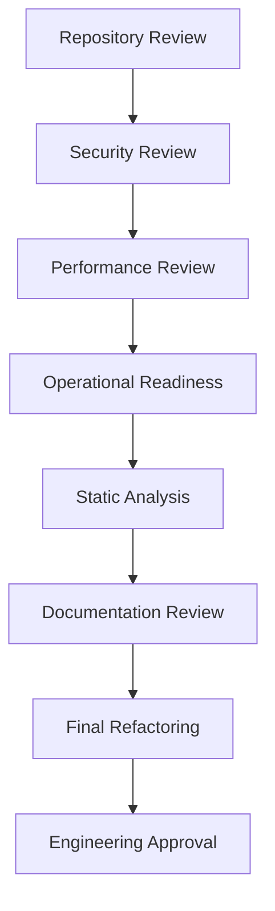
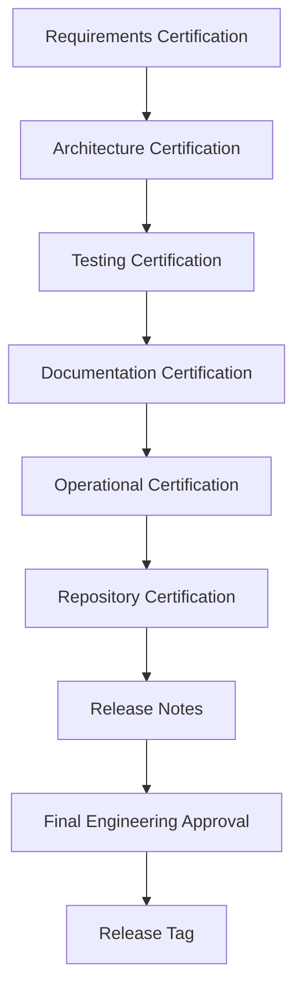

# IMPLEMENTATION_WORK_BREAKDOWN.md

> **Document Purpose**
>
> This document defines the complete implementation work breakdown structure (WBS) for the Cryptocurrency Price API project.
>
> Every engineering task required to deliver the project is represented within this checklist.
>
> Tasks are grouped by implementation phase and ordered according to the project roadmap.
>
> Completion of every task within this document is required before the project may proceed to final release.

---

# Table of Contents

1. Usage
2. Task Lifecycle
3. Task Priority Definitions
4. Task Status Definitions
5. Phase 1 – Repository Foundation
6. Phase 2 – Domain Design
7. Phase 3 – External API Integration
8. Phase 4 – Business Services
9. Phase 5 – Background Processing
10. Phase 6 – REST API
11. Phase 7 – Testing
12. Phase 8 – Production Hardening
13. Phase 9 – Release Preparation

---

# 1. Usage

This checklist shall be treated as the authoritative engineering task tracker throughout the implementation of the project.

Tasks should only be marked as complete after:

- implementation has been completed;
- automated tests pass;
- documentation has been updated;
- verification has been performed.

Checking a task without completing its verification activities is not permitted.

---

# 2. Task Lifecycle

Every implementation task progresses through the following lifecycle.

Tasks shall always move sequentially through the lifecycle.

No task may skip lifecycle stages.

---

# 3. Task Priority Definitions

| Priority | Meaning                                             |
| -------- | --------------------------------------------------- |
| Critical | Blocks subsequent implementation phases.            |
| High     | Required for project completion.                    |
| Medium   | Improves implementation quality or maintainability. |
| Low      | Optional enhancement or convenience.                |

---

# 4. Task Status Definitions

| Status | Description     |
| ------ | --------------- |
| ☐      | Not Started     |
| ◐      | In Progress     |
| ☑      | Completed       |
| ⚠      | Blocked         |
| ⟳      | Requires Rework |

---

# Phase 1 — Repository Foundation

## Objective

Establish a production-ready engineering environment before any business functionality is introduced.

---

## Repository Initialization

| ID      | Task                              | Priority | Depends On | Related Requirements | Verification           | Status |
| ------- | --------------------------------- | -------- | ---------- | -------------------- | ---------------------- | ------ |
| FND-001 | Create Git repository             | Critical | None       | NFR-001              | Repository initialized | ☐      |
| FND-002 | Configure default branch strategy | High     | FND-001    | NFR-001              | Branch created         | ☐      |
| FND-003 | Configure .gitignore              | High     | FND-001    | NFR-001              | Unwanted files ignored | ☐      |
| FND-004 | Configure .dockerignore           | Medium   | FND-001    | NFR-007              | Docker build verified  | ☐      |
| FND-005 | Add project license               | Low      | FND-001    | NFR-015              | License committed      | ☐      |

---

## Rails Application

| ID      | Task                              | Priority | Depends On | Related Requirements | Verification                   | Status |
| ------- | --------------------------------- | -------- | ---------- | -------------------- | ------------------------------ | ------ |
| FND-006 | Generate Rails API project        | Critical | FND-001    | NFR-001              | Application boots              | ☑      |
| FND-007 | Configure PostgreSQL              | Critical | FND-006    | NFR-001              | Database connection verified   | ☑      |
| FND-008 | Configure development environment | High     | FND-006    | NFR-001              | Rails server starts            | ☑      |
| FND-009 | Configure test environment        | High     | FND-006    | NFR-011              | Test environment verified      | ☑      |
| FND-010 | Configure production environment  | Medium   | FND-006    | NFR-013              | Environment loads successfully | ☑      |

---

## Ruby Environment

| ID      | Task                     | Priority | Depends On | Related Requirements | Verification            | Status |
| ------- | ------------------------ | -------- | ---------- | -------------------- | ----------------------- | ------ |
| FND-011 | Configure Ruby version   | High     | FND-006    | NFR-001              | Ruby version verified   | ☑      |
| FND-012 | Configure Bundler        | High     | FND-011    | NFR-001              | Bundle install succeeds | ☑      |
| FND-013 | Configure project gems   | High     | FND-012    | NFR-001              | Dependencies installed  | ☑      |
| FND-014 | Lock dependency versions | Medium   | FND-013    | NFR-001              | Gemfile.lock committed  | ☑      |

---

## Repository Structure

| ID      | Task                                     | Priority | Depends On | Related Requirements | Verification           | Status |
| ------- | ---------------------------------------- | -------- | ---------- | -------------------- | ---------------------- | ------ |
| FND-015 | Create documentation directory structure | High     | FND-001    | NFR-015              | Directory verified     | ☐      |
| FND-016 | Create development workspace             | Medium   | FND-015    | NFR-015              | Directory verified     | ☐      |
| FND-017 | Establish project conventions            | Medium   | FND-015    | NFR-002              | Documentation reviewed | ☐      |
| FND-018 | Verify repository structure              | Medium   | FND-017    | NFR-001              | Structure reviewed     | ☐      |

---

## Quality Tooling

| ID      | Task                 | Priority | Depends On | Related Requirements | Verification               | Status |
| ------- | -------------------- | -------- | ---------- | -------------------- | -------------------------- | ------ |
| FND-019 | Configure RSpec      | Critical | FND-006    | NFR-011              | Sample spec passes         | ☑      |
| FND-020 | Configure RuboCop    | High     | FND-019    | NFR-009              | Lint passes                | ☑      |
| FND-021 | Configure Brakeman   | High     | FND-019    | NFR-010              | Security scan passes       | ☑      |
| FND-022 | Configure SimpleCov  | High     | FND-019    | NFR-011              | Coverage report generated  | ☑      |
| FND-023 | Configure FactoryBot | Medium   | FND-019    | NFR-011              | Factory loads successfully | ☑      |
| FND-024 | Configure Faker      | Low      | FND-023    | NFR-011              | Sample data generated      | ☐      |

---

## Containerization

| ID      | Task                            | Priority | Depends On | Related Requirements | Verification                | Status |
| ------- | ------------------------------- | -------- | ---------- | -------------------- | --------------------------- | ------ |
| FND-025 | Create Dockerfile               | Critical | FND-006    | NFR-007              | Image builds                | ☐      |
| FND-026 | Create docker-compose.yml       | Critical | FND-025    | NFR-007              | Containers start            | ☐      |
| FND-027 | Configure application container | High     | FND-026    | NFR-007              | Rails boots in container    | ☐      |
| FND-028 | Configure PostgreSQL container  | High     | FND-026    | NFR-007              | Database reachable          | ☐      |
| FND-029 | Verify local Docker workflow    | High     | FND-027    | NFR-007              | End-to-end startup verified | ☐      |

---

## Continuous Integration

| ID      | Task                              | Priority | Depends On | Related Requirements | Verification           | Status |
| ------- | --------------------------------- | -------- | ---------- | -------------------- | ---------------------- | ------ |
| FND-030 | Create GitHub Actions workflow    | High     | FND-019    | NFR-008              | Workflow executes      | ☐      |
| FND-031 | Configure dependency installation | High     | FND-030    | NFR-008              | Dependencies installed | ☐      |
| FND-032 | Execute RuboCop in CI             | High     | FND-030    | NFR-009              | CI passes              | ☐      |
| FND-033 | Execute Brakeman in CI            | High     | FND-030    | NFR-010              | CI passes              | ☐      |
| FND-034 | Execute RSpec in CI               | Critical | FND-030    | NFR-011              | CI passes              | ☐      |
| FND-035 | Verify pipeline status            | High     | FND-034    | NFR-008              | Pipeline green         | ☐      |

---

## Documentation Foundation

| ID      | Task                                        | Priority | Depends On | Related Requirements | Verification                     | Status |
| ------- | ------------------------------------------- | -------- | ---------- | -------------------- | -------------------------------- | ------ |
| FND-036 | Complete PROJECT_SPECIFICATIONS.md          | Critical | FND-015    | NFR-015              | Document reviewed                | ☐      |
| FND-037 | Complete IMPLEMENTATION_ROADMAP.md          | Critical | FND-036    | NFR-015              | Document reviewed                | ☐      |
| FND-038 | Complete ENGINEERING_PRINCIPLES.md          | Critical | FND-037    | NFR-015              | Document reviewed                | ☐      |
| FND-039 | Create remaining documentation placeholders | Medium   | FND-038    | NFR-015              | Files verified                   | ☐      |
| FND-040 | Review documentation consistency            | High     | FND-039    | NFR-015              | Cross-reference review completed | ☐      |

---

## Repository Governance

| ID      | Task                                        | Priority | Depends On | Related Requirements | Verification                     | Status |
| ------- | ------------------------------------------- | -------- | ---------- | -------------------- | -------------------------------- | ------ |
| GOV-001 | Add issue templates                         | High     | FND-040    | NFR-015              | Templates created                | ☐      |
| GOV-002 | Configure Dependabot                        | High     | FND-040    | NFR-015              | dependabot.yml validated         | ☐      |
| GOV-003 | Create CODEOWNERS                           | Medium   | FND-040    | NFR-015              | CODEOWNERS file created          | ☐      |
| GOV-004 | Document branch protection rules            | High     | GOV-003    | NFR-015              | CONTRIBUTING.md updated          | ☐      |
| GOV-005 | Document required status checks             | High     | GOV-004    | NFR-015              | CONTRIBUTING.md updated          | ☐      |
| GOV-006 | Update pull request template                | Medium   | GOV-005    | NFR-015              | Template reviewed                | ☐      |
| GOV-007 | Update README.md governance references      | Medium   | GOV-006    | NFR-015              | README.md reviewed               | ☐      |
| GOV-008 | Update FEATURE_CHECKLIST.md                 | Medium   | GOV-007    | NFR-015              | Governance items tracked         | ☐      |
| GOV-009 | Update RELEASE_CHECKLIST.md                 | Medium   | GOV-008    | NFR-015              | Governance verification added    | ☐      |

---

# Phase 1 Exit Checklist

The Repository Foundation phase shall not be considered complete until every task below has been completed.

| Verification                      | Status |
| --------------------------------- | ------ |
| Git repository initialized        | ☐      |
| Rails API application operational | ☐      |
| PostgreSQL configured             | ☐      |
| Docker operational                | ☐      |
| GitHub Actions passing            | ☐      |
| RSpec configured                  | ☐      |
| RuboCop configured                | ☐      |
| Brakeman configured               | ☐      |
| SimpleCov configured              | ☐      |
| Documentation foundation complete | ☐      |
| Repository committed              | ☐      |

Only after every verification item has been completed may work begin on **Phase 2 – Domain Design**.

---

# Phase 2 — Domain Design

## Objective

Establish the application's domain model, persistence layer, and foundational abstractions.

This phase defines the core business entities and ensures that the application has a reliable, testable, and maintainable data access layer before external integrations or business logic are introduced.

The Domain Design phase intentionally excludes:

- external API communication;
- background processing;
- HTTP request handling;
- business orchestration.

---

## Engineering Deliverables

Upon completion of this phase the repository shall contain:

- Domain model(s)
- Database schema
- Migrations
- Repository layer
- Cache abstraction
- Validation rules
- Database indexes
- Factory definitions
- Initial seed strategy
- Automated tests
- Updated documentation

---

## Domain Model

| ID      | Task                                                  | Priority | Depends On | Related Requirements | Verification                | Status |
| ------- | ----------------------------------------------------- | -------- | ---------- | -------------------- | --------------------------- | ------ |
| DOM-001 | Design CryptoPrice domain entity                      | Critical | FND-040    | FR-005               | Design reviewed             | ☐      |
| DOM-002 | Identify required entity attributes                   | Critical | DOM-001    | FR-005               | Specification updated       | ☐      |
| DOM-003 | Identify optional attributes                          | Medium   | DOM-002    | FR-005               | Design reviewed             | ☐      |
| DOM-004 | Define entity responsibilities                        | Critical | DOM-001    | NFR-002              | Responsibilities documented | ☐      |
| DOM-005 | Review entity against Single Responsibility Principle | High     | DOM-004    | NFR-002              | Engineering review complete | ☐      |

---

## Database Schema

| ID      | Task                                    | Priority | Depends On | Related Requirements | Verification          | Status |
| ------- | --------------------------------------- | -------- | ---------- | -------------------- | --------------------- | ------ |
| DOM-006 | Design database schema                  | Critical | DOM-002    | FR-005               | Schema reviewed       | ☐      |
| DOM-007 | Define primary key strategy             | High     | DOM-006    | NFR-001              | Migration reviewed    | ☐      |
| DOM-008 | Define timestamp strategy               | Medium   | DOM-006    | FR-005               | Schema verified       | ☐      |
| DOM-009 | Identify required indexes               | High     | DOM-006    | NFR-001              | Index review complete | ☐      |
| DOM-010 | Identify future schema extension points | Low      | DOM-006    | NFR-005              | Design documented     | ☐      |

---

## ActiveRecord Model

| ID      | Task                                    | Priority | Depends On | Related Requirements | Verification                 | Status |
| ------- | --------------------------------------- | -------- | ---------- | -------------------- | ---------------------------- | ------ |
| DOM-011 | Generate CryptoPrice model              | Critical | DOM-006    | FR-005               | Model loads successfully     | ☐      |
| DOM-012 | Implement validations                   | Critical | DOM-011    | FR-005               | Validation specs pass        | ☐      |
| DOM-013 | Configure attribute constraints         | High     | DOM-012    | FR-005               | Database validation verified | ☐      |
| DOM-014 | Review model responsibilities           | High     | DOM-013    | NFR-002              | Engineering review complete  | ☐      |
| DOM-015 | Verify model contains no business logic | Critical | DOM-014    | NFR-002              | Code review completed        | ☐      |

---

## Database Migration

| ID      | Task                     | Priority | Depends On | Related Requirements | Verification        | Status |
| ------- | ------------------------ | -------- | ---------- | -------------------- | ------------------- | ------ |
| DOM-016 | Create migration         | Critical | DOM-006    | FR-005               | Migration generated | ☐      |
| DOM-017 | Add database constraints | High     | DOM-016    | FR-005               | Schema verified     | ☐      |
| DOM-018 | Add indexes              | High     | DOM-017    | NFR-001              | Indexes verified    | ☐      |
| DOM-019 | Execute migration        | Critical | DOM-018    | FR-005               | Migration succeeds  | ☐      |
| DOM-020 | Verify rollback          | High     | DOM-019    | NFR-001              | Rollback succeeds   | ☐      |

---

## Repository Layer

| ID      | Task                               | Priority | Depends On | Related Requirements | Verification                 | Status |
| ------- | ---------------------------------- | -------- | ---------- | -------------------- | ---------------------------- | ------ |
| DOM-021 | Define repository interface        | Critical | DOM-015    | NFR-005              | Interface reviewed           | ☐      |
| DOM-022 | Implement CryptoPriceRepository    | Critical | DOM-021    | FR-005               | Repository specs pass        | ☐      |
| DOM-023 | Implement find by symbol           | High     | DOM-022    | FR-005               | Repository specs pass        | ☐      |
| DOM-024 | Implement create/update behaviour  | High     | DOM-022    | FR-005               | Repository specs pass        | ☐      |
| DOM-025 | Prevent ActiveRecord leakage       | High     | DOM-022    | NFR-005              | Code review completed        | ☐      |
| DOM-026 | Review repository responsibilities | Medium   | DOM-025    | NFR-002              | Engineering review completed | ☐      |

---

## Cache Abstraction

| ID      | Task                             | Priority | Depends On | Related Requirements | Verification                 | Status |
| ------- | -------------------------------- | -------- | ---------- | -------------------- | ---------------------------- | ------ |
| DOM-027 | Define cache interface           | High     | DOM-021    | FR-006               | Interface reviewed           | ☐      |
| DOM-028 | Implement PriceCache abstraction | Critical | DOM-027    | FR-006               | Cache specs pass             | ☐      |
| DOM-029 | Implement cache read operation   | High     | DOM-028    | FR-006               | Cache specs pass             | ☐      |
| DOM-030 | Implement cache write operation  | High     | DOM-028    | FR-006               | Cache specs pass             | ☐      |
| DOM-031 | Implement cache invalidation     | Medium   | DOM-028    | FR-006               | Cache specs pass             | ☐      |
| DOM-032 | Verify cache isolation           | High     | DOM-031    | NFR-005              | Architecture review complete | ☐      |

---

## Factory Definitions

| ID      | Task                            | Priority | Depends On | Related Requirements | Verification       | Status |
| ------- | ------------------------------- | -------- | ---------- | -------------------- | ------------------ | ------ |
| DOM-033 | Create CryptoPrice factory      | High     | DOM-011    | NFR-011              | Factory loads      | ☐      |
| DOM-034 | Define realistic default values | Medium   | DOM-033    | NFR-011              | Factory verified   | ☐      |
| DOM-035 | Verify factory linting          | Medium   | DOM-034    | NFR-011              | Factory specs pass | ☐      |

---

## Seed Strategy

| ID      | Task                             | Priority | Depends On | Related Requirements | Verification        | Status |
| ------- | -------------------------------- | -------- | ---------- | -------------------- | ------------------- | ------ |
| DOM-036 | Design seed data strategy        | Low      | DOM-006    | NFR-015              | Strategy documented | ☐      |
| DOM-037 | Create development seed data     | Low      | DOM-036    | NFR-015              | Seeds execute       | ☐      |
| DOM-038 | Verify repeatable seed execution | Low      | DOM-037    | NFR-015              | Seeds idempotent    | ☐      |

---

## Domain Testing

| ID      | Task                            | Priority | Depends On | Related Requirements | Verification         | Status |
| ------- | ------------------------------- | -------- | ---------- | -------------------- | -------------------- | ------ |
| DOM-039 | Write model specifications      | Critical | DOM-015    | NFR-011              | Specs pass           | ☐      |
| DOM-040 | Write validation specifications | Critical | DOM-039    | NFR-011              | Specs pass           | ☐      |
| DOM-041 | Write repository specifications | Critical | DOM-026    | NFR-011              | Specs pass           | ☐      |
| DOM-042 | Write cache specifications      | Critical | DOM-032    | NFR-011              | Specs pass           | ☐      |
| DOM-043 | Verify migration behaviour      | Medium   | DOM-020    | NFR-011              | Migration tests pass | ☐      |
| DOM-044 | Review test coverage            | High     | DOM-043    | NFR-011              | Coverage verified    | ☐      |

---

## Documentation

| ID      | Task                          | Priority | Depends On | Related Requirements | Verification                | Status |
| ------- | ----------------------------- | -------- | ---------- | -------------------- | --------------------------- | ------ |
| DOM-045 | Update DATABASE.md            | High     | DOM-020    | NFR-015              | Documentation reviewed      | ☐      |
| DOM-046 | Update ARCHITECTURE.md        | High     | DOM-032    | NFR-015              | Documentation reviewed      | ☐      |
| DOM-047 | Record engineering decisions  | High     | DOM-046    | NFR-015              | Engineering Journal updated | ☐      |
| DOM-048 | Update Junior Developer Guide | Medium   | DOM-047    | NFR-015              | Documentation reviewed      | ☐      |

---

# Phase 2 Review Activities

Before Phase 2 is approved, perform the following reviews.

### Architecture Review

- Verify responsibility boundaries.
- Verify repository isolation.
- Verify cache abstraction.
- Verify model simplicity.

---

### Database Review

- Validate schema.
- Validate indexes.
- Validate constraints.
- Validate migration rollback.

---

### Testing Review

- Execute complete domain test suite.
- Verify deterministic behaviour.
- Verify repository coverage.
- Verify cache coverage.

---

### Documentation Review

- Review DATABASE.md.
- Review ARCHITECTURE.md.
- Review ENGINEERING_JOURNAL.md.
- Review JUNIOR_DEVELOPER_GUIDE.md.

---

# Phase 2 Exit Checklist

| Verification                 | Status |
| ---------------------------- | ------ |
| Domain model complete        | ☐      |
| Database schema complete     | ☐      |
| Migrations verified          | ☐      |
| Repository implemented       | ☐      |
| Cache abstraction complete   | ☐      |
| Factory definitions verified | ☐      |
| Domain test suite passing    | ☐      |
| Documentation synchronized   | ☐      |
| RTM updated                  | ☐      |
| Engineering review completed | ☐      |
| Repository committed         | ☐      |

No work shall begin on **Phase 3 – External API Integration** until every Phase 2 verification item has been completed successfully.

---

# Phase 3 — External Provider Integration

## Objective

Establish a resilient, testable, and maintainable integration with the external cryptocurrency pricing provider.

This phase introduces the infrastructure required to communicate with third-party services while ensuring that external dependencies remain isolated from the remainder of the application.

The application shall treat all external providers as unreliable dependencies.

Provider failures shall never compromise the integrity of the application.

---

## Engineering Deliverables

Upon completion of this phase the repository shall contain:

- External provider client
- Provider configuration
- Authentication strategy
- HTTP abstraction
- Response validation
- Error translation
- Retry strategy
- Timeout configuration
- Structured logging
- Provider test suite
- Updated documentation

---

## Provider Design

| ID      | Task                                          | Priority | Depends On | Related Requirements | Verification                  | Status |
| ------- | --------------------------------------------- | -------- | ---------- | -------------------- | ----------------------------- | ------ |
| EXT-001 | Identify provider responsibilities            | Critical | DOM-048    | FR-003               | Responsibilities documented   | ☐      |
| EXT-002 | Define provider interface                     | Critical | EXT-001    | NFR-005              | Interface reviewed            | ☐      |
| EXT-003 | Define provider response contract             | High     | EXT-002    | FR-003               | Contract reviewed             | ☐      |
| EXT-004 | Review provider boundary against architecture | High     | EXT-003    | NFR-002              | Architecture review completed | ☐      |
| EXT-005 | Document provider assumptions                 | Medium   | EXT-004    | NFR-015              | Documentation updated         | ☐      |

---

## HTTP Client

| ID      | Task                         | Priority | Depends On | Related Requirements | Verification                   | Status |
| ------- | ---------------------------- | -------- | ---------- | -------------------- | ------------------------------ | ------ |
| EXT-006 | Select HTTP client library   | High     | EXT-002    | NFR-001              | Decision documented            | ☐      |
| EXT-007 | Create CoinGecko client      | Critical | EXT-006    | FR-003               | Client loads successfully      | ☐      |
| EXT-008 | Configure HTTP connection    | High     | EXT-007    | FR-003               | Requests succeed               | ☐      |
| EXT-009 | Configure request headers    | High     | EXT-008    | FR-003               | Requests verified              | ☐      |
| EXT-010 | Configure authentication     | Critical | EXT-009    | FR-003               | Authenticated request verified | ☐      |
| EXT-011 | Verify provider connectivity | Critical | EXT-010    | FR-003               | Live request succeeds          | ☐      |

---

## Configuration Management

| ID      | Task                               | Priority | Depends On | Related Requirements | Verification                | Status |
| ------- | ---------------------------------- | -------- | ---------- | -------------------- | --------------------------- | ------ |
| EXT-012 | Configure environment variables    | Critical | EXT-010    | NFR-014              | Variables loaded            | ☐      |
| EXT-013 | Configure Rails credentials        | High     | EXT-012    | NFR-014              | Credentials verified        | ☐      |
| EXT-014 | Separate environment configuration | High     | EXT-013    | NFR-013              | Configuration reviewed      | ☐      |
| EXT-015 | Verify secret isolation            | Critical | EXT-014    | NFR-014              | Repository review completed | ☐      |

---

## Response Validation

| ID      | Task                        | Priority | Depends On | Related Requirements | Verification               | Status |
| ------- | --------------------------- | -------- | ---------- | -------------------- | -------------------------- | ------ |
| EXT-016 | Parse provider response     | High     | EXT-011    | FR-003               | Parsing verified           | ☐      |
| EXT-017 | Validate response structure | Critical | EXT-016    | FR-003               | Validation specs pass      | ☐      |
| EXT-018 | Validate required fields    | High     | EXT-017    | FR-003               | Validation specs pass      | ☐      |
| EXT-019 | Validate numeric values     | High     | EXT-018    | FR-003               | Validation specs pass      | ☐      |
| EXT-020 | Reject malformed responses  | Critical | EXT-019    | FR-007               | Failure behaviour verified | ☐      |

---

## Timeout Strategy

| ID      | Task                         | Priority | Depends On | Related Requirements | Verification     | Status |
| ------- | ---------------------------- | -------- | ---------- | -------------------- | ---------------- | ------ |
| EXT-021 | Configure connection timeout | High     | EXT-011    | FR-007               | Timeout verified | ☐      |
| EXT-022 | Configure read timeout       | High     | EXT-021    | FR-007               | Timeout verified | ☐      |
| EXT-023 | Verify timeout behaviour     | High     | EXT-022    | FR-007               | Specs pass       | ☐      |

---

## Retry Strategy

| ID      | Task                      | Priority | Depends On | Related Requirements | Verification      | Status |
| ------- | ------------------------- | -------- | ---------- | -------------------- | ----------------- | ------ |
| EXT-024 | Define retry policy       | High     | EXT-023    | FR-007               | Policy documented | ☐      |
| EXT-025 | Implement retry behaviour | High     | EXT-024    | FR-007               | Retry verified    | ☐      |
| EXT-026 | Verify retry limits       | Medium   | EXT-025    | FR-007               | Tests pass        | ☐      |
| EXT-027 | Prevent infinite retries  | Critical | EXT-026    | FR-007               | Review completed  | ☐      |

---

## Exception Translation

| ID      | Task                                | Priority | Depends On | Related Requirements | Verification                | Status |
| ------- | ----------------------------------- | -------- | ---------- | -------------------- | --------------------------- | ------ |
| EXT-028 | Define provider exception hierarchy | High     | EXT-020    | NFR-002              | Design reviewed             | ☐      |
| EXT-029 | Translate HTTP failures             | Critical | EXT-028    | FR-007               | Specs pass                  | ☐      |
| EXT-030 | Translate timeout failures          | High     | EXT-029    | FR-007               | Specs pass                  | ☐      |
| EXT-031 | Translate parsing failures          | High     | EXT-030    | FR-007               | Specs pass                  | ☐      |
| EXT-032 | Verify predictable exceptions       | High     | EXT-031    | NFR-002              | Engineering review complete | ☐      |

---

## Structured Logging

| ID      | Task                                     | Priority | Depends On | Related Requirements | Verification              | Status |
| ------- | ---------------------------------------- | -------- | ---------- | -------------------- | ------------------------- | ------ |
| EXT-033 | Define provider log format               | Medium   | EXT-032    | NFR-012              | Format documented         | ☐      |
| EXT-034 | Log outbound requests                    | Medium   | EXT-033    | NFR-012              | Logs verified             | ☐      |
| EXT-035 | Log provider failures                    | High     | EXT-034    | NFR-012              | Logs verified             | ☐      |
| EXT-036 | Log response duration                    | Medium   | EXT-034    | NFR-012              | Logs verified             | ☐      |
| EXT-037 | Verify sensitive information is excluded | Critical | EXT-036    | NFR-014              | Security review completed | ☐      |

---

## External Provider Testing

| ID      | Task                               | Priority | Depends On | Related Requirements | Verification      | Status |
| ------- | ---------------------------------- | -------- | ---------- | -------------------- | ----------------- | ------ |
| EXT-038 | Write provider client specs        | Critical | EXT-037    | NFR-011              | Specs pass        | ☐      |
| EXT-039 | Test successful provider responses | High     | EXT-038    | NFR-011              | Specs pass        | ☐      |
| EXT-040 | Test timeout scenarios             | Critical | EXT-039    | FR-007               | Specs pass        | ☐      |
| EXT-041 | Test malformed responses           | High     | EXT-040    | FR-007               | Specs pass        | ☐      |
| EXT-042 | Test retry behaviour               | High     | EXT-041    | FR-007               | Specs pass        | ☐      |
| EXT-043 | Review provider test coverage      | High     | EXT-042    | NFR-011              | Coverage verified | ☐      |

---

## Documentation

| ID      | Task                               | Priority | Depends On | Related Requirements | Verification                | Status |
| ------- | ---------------------------------- | -------- | ---------- | -------------------- | --------------------------- | ------ |
| EXT-044 | Update ARCHITECTURE.md             | High     | EXT-043    | NFR-015              | Documentation reviewed      | ☐      |
| EXT-045 | Update API.md (provider behaviour) | Medium   | EXT-044    | NFR-015              | Documentation reviewed      | ☐      |
| EXT-046 | Record integration decisions       | High     | EXT-045    | NFR-015              | Engineering Journal updated | ☐      |
| EXT-047 | Update Junior Developer Guide      | Medium   | EXT-046    | NFR-015              | Documentation reviewed      | ☐      |

---

# Phase 3 Review Activities

### Architecture Review

- Verify external provider isolation.
- Verify client abstraction.
- Verify dependency boundaries.
- Verify service independence.

---

### Reliability Review

- Validate timeout behaviour.
- Validate retry strategy.
- Validate failure handling.
- Validate exception translation.

---

### Security Review

- Verify API key management.
- Verify credential isolation.
- Verify log sanitisation.
- Verify secure configuration.

---

### Testing Review

- Execute provider test suite.
- Verify retry behaviour.
- Verify timeout handling.
- Verify malformed response handling.

---

### Documentation Review

- Review ARCHITECTURE.md.
- Review API.md.
- Review ENGINEERING_JOURNAL.md.
- Review JUNIOR_DEVELOPER_GUIDE.md.

---

# Phase 3 Exit Checklist

| Verification                   | Status |
| ------------------------------ | ------ |
| Provider client implemented    | ☐      |
| HTTP configuration complete    | ☐      |
| Authentication verified        | ☐      |
| Response validation complete   | ☐      |
| Retry strategy verified        | ☐      |
| Timeout strategy verified      | ☐      |
| Exception translation complete | ☐      |
| Structured logging verified    | ☐      |
| Provider test suite passing    | ☐      |
| Documentation synchronized     | ☐      |
| RTM updated                    | ☐      |
| Repository committed           | ☐      |

No work shall begin on **Phase 4 – Business Services** until every Phase 3 verification item has been completed successfully.

---

# Future Considerations

The following ideas have been intentionally deferred from the current implementation to preserve scope while keeping future evolution straightforward.

| ID         | Consideration                                            | Rationale                                                                    |
| ---------- | -------------------------------------------------------- | ---------------------------------------------------------------------------- |
| FC-EXT-001 | Provider interface supporting multiple pricing providers | Enables failover and vendor substitution without changing the service layer. |
| FC-EXT-002 | Circuit breaker pattern                                  | Improve resilience during prolonged upstream outages.                        |
| FC-EXT-003 | Exponential backoff retries                              | Reduce pressure on upstream providers during repeated failures.              |
| FC-EXT-004 | Provider health monitoring                               | Surface provider availability through operational metrics.                   |
| FC-EXT-005 | Response schema versioning                               | Simplify adaptation to future provider API changes.                          |

These items are documented for future consideration and shall not be implemented unless project scope changes.

---

# Lessons Learned

This section shall be completed during implementation.

Document observations including:

- implementation challenges;
- architectural discoveries;
- testing improvements;
- provider-specific behaviours;
- unexpected edge cases;
- opportunities for future simplification.

---

# Engineering Notes

This section shall be maintained throughout implementation.

Record concise engineering observations that may benefit future contributors, such as:

- framework-specific caveats;
- provider limitations;
- dependency considerations;
- implementation patterns worth reusing;
- common troubleshooting steps.

Only durable, project-relevant knowledge should be recorded here.

---

# Phase 4 — Business Services

## Objective

Implement the application's service layer responsible for coordinating domain entities, repositories, cache management, and external provider interactions.

The service layer shall become the application's primary implementation of business behaviour.

Controllers, background jobs and future integrations shall interact exclusively with the service layer.

Business behaviour shall never be duplicated outside this layer.

---

## Engineering Deliverables

Upon completion of this phase the repository shall contain:

- Application service layer
- Query service
- Refresh service
- Cache coordination
- Repository coordination
- Provider coordination
- Fallback strategy
- Response mapping
- Service test suite
- Updated documentation

---

## Service Architecture

The service layer is responsible for orchestration.

Persistence, HTTP communication and presentation concerns shall remain outside this layer.

---

# Query Service

| ID      | Task                                         | Priority | Depends On | Related Requirements | Verification                 | Status |
| ------- | -------------------------------------------- | -------- | ---------- | -------------------- | ---------------------------- | ------ |
| BUS-001 | Define Query Service responsibilities        | Critical | EXT-047    | FR-002               | Responsibilities documented  | ☐      |
| BUS-002 | Create PriceQueryService                     | Critical | BUS-001    | FR-002               | Service loads successfully   | ☐      |
| BUS-003 | Define public service interface              | High     | BUS-002    | NFR-005              | Interface reviewed           | ☐      |
| BUS-004 | Verify service independence from controllers | High     | BUS-003    | NFR-002              | Architecture review complete | ☐      |
| BUS-005 | Review SRP compliance                        | High     | BUS-004    | NFR-002              | Engineering review complete  | ☐      |

---

# Cache Coordination

| ID      | Task                              | Priority | Depends On | Related Requirements | Verification                 | Status |
| ------- | --------------------------------- | -------- | ---------- | -------------------- | ---------------------------- | ------ |
| BUS-006 | Retrieve cached prices first      | Critical | BUS-002    | FR-002               | Behaviour verified           | ☐      |
| BUS-007 | Handle cache miss                 | Critical | BUS-006    | FR-006               | Specs pass                   | ☐      |
| BUS-008 | Retrieve persisted value          | High     | BUS-007    | FR-006               | Specs pass                   | ☐      |
| BUS-009 | Repopulate cache after cache miss | High     | BUS-008    | FR-006               | Cache verified               | ☐      |
| BUS-010 | Verify cache-first strategy       | Critical | BUS-009    | FR-006               | Architecture review complete | ☐      |

---

# Refresh Service

| ID      | Task                                    | Priority | Depends On | Related Requirements | Verification                | Status |
| ------- | --------------------------------------- | -------- | ---------- | -------------------- | --------------------------- | ------ |
| BUS-011 | Define Refresh Service responsibilities | Critical | BUS-010    | FR-005               | Responsibilities documented | ☐      |
| BUS-012 | Create PriceRefreshService              | Critical | BUS-011    | FR-005               | Service loads successfully  | ☐      |
| BUS-013 | Integrate provider client               | High     | BUS-012    | FR-003               | Integration verified        | ☐      |
| BUS-014 | Validate provider response              | High     | BUS-013    | FR-003               | Validation verified         | ☐      |
| BUS-015 | Persist refreshed values                | Critical | BUS-014    | FR-005               | Repository specs pass       | ☐      |
| BUS-016 | Refresh cache after persistence         | Critical | BUS-015    | FR-006               | Cache updated               | ☐      |
| BUS-017 | Verify refresh workflow                 | High     | BUS-016    | FR-005               | Workflow reviewed           | ☐      |

---

# Fallback Behaviour

| ID      | Task                                               | Priority | Depends On | Related Requirements | Verification                 | Status |
| ------- | -------------------------------------------------- | -------- | ---------- | -------------------- | ---------------------------- | ------ |
| BUS-018 | Design fallback strategy                           | Critical | BUS-017    | FR-007               | Design approved              | ☐      |
| BUS-019 | Preserve persisted values on provider failure      | Critical | BUS-018    | FR-007               | Behaviour verified           | ☐      |
| BUS-020 | Continue serving cached values                     | Critical | BUS-019    | FR-007               | Specs pass                   | ☐      |
| BUS-021 | Prevent provider failures propagating to consumers | Critical | BUS-020    | FR-007               | Behaviour verified           | ☐      |
| BUS-022 | Log fallback execution                             | High     | BUS-021    | NFR-012              | Logs reviewed                | ☐      |
| BUS-023 | Review graceful degradation strategy               | High     | BUS-022    | FR-007               | Architecture review complete | ☐      |

---

# Response Mapping

| ID      | Task                                      | Priority | Depends On | Related Requirements | Verification       | Status |
| ------- | ----------------------------------------- | -------- | ---------- | -------------------- | ------------------ | ------ |
| BUS-024 | Define service response object            | High     | BUS-017    | FR-002               | Interface reviewed | ☐      |
| BUS-025 | Map persistence objects to response model | High     | BUS-024    | FR-002               | Specs pass         | ☐      |
| BUS-026 | Standardise service output                | Medium   | BUS-025    | NFR-001              | Behaviour verified | ☐      |
| BUS-027 | Verify response consistency               | High     | BUS-026    | FR-002               | Review complete    | ☐      |

---

# Error Coordination

| ID      | Task                                  | Priority | Depends On | Related Requirements | Verification       | Status |
| ------- | ------------------------------------- | -------- | ---------- | -------------------- | ------------------ | ------ |
| BUS-028 | Handle repository failures            | High     | BUS-023    | FR-007               | Specs pass         | ☐      |
| BUS-029 | Handle provider failures              | Critical | BUS-028    | FR-007               | Specs pass         | ☐      |
| BUS-030 | Handle cache failures                 | High     | BUS-029    | FR-007               | Behaviour verified | ☐      |
| BUS-031 | Ensure predictable service exceptions | High     | BUS-030    | NFR-002              | Review complete    | ☐      |

---

# Service Testing

| ID      | Task                        | Priority | Depends On | Related Requirements | Verification      | Status |
| ------- | --------------------------- | -------- | ---------- | -------------------- | ----------------- | ------ |
| BUS-032 | Write Query Service specs   | Critical | BUS-031    | NFR-011              | Specs pass        | ☐      |
| BUS-033 | Write Refresh Service specs | Critical | BUS-032    | NFR-011              | Specs pass        | ☐      |
| BUS-034 | Verify cache hit behaviour  | High     | BUS-033    | FR-006               | Specs pass        | ☐      |
| BUS-035 | Verify cache miss behaviour | High     | BUS-034    | FR-006               | Specs pass        | ☐      |
| BUS-036 | Verify fallback behaviour   | Critical | BUS-035    | FR-007               | Specs pass        | ☐      |
| BUS-037 | Verify service coverage     | High     | BUS-036    | NFR-011              | Coverage reviewed | ☐      |

---

# Documentation

| ID      | Task                           | Priority | Depends On | Related Requirements | Verification                | Status |
| ------- | ------------------------------ | -------- | ---------- | -------------------- | --------------------------- | ------ |
| BUS-038 | Update ARCHITECTURE.md         | High     | BUS-037    | NFR-015              | Documentation reviewed      | ☐      |
| BUS-039 | Update TESTING.md              | Medium   | BUS-038    | NFR-015              | Documentation reviewed      | ☐      |
| BUS-040 | Record service layer decisions | High     | BUS-039    | NFR-015              | Engineering Journal updated | ☐      |
| BUS-041 | Update Junior Developer Guide  | Medium   | BUS-040    | NFR-015              | Documentation reviewed      | ☐      |

---

# Phase 4 Review Activities

### Architecture Review

- Verify orchestration responsibilities.
- Verify controller independence.
- Verify repository isolation.
- Verify provider isolation.

---

### Behaviour Review

- Validate cache-first retrieval.
- Validate fallback behaviour.
- Validate persistence updates.
- Validate service responses.

---

### Testing Review

- Execute service test suite.
- Verify graceful degradation.
- Verify deterministic behaviour.

---

### Documentation Review

- Review ARCHITECTURE.md.
- Review TESTING.md.
- Review ENGINEERING_JOURNAL.md.
- Review JUNIOR_DEVELOPER_GUIDE.md.

---

# Phase 4 Exit Checklist

| Verification                   | Status |
| ------------------------------ | ------ |
| Query service implemented      | ☐      |
| Refresh service implemented    | ☐      |
| Cache coordination verified    | ☐      |
| Provider coordination verified | ☐      |
| Graceful degradation verified  | ☐      |
| Service test suite passing     | ☐      |
| Documentation synchronized     | ☐      |
| RTM updated                    | ☐      |
| Engineering review completed   | ☐      |
| Repository committed           | ☐      |

No work shall begin on **Phase 5 – Background Processing** until every Phase 4 verification item has been successfully completed.

---

# Future Considerations

| ID         | Consideration               | Rationale                                                       |
| ---------- | --------------------------- | --------------------------------------------------------------- |
| FC-BUS-001 | Support multiple currencies | Reduce service assumptions about a single quote currency.       |
| FC-BUS-002 | Batch refresh operations    | Improve efficiency when tracking many assets.                   |
| FC-BUS-003 | Service instrumentation     | Expose latency and cache metrics.                               |
| FC-BUS-004 | Distributed cache support   | Enable horizontal scaling with external cache providers.        |
| FC-BUS-005 | Domain events               | Publish significant application events for future integrations. |

These ideas are intentionally deferred and shall not be implemented unless the project scope changes.

---

# Lessons Learned

This section shall be completed during implementation.

Capture observations regarding:

- orchestration complexity;
- cache behaviour;
- service boundaries;
- testing techniques;
- opportunities to simplify the service layer.

---

# Engineering Notes

Maintain implementation notes that may assist future contributors.

Examples include:

- preferred orchestration patterns;
- common testing pitfalls;
- cache consistency considerations;
- dependency injection decisions;
- refactoring opportunities identified during implementation.

---

# Phase 5 — Background Processing

## Objective

Implement the asynchronous processing layer responsible for periodically synchronizing cryptocurrency prices with the external provider.

This phase introduces scheduled execution while ensuring that business logic remains within the service layer and that background jobs function solely as orchestration components.

Background jobs shall never contain business rules.

Their responsibility is limited to coordinating application services according to a defined schedule.

---

## Engineering Deliverables

Upon completion of this phase the repository shall contain:

- Background job implementation
- Scheduler configuration
- Job orchestration
- Job logging
- Failure recovery
- Retry behaviour
- Background job test suite
- Updated documentation

---

# Implementation Order

The implementation shall proceed in the following sequence.

Each step shall be completed before the next begins.

Business logic shall never be introduced into the background job.

---

# Job Design

| ID      | Task                                      | Priority | Depends On | Related Requirements | Verification                 | Status |
| ------- | ----------------------------------------- | -------- | ---------- | -------------------- | ---------------------------- | ------ |
| JOB-001 | Define background job responsibilities    | Critical | BUS-041    | FR-004               | Responsibilities documented  | ☐      |
| JOB-002 | Verify separation from service layer      | Critical | JOB-001    | NFR-002              | Architecture review complete | ☐      |
| JOB-003 | Define job execution lifecycle            | High     | JOB-002    | FR-004               | Design reviewed              | ☐      |
| JOB-004 | Review asynchronous processing boundaries | High     | JOB-003    | NFR-002              | Engineering review completed | ☐      |

---

# Background Job Implementation

| ID      | Task                           | Priority | Depends On | Related Requirements | Verification           | Status |
| ------- | ------------------------------ | -------- | ---------- | -------------------- | ---------------------- | ------ |
| JOB-005 | Create PriceRefreshJob         | Critical | JOB-004    | FR-004               | Job loads successfully | ☐      |
| JOB-006 | Invoke Refresh Service         | Critical | JOB-005    | FR-004               | Integration verified   | ☐      |
| JOB-007 | Remove business logic from job | Critical | JOB-006    | NFR-002              | Code review completed  | ☐      |
| JOB-008 | Verify job orchestration       | High     | JOB-007    | NFR-002              | Review completed       | ☐      |

---

# Scheduler Configuration

| ID      | Task                          | Priority | Depends On | Related Requirements | Verification                 | Status |
| ------- | ----------------------------- | -------- | ---------- | -------------------- | ---------------------------- | ------ |
| JOB-009 | Select scheduling mechanism   | High     | JOB-008    | FR-004               | Decision documented          | ☑      |
| JOB-010 | Configure one-minute schedule | Critical | JOB-009    | FR-004               | Scheduler verified           | ☐      |
| JOB-011 | Verify scheduled execution    | Critical | JOB-010    | FR-004               | Execution observed           | ☐      |
| JOB-012 | Validate repeated execution   | High     | JOB-011    | FR-004               | Multiple executions verified | ☐      |

---

# Retry Behaviour

| ID      | Task                        | Priority | Depends On | Related Requirements | Verification       | Status |
| ------- | --------------------------- | -------- | ---------- | -------------------- | ------------------ | ------ |
| JOB-013 | Define retry policy         | High     | JOB-012    | FR-007               | Policy reviewed    | ☐      |
| JOB-014 | Configure retry behaviour   | High     | JOB-013    | FR-007               | Behaviour verified | ☐      |
| JOB-015 | Prevent duplicate execution | High     | JOB-014    | NFR-001              | Review completed   | ☐      |
| JOB-016 | Verify retry limits         | Medium   | JOB-015    | FR-007               | Specs pass         | ☐      |

---

# Failure Recovery

| ID      | Task                        | Priority | Depends On | Related Requirements | Verification         | Status |
| ------- | --------------------------- | -------- | ---------- | -------------------- | -------------------- | ------ |
| JOB-017 | Handle provider failures    | Critical | JOB-016    | FR-007               | Behaviour verified   | ☐      |
| JOB-018 | Continue future scheduling  | Critical | JOB-017    | FR-007               | Scheduler verified   | ☐      |
| JOB-019 | Preserve existing data      | High     | JOB-018    | FR-007               | Persistence verified | ☐      |
| JOB-020 | Verify graceful degradation | High     | JOB-019    | FR-007               | Review completed     | ☐      |

---

# Logging

| ID      | Task                      | Priority | Depends On | Related Requirements | Verification     | Status |
| ------- | ------------------------- | -------- | ---------- | -------------------- | ---------------- | ------ |
| JOB-021 | Log job start             | Medium   | JOB-020    | NFR-012              | Logs reviewed    | ☐      |
| JOB-022 | Log successful completion | Medium   | JOB-021    | NFR-012              | Logs reviewed    | ☐      |
| JOB-023 | Log failures              | High     | JOB-022    | NFR-012              | Logs reviewed    | ☐      |
| JOB-024 | Log execution duration    | Medium   | JOB-023    | NFR-012              | Logs reviewed    | ☐      |
| JOB-025 | Verify structured logging | Medium   | JOB-024    | NFR-012              | Review completed | ☐      |

---

# Background Job Testing

| ID      | Task                       | Priority | Depends On | Related Requirements | Verification      | Status |
| ------- | -------------------------- | -------- | ---------- | -------------------- | ----------------- | ------ |
| JOB-026 | Write job specifications   | Critical | JOB-025    | NFR-011              | Specs pass        | ☐      |
| JOB-027 | Verify scheduler behaviour | High     | JOB-026    | NFR-011              | Specs pass        | ☐      |
| JOB-028 | Verify retry behaviour     | High     | JOB-027    | NFR-011              | Specs pass        | ☐      |
| JOB-029 | Verify failure recovery    | Critical | JOB-028    | FR-007               | Specs pass        | ☐      |
| JOB-030 | Review job coverage        | High     | JOB-029    | NFR-011              | Coverage verified | ☐      |

---

# Documentation

| ID      | Task                            | Priority | Depends On | Related Requirements | Verification                | Status |
| ------- | ------------------------------- | -------- | ---------- | -------------------- | --------------------------- | ------ |
| JOB-031 | Update BACKGROUND_JOBS.md       | High     | JOB-030    | NFR-015              | Documentation reviewed      | ☐      |
| JOB-032 | Update TESTING.md               | Medium   | JOB-031    | NFR-015              | Documentation reviewed      | ☐      |
| JOB-033 | Record implementation decisions | High     | JOB-032    | NFR-015              | Engineering Journal updated | ☐      |
| JOB-034 | Update Junior Developer Guide   | Medium   | JOB-033    | NFR-015              | Documentation reviewed      | ☐      |

---

# Phase 5 Review Activities

### Architecture Review

- Verify job responsibilities.
- Verify service orchestration.
- Verify scheduling design.

---

### Reliability Review

- Validate repeated execution.
- Validate failure recovery.
- Validate retry strategy.

---

### Testing Review

- Execute background job suite.
- Verify deterministic execution.
- Verify graceful degradation.

---

### Documentation Review

- Review BACKGROUND_JOBS.md.
- Review TESTING.md.
- Review ENGINEERING_JOURNAL.md.
- Review JUNIOR_DEVELOPER_GUIDE.md.

---

# Phase 5 Exit Checklist

| Verification                | Status |
| --------------------------- | ------ |
| Background job implemented  | ☐      |
| Scheduler operational       | ☐      |
| Retry behaviour verified    | ☐      |
| Failure recovery verified   | ☐      |
| Structured logging verified | ☐      |
| Job test suite passing      | ☐      |
| Documentation synchronized  | ☐      |
| RTM updated                 | ☐      |
| Repository committed        | ☐      |

No work shall begin on **Phase 6 – REST API** until every verification item has been successfully completed.

---

# Future Considerations

| ID         | Consideration             | Rationale                                            |
| ---------- | ------------------------- | ---------------------------------------------------- |
| FC-JOB-001 | Distributed job execution | Support multiple application instances safely.       |
| FC-JOB-002 | Job metrics dashboard     | Improve operational visibility.                      |
| FC-JOB-003 | Dead-letter queue         | Capture permanently failed executions.               |
| FC-JOB-004 | Dynamic scheduling        | Adjust polling intervals based on provider health.   |
| FC-JOB-005 | Job concurrency controls  | Improve scalability while preventing duplicate work. |

These enhancements are intentionally outside the current project scope.

---

# Lessons Learned

To be completed during implementation.

Record observations regarding:

- scheduler behaviour;
- retry effectiveness;
- operational reliability;
- deployment considerations;
- testing improvements.

---

# Engineering Notes

Maintain durable implementation knowledge including:

- scheduler configuration caveats;
- background processing patterns;
- operational troubleshooting guidance;
- framework-specific considerations;
- future optimisation opportunities.

---

# Phase 6 — REST API

## Objective

Expose the application's public HTTP interface while maintaining strict separation between transport concerns and business logic.

The REST API shall provide a stable, predictable, and well-documented interface for consumers of the Cryptocurrency Price API.

Controllers shall remain orchestration components.

Business logic shall remain exclusively within the service layer.

---

## Engineering Deliverables

Upon completion of this phase the repository shall contain:

- PricesController
- Route definitions
- Request validation
- Response serialization
- Error serialization
- HTTP status mapping
- API contract verification
- Request test suite
- Updated documentation

---

# Implementation Order

Implementation shall proceed in the following sequence.

Each implementation stage shall be completed and verified before proceeding to the next.

---

# API Design

| ID      | Task                                          | Priority | Depends On | Related Requirements | Verification                 | Status |
| ------- | --------------------------------------------- | -------- | ---------- | -------------------- | ---------------------------- | ------ |
| API-001 | Define public endpoint contract               | Critical | JOB-034    | FR-001               | Contract reviewed            | ☐      |
| API-002 | Review endpoint against project specification | Critical | API-001    | FR-001               | Review completed             | ☐      |
| API-003 | Define request structure                      | High     | API-002    | FR-001               | Specification updated        | ☐      |
| API-004 | Define response structure                     | High     | API-003    | FR-002               | Specification reviewed       | ☐      |
| API-005 | Review API versioning strategy                | Medium   | API-004    | NFR-001              | Engineering review completed | ☐      |

---

# Routing

| ID      | Task                        | Priority | Depends On | Related Requirements | Verification       | Status |
| ------- | --------------------------- | -------- | ---------- | -------------------- | ------------------ | ------ |
| API-006 | Configure route definitions | Critical | API-005    | FR-001               | Routes verified    | ☐      |
| API-007 | Verify route accessibility  | Critical | API-006    | FR-001               | Endpoint reachable | ☐      |
| API-008 | Review routing conventions  | Medium   | API-007    | NFR-001              | Review completed   | ☐      |

---

# Controller Implementation

| ID      | Task                                  | Priority | Depends On | Related Requirements | Verification                  | Status |
| ------- | ------------------------------------- | -------- | ---------- | -------------------- | ----------------------------- | ------ |
| API-009 | Create PricesController               | Critical | API-008    | FR-001               | Controller loads              | ☐      |
| API-010 | Inject Query Service                  | Critical | API-009    | FR-002               | Integration verified          | ☐      |
| API-011 | Remove business logic from controller | Critical | API-010    | NFR-002              | Code review completed         | ☐      |
| API-012 | Review controller responsibilities    | High     | API-011    | NFR-002              | Architecture review completed | ☐      |

---

# Request Validation

| ID      | Task                           | Priority | Depends On | Related Requirements | Verification        | Status |
| ------- | ------------------------------ | -------- | ---------- | -------------------- | ------------------- | ------ |
| API-013 | Validate cryptocurrency symbol | Critical | API-012    | FR-001               | Validation verified | ☐      |
| API-014 | Handle unsupported symbols     | High     | API-013    | FR-009               | Behaviour verified  | ☐      |
| API-015 | Validate malformed requests    | High     | API-014    | FR-009               | Specs pass          | ☐      |
| API-016 | Review validation strategy     | Medium   | API-015    | NFR-002              | Review completed    | ☐      |

---

# Response Serialization

| ID      | Task                         | Priority | Depends On | Related Requirements | Verification       | Status |
| ------- | ---------------------------- | -------- | ---------- | -------------------- | ------------------ | ------ |
| API-017 | Design response serializer   | High     | API-016    | FR-002               | Design reviewed    | ☐      |
| API-018 | Implement JSON serialization | Critical | API-017    | FR-002               | Responses verified | ☐      |
| API-019 | Ensure response consistency  | High     | API-018    | FR-009               | Review completed   | ☐      |
| API-020 | Verify timestamp formatting  | Medium   | API-019    | FR-002               | Specs pass         | ☐      |

---

# Error Handling

| ID      | Task                                     | Priority | Depends On | Related Requirements | Verification       | Status |
| ------- | ---------------------------------------- | -------- | ---------- | -------------------- | ------------------ | ------ |
| API-021 | Define error response format             | Critical | API-020    | FR-009               | Contract reviewed  | ☐      |
| API-022 | Map service exceptions to HTTP responses | Critical | API-021    | FR-008               | Behaviour verified | ☐      |
| API-023 | Implement consistent error serializer    | High     | API-022    | FR-009               | Specs pass         | ☐      |
| API-024 | Verify predictable API failures          | High     | API-023    | FR-009               | Review completed   | ☐      |

---

# HTTP Status Codes

| ID      | Task                          | Priority | Depends On | Related Requirements | Verification                 | Status |
| ------- | ----------------------------- | -------- | ---------- | -------------------- | ---------------------------- | ------ |
| API-025 | Define success status codes   | High     | API-024    | FR-008               | Verified                     | ☐      |
| API-026 | Define client error responses | High     | API-025    | FR-008               | Verified                     | ☐      |
| API-027 | Define server error responses | Medium   | API-026    | FR-008               | Verified                     | ☐      |
| API-028 | Review HTTP semantics         | Medium   | API-027    | NFR-001              | Engineering review completed | ☐      |

---

# API Contract Verification

| ID      | Task                              | Priority | Depends On | Related Requirements | Verification                | Status |
| ------- | --------------------------------- | -------- | ---------- | -------------------- | --------------------------- | ------ |
| API-029 | Verify endpoint contract          | Critical | API-028    | FR-001               | Contract validated          | ☐      |
| API-030 | Verify request schema             | Critical | API-029    | FR-001               | Request validation complete | ☐      |
| API-031 | Verify response schema            | Critical | API-030    | FR-002               | Schema validated            | ☐      |
| API-032 | Verify error schema               | Critical | API-031    | FR-009               | Error responses validated   | ☐      |
| API-033 | Verify JSON consistency           | High     | API-032    | FR-009               | Response review completed   | ☐      |
| API-034 | Verify API documentation accuracy | High     | API-033    | NFR-015              | Documentation reviewed      | ☐      |

---

# Request Testing

| ID      | Task                             | Priority | Depends On | Related Requirements | Verification      | Status |
| ------- | -------------------------------- | -------- | ---------- | -------------------- | ----------------- | ------ |
| API-035 | Write request specifications     | Critical | API-034    | NFR-011              | Specs pass        | ☐      |
| API-036 | Test successful responses        | Critical | API-035    | FR-002               | Specs pass        | ☐      |
| API-037 | Test invalid symbols             | High     | API-036    | FR-009               | Specs pass        | ☐      |
| API-038 | Test provider fallback behaviour | Critical | API-037    | FR-007               | Specs pass        | ☐      |
| API-039 | Verify request coverage          | High     | API-038    | NFR-011              | Coverage verified | ☐      |

---

# Documentation

| ID      | Task                          | Priority | Depends On | Related Requirements | Verification                | Status |
| ------- | ----------------------------- | -------- | ---------- | -------------------- | --------------------------- | ------ |
| API-040 | Complete API.md               | Critical | API-039    | NFR-015              | Documentation reviewed      | ☐      |
| API-041 | Update ARCHITECTURE.md        | Medium   | API-040    | NFR-015              | Documentation reviewed      | ☐      |
| API-042 | Record API design decisions   | High     | API-041    | NFR-015              | Engineering Journal updated | ☐      |
| API-043 | Update Junior Developer Guide | Medium   | API-042    | NFR-015              | Documentation reviewed      | ☐      |

---

# Phase 6 Review Activities

### API Review

- Verify endpoint definitions.
- Verify request validation.
- Verify response schema.
- Verify error responses.
- Verify HTTP semantics.

---

### Architecture Review

- Verify controller responsibilities.
- Verify service isolation.
- Verify transport layer separation.

---

### Testing Review

- Execute request specification suite.
- Verify API contract.
- Verify graceful degradation.
- Verify response consistency.

---

### Documentation Review

- Review API.md.
- Review ARCHITECTURE.md.
- Review ENGINEERING_JOURNAL.md.
- Review JUNIOR_DEVELOPER_GUIDE.md.

---

# Phase 6 Exit Checklist

| Verification                    | Status |
| ------------------------------- | ------ |
| Routes implemented              | ☐      |
| Controller implemented          | ☐      |
| Request validation complete     | ☐      |
| Response serialization complete | ☐      |
| Error serialization complete    | ☐      |
| HTTP status mapping verified    | ☐      |
| API contract verified           | ☐      |
| Request test suite passing      | ☐      |
| Documentation synchronized      | ☐      |
| RTM updated                     | ☐      |
| Repository committed            | ☐      |

No work shall begin on **Phase 7 – Testing & Quality Assurance** until every verification item has been completed successfully.

---

# Future Considerations

| ID         | Consideration                    | Rationale                                                          |
| ---------- | -------------------------------- | ------------------------------------------------------------------ |
| FC-API-001 | API versioning                   | Prepare for future backward-incompatible changes.                  |
| FC-API-002 | OpenAPI/Swagger generation       | Improve client integration and discoverability.                    |
| FC-API-003 | Rate limiting                    | Protect the API under high load.                                   |
| FC-API-004 | Authentication and authorization | Secure future endpoints if additional functionality is introduced. |
| FC-API-005 | Response compression             | Improve bandwidth efficiency for larger payloads.                  |

These enhancements are intentionally deferred to preserve the scope of the current project.

---

# Lessons Learned

This section shall be completed during implementation.

Document observations related to:

- API usability;
- request validation;
- response consistency;
- client experience;
- opportunities to simplify the public interface.

---

# Engineering Notes

Maintain implementation notes that will assist future contributors.

Examples include:

- serialization patterns;
- API design trade-offs;
- HTTP semantics;
- controller implementation guidance;
- common testing approaches for request specifications.

---

# Phase 7 — Testing & Quality Assurance

## Objective

Verify that the Cryptocurrency Price API satisfies all documented functional and non-functional requirements through comprehensive automated testing and engineering verification.

Testing is considered an implementation activity rather than a post-development validation exercise.

The objective of this phase is to establish confidence in the correctness, reliability, maintainability, and operational behaviour of the application.

---

## Engineering Deliverables

Upon completion of this phase the repository shall contain:

- Complete automated test suite
- Unit tests
- Integration tests
- Request tests
- Fallback verification
- Cache verification
- Coverage reporting
- Test documentation
- Verified quality metrics

---

# Implementation Order

Implementation shall proceed in the following sequence.

Testing shall evolve alongside implementation.

No production feature shall remain untested.

---

# Test Strategy

| ID      | Task                        | Priority | Depends On | Related Requirements | Verification          | Status |
| ------- | --------------------------- | -------- | ---------- | -------------------- | --------------------- | ------ |
| TST-001 | Review testing requirements | Critical | API-043    | NFR-011              | Requirements reviewed | ☐      |
| TST-002 | Define testing strategy     | Critical | TST-001    | NFR-011              | Strategy documented   | ☐      |
| TST-003 | Define coverage objectives  | High     | TST-002    | NFR-011              | Objectives approved   | ☐      |
| TST-004 | Define quality metrics      | High     | TST-003    | NFR-011              | Metrics documented    | ☐      |

---

# Unit Testing

| ID      | Task                                  | Priority | Depends On | Related Requirements | Verification | Status |
| ------- | ------------------------------------- | -------- | ---------- | -------------------- | ------------ | ------ |
| TST-005 | Verify model specifications           | Critical | TST-004    | NFR-011              | Specs pass   | ☐      |
| TST-006 | Verify repository specifications      | Critical | TST-005    | NFR-011              | Specs pass   | ☐      |
| TST-007 | Verify cache specifications           | Critical | TST-006    | NFR-011              | Specs pass   | ☐      |
| TST-008 | Verify provider client specifications | Critical | TST-007    | NFR-011              | Specs pass   | ☐      |
| TST-009 | Verify service specifications         | Critical | TST-008    | NFR-011              | Specs pass   | ☐      |
| TST-010 | Verify background job specifications  | Critical | TST-009    | NFR-011              | Specs pass   | ☐      |

---

# Integration Testing

| ID      | Task                         | Priority | Depends On | Related Requirements | Verification | Status |
| ------- | ---------------------------- | -------- | ---------- | -------------------- | ------------ | ------ |
| TST-011 | Verify provider integration  | High     | TST-010    | FR-003               | Specs pass   | ☐      |
| TST-012 | Verify persistence workflow  | High     | TST-011    | FR-005               | Specs pass   | ☐      |
| TST-013 | Verify cache workflow        | High     | TST-012    | FR-006               | Specs pass   | ☐      |
| TST-014 | Verify service orchestration | High     | TST-013    | FR-005               | Specs pass   | ☐      |
| TST-015 | Verify scheduler workflow    | High     | TST-014    | FR-004               | Specs pass   | ☐      |

---

# Request Testing

| ID      | Task                                 | Priority | Depends On | Related Requirements | Verification | Status |
| ------- | ------------------------------------ | -------- | ---------- | -------------------- | ------------ | ------ |
| TST-016 | Verify successful endpoint responses | Critical | TST-015    | FR-001               | Specs pass   | ☐      |
| TST-017 | Verify invalid requests              | High     | TST-016    | FR-009               | Specs pass   | ☐      |
| TST-018 | Verify unsupported symbols           | High     | TST-017    | FR-009               | Specs pass   | ☐      |
| TST-019 | Verify response schema               | Critical | TST-018    | FR-002               | Specs pass   | ☐      |
| TST-020 | Verify HTTP status codes             | Critical | TST-019    | FR-008               | Specs pass   | ☐      |

---

# Resilience Testing

| ID      | Task                                    | Priority | Depends On | Related Requirements | Verification    | Status |
| ------- | --------------------------------------- | -------- | ---------- | -------------------- | --------------- | ------ |
| TST-021 | Simulate provider outage                | Critical | TST-020    | FR-007               | Specs pass      | ☐      |
| TST-022 | Verify fallback behaviour               | Critical | TST-021    | FR-007               | Specs pass      | ☐      |
| TST-023 | Verify cache survives provider outage   | High     | TST-022    | FR-007               | Specs pass      | ☐      |
| TST-024 | Verify persisted data remains available | High     | TST-023    | FR-007               | Specs pass      | ☐      |
| TST-025 | Verify graceful degradation             | Critical | TST-024    | FR-007               | Review complete | ☐      |

---

# Regression Testing

| ID      | Task                              | Priority | Depends On | Related Requirements | Verification             | Status |
| ------- | --------------------------------- | -------- | ---------- | -------------------- | ------------------------ | ------ |
| TST-026 | Execute complete regression suite | Critical | TST-025    | NFR-011              | All specs pass           | ☐      |
| TST-027 | Verify no feature regressions     | Critical | TST-026    | NFR-011              | Review complete          | ☐      |
| TST-028 | Verify deterministic behaviour    | High     | TST-027    | NFR-011              | Multiple executions pass | ☐      |
| TST-029 | Review flaky tests                | High     | TST-028    | NFR-011              | Stability confirmed      | ☐      |

---

# Coverage Verification

| ID      | Task                              | Priority | Depends On | Related Requirements | Verification      | Status |
| ------- | --------------------------------- | -------- | ---------- | -------------------- | ----------------- | ------ |
| TST-030 | Generate coverage report          | High     | TST-029    | NFR-011              | Report generated  | ☐      |
| TST-031 | Verify minimum coverage threshold | Critical | TST-030    | NFR-011              | ≥95% verified     | ☐      |
| TST-032 | Review uncovered code             | Medium   | TST-031    | NFR-011              | Review complete   | ☐      |
| TST-033 | Improve uncovered areas           | Medium   | TST-032    | NFR-011              | Coverage improved | ☐      |

---

# Documentation Verification

| ID      | Task                                   | Priority | Depends On | Related Requirements | Verification                | Status |
| ------- | -------------------------------------- | -------- | ---------- | -------------------- | --------------------------- | ------ |
| TST-034 | Verify API documentation accuracy      | High     | TST-033    | NFR-015              | Documentation reviewed      | ☐      |
| TST-035 | Verify architecture documentation      | High     | TST-034    | NFR-015              | Documentation reviewed      | ☐      |
| TST-036 | Verify Junior Developer Guide accuracy | High     | TST-035    | NFR-015              | Walkthrough completed       | ☐      |
| TST-037 | Update TESTING.md                      | Critical | TST-036    | NFR-015              | Documentation reviewed      | ☐      |
| TST-038 | Record testing decisions               | Medium   | TST-037    | NFR-015              | Engineering Journal updated | ☐      |

---

# Phase 7 Review Activities

### Quality Review

- Verify functional correctness.
- Verify resilience.
- Verify regression protection.

---

### Test Review

- Execute complete test suite.
- Verify deterministic execution.
- Review flaky tests.

---

### Documentation Review

- Review TESTING.md.
- Review API.md.
- Review ARCHITECTURE.md.
- Review ENGINEERING_JOURNAL.md.

---

# Phase 7 Exit Checklist

| Verification                | Status |
| --------------------------- | ------ |
| Unit tests complete         | ☐      |
| Integration tests complete  | ☐      |
| Request tests complete      | ☐      |
| Fallback behaviour verified | ☐      |
| Regression suite passing    | ☐      |
| Coverage ≥95%               | ☐      |
| Documentation synchronized  | ☐      |
| RTM updated                 | ☐      |
| Repository committed        | ☐      |

No work shall begin on **Phase 8 – Production Hardening** until every verification item has been completed successfully.

---

# Future Considerations

| ID         | Consideration                    | Rationale                                                                     |
| ---------- | -------------------------------- | ----------------------------------------------------------------------------- |
| FC-TST-001 | Mutation testing                 | Evaluate the effectiveness of the test suite beyond coverage percentages.     |
| FC-TST-002 | Performance benchmarks           | Establish baseline response-time measurements for future optimization.        |
| FC-TST-003 | Load and stress testing          | Validate behaviour under sustained and peak traffic conditions.               |
| FC-TST-004 | Consumer-driven contract testing | Strengthen API compatibility guarantees if external consumers are introduced. |
| FC-TST-005 | Chaos testing                    | Exercise resilience under randomized infrastructure and provider failures.    |

These enhancements are intentionally deferred because they exceed the scope of the interview project while remaining valuable future improvements.

---

# Lessons Learned

This section shall be completed during implementation.

Capture observations related to:

- test maintainability;
- coverage quality;
- recurring defects;
- resilience validation;
- opportunities to simplify the testing strategy.

---

# Engineering Notes

Maintain durable implementation knowledge including:

- recommended testing patterns;
- mocking and stubbing conventions;
- fixture and factory usage;
- deterministic testing techniques;
- common causes of flaky tests and their mitigation.

---

# Phase 8 — Production Hardening

## Objective

Prepare the Cryptocurrency Price API for production-quality operation by validating operational readiness, improving maintainability, strengthening security, reviewing performance, and ensuring the repository satisfies enterprise engineering standards.

No new functional features shall be introduced during this phase.

The purpose of this phase is to improve the quality of the existing implementation.

---

## Engineering Deliverables

Upon completion of this phase the repository shall contain:

- Production-ready configuration
- Hardened application settings
- Verified logging
- Security review
- Performance review
- Static analysis compliance
- Documentation review
- Operational readiness assessment
- Repository quality review

---

# Implementation Order

Implementation shall proceed in the following sequence.

Production hardening shall improve existing implementation rather than introduce additional functionality.

---

# Repository Review

| ID      | Task                                      | Priority | Depends On | Related Requirements | Verification        | Status |
| ------- | ----------------------------------------- | -------- | ---------- | -------------------- | ------------------- | ------ |
| PRD-001 | Review repository structure               | Critical | TST-038    | NFR-015              | Review completed    | ☐      |
| PRD-002 | Review directory consistency              | High     | PRD-001    | NFR-001              | Review completed    | ☐      |
| PRD-003 | Remove obsolete files                     | Medium   | PRD-002    | NFR-015              | Repository verified | ☐      |
| PRD-004 | Remove temporary implementation artifacts | Critical | PRD-003    | NFR-015              | Repository verified | ☐      |

---

# Security Review

| ID      | Task                             | Priority | Depends On | Related Requirements | Verification              | Status |
| ------- | -------------------------------- | -------- | ---------- | -------------------- | ------------------------- | ------ |
| PRD-005 | Verify secrets are externalised  | Critical | PRD-004    | NFR-014              | Security review completed | ☐      |
| PRD-006 | Review Rails credentials         | High     | PRD-005    | NFR-014              | Verified                  | ☐      |
| PRD-007 | Verify environment configuration | High     | PRD-006    | NFR-013              | Verified                  | ☐      |
| PRD-008 | Execute Brakeman                 | Critical | PRD-007    | NFR-010              | Scan passes               | ☐      |
| PRD-009 | Resolve security warnings        | Critical | PRD-008    | NFR-010              | Review completed          | ☐      |

---

# Performance Review

| ID      | Task                                  | Priority | Depends On | Related Requirements | Verification          | Status |
| ------- | ------------------------------------- | -------- | ---------- | -------------------- | --------------------- | ------ |
| PRD-010 | Review database queries               | High     | PRD-009    | NFR-001              | Queries reviewed      | ☐      |
| PRD-011 | Verify cache effectiveness            | High     | PRD-010    | FR-006               | Review completed      | ☐      |
| PRD-012 | Review unnecessary allocations        | Medium   | PRD-011    | NFR-001              | Review completed      | ☐      |
| PRD-013 | Review response latency               | Medium   | PRD-012    | NFR-001              | Measurements recorded | ☐      |
| PRD-014 | Review opportunities for optimisation | Low      | PRD-013    | NFR-001              | Review documented     | ☐      |

---

# Operational Readiness Assessment

| ID      | Task                             | Priority | Depends On | Related Requirements | Verification                | Status |
| ------- | -------------------------------- | -------- | ---------- | -------------------- | --------------------------- | ------ |
| PRD-015 | Verify clean repository checkout | Critical | PRD-014    | NFR-015              | Fresh clone succeeds        | ☐      |
| PRD-016 | Verify bootstrap instructions    | Critical | PRD-015    | NFR-015              | Guide followed successfully | ☐      |
| PRD-017 | Verify Docker startup            | Critical | PRD-016    | NFR-007              | Containers operational      | ☐      |
| PRD-018 | Verify CI reproducibility        | Critical | PRD-017    | NFR-008              | CI succeeds                 | ☐      |
| PRD-019 | Verify deterministic setup       | High     | PRD-018    | NFR-015              | Review completed            | ☐      |

---

# Static Analysis

| ID      | Task                          | Priority | Depends On | Related Requirements | Verification        | Status |
| ------- | ----------------------------- | -------- | ---------- | -------------------- | ------------------- | ------ |
| PRD-020 | Execute RuboCop               | Critical | PRD-019    | NFR-009              | Lint passes         | ☐      |
| PRD-021 | Resolve RuboCop violations    | Critical | PRD-020    | NFR-009              | Review completed    | ☐      |
| PRD-022 | Review code consistency       | High     | PRD-021    | NFR-002              | Review completed    | ☐      |
| PRD-023 | Verify formatting consistency | Medium   | PRD-022    | NFR-002              | Repository reviewed | ☐      |

---

# Documentation Review

| ID      | Task                          | Priority | Depends On | Related Requirements | Verification           | Status |
| ------- | ----------------------------- | -------- | ---------- | -------------------- | ---------------------- | ------ |
| PRD-024 | Review README.md              | High     | PRD-023    | NFR-015              | Documentation reviewed | ☐      |
| PRD-025 | Review API.md                 | High     | PRD-024    | NFR-015              | Documentation reviewed | ☐      |
| PRD-026 | Review ARCHITECTURE.md        | High     | PRD-025    | NFR-015              | Documentation reviewed | ☐      |
| PRD-027 | Review TESTING.md             | High     | PRD-026    | NFR-015              | Documentation reviewed | ☐      |
| PRD-028 | Review Junior Developer Guide | Critical | PRD-027    | NFR-015              | Walkthrough completed  | ☐      |
| PRD-029 | Review Engineering Journal    | Medium   | PRD-028    | NFR-015              | Documentation reviewed | ☐      |

---

# Repository Refinement

| ID      | Task                               | Priority | Depends On | Related Requirements | Verification        | Status |
| ------- | ---------------------------------- | -------- | ---------- | -------------------- | ------------------- | ------ |
| PRD-030 | Refactor duplicated implementation | Medium   | PRD-029    | NFR-002              | Review completed    | ☐      |
| PRD-031 | Improve naming consistency         | Medium   | PRD-030    | NFR-002              | Review completed    | ☐      |
| PRD-032 | Improve inline documentation       | Low      | PRD-031    | NFR-015              | Review completed    | ☐      |
| PRD-033 | Verify repository cleanliness      | Critical | PRD-032    | NFR-015              | Repository reviewed | ☐      |

---

# Phase 8 Review Activities

### Operational Review

- Verify reproducible setup.
- Verify deployment readiness.
- Verify deterministic behaviour.

---

### Security Review

- Verify secret management.
- Verify static analysis.
- Review dependencies.

---

### Documentation Review

- Review all published documentation.
- Verify cross references.
- Verify consistency.

---

### Engineering Review

- Review architecture.
- Review maintainability.
- Review repository quality.

---

# Phase 8 Exit Checklist

| Verification                   | Status |
| ------------------------------ | ------ |
| Repository hardened            | ☐      |
| Security review complete       | ☐      |
| Performance review complete    | ☐      |
| Operational readiness verified | ☐      |
| RuboCop passing                | ☐      |
| Brakeman passing               | ☐      |
| Documentation synchronized     | ☐      |
| Repository reviewed            | ☐      |
| Repository committed           | ☐      |

No work shall begin on **Phase 9 – Release Preparation** until every verification item has been successfully completed.

---

# Future Considerations

| ID         | Consideration                          | Rationale                                                 |
| ---------- | -------------------------------------- | --------------------------------------------------------- |
| FC-PRD-001 | Continuous dependency scanning         | Detect newly disclosed vulnerabilities automatically.     |
| FC-PRD-002 | Container image vulnerability scanning | Strengthen deployment security.                           |
| FC-PRD-003 | Performance monitoring dashboards      | Provide operational visibility in production.             |
| FC-PRD-004 | Structured observability stack         | Centralize logs, metrics, and traces.                     |
| FC-PRD-005 | Automated release pipelines            | Reduce manual release effort while improving consistency. |

These items are intentionally deferred because they extend beyond the scope of the interview project.

---

# Lessons Learned

This section shall be completed during implementation.

Capture observations related to:

- operational readiness;
- repository quality;
- documentation improvements;
- deployment considerations;
- engineering refinements.

---

# Engineering Notes

Maintain durable implementation knowledge including:

- deployment caveats;
- configuration guidance;
- production troubleshooting notes;
- dependency management considerations;
- operational best practices.

---

# Phase 9 — Release Certification & Interview Readiness

## Objective

Formally certify that the Cryptocurrency Price API satisfies all documented functional and non-functional requirements and is ready for interview submission.

This phase introduces no new functionality.

Its purpose is to validate, certify, and document the quality of the completed repository.

The repository shall only be considered complete after every certification activity has been successfully completed.

---

## Engineering Deliverables

Upon completion of this phase the repository shall contain:

- Certified implementation
- Complete documentation
- Fully traceable requirements
- Verified test suite
- Final release tag
- Release notes
- Engineering certification
- Interview-ready repository

---

# Implementation Order

Implementation shall proceed in the following sequence.

Every certification activity shall complete successfully before the repository is considered ready for release.

---

# Requirements Certification

| ID      | Task                                    | Priority | Depends On | Related Requirements | Verification                 | Status |
| ------- | --------------------------------------- | -------- | ---------- | -------------------- | ---------------------------- | ------ |
| REL-001 | Review Functional Requirements          | Critical | PRD-033    | All FR               | Review completed             | ☐      |
| REL-002 | Review Non-Functional Requirements      | Critical | REL-001    | All NFR              | Review completed             | ☐      |
| REL-003 | Verify Requirements Traceability Matrix | Critical | REL-002    | All                  | RTM verified                 | ☐      |
| REL-004 | Verify implementation completeness      | Critical | REL-003    | All                  | Engineering review completed | ☐      |

---

# Architecture Certification

| ID      | Task                                       | Priority | Depends On | Related Requirements | Verification                  | Status |
| ------- | ------------------------------------------ | -------- | ---------- | -------------------- | ----------------------------- | ------ |
| REL-005 | Verify architecture against specifications | Critical | REL-004    | NFR-002              | Architecture review completed | ☐      |
| REL-006 | Verify responsibility boundaries           | High     | REL-005    | NFR-002              | Review completed              | ☐      |
| REL-007 | Verify dependency direction                | High     | REL-006    | NFR-002              | Review completed              | ☐      |
| REL-008 | Verify architectural consistency           | High     | REL-007    | NFR-002              | Engineering approval          | ☐      |

---

# Testing Certification

| ID      | Task                                  | Priority | Depends On | Related Requirements | Verification                   | Status |
| ------- | ------------------------------------- | -------- | ---------- | -------------------- | ------------------------------ | ------ |
| REL-009 | Execute complete automated test suite | Critical | REL-008    | NFR-011              | Tests pass                     | ☐      |
| REL-010 | Verify coverage threshold             | Critical | REL-009    | NFR-011              | Coverage ≥95%                  | ☐      |
| REL-011 | Verify regression suite               | High     | REL-010    | NFR-011              | Review completed               | ☐      |
| REL-012 | Verify deterministic execution        | High     | REL-011    | NFR-011              | Multiple successful executions | ☐      |

---

# Documentation Certification

| ID      | Task                             | Priority | Depends On | Related Requirements | Verification                     | Status |
| ------- | -------------------------------- | -------- | ---------- | -------------------- | -------------------------------- | ------ |
| REL-013 | Review README.md                 | High     | REL-012    | NFR-015              | Documentation approved           | ☐      |
| REL-014 | Review PROJECT_SPECIFICATIONS.md | Critical | REL-013    | NFR-015              | Documentation approved           | ☐      |
| REL-015 | Review ARCHITECTURE.md           | High     | REL-014    | NFR-015              | Documentation approved           | ☐      |
| REL-016 | Review API.md                    | High     | REL-015    | NFR-015              | Documentation approved           | ☐      |
| REL-017 | Review TESTING.md                | High     | REL-016    | NFR-015              | Documentation approved           | ☐      |
| REL-018 | Review BACKGROUND_JOBS.md        | Medium   | REL-017    | NFR-015              | Documentation approved           | ☐      |
| REL-019 | Review JUNIOR_DEVELOPER_GUIDE.md | Critical | REL-018    | NFR-015              | End-to-end walkthrough completed | ☐      |
| REL-020 | Review ENGINEERING_JOURNAL.md    | Medium   | REL-019    | NFR-015              | Documentation approved           | ☐      |

---

# Operational Certification

| ID      | Task                             | Priority | Depends On | Related Requirements | Verification                     | Status |
| ------- | -------------------------------- | -------- | ---------- | -------------------- | -------------------------------- | ------ |
| REL-021 | Verify fresh repository clone    | Critical | REL-020    | NFR-007              | Clone verified                   | ☐      |
| REL-022 | Verify Docker startup            | Critical | REL-021    | NFR-007              | Application operational          | ☐      |
| REL-023 | Verify bootstrap procedure       | Critical | REL-022    | NFR-015              | Junior Developer Guide validated | ☐      |
| REL-024 | Verify CI pipeline               | Critical | REL-023    | NFR-008              | CI successful                    | ☐      |
| REL-025 | Verify environment configuration | High     | REL-024    | NFR-013              | Configuration reviewed           | ☐      |

---

# Repository Certification

| ID      | Task                              | Priority | Depends On | Related Requirements | Verification        | Status |
| ------- | --------------------------------- | -------- | ---------- | -------------------- | ------------------- | ------ |
| REL-026 | Verify Git history quality        | Medium   | REL-025    | NFR-015              | History reviewed    | ☐      |
| REL-027 | Verify commit message consistency | Medium   | REL-026    | NFR-015              | Review completed    | ☐      |
| REL-028 | Verify repository cleanliness     | High     | REL-027    | NFR-015              | Repository reviewed | ☐      |
| REL-029 | Create release notes              | High     | REL-028    | NFR-015              | Notes completed     | ☐      |
| REL-030 | Create Version 1.0 release tag    | Critical | REL-029    | NFR-015              | Tag created         | ☐      |

---

# Interview Readiness Assessment

The completed repository shall demonstrate the following characteristics.

| Assessment                            | Status |
| ------------------------------------- | ------ |
| Production-quality architecture       | ☐      |
| Clean separation of concerns          | ☐      |
| High test coverage                    | ☐      |
| Graceful degradation                  | ☐      |
| Enterprise documentation              | ☐      |
| Professional Git history              | ☐      |
| Reproducible build                    | ☐      |
| Docker support                        | ☐      |
| CI verification                       | ☐      |
| Junior developer onboarding validated | ☐      |

---

# Formal Engineering Certifications

## Functional Certification

☐ Every Functional Requirement has been implemented.

☐ Every Functional Requirement has been verified.

☐ Every Functional Requirement is traceable.

---

## Architecture Certification

☐ Architectural boundaries remain intact.

☐ Layer responsibilities remain clearly separated.

☐ No architectural violations remain.

---

## Testing Certification

☐ Entire automated test suite passes.

☐ Coverage threshold satisfied.

☐ No known flaky tests remain.

☐ Regression verification complete.

---

## Documentation Certification

☐ Every project document is complete.

☐ Documentation accurately reflects implementation.

☐ Cross-references verified.

☐ Junior Developer Guide validated through a complete walkthrough.

---

## Operational Certification

☐ Docker verified.

☐ CI verified.

☐ Static analysis verified.

☐ Logging verified.

☐ Secrets managed securely.

☐ Repository reproducible from a clean environment.

---

# Final Engineering Approval

The project shall only be considered complete when all of the following statements are true.

☐ Every planned implementation phase has been completed.

☐ Every engineering quality gate has been satisfied.

☐ Every certification activity has been completed.

☐ Every engineering document has been finalized.

☐ Every project requirement has been satisfied.

☐ The repository is suitable for presentation during a senior software engineering interview.

---

# Future Considerations

The Version 1.0 release intentionally excludes the following enhancements to maintain alignment with the agreed project scope.

| ID         | Consideration                               | Rationale                                                      |
| ---------- | ------------------------------------------- | -------------------------------------------------------------- |
| FC-REL-001 | Support additional cryptocurrency providers | Expand beyond the initial CoinGecko integration.               |
| FC-REL-002 | Redis-backed distributed caching            | Improve scalability for multi-instance deployments.            |
| FC-REL-003 | Metrics and observability platform          | Provide production-grade monitoring and alerting.              |
| FC-REL-004 | OpenAPI documentation generation            | Automate API specification publication.                        |
| FC-REL-005 | Kubernetes deployment manifests             | Prepare the application for container orchestration platforms. |

These items are intentionally deferred and shall be considered only if the project scope is expanded beyond the current interview requirements.

---

# Lessons Learned

This section shall be completed after the implementation has been finalized.

Document observations regarding:

- engineering decisions that proved valuable;
- implementation trade-offs;
- testing effectiveness;
- documentation quality;
- opportunities for future improvement.

---

# Engineering Notes

Record final observations that may assist future maintainers.

Examples include:

- interview discussion points;
- architectural decisions worth highlighting;
- operational recommendations;
- future roadmap suggestions.

---

# Final Release Statement

Completion of this phase certifies that the Cryptocurrency Price API repository has been implemented in accordance with:

- `PROJECT_SPECIFICATIONS.md`
- `IMPLEMENTATION_ROADMAP.md`
- `ENGINEERING_PRINCIPLES.md`
- `FEATURE_CHECKLIST.md`

The repository represents a production-quality implementation that satisfies the defined project requirements, adheres to the established engineering standards, and is suitable for technical evaluation, knowledge transfer, and future extension.
