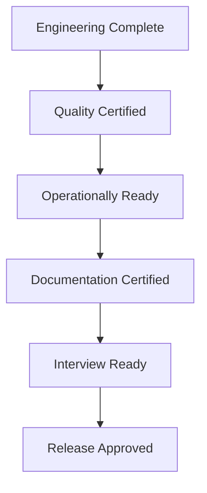

# RELEASE_CHECKLIST.md

> **Document Purpose**
>
> This document defines the formal release certification process for the Cryptocurrency Price API project.
>
> It is the final quality gate before the repository is considered complete and suitable for interview submission.
>
> Unlike the implementation work breakdown, this document contains **verification activities only**.
>
> No implementation work shall occur during this process.

---

# Table of Contents

1. Purpose
2. Usage
3. Release Workflow
4. Release Gate 1 – Engineering Completion
5. Release Gate 2 – Quality Certification
6. Release Gate 3 – Operational Readiness
7. Release Gate 4 – Documentation Certification
8. Release Gate 5 – Interview Certification
9. Final Release Approval
10. Release Summary

---

# 1. Purpose

The objective of this document is to certify that the repository satisfies every engineering, quality, operational and documentation requirement before release.

Completion of this checklist certifies that the repository is:

- functionally complete;
- production quality;
- fully documented;
- reproducible;
- suitable for technical evaluation.

---

# 2. Usage

This checklist shall only be used after every implementation phase has been completed.

The release process shall proceed sequentially through each release gate.

A release gate shall not be considered complete until every verification item has been successfully completed.

---

# 3. Release Workflow

Each release gate represents a mandatory approval stage.

---

# Release Gate 1 — Engineering Completion

## Objective

Verify that implementation has been completed.

---

## Repository

| Verification                               | Status |
| ------------------------------------------ | ------ |
| Repository builds successfully             | ☐      |
| Repository contains no temporary code      | ☐      |
| Repository contains no debugging artifacts | ☐      |
| Repository structure reviewed              | ☐      |
| Git history reviewed                       | ☐      |

---

## Functional Requirements

| Verification    | Status |
| --------------- | ------ |
| FR-001 Complete | ☐      |
| FR-002 Complete | ☐      |
| FR-003 Complete | ☐      |
| FR-004 Complete | ☐      |
| FR-005 Complete | ☐      |
| FR-006 Complete | ☐      |
| FR-007 Complete | ☐      |
| FR-008 Complete | ☐      |
| FR-009 Complete | ☐      |

---

## Non-Functional Requirements

| Verification    | Status |
| --------------- | ------ |
| Performance     | ☐      |
| Reliability     | ☐      |
| Maintainability | ☐      |
| Testability     | ☐      |
| Documentation   | ☐      |
| Security        | ☐      |
| Docker Support  | ☐      |
| CI Support      | ☐      |

---

## Engineering Principles

| Verification                          | Status |
| ------------------------------------- | ------ |
| Architectural boundaries preserved    | ☐      |
| Controllers contain no business logic | ☐      |
| Services contain business logic       | ☐      |
| Repository responsibilities isolated  | ☐      |
| Cache abstraction maintained          | ☐      |
| External provider isolated            | ☐      |

---

# Release Gate 2 — Quality Certification

## Automated Testing

| Verification         | Status |
| -------------------- | ------ |
| Model Specs          | ☐      |
| Repository Specs     | ☐      |
| Cache Specs          | ☐      |
| Provider Specs       | ☐      |
| Service Specs        | ☐      |
| Background Job Specs | ☐      |
| Request Specs        | ☐      |
| Integration Specs    | ☐      |

---

## Coverage

| Verification              | Status |
| ------------------------- | ------ |
| Coverage ≥95%             | ☐      |
| Critical paths covered    | ☐      |
| Edge cases covered        | ☐      |
| Failure scenarios covered | ☐      |

---

## Static Analysis

| Verification           | Status |
| ---------------------- | ------ |
| RuboCop passes         | ☐      |
| Brakeman passes        | ☐      |
| No unresolved warnings | ☐      |

---

## Quality Review

| Verification                 | Status |
| ---------------------------- | ------ |
| No duplicated business logic | ☐      |
| Naming consistency verified  | ☐      |
| Code readability reviewed    | ☐      |
| Engineering review completed | ☐      |

---

# Release Gate 3 — Operational Readiness

## Docker

| Verification           | Status |
| ---------------------- | ------ |
| Docker image builds    | ☐      |
| Docker Compose starts  | ☐      |
| Application accessible | ☐      |
| PostgreSQL operational | ☐      |

---

## Continuous Integration

| Verification             | Status |
| ------------------------ | ------ |
| CI executes successfully | ☐      |
| Tests execute            | ☐      |
| Static analysis executes | ☐      |
| Pipeline reproducible    | ☐      |

---

## Environment

| Verification                     | Status |
| -------------------------------- | ------ |
| Environment variables documented | ☐      |
| Rails credentials verified       | ☐      |
| Secrets externalised             | ☐      |
| Fresh clone succeeds             | ☐      |

---

## Runtime Behaviour

| Verification              | Status |
| ------------------------- | ------ |
| Scheduler executes        | ☐      |
| Cached values returned    | ☐      |
| Provider failures handled | ☐      |
| Fallback verified         | ☐      |

---

# Release Gate 4 — Documentation Certification

## Governance Documents

| Verification                     | Status |
| -------------------------------- | ------ |
| PROJECT_SPECIFICATIONS.md        | ☐      |
| IMPLEMENTATION_ROADMAP.md        | ☐      |
| ENGINEERING_PRINCIPLES.md        | ☐      |
| IMPLEMENTATION_WORK_BREAKDOWN.md | ☐      |
| FEATURE_CHECKLIST.md             | ☐      |
| RELEASE_CHECKLIST.md             | ☑      |

---

## Technical Documentation

| Verification       | Status |
| ------------------ | ------ |
| README.md          | ☐      |
| ARCHITECTURE.md    | ☐      |
| DATABASE.md        | ☐      |
| API.md             | ☐      |
| TESTING.md         | ☐      |
| BACKGROUND_JOBS.md | ☐      |

---

## Onboarding Documentation

| Verification                    | Status |
| ------------------------------- | ------ |
| Junior Developer Guide complete | ☐      |
| Walkthrough validated           | ☐      |
| Repository recreated from guide | ☐      |

---

## Documentation Review

| Verification                        | Status |
| ----------------------------------- | ------ |
| Cross references verified           | ☐      |
| Screenshots current (if applicable) | ☐      |
| Mermaid diagrams render correctly   | ☐      |
| Grammar reviewed                    | ☐      |
| Formatting consistent               | ☐      |

---

# Release Gate 5 — Interview Certification

## Technical Discussion Readiness

| Verification                | Status |
| --------------------------- | ------ |
| Architecture explainable    | ☐      |
| Design decisions documented | ☐      |
| Trade-offs documented       | ☐      |
| Future roadmap documented   | ☐      |

---

## Repository Presentation

| Verification                   | Status |
| ------------------------------ | ------ |
| Repository clean               | ☐      |
| Commit history professional    | ☐      |
| Documentation easy to navigate | ☐      |
| Directory structure intuitive  | ☐      |

---

## Demonstration Readiness

| Verification                  | Status |
| ----------------------------- | ------ |
| Live demo verified            | ☐      |
| API endpoint verified         | ☐      |
| Scheduler demonstrated        | ☐      |
| Provider failure demonstrated | ☐      |
| Automated tests demonstrated  | ☐      |

---

## Interview Confidence

| Verification                  | Status |
| ----------------------------- | ------ |
| Can explain architecture      | ☐      |
| Can explain caching strategy  | ☐      |
| Can explain fallback logic    | ☐      |
| Can explain testing strategy  | ☐      |
| Can explain design trade-offs | ☐      |

---

# Final Release Approval

## Engineering Certification

☐ Functional Requirements Complete

☐ Non-Functional Requirements Complete

☐ Architecture Certified

☐ Quality Certified

☐ Operationally Ready

☐ Documentation Certified

☐ Interview Ready

---

## Release Metadata

| Item         | Value             |
| ------------ | ----------------- |
| Version      | 1.0.0             |
| Release Name | Interview Release |
| Release Date | ****\_\_****      |
| Git Commit   | ****\_\_****      |
| Git Tag      | ****\_\_****      |

---

## Final Approval

| Role           | Name | Date | Signature |
| -------------- | ---- | ---- | --------- |
| Developer      |      |      |           |
| Reviewer       |      |      |           |
| Final Approval |      |      |           |

---

# Release Summary

The repository shall only be considered complete when every release gate has been successfully completed.

Successful completion certifies that the Cryptocurrency Price API project:

- satisfies all documented requirements;
- complies with the engineering principles defined for the project;
- demonstrates production-quality software engineering practices;
- can be recreated by following the Junior Developer Guide;
- is suitable for presentation during a senior software engineering interview.

This document represents the final engineering certification for Version **1.0.0**.
