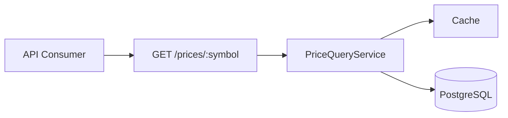
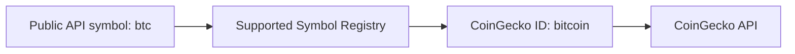
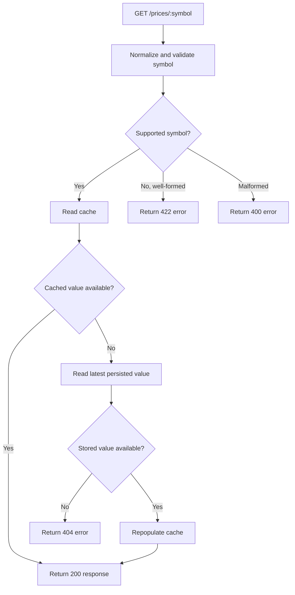
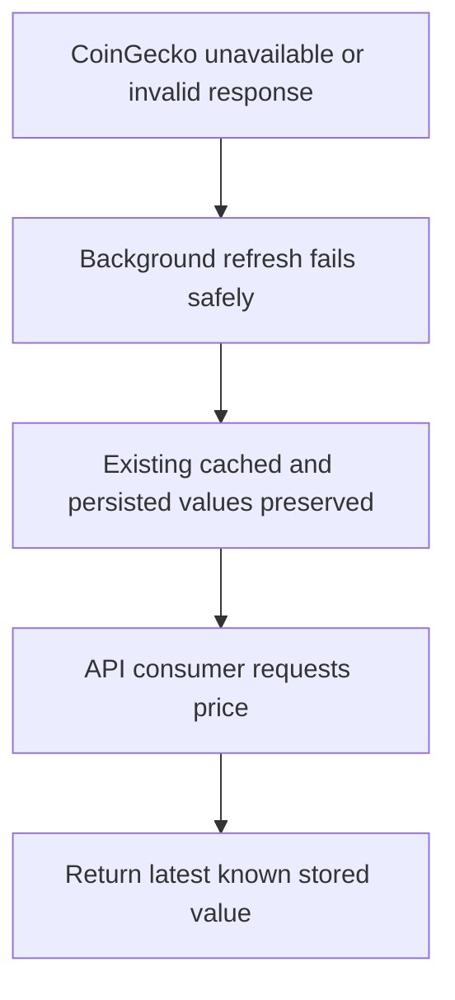

# API.md

> **Document Purpose**
>
> This document defines the public HTTP contract for the Cryptocurrency Price API.
>
> It specifies routes, request parameters, response payloads, validation rules, HTTP status codes, error formats, examples, and compatibility expectations.
>
> This document does not define internal service orchestration, persistence design, or background scheduling. Those responsibilities belong to `ARCHITECTURE.md`, `DATABASE.md`, and `BACKGROUND_JOBS.md`.

---

# Table of Contents

1. API Overview
2. Base URL and Versioning
3. Authentication
4. Content Types
5. Symbol Contract
6. Endpoint Summary
7. Get Cached Price
8. Successful Response
9. Error Response Format
10. HTTP Status Codes
11. Validation Rules
12. Response Field Definitions
13. Behaviour During Provider Failures
14. Caching Semantics
15. Examples
16. API Compatibility Rules
17. Security Considerations
18. Related Documentation
19. API Maintenance Requirements

---

# 1. API Overview

The Cryptocurrency Price API provides a read-only HTTP interface for retrieving the latest known price of a supported cryptocurrency.

The public API is intentionally narrow in Version 1.0.



The endpoint serves a cached or persisted value.

It does not make a synchronous request to CoinGecko while processing the client request.

---

# 2. Base URL and Versioning

## Base URL

The local development base URL is expected to be:

```text
http://localhost:3000
```

The Docker-based local base URL is expected to use the same host and port unless configuration changes are documented.

A production deployment base URL is intentionally not defined in Version 1.0.

---

## API Versioning

Version 1.0 does not include a URL version prefix.

The initial public route is:

```text
GET /prices/:symbol
```

Versioning is intentionally deferred because the API contains one small, stable endpoint.

If a future backward-incompatible change becomes necessary, the preferred strategy is:

```text
GET /v2/prices/:symbol
```

Versioning must not be introduced casually. It requires a documented engineering decision in `ENGINEERING_JOURNAL.md`.

---

# 3. Authentication

Version 1.0 does not require client authentication.

The CoinGecko provider API key is an internal application secret. It is never supplied by API consumers and must never appear in API responses, logs, examples, or public documentation.

Authentication and authorization are explicitly out of scope for the Version 1.0 interview release.

---

# 4. Content Types

## Requests

The endpoint accepts standard HTTP GET requests.

No request body is required.

```http
GET /prices/btc HTTP/1.1
Host: localhost:3000
Accept: application/json
```

---

## Responses

All API responses must use JSON.

```http
Content-Type: application/json; charset=utf-8
```

---

# 5. Symbol Contract

The public route accepts a normalized cryptocurrency symbol rather than a provider-specific CoinGecko identifier.

Example public symbols:

| Public Symbol | CoinGecko Identifier | Description |
| ------------- | -------------------- | ----------- |
| `btc`         | `bitcoin`            | Bitcoin     |
| `eth`         | `ethereum`           | Ethereum    |

The symbol-to-provider-ID mapping is an internal application concern.



API consumers must not need to know CoinGecko-specific identifiers.

---

## Symbol Normalization

The API normalizes symbols to lowercase before lookup.

Examples:

| Request Path  | Normalized Symbol |
| ------------- | ----------------- |
| `/prices/btc` | `btc`             |
| `/prices/BTC` | `btc`             |
| `/prices/Eth` | `eth`             |

The response always returns the normalized lowercase symbol.

---

## Supported Symbols

The initial supported-symbol list is configured by the application.

The API must distinguish between:

- A malformed symbol.
- A well-formed but unsupported symbol.
- A supported symbol that has no stored price yet.

The initial implementation is expected to support at least:

```text
btc
eth
```

The final supported list must be documented in the application configuration and kept synchronized with this document.

---

# 6. Endpoint Summary

| Method | Path              | Description                                                                         |
| ------ | ----------------- | ----------------------------------------------------------------------------------- |
| `GET`  | `/prices/:symbol` | Returns the latest cached or persisted price for a supported cryptocurrency symbol. |

---

# 7. Get Cached Price

## Request

```http
GET /prices/:symbol
```

## Path Parameters

| Parameter | Required | Type   | Description                                    |
| --------- | -------: | ------ | ---------------------------------------------- |
| `symbol`  |      Yes | String | Cryptocurrency symbol, such as `btc` or `eth`. |

---

## Behaviour

The endpoint follows this retrieval order:



The endpoint must never trigger a live external-provider fetch as part of the read path.

---

# 8. Successful Response

## Status

```http
200 OK
```

## Example

```http
GET /prices/btc
```

```json
{
  "symbol": "btc",
  "price": 109283.12,
  "currency": "usd",
  "last_updated_at": "2026-07-07T10:35:00Z"
}
```

---

# 9. Error Response Format

All API failures must return a consistent JSON structure.

```json
{
  "error": {
    "code": "error_code",
    "message": "Human-readable explanation of the error."
  }
}
```

## Error Fields

| Field           | Type   | Description                                        |
| --------------- | ------ | -------------------------------------------------- |
| `error.code`    | String | Stable machine-readable application error code.    |
| `error.message` | String | Human-readable explanation safe for API consumers. |

The API must not expose raw exception messages, stack traces, database details, API keys, provider headers, or internal implementation classes.

---

# 10. HTTP Status Codes

| Status | Name                  | Usage                                                                                            |
| -----: | --------------------- | ------------------------------------------------------------------------------------------------ |
|  `200` | OK                    | A cached or persisted price was found and returned.                                              |
|  `400` | Bad Request           | The symbol is malformed or invalid.                                                              |
|  `404` | Not Found             | The symbol is supported but no stored price exists yet.                                          |
|  `422` | Unprocessable Content | The symbol format is valid but the symbol is not configured as supported.                        |
|  `500` | Internal Server Error | An unexpected application failure occurred. This should not be used for normal provider outages. |

---

# 11. Validation Rules

## Malformed Symbol

A malformed symbol is a value that does not satisfy the route parameter format.

The target validation rules are:

| Rule               | Requirement                                               |
| ------------------ | --------------------------------------------------------- |
| Character set      | Lowercase or uppercase letters only before normalization. |
| Length             | Between 2 and 10 characters.                              |
| Whitespace         | Not permitted.                                            |
| Special characters | Not permitted.                                            |
| Empty value        | Not permitted.                                            |

Examples of malformed symbols:

| Request            | Reason                                   |
| ------------------ | ---------------------------------------- |
| `/prices/`         | Missing symbol.                          |
| `/prices/btc%20`   | Contains whitespace.                     |
| `/prices/btc-usd`  | Contains unsupported special characters. |
| `/prices/123`      | Numeric symbol is not permitted.         |
| `/prices/bitcoin!` | Contains unsupported punctuation.        |

## Malformed Symbol Response

```http
GET /prices/btc-usd
```

```http
HTTP/1.1 400 Bad Request
Content-Type: application/json
```

```json
{
  "error": {
    "code": "invalid_symbol",
    "message": "The symbol must contain only letters and be between 2 and 10 characters long."
  }
}
```

---

## Unsupported Symbol

An unsupported symbol is syntactically valid but is not included in the configured supported-symbol registry.

Example:

```http
GET /prices/doge
```

```http
HTTP/1.1 422 Unprocessable Content
Content-Type: application/json
```

```json
{
  "error": {
    "code": "unsupported_symbol",
    "message": "The symbol 'doge' is not supported by this API."
  }
}
```

---

## No Stored Price Available

A supported symbol can be valid but have no stored price when the initial background refresh has not completed successfully.

Example:

```http
GET /prices/eth
```

```http
HTTP/1.1 404 Not Found
Content-Type: application/json
```

```json
{
  "error": {
    "code": "price_not_found",
    "message": "No stored price is available for symbol 'eth'."
  }
}
```

This response does not imply that CoinGecko is currently unavailable. It only states that the application has no successfully stored price available to serve.

---

# 12. Response Field Definitions

## Successful Price Response

| Field             | Type                           | Example                  | Description                                           |
| ----------------- | ------------------------------ | ------------------------ | ----------------------------------------------------- |
| `symbol`          | String                         | `"btc"`                  | Normalized public cryptocurrency symbol.              |
| `price`           | Number                         | `109283.12`              | Latest known decimal price.                           |
| `currency`        | String                         | `"usd"`                  | Quote currency associated with the price.             |
| `last_updated_at` | String, ISO 8601 UTC timestamp | `"2026-07-07T10:35:00Z"` | Time when the provider data was successfully fetched. |

---

## Timestamp Requirements

`last_updated_at` must:

- Represent the external-price retrieval time.
- Be generated from persisted `fetched_at` data.
- Use ISO 8601 format.
- Include UTC offset information.
- Be returned consistently for cache hits and database-fallback responses.

Example:

```text
2026-07-07T10:35:00Z
```

---

## Price Representation

The application stores prices as decimals.

The JSON response returns the price as a JSON number.

Consumers requiring exact decimal handling should parse the value with a decimal-safe numeric type supported by their client language.

The API must not return floating-point artifacts such as:

```json
{
  "price": 109283.12000000001
}
```

---

# 13. Behaviour During Provider Failures

The public endpoint is designed to remain independent from the immediate availability of CoinGecko.



## Expected API Behaviour

When CoinGecko fails but a stored price exists:

```http
GET /prices/btc
```

```http
HTTP/1.1 200 OK
Content-Type: application/json
```

```json
{
  "symbol": "btc",
  "price": 109283.12,
  "currency": "usd",
  "last_updated_at": "2026-07-07T10:35:00Z"
}
```

The response remains successful because the API returns the last known valid value.

---

## Important Limitation

When CoinGecko has failed before the application has ever stored a valid value for a supported symbol, the endpoint cannot provide a fallback price.

In that situation, the API returns:

```http
404 Not Found
```

with the `price_not_found` error code.

The public endpoint does not expose raw provider-failure details because it does not make provider calls directly.

---

# 14. Caching Semantics

The endpoint uses cache-first retrieval.

## Cache Behaviour

| Scenario                                            | Expected Behaviour                                                   |
| --------------------------------------------------- | -------------------------------------------------------------------- |
| Cache hit                                           | Return cached value with `200 OK`.                                   |
| Cache miss, stored record exists                    | Read stored value, repopulate cache, return `200 OK`.                |
| Cache miss, no stored record exists                 | Return `404 price_not_found`.                                        |
| Cache temporarily unavailable, stored record exists | Attempt persistence fallback and return the stored value where safe. |
| Provider unavailable                                | Do not affect the read path if a cached or stored price exists.      |

## Freshness Semantics

The API returns the latest value known to the application.

It does not promise that the returned value is the current live market price at the exact moment of the request.

Consumers can determine data age using `last_updated_at`.

---

# 15. Examples

## Example 1: Cached Bitcoin Price

```bash
curl --request GET \
  --url http://localhost:3000/prices/btc \
  --header "Accept: application/json"
```

Expected response:

```json
{
  "symbol": "btc",
  "price": 109283.12,
  "currency": "usd",
  "last_updated_at": "2026-07-07T10:35:00Z"
}
```

---

## Example 2: Case-Insensitive Symbol Input

```bash
curl --request GET \
  --url http://localhost:3000/prices/BTC \
  --header "Accept: application/json"
```

Expected normalized response:

```json
{
  "symbol": "btc",
  "price": 109283.12,
  "currency": "usd",
  "last_updated_at": "2026-07-07T10:35:00Z"
}
```

---

## Example 3: Unsupported Symbol

```bash
curl --request GET \
  --url http://localhost:3000/prices/doge \
  --header "Accept: application/json"
```

Expected response:

```http
HTTP/1.1 422 Unprocessable Content
```

```json
{
  "error": {
    "code": "unsupported_symbol",
    "message": "The symbol 'doge' is not supported by this API."
  }
}
```

---

## Example 4: Supported Symbol Without Stored Data

```bash
curl --request GET \
  --url http://localhost:3000/prices/eth \
  --header "Accept: application/json"
```

Expected response before the first successful refresh:

```http
HTTP/1.1 404 Not Found
```

```json
{
  "error": {
    "code": "price_not_found",
    "message": "No stored price is available for symbol 'eth'."
  }
}
```

---

## Example 5: Malformed Symbol

```bash
curl --request GET \
  --url http://localhost:3000/prices/btc-usd \
  --header "Accept: application/json"
```

Expected response:

```http
HTTP/1.1 400 Bad Request
```

```json
{
  "error": {
    "code": "invalid_symbol",
    "message": "The symbol must contain only letters and be between 2 and 10 characters long."
  }
}
```

---

# 16. API Compatibility Rules

The public response contract is treated as a stable interface.

## Backward-Compatible Changes

The following changes are generally backward-compatible:

- Adding optional response fields.
- Adding new supported symbols.
- Adding additional internal providers without changing existing response fields.
- Improving response performance.
- Improving internal cache or persistence implementation.

## Backward-Incompatible Changes

The following changes require a documented migration or API versioning strategy:

- Renaming an existing response field.
- Changing the type of an existing response field.
- Removing a response field.
- Changing an error-code meaning.
- Changing `last_updated_at` semantics.
- Changing path parameter behavior in a way that breaks existing consumers.
- Changing a successful `200` response into another status for an existing supported symbol with stored data.

## Compatibility Principle

The API must preserve existing client expectations unless a deliberate versioned change is introduced and documented.

---

# 17. Security Considerations

The public endpoint is read-only in Version 1.0.

Even so, the API must follow these rules:

- Validate all route parameters.
- Return safe error messages only.
- Avoid exposing internal exceptions.
- Avoid exposing provider credentials.
- Avoid exposing cache keys, database identifiers, or internal provider IDs.
- Use HTTPS in deployed environments.
- Apply appropriate operational rate limiting if the API is exposed publicly in a future deployment.

Rate limiting is out of scope for Version 1.0 but remains a documented future consideration.

---

# 18. Related Documentation

| Document                                                 | Relationship                                                           |
| -------------------------------------------------------- | ---------------------------------------------------------------------- |
| [`PROJECT_SPECIFICATIONS.md`](PROJECT_SPECIFICATIONS.md) | Defines the functional requirements satisfied by this API contract.    |
| [`ARCHITECTURE.md`](ARCHITECTURE.md)                     | Defines the internal layers and request flow behind the endpoint.      |
| [`DATABASE.md`](DATABASE.md)                             | Defines storage of `symbol`, `price`, `currency`, and `fetched_at`.    |
| [`BACKGROUND_JOBS.md`](BACKGROUND_JOBS.md)               | Defines how prices are refreshed without API-read-path provider calls. |
| [`TESTING.md`](TESTING.md)                               | Defines request-spec coverage for this contract.                       |
| [`JUNIOR_DEVELOPER_GUIDE.md`](JUNIOR_DEVELOPER_GUIDE.md) | Explains how to implement this endpoint from scratch.                  |
| [`ENGINEERING_JOURNAL.md`](ENGINEERING_JOURNAL.md)       | Records material API design decisions and changes.                     |

---

# 19. API Maintenance Requirements

This document must be updated whenever any of the following changes:

- A route is added, removed, renamed, or versioned.
- Request parameter validation changes.
- Supported symbol behaviour changes.
- Response fields are added, removed, renamed, or changed.
- Error codes or error messages change materially.
- HTTP status-code mapping changes.
- Cache or provider-outage behaviour changes from the consumer perspective.
- Authentication is introduced.
- Rate limiting is introduced.
- API versioning is introduced.

The API documentation is part of the public contract and must remain synchronized with the implemented endpoint.
