# ARCHITECTURE.md

> **Document Purpose**
>
> This document defines the target architecture of the Cryptocurrency Price API.
>
> It explains the system boundaries, component responsibilities, dependency direction, request flows, background refresh flow, failure handling, and design rationale.
>
> Functional requirements are defined in `PROJECT_SPECIFICATIONS.md`. API payloads and HTTP details are defined in `API.md`. Database structure is defined in `DATABASE.md`.

---

# Table of Contents

1. Architecture Goals
2. Architectural Style
3. System Context
4. High-Level Component Design
5. Component Responsibilities
6. Dependency Rules
7. Read Flow
8. Background Refresh Flow
9. Cache and Persistence Strategy
10. Failure and Fallback Behaviour
11. Error Boundaries
12. Logging and Observability Boundaries
13. Security Boundaries
14. Configuration Boundaries
15. Testing Boundaries
16. Extensibility Decisions
17. Architecture Decision Summary
18. Related Documentation

---

# 1. Architecture Goals

The architecture exists to satisfy the project requirements while keeping the implementation small, understandable, testable, and resilient.

The system shall optimize for:

- Fast and predictable API reads.
- Durable storage of the latest successful price.
- Isolation from third-party provider failures.
- Clear ownership of responsibilities.
- Straightforward automated testing.
- Minimal coupling between HTTP, business logic, persistence, cache, and external API code.
- Future extension without speculative complexity.

The architecture intentionally avoids introducing patterns that do not serve a current requirement.

---

# 2. Architectural Style

The application uses a layered Rails API architecture with explicit boundaries around external communication, application orchestration, caching, persistence, and HTTP transport.

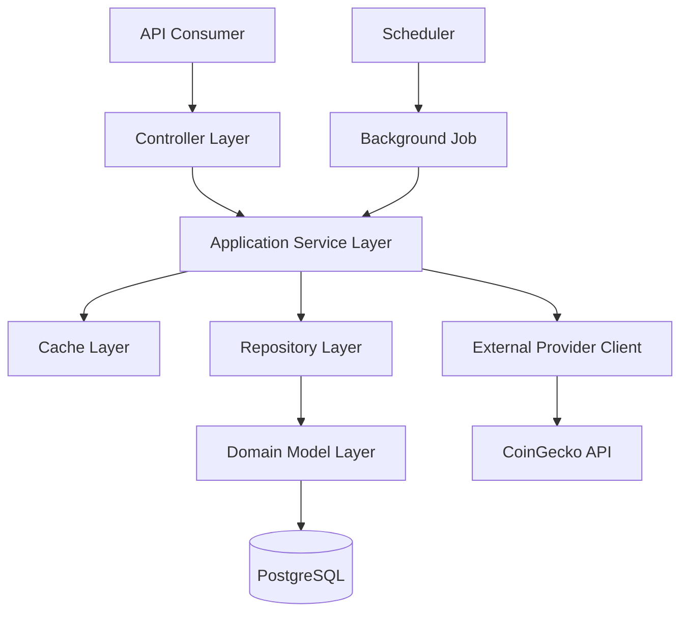

The architecture has two primary execution paths:

1. **Read path** — serves an existing cached or persisted price to an API consumer.
2. **Refresh path** — retrieves a fresh price in the background, persists it, and updates the cache.

The public request path must never depend on an immediate CoinGecko response.

---

# 3. System Context

The Cryptocurrency Price API operates between API consumers and an external cryptocurrency price provider.

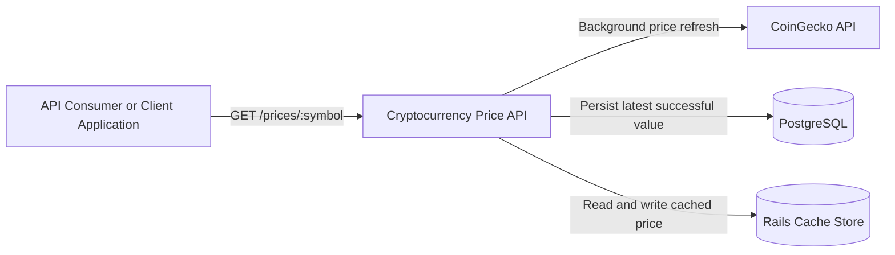

## External Systems

| System            | Relationship                                    | Reliability Assumption                                                                      |
| ----------------- | ----------------------------------------------- | ------------------------------------------------------------------------------------------- |
| CoinGecko API     | Provides cryptocurrency price data.             | Treated as unavailable, slow, malformed, rate-limited, or otherwise unreliable at any time. |
| PostgreSQL        | Durable store for the latest known valid price. | Required for data durability and cache recovery.                                            |
| Rails Cache Store | Fast retrieval layer for public API requests.   | May be empty, expire entries, or become temporarily unavailable.                            |
| GitHub Actions    | Executes automated quality gates.               | Used for CI validation, not runtime application behaviour.                                  |

---

# 4. High-Level Component Design

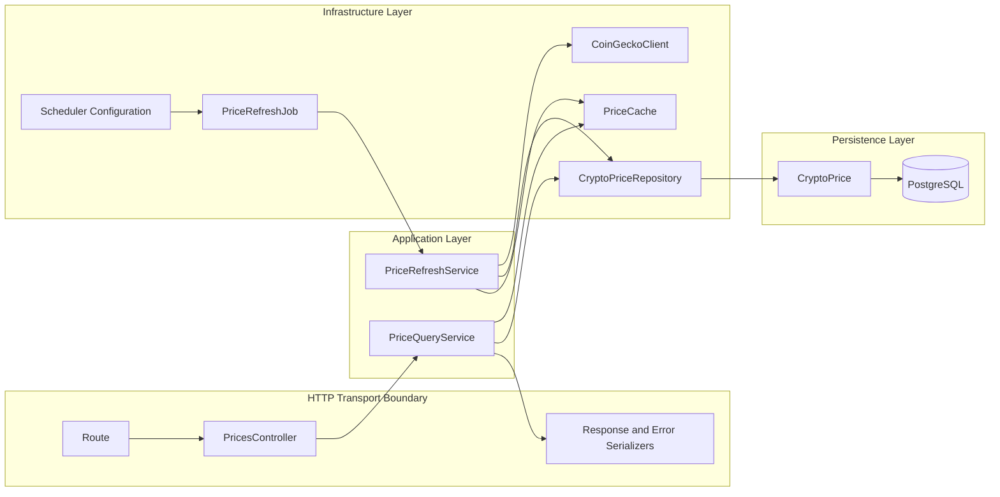

The architecture separates transport concerns from application behaviour and infrastructure concerns.

---

# 5. Component Responsibilities

## 5.1 Routes

Routes define the public HTTP path and map valid requests to controllers.

Routes must not contain business behaviour.

Example target route:

```text
GET /prices/:symbol
```

---

## 5.2 `PricesController`

The controller is responsible for HTTP transport concerns only.

Responsibilities:

- Receive incoming requests.
- Extract and normalize request parameters.
- Perform transport-level validation where appropriate.
- Invoke the application service.
- Render successful JSON responses.
- Render consistent JSON error responses.
- Map known application exceptions to appropriate HTTP status codes.

The controller must not:

- Call CoinGecko directly.
- Query ActiveRecord directly.
- Read or write Rails cache directly.
- Implement fallback behaviour.
- Contain business orchestration.

---

## 5.3 `PriceQueryService`

The query service owns the API read-path orchestration.

Responsibilities:

- Retrieve a price from cache first.
- Retrieve the latest stored value when the cache does not contain a usable entry.
- Repopulate cache from persisted data after a cache miss.
- Return a stable application-level response model.
- Raise a predictable application-level error when no stored price exists.

The query service must not:

- Make direct HTTP requests to CoinGecko.
- Render JSON.
- Know HTTP status codes.
- Perform raw ActiveRecord queries.

---

## 5.4 `PriceRefreshService`

The refresh service owns the background price-refresh workflow.

Responsibilities:

- Request a new value from the provider client.
- Validate that the provider returned usable data.
- Persist a valid latest price.
- Update the cache after persistence succeeds.
- Preserve prior valid data when the provider fails.
- Emit structured logs for success and failure paths.

The refresh service must not:

- Render API responses.
- Know route definitions.
- Include scheduler configuration.
- Contain provider-specific HTTP details.

---

## 5.5 `CoinGeckoClient`

The external provider client encapsulates CoinGecko-specific behaviour.

Implementation location:

```text
app/clients/coin_gecko_client.rb
```

The client exposes a narrow public interface:

```ruby
fetch_price(symbol:, currency: "usd")
```

The method returns normalized application-level data containing `symbol`, `price`, `currency`, `provider`, and `fetched_at`. Prices are represented as `BigDecimal`; `symbol` and `currency` are normalized to the application's uppercase internal convention, and `provider` is returned as `coingecko`.

Responsibilities:

- Build external requests.
- Add provider-specific authentication.
- Configure timeouts.
- Parse provider responses.
- Validate required provider fields.
- Convert provider failures into application-specific exceptions.
- Avoid leaking raw HTTP-client errors to service code.

The supported Version 1.0 symbol mapping is intentionally small:

| Application Symbol | CoinGecko Identifier |
| ------------------ | -------------------- |
| `BTC`              | `bitcoin`            |
| `ETH`              | `ethereum`           |

Provider communication uses Faraday with environment-driven configuration. `COINGECKO_API_KEY` supplies the provider credential and must never be logged, returned, or included in raised exception messages. Request and open timeouts are configurable, and retry behaviour is bounded.

Provider-specific failures are translated into controlled application exceptions under `ProviderError`, including configuration, unsupported symbol, HTTP, timeout, network, parse, and malformed-response failures.

The client must not:

- Persist data.
- Update cache.
- Render JSON.
- Decide public API status codes.
- Call repositories or cache abstractions.
- Be invoked from the public request path.

---

## 5.6 `PriceCache`

The cache abstraction encapsulates all cache interaction.

Implementation location:

```text
app/cache/price_cache.rb
```

Responsibilities:

- Build stable cache keys.
- Read cached price values.
- Write cache entries.
- Apply configured expiry behaviour.
- Invalidate entries when necessary.
- Use only Rails cache-compatible `read`, `write`, and `delete` APIs through an injected cache store.

The cache abstraction must not:

- Query the database.
- Call CoinGecko.
- Decide fallback rules.
- Render HTTP responses.

---

## 5.7 `CryptoPriceRepository`

The repository encapsulates persistence operations.

Implementation location:

```text
app/repositories/crypto_price_repository.rb
```

Responsibilities:

- Find the latest stored value for a normalized symbol, currency, and provider.
- Create or update a current price record.
- Isolate ActiveRecord query syntax from services.
- Return persistence data through a stable interface.

The repository must not:

- Call external APIs.
- Read or write cache.
- Contain HTTP concerns.
- Implement scheduling logic.

---

## 5.8 `CryptoPrice`

The ActiveRecord model represents persisted cryptocurrency price data.

Responsibilities:

- Map database fields to Ruby attributes.
- Enforce model-level validations.
- Represent domain data.
- Maintain simple, persistence-focused behaviour.

The model must not:

- Fetch from CoinGecko.
- Implement refresh orchestration.
- Render API payloads.
- Contain scheduler logic.

---

## 5.9 `PriceRefreshJob`

The background job triggers the refresh workflow.

Responsibilities:

- Receive an asynchronous execution request.
- Invoke the refresh service with the required symbols and currency.
- Delegate retries according to configured job behaviour.
- Log job lifecycle events at the orchestration level.

The job must not:

- Reimplement refresh logic.
- Persist prices directly.
- Interact directly with Rails cache.
- Parse CoinGecko responses.

---

## 5.10 Scheduler Configuration

The scheduler is responsible for enqueuing `PriceRefreshJob` every minute.

Responsibilities:

- Define the configured interval.
- Trigger the correct job.
- Run independently from the web request lifecycle.

The scheduler must not:

- Contain business logic.
- Query data.
- Call CoinGecko.
- determine price fallback behaviour.

---

# 6. Dependency Rules

Dependencies must point inward toward application behaviour.

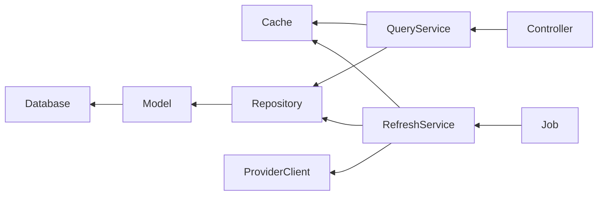

## Allowed Dependencies

| Component       | Allowed Dependencies                                        |
| --------------- | ----------------------------------------------------------- |
| Controller      | Services, serializers, error mapping.                       |
| Query Service   | Cache abstraction, repository, response model.              |
| Refresh Service | Provider client, repository, cache, logging.                |
| Repository      | Model and persistence framework.                            |
| Provider Client | HTTP library, provider configuration, provider error types. |
| Background Job  | Refresh service and job framework.                          |
| Cache           | Rails cache implementation and configuration.               |
| Model           | ActiveRecord and model validations.                         |

## Forbidden Dependencies

| Component       | Forbidden Dependencies                                    |
| --------------- | --------------------------------------------------------- |
| Controller      | Provider client, repository, model, cache implementation. |
| Query Service   | Controller, HTTP rendering, provider client.              |
| Refresh Service | Controller, routes, serializer.                           |
| Repository      | Provider client, cache, controller.                       |
| Provider Client | Repository, model, cache, controller.                     |
| Job             | Repository, cache, provider client, controller.           |
| Model           | Provider client, job, cache, controller.                  |

These rules prevent the architecture from gradually collapsing into a controller-driven or model-driven design.

---

# 7. Read Flow

The read flow retrieves the latest known value without synchronously calling the external provider.

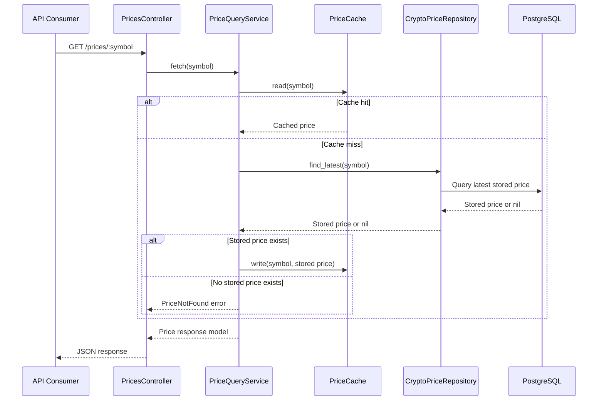

## Read-Path Rules

- A request must not call CoinGecko directly.
- Cache lookup occurs before persistence lookup.
- A cache miss is not an error when persisted data exists.
- Persisted data may repopulate the cache.
- A missing cache entry and missing database record results in a documented not-found response.
- The read path must remain deterministic and quick.

---

# 8. Background Refresh Flow

The background refresh flow updates the latest known price independently of API requests.

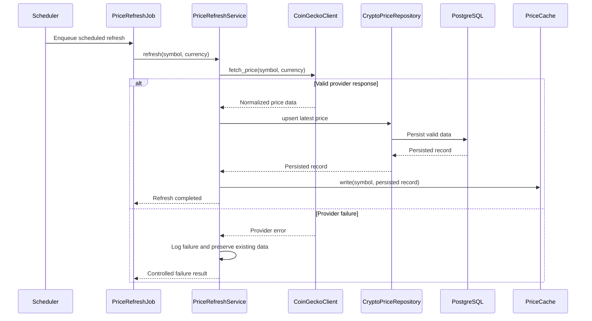

## Refresh-Path Rules

- Refreshes occur asynchronously.
- Provider responses must be validated before persistence.
- Database persistence must succeed before the cache is updated.
- A provider failure must not delete or overwrite a known valid price.
- A provider failure must be visible through structured logs.
- Future refresh executions must still occur after an individual failure.

---

# 9. Cache and Persistence Strategy

The application uses cache for speed and PostgreSQL for durability.

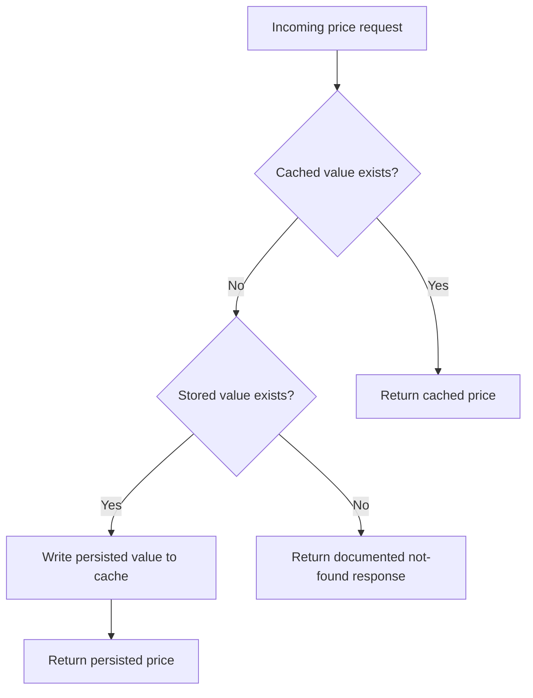

## Why Both Cache and Database?

| Concern                       | Cache                  | PostgreSQL                                   |
| ----------------------------- | ---------------------- | -------------------------------------------- |
| Fast API reads                | Primary responsibility | Secondary fallback                           |
| Durability                    | Not guaranteed         | Primary responsibility                       |
| Recovery after cache expiry   | Not sufficient alone   | Supports cache repopulation                  |
| Last known price preservation | Temporary              | Durable                                      |
| Query frequency               | Reduced                | Used on cache misses and refresh persistence |

## Cache Consistency Rule

The system follows a write-after-persist pattern:

1. Retrieve and validate provider response.
2. Persist the latest valid price.
3. Update the cache from the persisted record.

This prevents the cache from representing a value that was not successfully committed to durable storage.

## Implemented Cache Boundary

`PriceCache` is the only cache boundary introduced in the domain phase. It accepts an injected Rails cache-compatible store and defaults to `Rails.cache`.

The cache boundary currently:

- Generates normalized keys in the form `prices:<provider>:<symbol>:<currency>`.
- Reads cached payloads through `cache_store.read`.
- Writes simple price payload hashes through `cache_store.write`.
- Deletes cached payloads through `cache_store.delete`.
- Avoids Redis-specific APIs and cache-store-specific behaviour.

Rails Memory Store remains the Version 1.0 cache-store decision. Redis cache integration is intentionally deferred until a later architecture decision requires it.

## Implemented Repository Boundary

`CryptoPriceRepository` is the persistence boundary for current price records. It normalizes symbol, currency, and provider inputs before querying or writing and only identifies records by the composite `[symbol, currency, provider]` key.

The repository currently exposes:

- `find(symbol:, currency:, provider:)`
- `upsert(symbol:, price:, currency:, provider:, fetched_at:)`

The repository does not call cache, providers, controllers, services, background jobs, retries, or logging.

---

# 10. Failure and Fallback Behaviour

The system is designed to degrade gracefully.

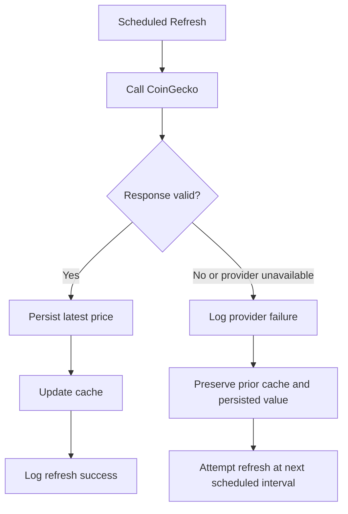

## Expected Failure Scenarios

| Scenario                                  | Expected Behaviour                                                                                    |
| ----------------------------------------- | ----------------------------------------------------------------------------------------------------- |
| CoinGecko timeout                         | Provider client raises a controlled timeout-related error. Existing values remain available.          |
| CoinGecko network error                   | Refresh records a failure; read requests continue using cache or persistence.                         |
| CoinGecko returns malformed JSON          | Response is rejected before it reaches persistence. Existing values remain unchanged.                 |
| CoinGecko returns unexpected schema       | Provider client raises a controlled validation error.                                                 |
| Cache is empty                            | Query service reads the latest persisted price and repopulates cache.                                 |
| Cache unavailable                         | Query service attempts persisted-data fallback according to the selected cache error strategy.        |
| No price was ever stored                  | API returns a documented not-found error.                                                             |
| Database persistence fails during refresh | Cache is not updated with the unpersisted value; failure is logged and prior values remain available. |

## Fallback Guarantee

The application guarantees the following only when a valid historical price has already been stored:

> If the external provider fails, the API continues serving the latest available cached or persisted price instead of failing solely because CoinGecko is unavailable.

The application cannot serve a price that has never been successfully fetched and stored.

---

# 11. Error Boundaries

Errors are categorized and handled at the layer best positioned to understand them.

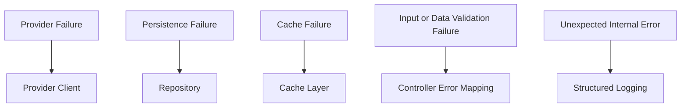

## Error Ownership

| Error Category              | Primary Owner                             | Public Behaviour                                           |
| --------------------------- | ----------------------------------------- | ---------------------------------------------------------- |
| Invalid symbol format       | Controller or request validation boundary | Consistent client error response.                          |
| Price not found             | Query service                             | Consistent not-found response.                             |
| Provider timeout            | Provider client and refresh service       | Logged; previous price remains available.                  |
| Provider malformed response | Provider client                           | Logged; previous price remains available.                  |
| Persistence failure         | Repository and refresh service            | Logged; cache must not be updated with unpersisted data.   |
| Cache read failure          | Cache abstraction and query service       | Attempt persistence fallback where safe.                   |
| Unexpected internal error   | Global error boundary                     | Logged with request context; return a safe error response. |

Raw implementation exceptions must not be exposed directly to API consumers.

---

# 12. Logging and Observability Boundaries

Logging should provide enough operational context to diagnose behaviour without exposing secrets.

## Required Context

Relevant logs should include, where applicable:

- Request identifier.
- Cryptocurrency symbol.
- Quote currency.
- Provider name.
- Refresh job identifier.
- Execution duration.
- Result status.
- Error category.
- Retry attempt count.
- Safe error message.

## Logging Ownership

| Component       | Expected Log Events                                                          |
| --------------- | ---------------------------------------------------------------------------- |
| Controller      | Incoming request context and safe request failure details.                   |
| Query Service   | Cache miss, persisted-data fallback, unavailable price state.                |
| Refresh Service | Refresh start, successful update, fallback preservation, controlled failure. |
| Provider Client | Outbound provider call duration, provider status, normalized provider error. |
| Background Job  | Job start, job completion, retry lifecycle, unexpected job failure.          |

## Sensitive Data Rules

The following must not be logged:

- CoinGecko API keys.
- Rails credentials.
- Authentication headers.
- Full environment-variable values.
- Internal stack traces in public API responses.

---

# 13. Security Boundaries

The application has a small attack surface, but its security responsibilities remain explicit.

## Input Boundary

All incoming path parameters are untrusted.

The application must:

- Normalize symbols consistently.
- Validate permitted format and length.
- Reject malformed values predictably.
- Avoid interpolating untrusted values into raw SQL or external URLs without safe handling.

## Secret Boundary

Secrets are external configuration.

The application must:

- Read credentials from environment variables or Rails credentials.
- Exclude local secret files from Git.
- Provide placeholders only through `.env.example`.
- Never log secrets.

## External HTTP Boundary

The provider client must:

- Use HTTPS.
- Apply connection and read timeouts.
- Validate response data before use.
- Treat all provider payloads as untrusted input.

---

# 14. Configuration Boundaries

Configuration must remain separate from application logic.

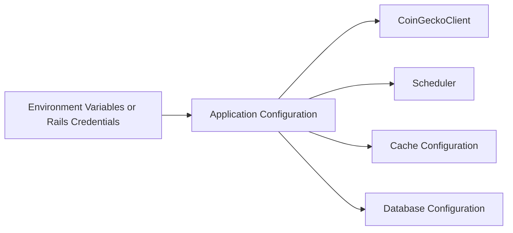

## Configuration Categories

| Category                    | Examples                                              |
| --------------------------- | ----------------------------------------------------- |
| Provider configuration      | API key, base URL, timeout values, retry limit.       |
| Price refresh configuration | Supported symbols, quote currency, schedule interval. |
| Cache configuration         | Store type, TTL, namespace.                           |
| Database configuration      | Connection URL, pool size, credentials.               |
| Logging configuration       | Log level, structured format settings.                |
| Runtime configuration       | Rails environment, worker adapter, scheduler adapter. |

Configuration changes should not require business-service code changes.

---

# 15. Testing Boundaries

Each architectural layer should be testable independently.

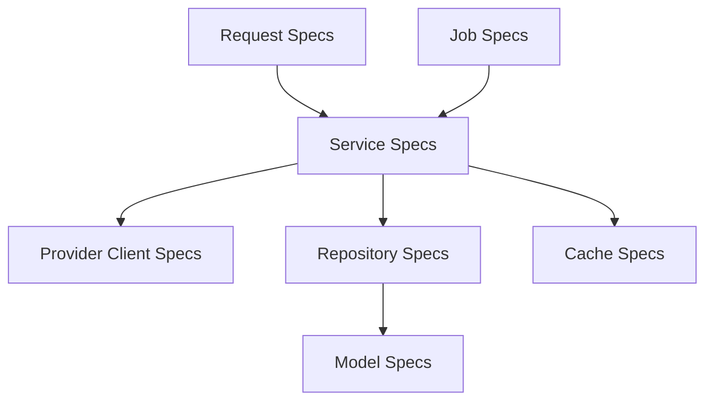

## Test Ownership

| Component         | Primary Test Type                                                                            |
| ----------------- | -------------------------------------------------------------------------------------------- |
| Controller        | Request specifications.                                                                      |
| Query service     | Service specifications covering cache hit, cache miss, and no-data behaviour.                |
| Refresh service   | Service specifications covering success, persistence, cache update, and provider failure.    |
| Provider client   | Client specifications using mocked provider responses.                                       |
| Repository        | Repository specifications using the test database.                                           |
| Cache abstraction | Cache specifications covering reads, writes, expiry-related behaviour, and failure handling. |
| Model             | Validation and persistence specifications.                                                   |
| Background job    | Job specifications verifying delegation and retry behaviour.                                 |

Tests should verify observable behaviour rather than private implementation details.

---

# 16. Extensibility Decisions

The architecture supports limited future extension without implementing speculative features now.

## Supported Future Extensions

| Potential Extension       | Existing Boundary That Enables It                         |
| ------------------------- | --------------------------------------------------------- |
| Add a second provider     | Provider client boundary and normalized service contract. |
| Add provider failover     | Refresh service orchestration and provider interface.     |
| Use Redis cache           | Cache abstraction.                                        |
| Track more symbols        | Scheduler configuration and refresh-service inputs.       |
| Add more quote currencies | Configuration and normalized response model.              |
| Add metrics               | Existing service and job execution boundaries.            |
| Add API versioning        | Route and serializer boundary.                            |
| Add authentication        | HTTP transport boundary.                                  |

## Deliberately Deferred Complexity

The following are not part of Version 1.0:

- Generic multi-provider registry.
- Circuit breaker framework.
- Distributed locking.
- Event bus.
- CQRS infrastructure.
- Domain event framework.
- Kubernetes-specific architecture.
- Dedicated observability platform.

These may be useful in larger systems but are unnecessary for the current project scope.

---

# 17. Architecture Decision Summary

| Decision                                                   | Rationale                                                                                 |
| ---------------------------------------------------------- | ----------------------------------------------------------------------------------------- |
| API requests do not call CoinGecko directly.               | Protects API availability and latency from external-provider behaviour.                   |
| Cache-first reads with database fallback.                  | Provides fast responses and durable recovery after cache misses.                          |
| Background refreshes update database before cache.         | Prevents cache values from diverging from durable state.                                  |
| Provider communication is isolated in `CoinGeckoClient`.   | Prevents provider-specific details from leaking into application services.                |
| Services coordinate behaviour.                             | Keeps controllers, jobs, repositories, and clients focused on their own responsibilities. |
| Repositories encapsulate ActiveRecord queries.             | Improves testability and prevents persistence leakage into orchestration code.            |
| Background jobs delegate to services.                      | Keeps asynchronous scheduling separate from business behaviour.                           |
| Historical valid values are preserved on provider failure. | Satisfies graceful-degradation requirement.                                               |
| Configuration remains external.                            | Protects secrets and supports environment-specific deployment.                            |

Material decisions, alternatives considered, and implementation trade-offs should be recorded in `ENGINEERING_JOURNAL.md`.

---

# 18. Related Documentation

| Document                                                 | Relationship                                                          |
| -------------------------------------------------------- | --------------------------------------------------------------------- |
| [`PROJECT_SPECIFICATIONS.md`](PROJECT_SPECIFICATIONS.md) | Defines functional and non-functional requirements.                   |
| [`API.md`](API.md)                                       | Defines the public HTTP contract and JSON payloads.                   |
| [`DATABASE.md`](DATABASE.md)                             | Defines schema, indexes, validations, and persistence behaviour.      |
| [`BACKGROUND_JOBS.md`](BACKGROUND_JOBS.md)               | Defines scheduling, job execution, retry, and operational details.    |
| [`TESTING.md`](TESTING.md)                               | Defines testing strategy and test execution procedures.               |
| [`ENGINEERING_JOURNAL.md`](ENGINEERING_JOURNAL.md)       | Records decision rationale and changes to architecture.               |
| [`JUNIOR_DEVELOPER_GUIDE.md`](JUNIOR_DEVELOPER_GUIDE.md) | Explains how to create and understand this architecture from scratch. |

---

# Architecture Maintenance

This document must be updated whenever any of the following changes:

- A new architectural layer or component is introduced.
- Dependency direction changes.
- Request or refresh flow changes.
- Cache or persistence strategy changes.
- Provider integration strategy changes.
- Failure-handling behaviour changes.
- A significant design decision is reversed or replaced.

Architecture documentation is part of the production implementation and must remain synchronized with the codebase.
