# BACKGROUND_JOBS.md

> **Document Purpose**
>
> This document defines the target background-processing and scheduling design for the Cryptocurrency Price API.
>
> It explains how cryptocurrency prices are refreshed every minute, how background jobs interact with application services, how retry and failure behaviour are handled, and how scheduled work remains independent from API requests.
>
> This document does not define the public HTTP contract, database schema, or general application architecture. Those responsibilities belong to `API.md`, `DATABASE.md`, and `ARCHITECTURE.md`.

---

# Table of Contents

1. Background Processing Goals
2. Background Processing Overview
3. Responsibilities and Boundaries
4. Job Architecture
5. Scheduler Design
6. Refresh Workflow
7. Job Contract
8. Retry Strategy
9. Failure Handling
10. Idempotency and Duplicate Execution
11. Logging and Operational Context
12. Configuration
13. Testing Strategy
14. Local Verification
15. Operational Considerations
16. Future Considerations
17. Related Documentation
18. Maintenance Requirements

---

# 1. Background Processing Goals

The background-processing design exists to ensure that cryptocurrency prices are refreshed independently from public API requests.

The system must:

- Fetch configured cryptocurrency prices every minute.
- Persist validated provider values.
- Update cached values after persistence succeeds.
- Continue serving previously stored values if a refresh fails.
- Prevent provider availability from determining public API availability.
- Keep jobs thin and business logic centralized in application services.
- Support deterministic testing of scheduling, job delegation, failure handling, and retry behaviour.

The scheduler and job system are implementation mechanisms. They must not become the location of business logic.

---

# 2. Background Processing Overview

The application refreshes prices asynchronously.

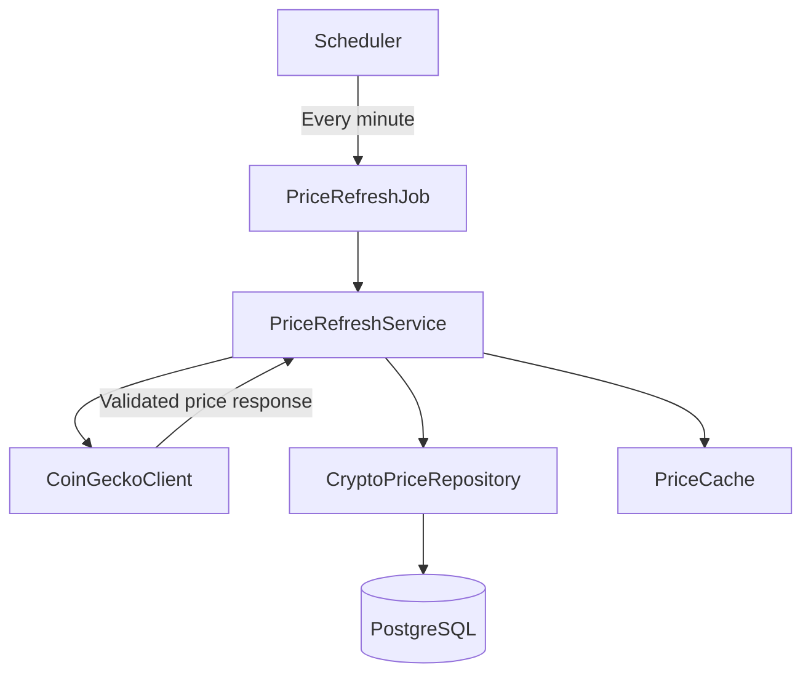

The refresh workflow is deliberately separated from the API request flow.


The API reads known values. The background process updates known values.

---

# 3. Responsibilities and Boundaries

## Scheduler Responsibilities

The scheduler is responsible for:

- Enqueuing the refresh job at the configured interval.
- Running independently of HTTP requests.
- Triggering the correct job with the configured symbols and currency.
- Remaining operational after an individual job execution fails.

The scheduler must not:

- Call CoinGecko directly.
- Query PostgreSQL directly.
- Read or write cache entries.
- Perform response validation.
- Implement fallback logic.

---

## `PriceRefreshJob` Responsibilities

`PriceRefreshJob` is responsible for:

- Receiving scheduled execution.
- Invoking `PriceRefreshService`.
- Passing configured refresh inputs.
- Participating in configured job retry behaviour.
- Logging job lifecycle events where appropriate.

The job must not:

- Build CoinGecko HTTP requests.
- Parse provider responses.
- Persist records directly.
- Update cache entries directly.
- Render HTTP responses.
- Duplicate service-layer fallback behaviour.

---

## `PriceRefreshService` Responsibilities

`PriceRefreshService` owns the refresh workflow.

It is responsible for:

- Coordinating provider calls.
- Validating normalized provider data.
- Persisting valid price data.
- Updating cache after persistence succeeds.
- Preserving existing values during provider failures.
- Emitting structured business-operation logs.
- Returning a predictable result to the invoking job.

---

## Provider Client Responsibilities

`CoinGeckoClient` is responsible for:

- Making external HTTP requests.
- Applying provider authentication.
- Applying connection and read timeouts.
- Parsing JSON responses.
- Validating provider response shape.
- Translating provider-specific failures into controlled application errors.

---

# 4. Job Architecture

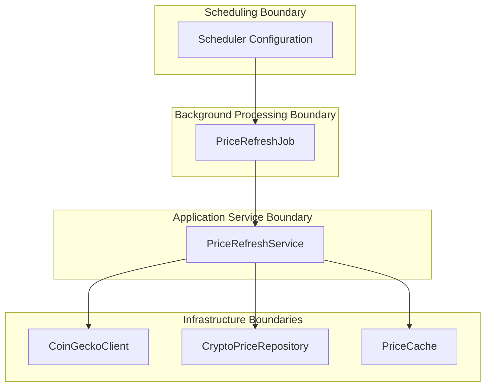

## Dependency Direction

The dependency direction must remain explicit:

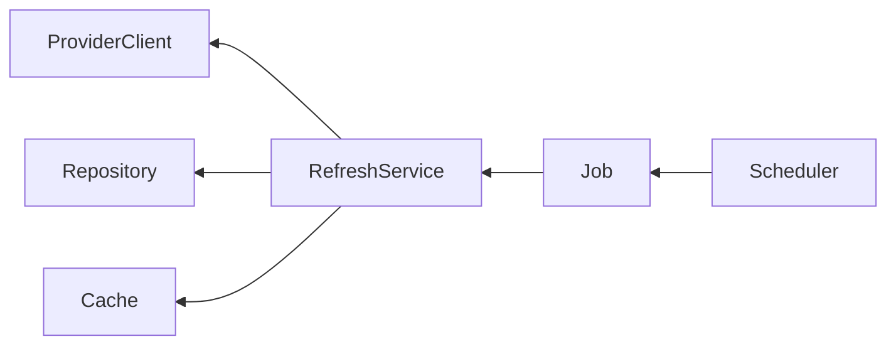

The refresh service must not depend on the scheduler implementation.

This allows the service to be invoked from:

- A scheduled background job.
- A manual administrative task.
- A Rails runner command.
- A future health-repair process.
- A test suite.

---

# 5. Scheduler Design

## Required Interval

The project requirement specifies that price refresh must occur every minute.

The target schedule is:

```text id="2nepew"
Every 1 minute
```

The final scheduler implementation must enqueue `PriceRefreshJob` at this interval.

---

## Scheduler Selection

The specific scheduling mechanism will be selected during implementation based on compatibility with the chosen ActiveJob adapter and Docker development environment.

The selected mechanism must satisfy all of the following:

| Requirement           | Expected Behaviour                                                                  |
| --------------------- | ----------------------------------------------------------------------------------- |
| Interval support      | Can enqueue work every minute.                                                      |
| Rails integration     | Works cleanly with Rails configuration and ActiveJob.                               |
| Local reproducibility | Can run in Docker and local development.                                            |
| Testability           | Scheduler configuration can be validated without relying on timing-sensitive tests. |
| Failure isolation     | One failed refresh does not permanently stop future scheduled executions.           |
| Operational clarity   | Configuration is understandable to a junior developer.                              |

The scheduler decision must be recorded in `ENGINEERING_JOURNAL.md`.

---

## Scheduler Configuration Boundary


The schedule interval, enabled state, configured symbols, and quote currency must be externalized through configuration.

---

# 6. Refresh Workflow

## High-Level Workflow

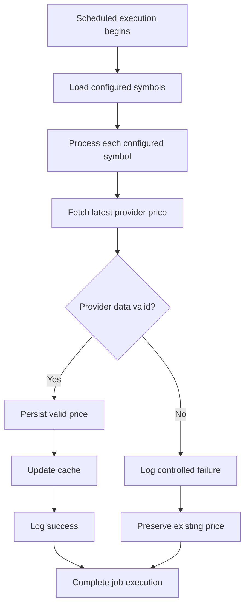

---

## Per-Symbol Refresh Sequence

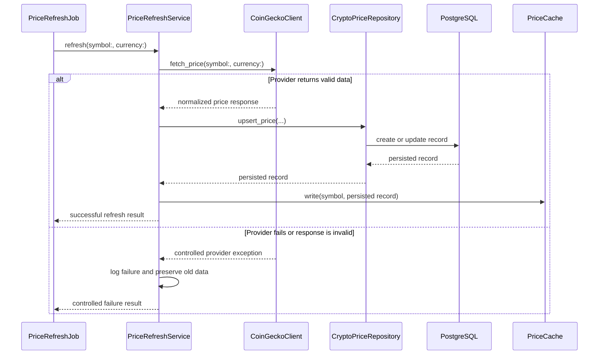

---

## Required Refresh Ordering

The refresh workflow must follow this exact logical order:

1. Retrieve the configured symbol and currency.
2. Request provider data through `CoinGeckoClient`.
3. Validate and normalize the provider response.
4. Persist the price through `CryptoPriceRepository`.
5. Receive the successfully persisted record.
6. Update `PriceCache` from the persisted record.
7. Record a successful refresh event.

The cache must not be updated before the database write succeeds.

---

# 7. Job Contract

## Intended Job Name

```ruby id="qv6n9e"
PriceRefreshJob
```

## Intended Invocation Shape

The final implementation is expected to support an invocation equivalent to:

```ruby id="c72e7t"
PriceRefreshJob.perform_later(
  symbol: "btc",
  currency: "usd"
)
```

The exact argument representation may change if the selected job adapter imposes a serialization constraint. Any change must preserve explicit, testable inputs.

---

## Batch Scheduling Model

The scheduler may enqueue either:

1. One job per configured symbol, or
2. One job containing a configured set of symbols.

The preferred Version 1.0 design is one job per symbol.

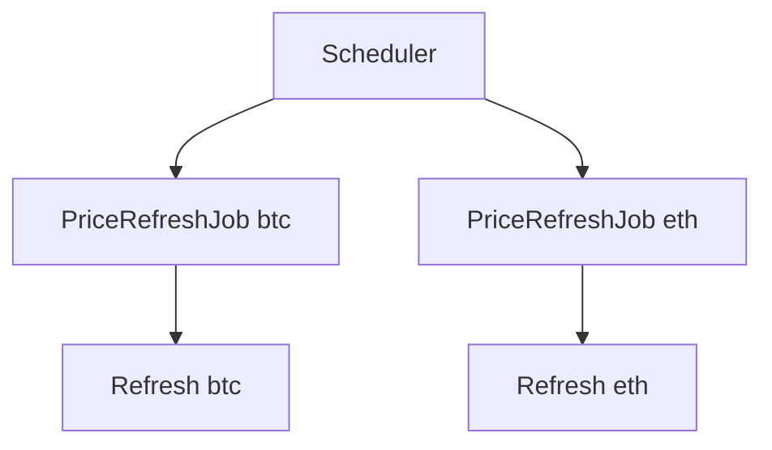

## Rationale

One job per symbol:

- Keeps failures isolated.
- Produces focused logs.
- Simplifies retry behaviour.
- Allows one symbol to refresh even if another fails.
- Keeps test cases smaller and more deterministic.

The application does not require batch optimization at the Version 1.0 scale.

---

# 8. Retry Strategy

Retries are intended to handle transient failures.

They are not intended to conceal persistent provider failures or create unbounded background work.

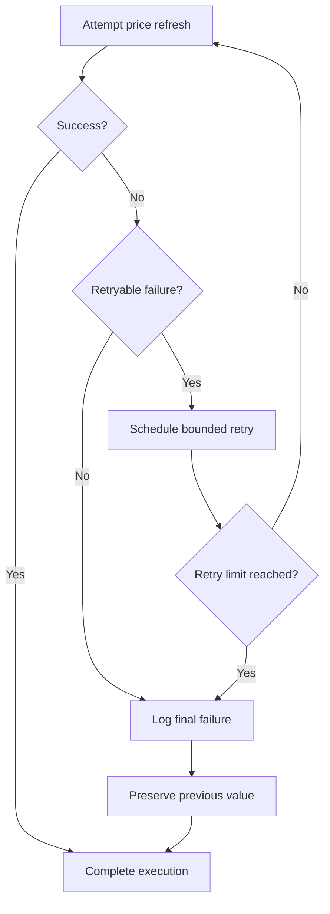

## Retry Principles

| Principle                      | Rule                                                                                                        |
| ------------------------------ | ----------------------------------------------------------------------------------------------------------- |
| Bounded retries                | The job must not retry indefinitely.                                                                        |
| Retry only transient failures  | Timeouts, temporary network errors, and selected server failures may be retryable.                          |
| Avoid retrying invalid input   | Malformed provider responses and unsupported symbols should not generate repeated retries without a reason. |
| Preserve existing data         | A failed refresh must not remove a valid historical value.                                                  |
| Log retry context              | Logs should show retry attempt, symbol, provider, and error category.                                       |
| Allow next scheduled execution | Exhausted retries must not prevent the next regular one-minute refresh.                                     |

---

## Retryable Failures

The exact retryable error list will depend on the HTTP client and provider behaviour, but likely candidates include:

- Connection timeout.
- Read timeout.
- Temporary DNS or network failure.
- Provider `429 Too Many Requests`, when retry policy permits.
- Provider `5xx` server errors.

---

## Non-Retryable Failures

Likely non-retryable failures include:

- Unsupported configured symbol.
- Invalid local configuration.
- Malformed application invocation.
- Persisted-data validation failure caused by application defects.
- Provider response schema mismatch that requires engineering review.
- Unauthorized provider credential configuration.

The final classification must be recorded in `ENGINEERING_JOURNAL.md` once implementation decisions are made.

---

# 9. Failure Handling

## Provider Failure

When CoinGecko fails, the refresh process must fail safely.

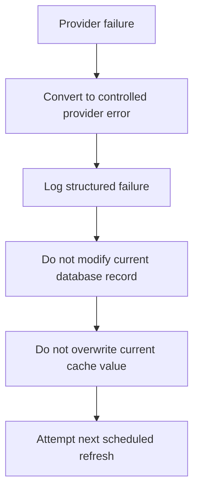

Expected outcome:

- No `500` response is generated merely because CoinGecko fails.
- Existing cached data remains available where cache semantics permit.
- Existing persisted data remains available.
- A later scheduled execution may succeed and refresh the value.

---

## Persistence Failure

If a valid provider response is received but the database write fails:

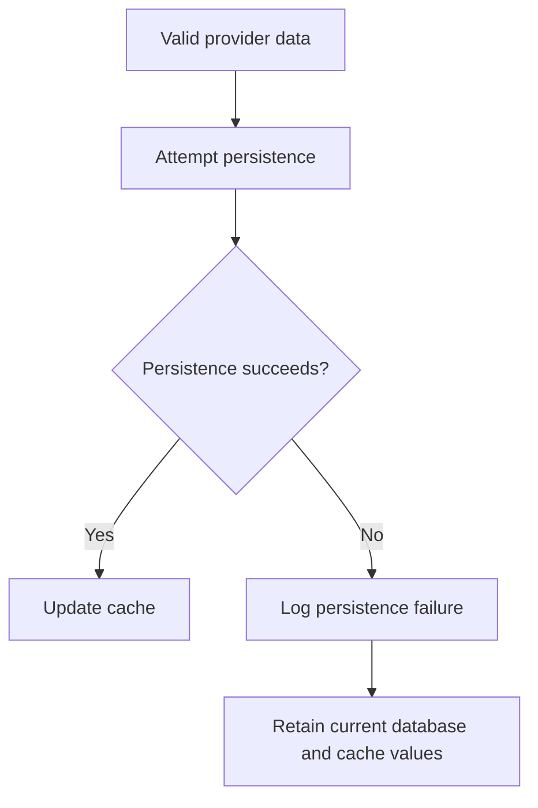

The system must not place the new provider value in cache if persistence failed.

This prevents cache from exposing a value that cannot be recovered from durable storage.

---

## Cache Failure

Cache failures should not make durable stored data inaccessible when PostgreSQL remains available.

Expected query-path behaviour is documented in `ARCHITECTURE.md` and `API.md`.

Expected refresh-path behaviour:

- Persist the new record if persistence succeeds.
- Attempt cache update.
- Log a controlled cache failure if cache update fails.
- Do not treat cache failure as permission to discard the persisted success.
- Permit later API reads to recover through the database path.

---

## Job Failure Escalation

An unexpected application error should:

1. Be logged with safe context.
2. Be allowed to follow the selected ActiveJob retry policy where appropriate.
3. Avoid corrupting or deleting prior valid records.
4. Avoid preventing future scheduled executions.

The final selected background-job adapter may have adapter-specific failure handling. That behaviour must be documented after implementation.

---

# 10. Idempotency and Duplicate Execution

Scheduled systems can occasionally enqueue duplicate work due to process restarts, retries, deployments, or scheduler misconfiguration.

The design must remain safe if the same symbol refresh executes more than once.

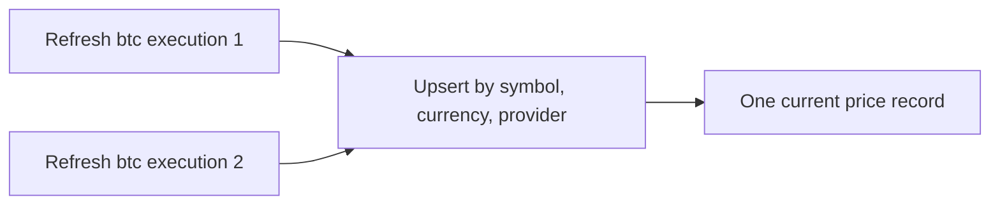

## Idempotency Rules

| Rule                                 | Expected Behaviour                                                    |
| ------------------------------------ | --------------------------------------------------------------------- |
| Repeated successful refresh          | Updates the same current record rather than creating duplicates.      |
| Duplicate job execution              | Produces a safe upsert result.                                        |
| Retry after uncertain completion     | Remains safe because persistence is scoped by unique record identity. |
| Cache update after duplicate write   | Replaces cache with the latest successfully persisted record.         |
| Provider failure after prior success | Preserves the latest valid stored record.                             |

The database uniqueness constraint documented in `DATABASE.md` supports this behaviour.

---

# 11. Logging and Operational Context

Logs must help diagnose scheduled processing without exposing secrets.

## Required Job Log Events

| Event                      | Required Context                                                          |
| -------------------------- | ------------------------------------------------------------------------- |
| Job started                | Job identifier, symbol, currency, attempt number.                         |
| Provider request started   | Provider name, symbol, currency.                                          |
| Provider request completed | Provider name, response status, duration.                                 |
| Price persisted            | Symbol, price, currency, provider, fetched timestamp.                     |
| Cache updated              | Symbol, cache key category, expiry configuration reference.               |
| Retry scheduled            | Symbol, error category, retry attempt, next retry timing where available. |
| Refresh failed             | Symbol, provider, safe error category, duration.                          |
| Job completed              | Symbol, final outcome, total duration.                                    |

---

## Logging Flow

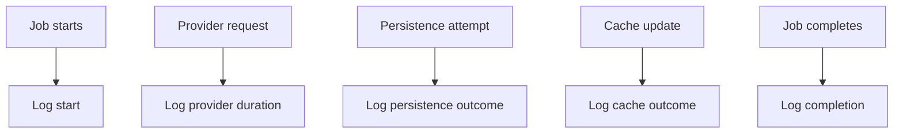

## Sensitive Information Exclusions

The following must never appear in logs:

- CoinGecko API key.
- Full authorization headers.
- Rails master key.
- Database password.
- Full environment-variable values.
- Raw external response bodies when they could contain sensitive fields.
- Full internal stack traces in API responses.

---

# 12. Configuration

Background processing must be configurable without modifying application business logic.

## Required Configuration Categories

| Category                | Example                                    |
| ----------------------- | ------------------------------------------ |
| Refresh interval        | Every one minute.                          |
| Supported symbols       | `btc`, `eth`.                              |
| Quote currency          | `usd`.                                     |
| Scheduler enabled state | Enabled in applicable environments.        |
| Job adapter             | Selected ActiveJob backend.                |
| Retry limit             | Bounded number of retries.                 |
| Retry delay strategy    | Configured retry timing or adapter policy. |
| Provider timeout        | Connection and read timeout values.        |

---

## Example Environment Variables

```dotenv id="jidro8"
PRICE_REFRESH_SYMBOLS=btc,eth
PRICE_REFRESH_CURRENCY=usd
PRICE_REFRESH_INTERVAL_SECONDS=60
PRICE_REFRESH_ENABLED=true
PRICE_REFRESH_MAX_RETRIES=3
```

The final variable names may differ, but the documented behaviours must remain available.

---

## Environment Expectations

| Environment | Scheduler Behaviour                                                                            |
| ----------- | ---------------------------------------------------------------------------------------------- |
| Development | Enabled when the developer wants live local refreshes; may be disabled during focused testing. |
| Test        | Disabled by default; jobs should be controlled explicitly by specs.                            |
| CI          | Disabled unless a dedicated integration verification requires it.                              |
| Production  | Enabled through the selected scheduler process or service.                                     |

Tests must not rely on real one-minute waits.

---

# 13. Testing Strategy

Background processing must be tested at multiple boundaries.

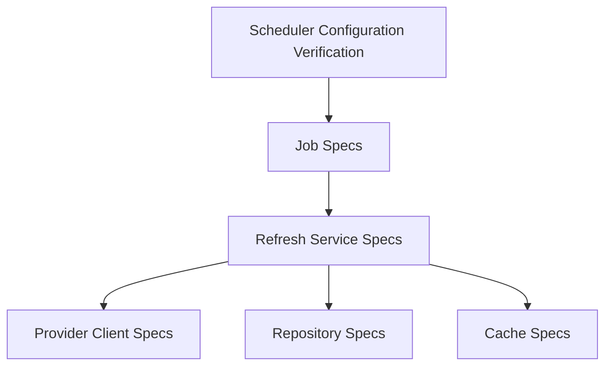

## Required Test Categories

| Test Area                 | Verification Goal                                                          |
| ------------------------- | -------------------------------------------------------------------------- |
| Job delegation            | The job invokes the refresh service with expected inputs.                  |
| Scheduler configuration   | The configured schedule enqueues the expected job every minute.            |
| Successful refresh        | Provider result is persisted and cached.                                   |
| Provider timeout          | Existing value remains available; failure is controlled.                   |
| Invalid provider response | No invalid record is persisted; failure is logged or reported predictably. |
| Persistence failure       | Cache is not updated with the unpersisted value.                           |
| Cache failure             | Persisted success remains valid; cache failure is controlled.              |
| Retry behaviour           | Retryable errors use bounded retry behaviour.                              |
| Idempotency               | Duplicate execution does not create duplicate current records.             |
| Logging                   | Key lifecycle events include safe contextual information.                  |

Detailed RSpec structure and execution instructions are defined in `TESTING.md`.

---

# 14. Local Verification

Once implementation is complete, a developer should be able to verify scheduled refresh behaviour without waiting blindly for an unknown outcome.

## Verify Job Enqueueing

Expected command shape:

```bash id="m5m8sm"
bin/rails runner "PriceRefreshJob.perform_later(symbol: 'btc', currency: 'usd')"
```

The final invocation command may vary based on the selected job adapter.

---

## Verify Stored Data

Expected command shape:

```bash id="hcs1nt"
bin/rails console
```

```ruby id="aeocqg"
CryptoPrice.find_by(symbol: "btc", currency: "usd")
```

A successful refresh should create or update the expected record.

---

## Verify Public Endpoint

```bash id="ptb866"
curl --request GET \
  --url http://localhost:3000/prices/btc \
  --header "Accept: application/json"
```

The endpoint should return the latest cached or persisted value.

---

## Verify Fallback Behaviour

A developer should be able to simulate provider failure through test doubles or controlled configuration.

Expected outcome:

1. A valid price exists in PostgreSQL.
2. CoinGecko client is made unavailable or returns an error.
3. Refresh job records a controlled failure.
4. `GET /prices/btc` continues returning the prior known value.
5. No invalid data overwrites the existing record.

The exact local verification approach will be documented after the provider client and job adapter are implemented.

---

# 15. Operational Considerations

## Separate Process Expectations

Depending on the selected background-job adapter and scheduler, local and deployed environments may require separate processes.

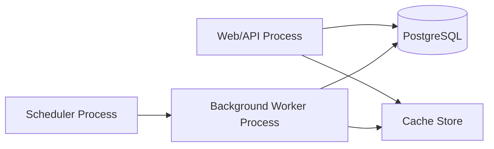

The final Docker Compose design must make these process responsibilities explicit.

---

## Health and Monitoring Considerations

Version 1.0 does not require a full observability platform, but operational verification should be possible through:

- Application logs.
- Job execution logs.
- Database inspection.
- API response timestamps.
- CI verification.
- Docker container status.

A future enhancement may add health endpoints, metrics, dashboards, alerting, and distributed tracing.

---

## Deployment Considerations

A deployed environment must ensure:

- The scheduler is enabled exactly where intended.
- Background workers are running.
- Environment variables are configured securely.
- PostgreSQL is reachable.
- Cache configuration is available.
- Logs are retained according to deployment needs.
- The provider API key remains external to source control.

---

# 16. Future Considerations

The following enhancements are deliberately deferred from Version 1.0.

| ID         | Consideration                 | Rationale                                                                  |
| ---------- | ----------------------------- | -------------------------------------------------------------------------- |
| FC-JOB-001 | Redis-backed background queue | Useful for multi-process and distributed deployment scenarios.             |
| FC-JOB-002 | Distributed job locking       | Prevents duplicate refresh work across multiple scheduler instances.       |
| FC-JOB-003 | Dead-letter queue             | Preserves permanently failed jobs for operational investigation.           |
| FC-JOB-004 | Circuit breaker               | Limits repeated calls during prolonged provider outages.                   |
| FC-JOB-005 | Exponential backoff           | Reduces provider pressure during repeated transient failures.              |
| FC-JOB-006 | Job metrics dashboard         | Improves operational visibility.                                           |
| FC-JOB-007 | Dynamic refresh frequency     | Adjusts polling based on provider health or business requirements.         |
| FC-JOB-008 | Multi-provider failover       | Improves resilience if CoinGecko becomes unavailable for extended periods. |

These items must not be implemented unless project scope is formally expanded.

---

# 17. Related Documentation

| Document                                                 | Relationship                                                                       |
| -------------------------------------------------------- | ---------------------------------------------------------------------------------- |
| [`PROJECT_SPECIFICATIONS.md`](PROJECT_SPECIFICATIONS.md) | Defines the one-minute refresh and fallback requirements.                          |
| [`ARCHITECTURE.md`](ARCHITECTURE.md)                     | Defines component boundaries and dependency direction.                             |
| [`DATABASE.md`](DATABASE.md)                             | Defines the persisted current-price model and idempotent upsert rules.             |
| [`API.md`](API.md)                                       | Defines how API consumers receive cached or persisted values.                      |
| [`TESTING.md`](TESTING.md)                               | Defines job, scheduler, retry, and failure test procedures.                        |
| [`ENGINEERING_JOURNAL.md`](ENGINEERING_JOURNAL.md)       | Records scheduler and job-adapter decisions.                                       |
| [`JUNIOR_DEVELOPER_GUIDE.md`](JUNIOR_DEVELOPER_GUIDE.md) | Explains how to implement and verify the background processing stack from scratch. |

---

# 18. Maintenance Requirements

This document must be updated whenever any of the following changes:

- The selected job adapter changes.
- The scheduling mechanism changes.
- The refresh interval changes.
- The configured symbols or currency strategy changes.
- Job arguments change.
- Retry classification or limits change.
- Failure-handling behaviour changes.
- Job logging changes materially.
- Cache-write ordering changes.
- The application moves to distributed or multi-instance execution.
- Additional providers are introduced.

Background-processing documentation is part of the operational contract and must remain synchronized with the actual implementation.
