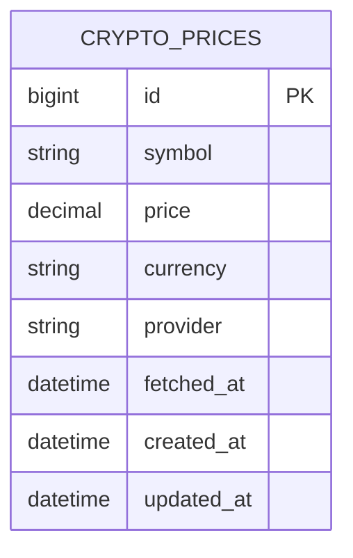
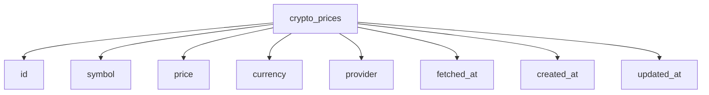
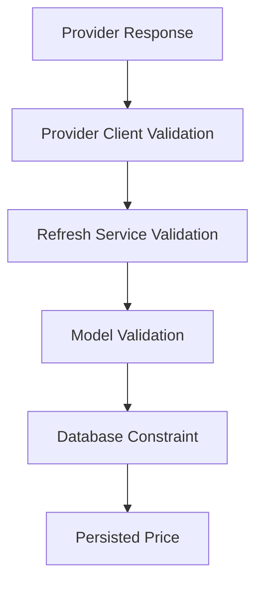
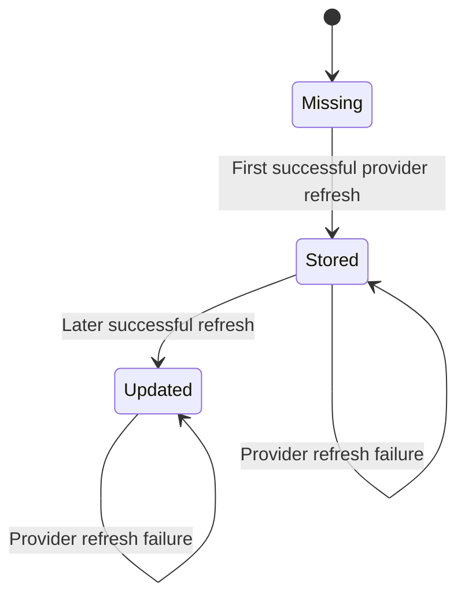
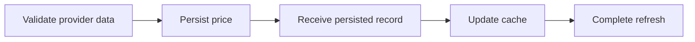
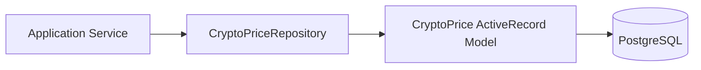
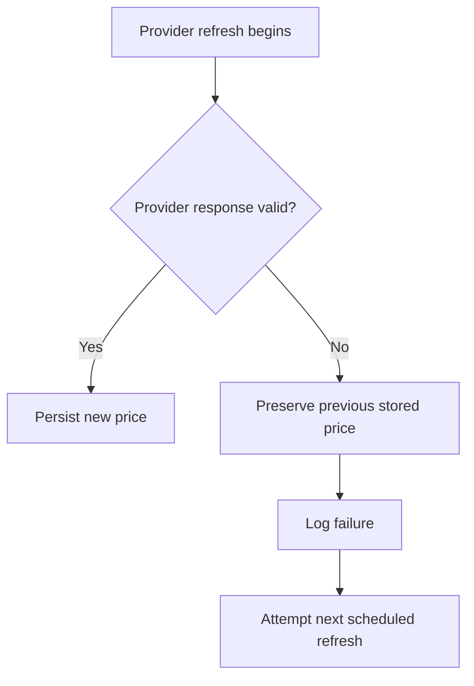

# DATABASE.md

> **Document Purpose**
>
> This document defines the target persistence design for the Cryptocurrency Price API.
>
> It explains the data model, schema responsibilities, validations, indexes, migration strategy, repository interaction, seed-data approach, and database operational considerations.
>
> This document does not define HTTP responses, background scheduling, or service orchestration. Those responsibilities belong to `API.md`, `BACKGROUND_JOBS.md`, and `ARCHITECTURE.md`.

---

# Table of Contents

1. Database Goals
2. Persistence Responsibilities
3. Data Model Overview
4. Entity Definition
5. Schema Design
6. Field Definitions
7. Validation Strategy
8. Database Constraints
9. Index Strategy
10. Record Lifecycle
11. Persistence Operations
12. Repository Boundary
13. Migration Strategy
14. Seed Data Strategy
15. Data Integrity Rules
16. Query Patterns
17. Performance Considerations
18. Failure Handling
19. Future Data Model Considerations
20. Related Documentation
21. Maintenance Requirements

---

# 1. Database Goals

PostgreSQL is the durable source of truth for the latest successfully retrieved cryptocurrency price.

The database design must support the following outcomes:

- Store the latest valid price fetched from the external provider.
- Preserve the last known valid value during provider failures.
- Support efficient lookup by cryptocurrency symbol.
- Support cache recovery when a cached value is missing or expired.
- Maintain data integrity through model validations and database constraints.
- Remain intentionally simple for the Version 1.0 scope.

The database is not intended to provide historical market analytics, trading records, user portfolios, or price-chart data.

---

# 2. Persistence Responsibilities

The persistence layer has a narrow responsibility.

It is responsible for:

- Storing the latest valid price for a cryptocurrency symbol.
- Retrieving the latest stored price for a requested symbol.
- Enforcing data integrity at the database boundary.
- Supporting cache repopulation after cache misses.
- Preserving prior valid data when a refresh attempt fails.

It is not responsible for:

- Calling CoinGecko.
- Deciding when prices should refresh.
- Rendering API responses.
- Applying HTTP status codes.
- Managing provider retry strategy.
- Deciding cache fallback order.

---

# 3. Data Model Overview

Version 1.0 contains one primary persisted entity:



The `crypto_prices` table stores the latest successfully validated value for a cryptocurrency symbol and quote currency combination.

---

# 4. Entity Definition

## `CryptoPrice`

`CryptoPrice` represents a durable, provider-sourced price observation that has passed validation and can safely be returned to API consumers.

Each record represents:

> The latest known valid price for one cryptocurrency symbol in one quote currency from one configured provider.

The intended ActiveRecord model name is:

```ruby id="hvokv1"
CryptoPrice
```

The intended table name is:

```text id="r2gxs6"
crypto_prices
```

---

# 5. Schema Design

## Target Table Definition



## Target Migration Shape

The final migration should create fields equivalent to the following design:

```ruby id="cl0ytn"
create_table :crypto_prices do |t|
  t.string :symbol, null: false
  t.decimal :price, precision: 20, scale: 8, null: false
  t.string :currency, null: false, default: "usd"
  t.string :provider, null: false, default: "coingecko"
  t.datetime :fetched_at, null: false

  t.timestamps
end
```

The final implementation may adjust exact precision, scale, defaults, or constraints only when the change is documented in `ENGINEERING_JOURNAL.md` and remains aligned with `PROJECT_SPECIFICATIONS.md`.

---

# 6. Field Definitions

| Field        | Type            | Required | Purpose                                                          |
| ------------ | --------------- | -------: | ---------------------------------------------------------------- |
| `id`         | `bigint`        |      Yes | Primary key generated by PostgreSQL.                             |
| `symbol`     | `string`        |      Yes | Normalized cryptocurrency symbol or configured asset identifier. |
| `price`      | `decimal(20,8)` |      Yes | Latest valid price in the configured quote currency.             |
| `currency`   | `string`        |      Yes | Quote currency for the price, initially expected to be `usd`.    |
| `provider`   | `string`        |      Yes | Name of the external data source, initially `coingecko`.         |
| `fetched_at` | `datetime`      |      Yes | Time at which the provider data was successfully retrieved.      |
| `created_at` | `datetime`      |      Yes | Rails-managed record creation timestamp.                         |
| `updated_at` | `datetime`      |      Yes | Rails-managed record modification timestamp.                     |

---

## Symbol

The `symbol` field identifies the requested cryptocurrency.

The final implementation must normalize symbols consistently before persistence and lookup.

Examples:

| Input | Normalized Stored Value |
| ----- | ----------------------- |
| `BTC` | `btc`                   |
| `btc` | `btc`                   |
| `Eth` | `eth`                   |
| `ETH` | `eth`                   |

The application must not rely on inconsistent capitalization when finding persisted values.

---

## Price

The `price` field uses a decimal type rather than a floating-point type.

Decimal storage is required because price values represent financial data and must avoid common floating-point precision problems.

The Version 1.0 project does not perform trading or financial settlement. However, accurate decimal representation remains appropriate because the public API returns price information that may be consumed by other systems.

---

## Currency

The `currency` field identifies the quote currency associated with the price.

Version 1.0 is designed around USD pricing, but storing the currency explicitly avoids silently assuming that every price is USD.

Examples:

| Symbol |             Price | Currency |
| ------ | ----------------: | -------- |
| `btc`  | `109283.12000000` | `usd`    |
| `eth`  |   `6245.35000000` | `usd`    |

---

## Provider

The `provider` field identifies where the value originated.

The initial provider is expected to be:

```text id="blbmws"
coingecko
```

This field improves traceability and allows future provider changes without redefining the meaning of existing data.

---

## Fetched At

`fetched_at` records when the value was successfully retrieved from the provider.

It is distinct from `updated_at`.

| Timestamp    | Meaning                                       |
| ------------ | --------------------------------------------- |
| `fetched_at` | When the external provider data was obtained. |
| `updated_at` | When the database record was last changed.    |

This distinction is important because database updates, repairs, migrations, or metadata changes should not be confused with provider-data freshness.

---

# 7. Validation Strategy

Data integrity is protected through both application-level validations and database-level constraints.



Each validation layer has a distinct responsibility.

---

## Model-Level Validations

The target `CryptoPrice` model should validate:

- Presence of `symbol`.
- Presence of `price`.
- Presence of `currency`.
- Presence of `provider`.
- Presence of `fetched_at`.
- Numeric value of `price`.
- Positive value of `price`.
- Normalized format for `symbol`.
- Normalized format for `currency`.
- Normalized format for `provider`.

Example target behaviour:

```ruby id="fiqmw9"
validates :symbol, presence: true
validates :price, presence: true, numericality: { greater_than: 0 }
validates :currency, presence: true
validates :provider, presence: true
validates :fetched_at, presence: true
```

The final validation syntax may vary, but the behavioural rules must remain intact.

---

## Validation Rules

| Attribute    | Rule                            | Reason                                             |
| ------------ | ------------------------------- | -------------------------------------------------- |
| `symbol`     | Required and normalized.        | Allows consistent lookup and cache-key generation. |
| `price`      | Required and greater than zero. | Prevents invalid or incomplete price records.      |
| `currency`   | Required and normalized.        | Makes quote currency explicit.                     |
| `provider`   | Required and normalized.        | Preserves data origin.                             |
| `fetched_at` | Required.                       | Allows freshness and operational analysis.         |

---

# 8. Database Constraints

Application validations protect normal application flows, but database constraints protect the data when application-level validation is bypassed.

The database should enforce:

- `NOT NULL` on required columns.
- A unique lookup strategy for the intended current-price record shape.
- Appropriate indexes for required queries.

## Uniqueness Decision

For Version 1.0, the preferred uniqueness scope is:

```text id="plh4cb"
symbol + currency + provider
```

This supports one current record per asset, quote currency, and provider combination.

Example:

```text id="wdqv76"
btc + usd + coingecko
eth + usd + coingecko
```

This structure preserves flexibility for future multi-currency and multi-provider support while remaining simple.

---

## Intended Unique Index

```ruby id="etfygt"
add_index :crypto_prices,
          [:symbol, :currency, :provider],
          unique: true,
          name: "index_crypto_prices_on_symbol_currency_provider"
```

The implementation should use an upsert-compatible persistence strategy so that repeated successful refreshes update the existing current record rather than creating unnecessary duplicates.

---

# 9. Index Strategy

Indexes are selected based on known query patterns rather than speculative optimization.

## Required Indexes

| Index                                                      | Type                      | Purpose                                                               |
| ---------------------------------------------------------- | ------------------------- | --------------------------------------------------------------------- |
| Primary key on `id`                                        | Default primary-key index | Identifies individual records.                                        |
| Unique composite index on `symbol`, `currency`, `provider` | Unique B-tree index       | Supports current-price lookup and prevents duplicate current records. |
| Optional index on `fetched_at`                             | Non-unique B-tree index   | Supports future freshness monitoring or cleanup tasks if required.    |

## Primary Query Pattern

The expected primary persistence query is conceptually:

```text id="72ztki"
Find the current record for:
symbol = normalized requested symbol
currency = configured currency
provider = configured provider
```

This query is supported directly by the composite unique index.

---

# 10. Record Lifecycle



## Lifecycle States

| State     | Description                                                                  |
| --------- | ---------------------------------------------------------------------------- |
| Missing   | No successful price has been fetched and persisted for the requested symbol. |
| Stored    | A valid price exists and can be served.                                      |
| Updated   | A newer valid provider price replaced the prior stored value.                |
| Preserved | A provider refresh failed, so the last known valid record remains unchanged. |

A failed provider refresh must never convert a valid stored record into an invalid or empty record.

---

# 11. Persistence Operations

The repository layer owns persistence operations.

## Find Latest Stored Price

The repository must support a stable operation equivalent to:

```ruby id="ixl6u5"
find_latest(symbol:, currency:, provider:)
```

Expected outcome:

- Return the matching `CryptoPrice` record when it exists.
- Return `nil` when no successful value has ever been stored.

The repository should not raise an error merely because a record is absent. Absence is a valid state that the query service can interpret.

---

## Create or Update Current Price

The repository must support an operation equivalent to:

```ruby id="dj5saq"
upsert_price(symbol:, price:, currency:, provider:, fetched_at:)
```

Expected behaviour:

1. Locate the current record by symbol, currency, and provider.
2. Create the record if no existing record is found.
3. Update price and `fetched_at` when a record exists.
4. Return the persisted record.
5. Raise a controlled persistence error if the write cannot complete.

---

## Write Ordering Rule

The refresh workflow must follow this order:



The cache must not be updated with a fresh provider value until that value has been persisted successfully.

---

# 12. Repository Boundary

The repository layer separates application services from ActiveRecord query details.



## Repository Responsibilities

The repository owns:

- Record lookup.
- Record creation.
- Record update.
- Upsert behaviour.
- Query-scope selection.
- Translation of persistence behaviour into stable return values or controlled exceptions.

## Service Responsibilities

The service layer owns:

- Deciding when to read persisted data.
- Deciding when to write a new value.
- Coordinating cache updates after persistence.
- Interpreting absent records.
- Handling provider failure without deleting historical valid data.

The repository must not decide fallback behaviour or call the cache.

---

# 13. Migration Strategy

Database changes must be applied through Rails migrations.

## Migration Principles

- Migrations must be reversible whenever practical.
- Schema changes must be tested in the local and test environments.
- New constraints must be considered against existing data.
- Index creation must be intentional and documented.
- Migration names must describe the schema change clearly.
- Schema changes must be reflected in `db/schema.rb` or the selected Rails schema format.

## Required Verification

Every database migration must be verified through:

```bash id="jvyecl"
bin/rails db:migrate
bin/rails db:rollback
bin/rails db:migrate
bin/rails db:prepare
```

The exact command sequence may vary based on the final development environment, but the implementation must demonstrate:

- Successful migration.
- Successful rollback.
- Successful reapplication.
- A usable schema in test and development environments.

---

# 14. Seed Data Strategy

Seed data exists for local development and demonstration support.

It must not be required for production correctness.

## Seed Data Principles

- Seed data should be safe to execute repeatedly.
- Seed execution should be idempotent.
- Seed values must be clearly identified as local-development sample data.
- Seed data must not contain real secrets.
- Seed data must not imply that values are live market data.

## Suggested Development Seed Records

| Symbol |       Price | Currency | Provider | Purpose                               |
| ------ | ----------: | -------- | -------- | ------------------------------------- |
| `btc`  | `100000.00` | `usd`    | `seed`   | Demonstrates a stored Bitcoin price.  |
| `eth`  |   `5000.00` | `usd`    | `seed`   | Demonstrates a stored Ethereum price. |

The final implementation may use a dedicated seed provider value such as `seed` to prevent sample data from being mistaken for CoinGecko-derived data.

---

# 15. Data Integrity Rules

The persistence layer must preserve these invariants.

| ID     | Rule                                                                                   |
| ------ | -------------------------------------------------------------------------------------- |
| DI-001 | A stored `CryptoPrice` record must have a symbol.                                      |
| DI-002 | A stored `CryptoPrice` record must have a positive decimal price.                      |
| DI-003 | A stored `CryptoPrice` record must identify its quote currency.                        |
| DI-004 | A stored `CryptoPrice` record must identify its provider.                              |
| DI-005 | A stored `CryptoPrice` record must include a successful provider fetch timestamp.      |
| DI-006 | Only one current record may exist for each symbol, currency, and provider combination. |
| DI-007 | A failed provider refresh must not erase a previously valid stored record.             |
| DI-008 | Cache updates must occur only after successful persistence.                            |
| DI-009 | Sample seed data must be distinguishable from external-provider data.                  |

---

# 16. Query Patterns

The database is intentionally optimized for a small number of predictable query patterns.

## Current Price Lookup

```text id="xumc6t"
Lookup a current stored price by:
symbol + currency + provider
```

Used by:

- `PriceQueryService` after a cache miss.
- `PriceRefreshService` during create-or-update behaviour.
- Local debugging and operational verification.

---

## Current Price Upsert

```text id="86iah6"
Insert or update a current price by:
symbol + currency + provider
```

Used by:

- `PriceRefreshService` after validating a provider response.

---

## Freshness Inspection

```text id="6n4f17"
Inspect fetched_at to determine the age of the latest stored value.
```

Used by:

- Operational diagnostics.
- Future health checks.
- Future freshness alerts.
- Manual local verification.

---

# 17. Performance Considerations

The Version 1.0 data model is deliberately small.

## Expected Load Characteristics

| Concern          | Expected Behaviour                                                                       |
| ---------------- | ---------------------------------------------------------------------------------------- |
| Read volume      | API requests should be served from cache in normal operation.                            |
| Database reads   | Expected mainly after cache misses, expiration, or cache recovery.                       |
| Database writes  | One write per configured symbol per successful refresh interval.                         |
| Data volume      | Small because Version 1.0 retains one current record per symbol, currency, and provider. |
| Index complexity | Low because the primary lookup is a composite key lookup.                                |

## Performance Rules

- Do not add indexes without a documented query requirement.
- Do not store duplicate current records unnecessarily.
- Do not use floating-point price storage.
- Do not query the database from controllers.
- Do not query CoinGecko as part of the API read path.
- Prefer cache reads for public endpoint requests.

---

# 18. Failure Handling

## Provider Failure

Provider failures do not directly modify the database.



If the provider fails:

- Existing records remain unchanged.
- Existing cache entries are not intentionally invalidated.
- The failure is logged.
- The next scheduled refresh retries according to the configured job and provider policy.

---

## Database Failure During Refresh

If persistence fails after receiving a valid provider response:

- The cache must not be updated with the new unpersisted value.
- The prior cached and persisted values remain the current known value.
- The error must be logged with safe operational context.
- The scheduled process remains capable of retrying at the next interval.

---

## Missing Persisted Data

When no stored record exists:

- The query service cannot provide a historical fallback.
- The API must return the documented not-found response.
- The background refresh process remains responsible for obtaining the first valid price.

---

# 19. Future Data Model Considerations

The following ideas are intentionally deferred from Version 1.0.

| Future Consideration                 | Reason for Deferral                                                                       |
| ------------------------------------ | ----------------------------------------------------------------------------------------- |
| Historical price table               | The current requirement asks for the cached latest price, not historical market analysis. |
| Multiple provider records per symbol | One provider is sufficient for the interview scope.                                       |
| Provider failover metadata           | Adds complexity before a second provider exists.                                          |
| Currency conversion table            | Version 1.0 uses a configured quote currency.                                             |
| Audit trail of every refresh event   | Useful for observability but unnecessary for the core requirement.                        |
| Soft deletion                        | Current records should remain simple and durable.                                         |
| Partitioned historical tables        | Not needed without large time-series data volume.                                         |
| User-owned price preferences         | Authentication and user management are out of scope.                                      |

The current composite uniqueness strategy intentionally leaves room for some of these additions without requiring a full data-model rewrite.

---

# 20. Related Documentation

| Document                                                 | Relationship                                                                      |
| -------------------------------------------------------- | --------------------------------------------------------------------------------- |
| [`PROJECT_SPECIFICATIONS.md`](PROJECT_SPECIFICATIONS.md) | Defines project requirements and persistence expectations.                        |
| [`ARCHITECTURE.md`](ARCHITECTURE.md)                     | Defines the role of repositories, models, services, and cache boundaries.         |
| [`API.md`](API.md)                                       | Defines the public response fields sourced from persisted values.                 |
| [`BACKGROUND_JOBS.md`](BACKGROUND_JOBS.md)               | Defines how scheduled refreshes write data.                                       |
| [`TESTING.md`](TESTING.md)                               | Defines model, repository, migration, and persistence test expectations.          |
| [`ENGINEERING_JOURNAL.md`](ENGINEERING_JOURNAL.md)       | Records significant schema and persistence decisions.                             |
| [`JUNIOR_DEVELOPER_GUIDE.md`](JUNIOR_DEVELOPER_GUIDE.md) | Explains how to generate migrations and build the persistence layer from scratch. |

---

# 21. Maintenance Requirements

This document must be updated when any of the following changes:

- New tables are added.
- Existing table fields are added, removed, or renamed.
- Validation rules change.
- Uniqueness rules change.
- Indexes are added, removed, or modified.
- Persistence query patterns change.
- Cache-write ordering changes.
- Historical-price storage is introduced.
- Provider or currency support changes the uniqueness scope.
- Migration or seed-data strategy changes.

The database design is part of the production implementation and must remain synchronized with the actual schema.
