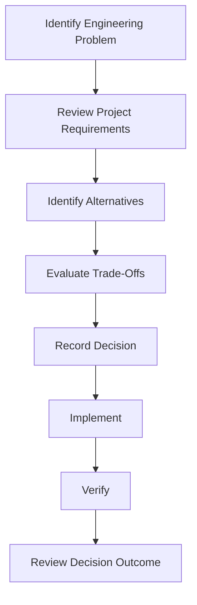
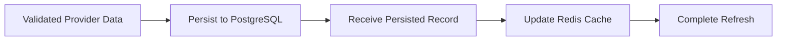
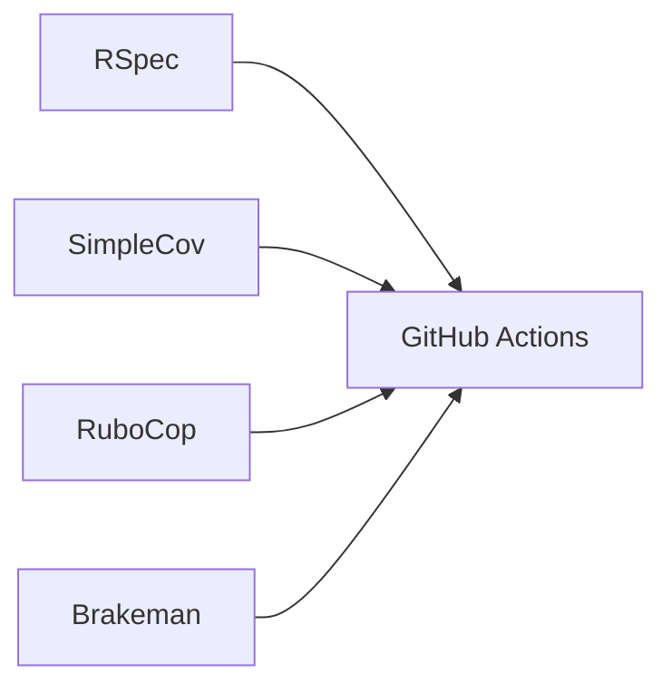
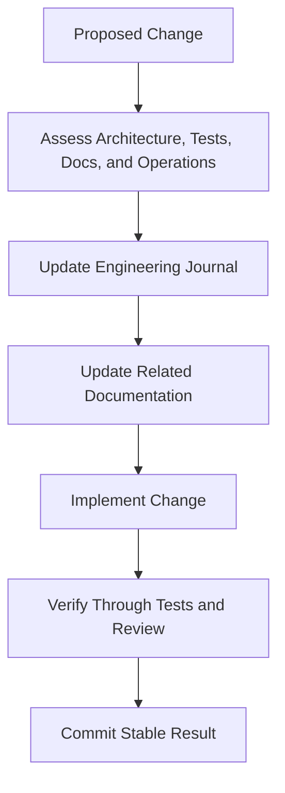

# ENGINEERING_JOURNAL.md

> **Document Purpose**
>
> This journal records material engineering decisions made during the design, implementation, testing, and release of the Cryptocurrency Price API.
>
> It captures the problem being solved, alternatives considered, decision rationale, trade-offs, implementation impact, and follow-up actions.
>
> This document is a decision record. It is not a project plan, task tracker, API reference, or troubleshooting guide.

---

# Table of Contents

1. Journal Usage
2. Decision Record Format
3. Decision Status Definitions
4. Decision Governance
5. Decision Index
6. ADR-001 — Rails API-Only Application
7. ADR-002 — PostgreSQL as Durable Price Storage
8. ADR-003 — Cache-First Read Strategy
9. ADR-004 — Background Refresh Instead of Request-Time Provider Calls
10. ADR-005 — Redis for Cache and Background Queue Infrastructure
11. ADR-006 — Service-Layer Orchestration
12. ADR-007 — Repository Boundary for Persistence
13. ADR-008 — Dedicated CoinGecko Provider Client
14. ADR-009 — Last Known Value Fallback Strategy
15. ADR-010 — Persist Before Updating Cache
16. ADR-011 — One Current Record per Symbol, Currency, and Provider
17. ADR-012 — Decimal Storage for Price Data
18. ADR-013 — Sidekiq and Sidekiq Scheduler
19. ADR-014 — RSpec, SimpleCov, RuboCop, and Brakeman Quality Stack
20. ADR-015 — Docker Compose Development Environment
21. ADR-016 — GitHub Actions Continuous Integration
22. Implementation Decision Template
23. Lessons Learned Log
24. Deferred Decisions
25. Journal Maintenance Requirements

---

# 1. Journal Usage

This journal must be updated when a decision materially affects:

- Application architecture.
- External dependencies.
- Database schema.
- Caching behaviour.
- Background-processing behaviour.
- API compatibility.
- Security posture.
- Test strategy.
- Deployment or local-development workflow.
- Reliability or fallback behaviour.

A journal entry should be created before or alongside implementation whenever a decision cannot be explained by a simple Rails convention alone.

The journal should answer:

- What problem were we solving?
- Which options were considered?
- Why was one option selected?
- What trade-offs were accepted?
- What documents and components are affected?
- Is the decision reversible?

---

# 2. Decision Record Format

Every future architectural decision should use the following structure.

```markdown
# ADR-XXX — Decision Title

## Status

Proposed | Accepted | Superseded | Deprecated

## Date

YYYY-MM-DD

## Context

Describe the problem, constraints, and relevant background.

## Decision

Describe the selected approach.

## Alternatives Considered

| Alternative | Benefits | Drawbacks | Decision |
| ----------- | -------- | --------- | -------- |
| Option A    | ...      | ...       | Rejected |
| Option B    | ...      | ...       | Selected |

## Rationale

Explain why the selected approach best satisfies the requirements.

## Consequences

### Positive Consequences

- ...

### Trade-Offs

- ...

### Risks

- ...

## Implementation Impact

List affected components, documents, tests, configuration, or operational behaviour.

## Verification

Describe how the decision will be verified.

## Related Documents

List links to related documentation.

## Follow-Up Actions

- [ ] ...
```

---

# 3. Decision Status Definitions

| Status     | Meaning                                                                          |
| ---------- | -------------------------------------------------------------------------------- |
| Proposed   | The decision is under consideration and has not yet been implemented.            |
| Accepted   | The decision has been approved and is the current project approach.              |
| Superseded | A newer decision has replaced this decision.                                     |
| Deprecated | The decision remains documented for history but should not be used for new work. |
| Rejected   | The option was considered but intentionally not selected.                        |

---

# 4. Decision Governance



The following rules apply:

1. Significant decisions must be recorded before or during implementation.
2. Decisions must cite their effect on requirements, architecture, tests, and documentation.
3. Decisions should favor the simplest approach that meets current requirements.
4. Decisions must not introduce unnecessary abstractions for hypothetical future needs.
5. A decision may be revised when evidence shows that it no longer serves the project.
6. When a decision changes, the relevant architecture and implementation documents must also change.

---

# 5. Decision Index

| ID      | Decision                                                  | Status   | Date       | Primary Area                |
| ------- | --------------------------------------------------------- | -------- | ---------- | --------------------------- |
| ADR-001 | Rails API-Only Application                                | Accepted | 2026-07-07 | Application Foundation      |
| ADR-002 | PostgreSQL as Durable Price Storage                       | Accepted | 2026-07-07 | Persistence                 |
| ADR-003 | Cache-First Read Strategy                                 | Accepted | 2026-07-07 | Performance and Reliability |
| ADR-004 | Background Refresh Instead of Request-Time Provider Calls | Accepted | 2026-07-07 | Reliability                 |
| ADR-005 | Redis for Cache and Background Queue Infrastructure       | Accepted | 2026-07-07 | Infrastructure              |
| ADR-006 | Service-Layer Orchestration                               | Accepted | 2026-07-07 | Architecture                |
| ADR-007 | Repository Boundary for Persistence                       | Accepted | 2026-07-07 | Architecture                |
| ADR-008 | Dedicated CoinGecko Provider Client                       | Accepted | 2026-07-07 | External Integration        |
| ADR-009 | Last Known Value Fallback Strategy                        | Accepted | 2026-07-07 | Reliability                 |
| ADR-010 | Persist Before Updating Cache                             | Accepted | 2026-07-07 | Data Integrity              |
| ADR-011 | One Current Record per Symbol, Currency, and Provider     | Accepted | 2026-07-07 | Data Model                  |
| ADR-012 | Decimal Storage for Price Data                            | Accepted | 2026-07-07 | Data Model                  |
| ADR-013 | Sidekiq and Sidekiq Scheduler                             | Proposed | 2026-07-07 | Background Processing       |
| ADR-014 | RSpec, SimpleCov, RuboCop, and Brakeman Quality Stack     | Accepted | 2026-07-07 | Quality                     |
| ADR-015 | Docker Compose Development Environment                    | Accepted | 2026-07-07 | Developer Experience        |
| ADR-016 | GitHub Actions Continuous Integration                     | Accepted | 2026-07-07 | Continuous Integration      |

---

# 6. ADR-001 — Rails API-Only Application

## Status

Accepted

## Date

2026-07-07

## Context

The project must expose a small JSON API and does not require server-rendered HTML pages, browser views, asset compilation, rich text, file upload workflows, or user-facing web forms.

A conventional full-stack Rails application would include components that do not support the project requirements and would increase project complexity.

## Decision

Use a Rails application generated in API-only mode.

## Alternatives Considered

| Alternative                           | Benefits                                                           | Drawbacks                                                                                  | Decision |
| ------------------------------------- | ------------------------------------------------------------------ | ------------------------------------------------------------------------------------------ | -------- |
| Full-stack Rails application          | Includes all Rails defaults and browser capabilities.              | Adds unused middleware, view conventions, and generated components.                        | Rejected |
| Sinatra or lightweight Ruby framework | Smaller runtime surface.                                           | Requires more manual setup for persistence, jobs, testing, configuration, and conventions. | Rejected |
| Rails API-only application            | Mature Rails conventions with reduced browser-oriented components. | Requires explicit JSON serialization and some configuration choices.                       | Selected |

## Rationale

Rails API mode provides the right balance between convention and control.

It supports:

- Routing.
- ActiveRecord.
- ActiveJob.
- Environment configuration.
- Structured application organization.
- Mature testing and security tooling.

At the same time, it avoids unnecessary browser-facing components.

## Consequences

### Positive Consequences

- Reduced framework surface area.
- Clear API-focused project structure.
- Faster onboarding for Rails developers.
- Strong ecosystem compatibility.

### Trade-Offs

- JSON rendering and serialization must be explicit.
- Browser-facing features would require future work if they become necessary.

### Risks

- Developers may accidentally add full-stack assumptions if Rails conventions are not reviewed carefully.

## Implementation Impact

Affected areas:

- Rails generation command.
- Middleware configuration.
- Controller inheritance.
- Testing setup.
- Docker runtime.
- README and Junior Developer Guide.

## Verification

- Rails boots in API mode.
- JSON endpoint responds correctly.
- No unnecessary frontend stack is required.

## Related Documents

- `PROJECT_SPECIFICATIONS.md`
- `ARCHITECTURE.md`
- `JUNIOR_DEVELOPER_GUIDE.md`

## Follow-Up Actions

- [ ] Generate Rails application using `--api`.
- [ ] Verify generated middleware and route behaviour.
- [ ] Confirm API-only controller setup in request specifications.

---

# 7. ADR-002 — PostgreSQL as Durable Price Storage

## Status

Accepted

## Date

2026-07-07

## Context

The application must continue serving the last known cryptocurrency price when the external provider fails.

A cache alone is insufficient because cache entries may expire, be cleared, or become unavailable.

The project requires durable storage that supports validations, unique constraints, decimal values, and predictable query behaviour.

## Decision

Use PostgreSQL as the durable system of record for the latest successful price of each configured symbol, currency, and provider combination.

## Alternatives Considered

| Alternative | Benefits                                                                       | Drawbacks                                                                                     | Decision |
| ----------- | ------------------------------------------------------------------------------ | --------------------------------------------------------------------------------------------- | -------- |
| SQLite      | Very easy local setup.                                                         | Less representative of production deployment and lower confidence for concurrent service use. | Rejected |
| Redis only  | Fast reads and simple storage.                                                 | Does not provide the intended durable relational fallback for this project.                   | Rejected |
| PostgreSQL  | Durable, relational, supports constraints, decimal types, and indexed lookups. | Requires a database service and configuration.                                                | Selected |

## Rationale

PostgreSQL supports the reliability requirement directly.

The database becomes the durable source for:

- Last known valid prices.
- Cache recovery after cache loss.
- Validated current price records.
- Safe uniqueness constraints.
- Future operational inspection.

## Consequences

### Positive Consequences

- Durable fallback when cache is empty.
- Strong data-integrity constraints.
- Realistic production-oriented architecture.
- Compatible with Rails ActiveRecord.

### Trade-Offs

- Requires PostgreSQL locally and in Docker.
- Adds migration and connection-management responsibilities.

### Risks

- Incorrect schema or index design could reduce query efficiency.
- Developers may bypass repository boundaries with direct model queries.

## Implementation Impact

Affected areas:

- `config/database.yml`.
- Docker Compose services.
- `CryptoPrice` model.
- Database migrations.
- `CryptoPriceRepository`.
- Repository and model test suites.

## Verification

- PostgreSQL starts through Docker Compose.
- Migrations apply and roll back successfully.
- A valid stored price can be retrieved after cache expiration or cache clearing.
- Database constraints prevent invalid or duplicate current records.

## Related Documents

- `DATABASE.md`
- `ARCHITECTURE.md`
- `BACKGROUND_JOBS.md`
- `TESTING.md`

## Follow-Up Actions

- [ ] Configure PostgreSQL in Rails.
- [ ] Add `crypto_prices` migration.
- [ ] Add composite unique index.
- [ ] Add repository specifications.

---

# 8. ADR-003 — Cache-First Read Strategy

## Status

Accepted

## Date

2026-07-07

## Context

The public endpoint may receive repeated requests for the same cryptocurrency price.

Querying PostgreSQL for every request is acceptable at small scale but does not demonstrate the intended cached-price requirement and creates unnecessary read load.

The project explicitly requires `/prices/:symbol` to return a cached price.

## Decision

Use a cache-first read strategy.

The query service must:

1. Attempt to read the requested symbol from cache.
2. Fall back to PostgreSQL when cache data is unavailable.
3. Repopulate cache from persisted data after a cache miss.
4. Return a not-found result only when neither cache nor database contains a valid price.

## Alternatives Considered

| Alternative                          | Benefits                               | Drawbacks                                                                      | Decision |
| ------------------------------------ | -------------------------------------- | ------------------------------------------------------------------------------ | -------- |
| Database-only reads                  | Simple and durable.                    | Does not satisfy cache-first requirement and creates avoidable database reads. | Rejected |
| Cache-only reads                     | Fastest read path.                     | Loses durable fallback after expiration or cache reset.                        | Rejected |
| Cache-first with PostgreSQL fallback | Fast normal path and durable recovery. | Requires explicit cache abstraction and consistency rules.                     | Selected |

## Rationale

The selected approach separates speed from durability.

Redis provides fast reads. PostgreSQL provides durable recovery.

The application remains useful if:

- Cache entries expire.
- Redis restarts.
- Cache is temporarily unavailable.
- The process restarts.

## Consequences

### Positive Consequences

- Fast API responses under normal operation.
- Durable fallback after cache miss.
- Clear separation of cache and persistence responsibilities.
- Direct satisfaction of the cached-price requirement.

### Trade-Offs

- Requires a cache abstraction.
- Requires cache invalidation and expiry decisions.
- Requires test coverage for both cache and database paths.

### Risks

- Cache and database could diverge if write order is incorrect.
- Cache keys may become inconsistent without centralization.

## Implementation Impact

Affected areas:

- `PriceCache`.
- `PriceQueryService`.
- `PriceRefreshService`.
- Redis configuration.
- Cache specifications.
- Service specifications.
- Request specifications.

## Verification

- Cache hit returns cached data.
- Cache miss falls back to persisted data.
- Persisted fallback repopulates cache.
- Cache failure does not prevent database fallback where safe.

## Related Documents

- `ARCHITECTURE.md`
- `DATABASE.md`
- `API.md`
- `TESTING.md`

## Follow-Up Actions

- [ ] Implement `PriceCache`.
- [ ] Define stable cache keys.
- [ ] Add cache-hit and cache-miss service specs.
- [ ] Add API request spec proving cache recovery.

---

# 9. ADR-004 — Background Refresh Instead of Request-Time Provider Calls

## Status

Accepted

## Date

2026-07-07

## Context

The application must fetch cryptocurrency prices from CoinGecko and continue serving the last known price if CoinGecko fails.

Calling CoinGecko directly during every API request would make public response latency and availability dependent on the provider.

## Decision

Refresh prices in background jobs on a one-minute schedule.

Public API requests must read cached or persisted values only and must not call CoinGecko synchronously.

## Alternatives Considered

| Alternative                          | Benefits                                                                  | Drawbacks                                                           | Decision |
| ------------------------------------ | ------------------------------------------------------------------------- | ------------------------------------------------------------------- | -------- |
| Call CoinGecko for every API request | Always attempts to return current provider data.                          | Slow, provider-dependent, rate-limit risk, weak fallback behaviour. | Rejected |
| Refresh only on cache miss           | Fewer scheduled processes.                                                | Cache miss can create user-facing provider latency and failure.     | Rejected |
| Scheduled background refresh         | Predictable refresh cadence and provider isolation from public read path. | Requires worker, scheduler, Redis, and job tests.                   | Selected |

## Rationale

Background refreshes isolate external-provider uncertainty from API consumers.

The application can return the latest known valid value while a later scheduled job attempts to refresh stale data.

## Consequences

### Positive Consequences

- Public API latency is independent of CoinGecko latency.
- Provider outages do not automatically produce API outages.
- Refresh work is observable and retryable.
- Fallback behaviour is easier to reason about.

### Trade-Offs

- Prices may not be real-time to the exact second.
- Requires background-process infrastructure.
- Requires explicit freshness timestamp in responses.

### Risks

- Scheduler misconfiguration could prevent updates.
- Worker process outages could make data stale.
- Duplicate job execution requires idempotent persistence.

## Implementation Impact

Affected areas:

- `PriceRefreshJob`.
- Sidekiq configuration.
- Scheduler configuration.
- `PriceRefreshService`.
- Redis infrastructure.
- Background job and scheduler specs.
- Docker Compose worker process.

## Verification

- Scheduler enqueues refresh every minute.
- Job delegates to refresh service.
- Public endpoint serves stored data during provider failure.
- Job failures do not remove existing price records.

## Related Documents

- `BACKGROUND_JOBS.md`
- `ARCHITECTURE.md`
- `API.md`
- `TESTING.md`

## Follow-Up Actions

- [ ] Select and configure scheduler.
- [ ] Create `PriceRefreshJob`.
- [ ] Implement refresh service.
- [ ] Add provider outage tests.

---

# 10. ADR-005 — Redis for Cache and Background Queue Infrastructure

## Status

Accepted

## Date

2026-07-07

## Context

The selected background-processing system requires a queue backend. The project also requires a fast cache layer.

Using separate technologies for queue and cache would increase local-development complexity without a demonstrated need.

## Decision

Use Redis for both:

- Rails cache storage.
- Sidekiq queue and scheduling infrastructure.

## Alternatives Considered

| Alternative                           | Benefits                                                     | Drawbacks                                                                               | Decision |
| ------------------------------------- | ------------------------------------------------------------ | --------------------------------------------------------------------------------------- | -------- |
| Memory store cache with Redis queue   | Minimal cache setup.                                         | Cache is process-local and less representative of multi-process production behaviour.   | Rejected |
| Separate queue and cache technologies | Strong separation of infrastructure responsibilities.        | Adds unnecessary services and setup complexity.                                         | Rejected |
| Redis for cache and Sidekiq           | One shared infrastructure service with mature Rails support. | Redis availability affects cache and queue behaviour, requiring clear failure handling. | Selected |

## Rationale

Redis is a conventional choice for Rails projects using Sidekiq.

Using it for both requirements keeps Docker Compose understandable while still reflecting a realistic multi-process application architecture.

## Consequences

### Positive Consequences

- Fewer local infrastructure services.
- Shared configuration pattern.
- Mature Rails and Sidekiq ecosystem support.
- Consistent Docker Compose setup.

### Trade-Offs

- Redis outage affects both queueing and cache availability.
- Requires clear fallback to PostgreSQL for cache read failures.

### Risks

- Redis eviction or restart can clear cache entries.
- Redis misconfiguration can prevent jobs from running.

## Implementation Impact

Affected areas:

- Docker Compose Redis service.
- `config.cache_store`.
- Sidekiq Redis connection.
- Environment variables.
- Cache and job resilience tests.

## Verification

- Redis container reports healthy.
- Rails cache reads and writes through Redis.
- Sidekiq starts and connects to Redis.
- Cache miss correctly recovers through PostgreSQL.

## Related Documents

- `BACKGROUND_JOBS.md`
- `ARCHITECTURE.md`
- `TESTING.md`
- `JUNIOR_DEVELOPER_GUIDE.md`

## Follow-Up Actions

- [ ] Add Redis service to Docker Compose.
- [ ] Configure Rails cache store.
- [ ] Configure Sidekiq Redis URL.
- [ ] Add Redis-related environment variables.

---

# 11. ADR-006 — Service-Layer Orchestration

## Status

Accepted

## Date

2026-07-07

## Context

The project includes multiple dependencies and workflows:

- Cache reads and writes.
- Persisted price lookup and upsert.
- External provider fetches.
- Fallback handling.
- Background job invocation.
- Public API responses.

Placing these responsibilities in controllers, models, or jobs would create tightly coupled code that is difficult to test and evolve.

## Decision

Use application services as the primary orchestration layer.

The initial services are:

- `PriceQueryService`.
- `PriceRefreshService`.

## Alternatives Considered

| Alternative               | Benefits                                                | Drawbacks                                                                           | Decision |
| ------------------------- | ------------------------------------------------------- | ----------------------------------------------------------------------------------- | -------- |
| Fat controller approach   | Fewer files initially.                                  | Mixes HTTP, cache, persistence, and provider logic.                                 | Rejected |
| Fat model approach        | Keeps logic near data.                                  | Mixes persistence with external calls and orchestration.                            | Rejected |
| Job-driven business logic | Keeps background logic together.                        | Makes business behaviour unavailable outside job execution and complicates testing. | Rejected |
| Application service layer | Clear orchestration boundary and testable dependencies. | Adds explicit classes and dependency construction.                                  | Selected |

## Rationale

Services provide a clear place for application behaviour.

The query service owns read-path decisions. The refresh service owns update-path decisions.

This keeps controllers and jobs intentionally small.

## Consequences

### Positive Consequences

- Clear business workflow boundaries.
- Easier unit and service testing.
- Reusable behaviour outside HTTP requests.
- Better separation of concerns.

### Trade-Offs

- More files than a simple controller-driven implementation.
- Dependency injection decisions must remain readable.

### Risks

- Services can become overly broad if responsibilities are not reviewed.
- Developers may create abstractions before they are needed.

## Implementation Impact

Affected areas:

- `app/services/`.
- Controller implementation.
- Background job implementation.
- Service specs.
- Architecture documentation.

## Verification

- Controller delegates rather than orchestrates persistence and provider calls.
- Job delegates rather than contains refresh logic.
- Service specs cover cache, persistence, provider, and fallback behaviour.

## Related Documents

- `ARCHITECTURE.md`
- `TESTING.md`
- `ENGINEERING_PRINCIPLES.md`

## Follow-Up Actions

- [ ] Implement query service.
- [ ] Implement refresh service.
- [ ] Add focused service specs.
- [ ] Review service class responsibilities during code review.

---

# 12. ADR-007 — Repository Boundary for Persistence

## Status

Accepted

## Date

2026-07-07

## Context

The application requires repeated persistence operations:

- Find current price by symbol, currency, and provider.
- Create or update a current price.
- Preserve database query details outside application services.

Allowing ActiveRecord queries directly in services would couple service behaviour to persistence implementation details.

## Decision

Create `CryptoPriceRepository` as the boundary for persistence operations.

## Alternatives Considered

| Alternative                             | Benefits                                       | Drawbacks                                           | Decision |
| --------------------------------------- | ---------------------------------------------- | --------------------------------------------------- | -------- |
| Direct ActiveRecord queries in services | Conventional Rails simplicity.                 | Persistence details spread into orchestration code. | Rejected |
| Generic repository framework            | Reusable abstraction across future models.     | Excessive complexity for one model.                 | Rejected |
| Focused `CryptoPriceRepository`         | Clear persistence boundary with limited scope. | Adds one explicit layer.                            | Selected |

## Rationale

The repository is intentionally focused.

It does not introduce a generic data-access framework. It only centralizes the persistence operations needed for `CryptoPrice`.

## Consequences

### Positive Consequences

- Services stay focused on workflow.
- ActiveRecord queries are centralized.
- Repository behaviour can be tested directly.
- Future schema changes affect fewer files.

### Trade-Offs

- Adds a class that may be unnecessary in a trivial Rails application.
- Must avoid turning repository into a second service layer.

### Risks

- Repository may accumulate business rules if responsibility boundaries are not respected.

## Implementation Impact

Affected areas:

- `app/repositories/crypto_price_repository.rb`.
- Repository specifications.
- Query and refresh service dependencies.
- Architecture documentation.

## Verification

- Services use repository operations rather than raw model queries.
- Repository contains query and persistence operations only.
- Repository specs verify lookup and upsert behaviour.

## Related Documents

- `ARCHITECTURE.md`
- `DATABASE.md`
- `TESTING.md`

## Follow-Up Actions

- [ ] Define repository public interface.
- [ ] Implement current-price lookup.
- [ ] Implement upsert behaviour.
- [ ] Add repository specifications.

---

# 13. ADR-008 — Dedicated CoinGecko Provider Client

## Status

Accepted

## Date

2026-07-07

## Context

CoinGecko communication includes provider-specific concerns:

- Base URL.
- Authentication header or query parameter.
- Symbol-to-provider-ID mapping.
- Timeouts.
- JSON parsing.
- Response validation.
- Provider errors.
- Retryable status interpretation.

Embedding this behaviour in a service or controller would make the application difficult to test and replace.

## Decision

Create a dedicated `CoinGeckoClient` responsible for all provider-specific communication and error translation.

## Alternatives Considered

| Alternative                          | Benefits                                      | Drawbacks                                                 | Decision |
| ------------------------------------ | --------------------------------------------- | --------------------------------------------------------- | -------- |
| Faraday calls inside refresh service | Fewer classes.                                | Provider implementation leaks into service orchestration. | Rejected |
| Generic HTTP client wrapper          | Reusable infrastructure.                      | Premature abstraction for one provider.                   | Rejected |
| Dedicated CoinGecko client           | Explicit provider boundary and focused tests. | Adds one provider-specific class.                         | Selected |

## Rationale

The client isolates provider behaviour and makes it possible to test provider parsing and failures without involving the service, database, cache, or background job.

## Consequences

### Positive Consequences

- Provider details stay localized.
- Timeouts and parsing are testable in isolation.
- Future provider replacement is simpler.
- Controlled exceptions make service logic clearer.

### Trade-Offs

- Requires response-contract maintenance if CoinGecko changes.
- Requires symbol mapping management.

### Risks

- Provider API changes can break refreshes.
- Incorrect timeout or retry handling can create operational problems.

## Implementation Impact

Affected areas:

- `app/clients/coin_gecko_client.rb`.
- Provider exception classes.
- Client specifications.
- Environment configuration.
- Logging and retry policy.

## Verification

- Client parses valid responses.
- Client rejects malformed responses.
- Client translates timeout and network errors.
- No live HTTP calls occur in test suite.

## Related Documents

- `ARCHITECTURE.md`
- `BACKGROUND_JOBS.md`
- `TESTING.md`
- `API.md`

## Follow-Up Actions

- [ ] Define supported symbol mapping.
- [ ] Configure Faraday.
- [ ] Add connection and read timeouts.
- [ ] Add client specs with mocked responses.

---

# 14. ADR-009 — Last Known Value Fallback Strategy

## Status

Accepted

## Date

2026-07-07

## Context

The project explicitly requires the application to continue serving the last known price if the external API fails.

The system needs a clear definition of what “fallback” means.

## Decision

When CoinGecko refresh attempts fail:

- Do not delete the existing `CryptoPrice` record.
- Do not replace it with invalid or empty data.
- Do not overwrite cache with an unpersisted provider value.
- Continue serving the latest cached or persisted valid value.
- Log the controlled provider failure.
- Attempt a future refresh through the normal schedule.

## Alternatives Considered

| Alternative                                    | Benefits                                           | Drawbacks                                        | Decision |
| ---------------------------------------------- | -------------------------------------------------- | ------------------------------------------------ | -------- |
| Return provider failure to API consumers       | Transparent upstream failure.                      | Violates graceful-degradation requirement.       | Rejected |
| Return stale data without timestamp            | Simple response behaviour.                         | Misleads consumers about freshness.              | Rejected |
| Return last known value with `last_updated_at` | Reliable fallback and clear freshness information. | Consumer must understand that data may be stale. | Selected |

## Rationale

The last known valid price is more useful than an unavailable endpoint when provider failure occurs.

The response includes `last_updated_at` so consumers can understand the age of the returned data.

## Consequences

### Positive Consequences

- Meets primary resilience requirement.
- Keeps the public API available through provider outages.
- Preserves a clear distinction between valid historical data and current live data.

### Trade-Offs

- Returned data may be stale.
- Freshness monitoring is a future operational concern.

### Risks

- If no price was ever stored, no fallback is possible.
- Long provider outages could result in increasingly stale data.

## Implementation Impact

Affected areas:

- `PriceRefreshService`.
- `PriceQueryService`.
- Background job failure handling.
- API response timestamp.
- Service, request, and integration specs.

## Verification

- Provider failure after successful refresh preserves stored and cached values.
- Public request still returns `200 OK` with prior data.
- No price exists scenario returns documented `404`.
- Fallback behaviour is covered by automated tests.

## Related Documents

- `API.md`
- `ARCHITECTURE.md`
- `BACKGROUND_JOBS.md`
- `TESTING.md`

## Follow-Up Actions

- [ ] Add provider-failure service specs.
- [ ] Add request spec for stored-data fallback.
- [ ] Add integration spec for provider outage after successful refresh.

---

# 15. ADR-010 — Persist Before Updating Cache

## Status

Accepted

## Date

2026-07-07

## Context

A successful provider response must become available through both durable storage and cache.

Writing the cache before PostgreSQL creates a risk that the API could return a new provider value that was never durably saved.

## Decision

The refresh service must persist the valid provider result before updating cache.

Required sequence:



## Alternatives Considered

| Alternative                            | Benefits                              | Drawbacks                                                   | Decision |
| -------------------------------------- | ------------------------------------- | ----------------------------------------------------------- | -------- |
| Cache first, persist second            | Slightly faster cache availability.   | Cache can expose data not recoverable from durable storage. | Rejected |
| Persist first, cache second            | Durable source remains authoritative. | Cache update occurs slightly later.                         | Selected |
| Transactional cache and database write | Strong consistency concept.           | Not practical without distributed transaction complexity.   | Rejected |

## Rationale

PostgreSQL is the durable source of truth.

Cache is an optimization and must not become the sole holder of newly fetched data.

## Consequences

### Positive Consequences

- Cache cannot get ahead of durable storage.
- Cache can always be rebuilt from persisted data.
- Failure paths remain easier to reason about.

### Trade-Offs

- A successful database write followed by cache failure temporarily reduces cache efficiency.
- API reads may use database fallback until cache is restored.

### Risks

- Developers may bypass the service and update cache directly.
- Cache-update failure must be logged and tested.

## Implementation Impact

Affected areas:

- `PriceRefreshService`.
- `CryptoPriceRepository`.
- `PriceCache`.
- Refresh-service tests.
- Database and cache documentation.

## Verification

- Persistence failure does not update cache with new provider value.
- Successful persistence updates cache from the persisted record.
- Cache failure preserves durable stored success.

## Related Documents

- `ARCHITECTURE.md`
- `DATABASE.md`
- `BACKGROUND_JOBS.md`
- `TESTING.md`

## Follow-Up Actions

- [ ] Implement write-after-persist flow.
- [ ] Add persistence-failure spec.
- [ ] Add cache-failure spec.

---

# 16. ADR-011 — One Current Record per Symbol, Currency, and Provider

## Status

Accepted

## Date

2026-07-07

## Context

The Version 1.0 requirement is to return the latest known price, not historical price history.

The data model needs to prevent duplicate current records while preserving enough metadata for future multi-currency or multi-provider support.

## Decision

Store one current `CryptoPrice` record for each unique combination of:

```text
symbol + currency + provider
```

Use a composite unique database index and an upsert-oriented repository operation.

## Alternatives Considered

| Alternative                              | Benefits                                                 | Drawbacks                                                      | Decision |
| ---------------------------------------- | -------------------------------------------------------- | -------------------------------------------------------------- | -------- |
| One record per symbol only               | Simplest model.                                          | Prevents future currency or provider differentiation.          | Rejected |
| Historical append-only records           | Supports price history.                                  | Adds storage, queries, cleanup, and scope beyond requirements. | Rejected |
| Unique symbol, currency, provider record | Supports current-price requirement and future extension. | Requires composite uniqueness and upsert logic.                | Selected |

## Rationale

The selected design remains simple while avoiding hidden assumptions that every future value will always be USD from CoinGecko.

## Consequences

### Positive Consequences

- Prevents duplicate current records.
- Supports clear current-price lookup.
- Leaves room for future provider and currency support.
- Keeps data volume small.

### Trade-Offs

- Does not retain historical price movements.
- Requires explicit upsert behaviour.

### Risks

- Concurrent refreshes must respect unique constraints.
- Incorrect normalization could create duplicate logical records.

## Implementation Impact

Affected areas:

- Migration.
- Composite unique index.
- Repository lookup and upsert.
- Factory defaults.
- Duplicate-refresh integration tests.

## Verification

- Multiple refreshes update one current record.
- Duplicate execution does not create duplicate records.
- Lookup uses normalized symbol, currency, and provider.

## Related Documents

- `DATABASE.md`
- `ARCHITECTURE.md`
- `TESTING.md`

## Follow-Up Actions

- [ ] Add composite unique index.
- [ ] Implement repository upsert.
- [ ] Add duplicate-refresh test.

---

# 17. ADR-012 — Decimal Storage for Price Data

## Status

Accepted

## Date

2026-07-07

## Context

Cryptocurrency prices are financial values.

Using binary floating-point storage can introduce representation artifacts that are unacceptable for price data.

## Decision

Store prices as PostgreSQL decimal values using Rails `decimal` columns.

Target shape:

```text
decimal(20,8)
```

## Alternatives Considered

| Alternative   | Benefits                                                        | Drawbacks                                                                                         | Decision |
| ------------- | --------------------------------------------------------------- | ------------------------------------------------------------------------------------------------- | -------- |
| Float         | Simple to use.                                                  | Binary precision artifacts can distort values.                                                    | Rejected |
| Integer cents | Exact for fixed decimal places.                                 | Unsuitable for highly variable cryptocurrency decimal precision without additional scaling logic. | Rejected |
| Decimal       | Exact decimal representation and straightforward Rails support. | Requires clear precision and scale choice.                                                        | Selected |

## Rationale

Decimal storage is the standard appropriate choice for financial-style values in Rails and PostgreSQL.

## Consequences

### Positive Consequences

- Avoids binary floating-point artifacts.
- Supports precise persistence.
- Works well with Rails `BigDecimal`.

### Trade-Offs

- JSON serialization and test comparisons must use decimal-aware expectations.
- Precision and scale must be chosen deliberately.

### Risks

- Too-small precision or scale could truncate unusually large or precise values.

## Implementation Impact

Affected areas:

- `crypto_prices` migration.
- Model validations.
- Factories.
- Repository tests.
- API serializer.
- JSON response assertions.

## Verification

- Database stores expected decimal values.
- Service and API tests avoid float-artifact comparisons.
- JSON responses remain clean and predictable.

## Related Documents

- `DATABASE.md`
- `API.md`
- `TESTING.md`

## Follow-Up Actions

- [ ] Add decimal migration field.
- [ ] Use `BigDecimal` values in factories.
- [ ] Add precision-aware tests.

---

# 18. ADR-013 — Sidekiq and Sidekiq Scheduler

## Status

Proposed

## Date

2026-07-07

## Context

The project requires a background job to fetch prices every minute.

Rails ActiveJob provides a framework abstraction but requires a concrete queue adapter for real asynchronous execution.

The application also needs a recurring scheduler.

## Decision

Use Sidekiq as the ActiveJob backend and Sidekiq Scheduler for recurring one-minute job scheduling.

## Alternatives Considered

| Alternative                               | Benefits                                                          | Drawbacks                                                                                                  | Decision     |
| ----------------------------------------- | ----------------------------------------------------------------- | ---------------------------------------------------------------------------------------------------------- | ------------ |
| ActiveJob inline adapter                  | Simple test behaviour.                                            | Does not provide real asynchronous processing or scheduling.                                               | Rejected     |
| Solid Queue with Rails scheduler features | Rails-native option.                                              | Requires validation against the chosen Rails version and adds database-backed queue design considerations. | Under review |
| Sidekiq with Sidekiq Scheduler            | Mature Redis-backed queue and established recurring-job approach. | Adds Redis and Sidekiq-specific configuration.                                                             | Proposed     |
| Cron invoking Rails runner                | Familiar operating-system scheduling.                             | Harder local Docker orchestration and weaker queue/retry integration.                                      | Rejected     |

## Rationale

Sidekiq is a widely recognized Ruby background-processing system and provides a clear path for retries, queues, logs, and scheduled work.

This decision remains proposed until the project foundation verifies gem compatibility and the Docker workflow successfully runs.

## Consequences

### Positive Consequences

- Real asynchronous job processing.
- Mature retry behaviour.
- Direct Redis integration.
- Clear separation of worker and web processes.
- Familiarity for Ruby on Rails reviewers.

### Trade-Offs

- Adds Redis infrastructure.
- Adds Sidekiq configuration and operational dependencies.
- Scheduler configuration must be tested without real-time waits.

### Risks

- Sidekiq Scheduler version compatibility may change.
- Redis availability affects both queueing and cache.

## Implementation Impact

Affected areas:

- Gemfile.
- Docker Compose.
- `config/sidekiq.yml`.
- Scheduler configuration.
- `PriceRefreshJob`.
- Job specs.
- Background job documentation.

## Verification

Before accepting this decision:

- Sidekiq starts in Docker.
- Rails enqueues and executes a test job.
- Sidekiq Scheduler loads the one-minute schedule.
- Job retries behave as configured.
- Test suite can verify job delegation without live scheduling.

## Related Documents

- `BACKGROUND_JOBS.md`
- `JUNIOR_DEVELOPER_GUIDE.md`
- `TESTING.md`
- `ARCHITECTURE.md`

## Follow-Up Actions

- [ ] Validate selected gem versions against the generated Rails version.
- [ ] Start Sidekiq worker in Docker.
- [ ] Add schedule configuration.
- [ ] Convert status to Accepted after successful local verification.

---

# 19. ADR-014 — RSpec, SimpleCov, RuboCop, and Brakeman Quality Stack

## Status

Accepted

## Date

2026-07-07

## Context

The project requires automated tests and production-quality engineering practices.

A complete quality workflow needs:

- Behavioural testing.
- Coverage reporting.
- Code-style and static quality checks.
- Security-focused Rails scanning.

## Decision

Use:

- RSpec for automated testing.
- FactoryBot for test data.
- SimpleCov for coverage reporting.
- RuboCop with Rails support for linting.
- Brakeman for Rails security scanning.

## Alternatives Considered

| Alternative                 | Benefits                                             | Drawbacks                                                    | Decision |
| --------------------------- | ---------------------------------------------------- | ------------------------------------------------------------ | -------- |
| Rails Minitest only         | Included by default.                                 | Less aligned with the requested RSpec-oriented project plan. | Rejected |
| RSpec only                  | Strong test framework.                               | Does not provide coverage, linting, or security scanning.    | Rejected |
| Full selected quality stack | Covers testing, coverage, style, and Rails security. | Adds configuration and CI work.                              | Selected |

## Rationale

The selected tools cover separate quality concerns without excessive overlap.



## Consequences

### Positive Consequences

- Clear automated quality gates.
- Better confidence in edge and fallback behaviour.
- Objective coverage visibility.
- Early detection of style and security issues.

### Trade-Offs

- Tool configuration must be maintained.
- Coverage target must not encourage meaningless tests.

### Risks

- Overly strict lint configuration can slow early development.
- Coverage targets can become misleading if not reviewed alongside test quality.

## Implementation Impact

Affected areas:

- Gemfile.
- `.rubocop.yml`.
- `spec/spec_helper.rb`.
- GitHub Actions workflow.
- Release checklist.

## Verification

- RSpec suite passes.
- SimpleCov report generates and meets threshold.
- RuboCop passes.
- Brakeman passes.
- CI executes all quality gates.

## Related Documents

- `TESTING.md`
- `RELEASE_CHECKLIST.md`
- `FEATURE_CHECKLIST.md`

## Follow-Up Actions

- [ ] Configure RSpec.
- [ ] Configure SimpleCov.
- [ ] Configure RuboCop.
- [ ] Configure Brakeman.
- [ ] Add CI quality-gate workflow.

---

# 20. ADR-015 — Docker Compose Development Environment

## Status

Accepted

## Date

2026-07-07

## Context

The project requires several coordinated services:

- Rails web process.
- PostgreSQL.
- Redis.
- Background worker.
- Scheduler functionality.

Manual local setup can vary across developer machines and makes the Junior Developer Guide difficult to validate.

## Decision

Use Docker Compose as the primary reproducible local-development environment.

## Alternatives Considered

| Alternative                  | Benefits                                | Drawbacks                                                        | Decision |
| ---------------------------- | --------------------------------------- | ---------------------------------------------------------------- | -------- |
| Host-only local setup        | Fewer containers.                       | Developer-specific dependency differences and harder onboarding. | Rejected |
| Docker Compose               | Reproducible multi-service environment. | Requires Docker knowledge and volume management.                 | Selected |
| Kubernetes local environment | Production-like orchestration.          | Excessive complexity for an interview project.                   | Rejected |

## Rationale

Docker Compose makes all required services visible and runnable with one command.

It is particularly valuable for a junior developer attempting to recreate the project from documentation.

## Consequences

### Positive Consequences

- Repeatable local environment.
- Clear infrastructure dependencies.
- Easier onboarding.
- Better CI and deployment parity.
- Isolated PostgreSQL and Redis services.

### Trade-Offs

- Docker build and volume troubleshooting may be required.
- Local file-permission differences can appear across operating systems.

### Risks

- Overly complex Compose configuration can make local development difficult.
- Stale volumes can produce confusing database state.

## Implementation Impact

Affected areas:

- `Dockerfile`.
- `docker-compose.yml`.
- `.dockerignore`.
- Environment variable examples.
- Junior Developer Guide.
- Release verification.

## Verification

- `docker compose up --build` starts required services.
- Rails can connect to PostgreSQL and Redis.
- Sidekiq can execute a job.
- API responds locally.
- Fresh clone can be bootstrapped using documented commands.

## Related Documents

- `README.md`
- `BACKGROUND_JOBS.md`
- `JUNIOR_DEVELOPER_GUIDE.md`
- `RELEASE_CHECKLIST.md`

## Follow-Up Actions

- [ ] Add Dockerfile.
- [ ] Add Docker Compose configuration.
- [ ] Add health checks.
- [ ] Verify fresh environment startup.

---

# 21. ADR-016 — GitHub Actions Continuous Integration

## Status

Accepted

## Date

2026-07-07

## Context

Local success is not sufficient evidence that a project is reproducible.

The repository requires automated checks that run from a clean environment for pushes and pull requests.

## Decision

Use GitHub Actions to execute:

- Dependency installation.
- Test database preparation.
- RSpec.
- SimpleCov threshold verification.
- RuboCop.
- Brakeman.

## Alternatives Considered

| Alternative          | Benefits                                                       | Drawbacks                                           | Decision |
| -------------------- | -------------------------------------------------------------- | --------------------------------------------------- | -------- |
| Local checks only    | No CI setup required.                                          | No independent reproducibility verification.        | Rejected |
| GitHub Actions       | Native GitHub integration and accessible workflow definitions. | Requires workflow configuration and service setup.  | Selected |
| External CI provider | Potential advanced features.                                   | Adds external configuration and account dependency. | Rejected |

## Rationale

GitHub Actions is sufficient for a small Rails project and demonstrates automated quality enforcement directly in the repository.

## Consequences

### Positive Consequences

- Clean-environment verification.
- Visible quality status for reviewers.
- Automated enforcement of test, lint, and security checks.
- Professional repository presentation.

### Trade-Offs

- Workflow setup must handle PostgreSQL and Redis dependencies.
- CI failures require environment-specific debugging.

### Risks

- A CI workflow that relies on live CoinGecko calls will be unstable.
- Missing environment variables can break tests.

## Implementation Impact

Affected areas:

- `.github/workflows/ci.yml`.
- Test configuration.
- Docker or service-container setup.
- README badges if added later.
- Release checklist.

## Verification

- Workflow runs on push and pull request.
- PostgreSQL and Redis services are available to tests.
- RSpec, RuboCop, Brakeman, and coverage checks pass.
- CI does not call live CoinGecko.

## Related Documents

- `TESTING.md`
- `README.md`
- `RELEASE_CHECKLIST.md`

## Follow-Up Actions

- [ ] Add CI workflow.
- [ ] Configure PostgreSQL service.
- [ ] Configure Redis service.
- [ ] Run CI after initial test suite exists.

---

# 22. Implementation Decision Template

Use this section when a smaller implementation choice does not require a full ADR but should still be recorded.

## Decision Entry

### Date

`YYYY-MM-DD`

### Area

`Example: Cache key naming`

### Decision

`Describe the implementation choice.`

### Why

`Explain the rationale.`

### Impact

`List affected code, tests, or documents.`

### Follow-Up

- [ ] `Action item`

---

# 23. Lessons Learned Log

This section records practical insights discovered during implementation.

## Entry Format

### Date

`YYYY-MM-DD`

### Topic

`Example: Sidekiq test adapter behaviour`

### Observation

`Describe what was learned.`

### Impact on Project

`Explain whether code, tests, documentation, or process changed.`

### Action Taken

`Describe the update made.`

---

## Initial Lessons Learned

### Date

2026-07-07

### Topic

Documentation scope separation

### Observation

The project has separate documents for requirements, roadmap, architecture, testing, release certification, and implementation work breakdown.

### Impact on Project

Each document must maintain a single responsibility to avoid duplicated or contradictory guidance.

### Action Taken

Documentation responsibilities were separated into `docs/` and `development/` directories.

---

# 24. Deferred Decisions

The following decisions are intentionally deferred until the project has a demonstrated need.

| ID     | Deferred Decision                         | Trigger for Reconsideration                                               |
| ------ | ----------------------------------------- | ------------------------------------------------------------------------- |
| DD-001 | Add a second price provider.              | CoinGecko reliability, pricing, or provider constraints require failover. |
| DD-002 | Add provider circuit breaker.             | Repeated provider failures create unnecessary outgoing requests.          |
| DD-003 | Add distributed locking.                  | Application runs multiple scheduler instances.                            |
| DD-004 | Add price history table.                  | Requirements expand to charts, analytics, or historical queries.          |
| DD-005 | Add authentication.                       | API becomes public or supports user-specific behaviour.                   |
| DD-006 | Add rate limiting.                        | Public traffic volume or abuse risk requires protection.                  |
| DD-007 | Add metrics and tracing platform.         | Application is deployed beyond interview demonstration scope.             |
| DD-008 | Add Kubernetes manifests.                 | Deployment moves to an orchestrated multi-service platform.               |
| DD-009 | Add API version prefix.                   | Backward-incompatible public API change is required.                      |
| DD-010 | Replace Sidekiq with another job adapter. | Compatibility, licensing, operational, or project constraints change.     |

Deferred decisions are not unfinished work. They are deliberately excluded from Version 1.0 scope.

---

# 25. Journal Maintenance Requirements

Update this journal whenever:

- A significant dependency is selected or replaced.
- A schema decision changes.
- A new architectural layer is introduced.
- Cache, persistence, or refresh ordering changes.
- Provider failure handling changes.
- Retry behaviour changes.
- A public API compatibility decision changes.
- A material security decision is made.
- A new operational process is introduced.
- A decision is superseded.

## Journal Review Flow



The Engineering Journal is complete only when it reflects the major choices that explain why the repository is designed and operated as it is.
