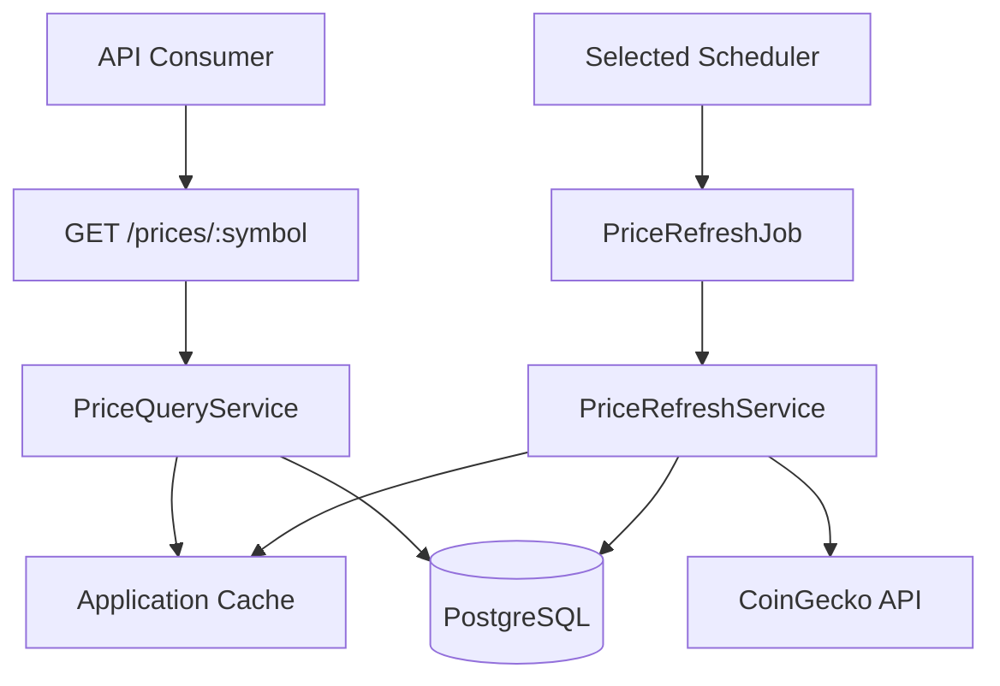
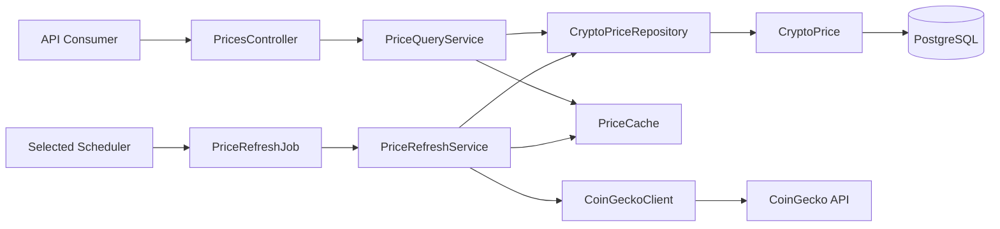
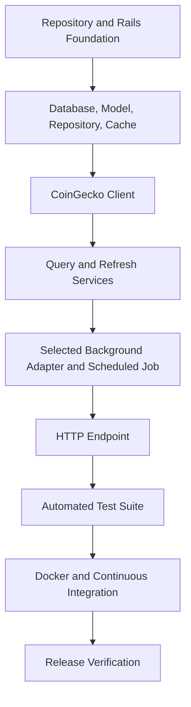
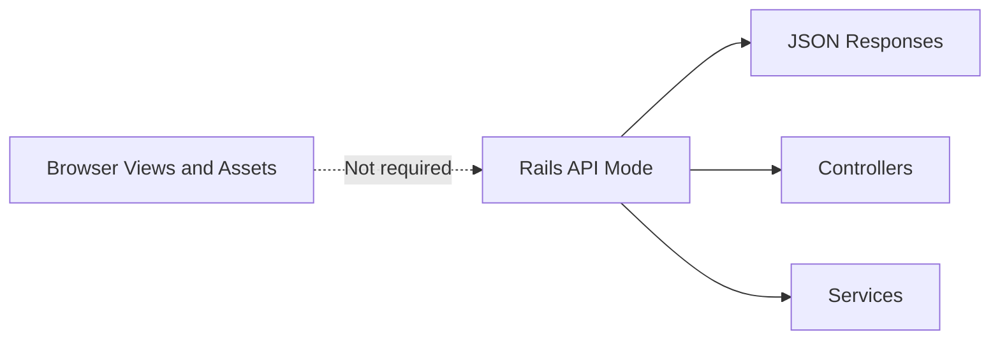
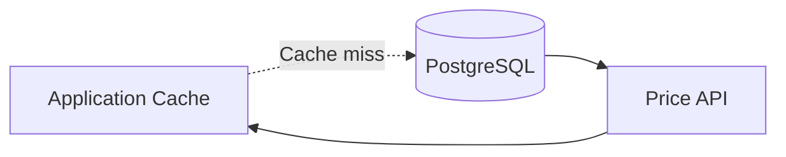
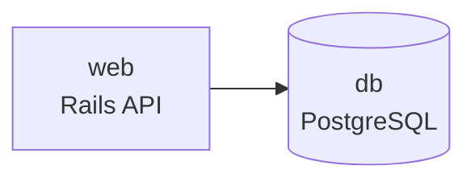

# JUNIOR_DEVELOPER_GUIDE.md

> **Document Purpose**
>
> This guide describes the target reconstruction path for the Cryptocurrency Price API from an empty directory while explaining the engineering decisions behind each implementation step.
>
> Follow the sections in order during implementation. Do not skip verification steps. Each chapter is intended to build on the previous chapter and leave the repository in a working state after the required files exist.
>
> This guide explains **how to build the project**. The authoritative requirements remain in `PROJECT_SPECIFICATIONS.md`.

---

# Table of Contents

1. How to Use This Guide
2. What You Will Build
3. Learning Objectives
4. Prerequisites
5. Target and Proposed Technology Choices
6. Project Architecture at a Glance
7. Build Sequence
8. Create the Repository
9. Generate the Rails API
10. Configure PostgreSQL
11. Add Development Tooling
12. Configure Docker and Local Services
13. Configure RSpec and Quality Gates
14. Create the Data Model
15. Implement the Persistence and Cache Boundaries
16. Implement the CoinGecko Provider Client
17. Implement Application Services
18. Configure Background Processing
19. Implement the HTTP API
20. Add Automated Tests
21. Configure Continuous Integration
22. Verify Failure Recovery
23. Complete Documentation and Release Checks
24. Troubleshooting Guide
25. Final Recreation Checklist

---

# 1. How to Use This Guide

This guide is written for a developer who starts with:

- An empty local directory.
- A GitHub account or another Git hosting service.
- A working development machine.
- Basic familiarity with the terminal.
- Basic familiarity with Ruby and Rails concepts.

Each chapter follows the same structure:

1. **Goal** — what the chapter accomplishes.
2. **Why this exists** — why the implementation decision matters.
3. **Commands and files** — the work to perform.
4. **Verification** — how to prove the step worked.
5. **Common mistakes** — mistakes to avoid before continuing.

Do not mark a chapter as complete merely because files exist. A chapter is complete only when its verification command succeeds.

---

# 2. What You Will Build

The target implementation will build a Rails API that returns the latest known cryptocurrency price for a configured symbol. The current repository is documentation-only and does not yet contain the files or commands this guide will create.

The application will:

- Expose `GET /prices/:symbol`.
- Read prices from cache first.
- Fall back to PostgreSQL when cache data is unavailable.
- Refresh configured prices every minute in a background process.
- Fetch fresh data from CoinGecko.
- Persist valid provider results.
- Update cache only after persistence succeeds.
- Continue serving the last known price if CoinGecko fails.
- Include automated tests for caching, jobs, fallback behaviour, provider failures, and HTTP responses.
- Run locally with Docker.
- Run quality checks through GitHub Actions.

---

## Final Behaviour



The important design rule is:

> Public API requests return known values. Background processing obtains new values.

This keeps a temporary CoinGecko outage from making the public endpoint unavailable.

---

# 3. Learning Objectives

By completing this guide, you should understand:

- How to create an API-only Rails application.
- Why a controller should remain thin.
- Why services coordinate application behaviour.
- Why repositories isolate database queries.
- Why a dedicated provider client isolates third-party HTTP concerns.
- Why cache and durable storage solve different problems.
- Why background jobs should delegate rather than contain business logic.
- How graceful degradation improves reliability.
- How RSpec tests map to system responsibilities.
- How Docker and CI make a project reproducible.

---

# 4. Prerequisites

## Required Tools

Install the following before starting.

| Tool                            | Purpose                                           |
| ------------------------------- | ------------------------------------------------- |
| Git                             | Source control.                                   |
| Ruby                            | Application runtime.                              |
| Bundler                         | Ruby dependency management.                       |
| PostgreSQL                      | Durable application database.                     |
| Docker Desktop or Docker Engine | Reproducible local environment (implemented).     |
| Docker Compose                  | Runs application services together (implemented). |
| A Git hosting account           | Remote repository and CI.                         |
| curl                            | Local API verification.                           |

---

## Verify Installed Tools

Run the following commands:

```bash
git --version
ruby --version
bundle --version
docker --version
docker compose version
curl --version
```

Expected result:

- Each command returns a version.
- No command returns `command not found`.
- Docker is running before you continue.

---

## Recommended Ruby Version

Use the Ruby version defined by the project’s `.ruby-version` file.

For this project, use Ruby `3.4.x` unless your team deliberately selects another supported version and records that decision in `ENGINEERING_JOURNAL.md`.

Create the version file:

```bash
printf "3.4.4\n" > .ruby-version
```

Verify:

```bash
ruby --version
cat .ruby-version
```

The major and minor Ruby versions should align.

---

## Required CoinGecko Credential

The provider credential must be treated as a secret.

Create a local `.env` file later in the guide. Do not paste the real key into:

- Git commits.
- Source code.
- Documentation examples.
- Screenshots.
- Chat logs intended for public sharing.
- CI configuration files without secure-secret storage.

---

# 5. Target and Proposed Technology Choices

This guide uses accepted target choices where decisions are approved and marks unresolved implementation choices as proposed or deferred.

| Concern                    | Selected Technology              | Why                                                                                    |
| -------------------------- | -------------------------------- | -------------------------------------------------------------------------------------- |
| Web framework              | Rails API mode                   | Rails provides routing, ActiveRecord, ActiveJob, configuration, and conventions.       |
| Durable storage            | PostgreSQL                       | Reliable relational storage and a realistic production database.                       |
| Background execution       | Solid Queue 1.4+                 | Database-backed Active Job backend; default in Rails 8. No Redis required.             |
| Scheduling                 | Solid Queue recurring tasks      | Built-in recurring scheduling via `config/recurring.yml`. No separate scheduler gem.   |
| Background queue and cache | Solid Queue for queue; Memory Store for cache | PostgreSQL-backed queue; Rails Memory Store for cache with PostgreSQL fallback. |
| HTTP client                | Faraday                          | Explicit timeout configuration and testable provider communication.                    |
| Test framework             | RSpec                            | Standard Ruby behaviour-driven testing.                                                |
| Test fixtures              | FactoryBot                       | Clear, repeatable model creation.                                                      |
| Coverage                   | SimpleCov                        | Enforces test-coverage visibility.                                                     |
| Linting                    | RuboCop                          | Ruby code-quality checks.                                                              |
| Security scanning          | Brakeman                         | Rails-focused static security analysis.                                                |
| Containers                 | Docker Compose                   | Web and jobs services with PostgreSQL. No Redis required.                              |
| CI                         | GitHub Actions                   | Automated checks on remote pushes and pull requests.                                   |

The background infrastructure decisions have been validated in Issue #5. See ADR-017 and ADR-018 in `ENGINEERING_JOURNAL.md` for full rationale.

---

# 6. Project Architecture at a Glance

The project uses a layered architecture.



---

## Responsibilities

| Component               | Responsibility                                                                 |
| ----------------------- | ------------------------------------------------------------------------------ |
| `PricesController`      | Accepts HTTP requests and renders HTTP responses.                              |
| `PriceQueryService`     | Finds cache or persisted prices for API reads.                                 |
| `PriceRefreshService`   | Fetches, validates, persists, and caches new prices.                           |
| `CryptoPriceRepository` | Encapsulates ActiveRecord queries and upserts.                                 |
| `PriceCache`            | Encapsulates cache keys and cache reads/writes for the accepted cache backend. |
| `CoinGeckoClient`       | Encapsulates external HTTP requests and provider response parsing.             |
| `CryptoPrice`           | Represents durable price data.                                                 |
| `PriceRefreshJob`       | Delegates refresh work to the refresh service.                                 |
| Selected Scheduler      | Enqueues refresh jobs every minute after the scheduler decision is accepted.   |

A simple rule helps prevent architecture drift:

> Every production class must exist because it has a clearly defined responsibility documented in `PROJECT_SPECIFICATIONS.md`, and every production class must have a corresponding test and documentation reference before it is introduced.

---

# 7. Build Sequence

Build the project in the following order.



Do not begin a later stage before the previous stage has been verified.

---

# 8. Create the Repository

## Goal

Create an empty Git repository with a predictable directory structure and secret-safe ignore rules.

---

## Why This Exists

Version control is not just backup storage.

A clean repository:

- Documents development history.
- Allows safe rollback.
- Supports code review.
- Enables CI.
- Prevents secrets and generated artifacts from being committed.

---

## Create the Project Directory

```bash
mkdir crypto-price-api
cd crypto-price-api
git init
git branch -M main
```

Verify:

```bash
git status
git branch --show-current
```

Expected result:

```text
main
```

---

## Create Initial Directory Structure

```bash
mkdir -p docs development docker .github/workflows
```

Create the project documentation files:

```bash
touch README.md
touch docs/PROJECT_SPECIFICATIONS.md
touch docs/ARCHITECTURE.md
touch docs/DATABASE.md
touch docs/API.md
touch docs/BACKGROUND_JOBS.md
touch docs/TESTING.md
touch docs/JUNIOR_DEVELOPER_GUIDE.md
touch docs/ENGINEERING_JOURNAL.md
touch development/IMPLEMENTATION_ROADMAP.md
touch development/IMPLEMENTATION_WORK_BREAKDOWN.md
touch development/ENGINEERING_PRINCIPLES.md
touch development/FEATURE_CHECKLIST.md
touch development/RELEASE_CHECKLIST.md
```

At this stage, copy the completed governance and documentation files into their intended locations.

---

## Create `.gitignore`

Create `.gitignore`:

```gitignore
/.bundle
/.env
/.env.*
!/\.env.example
/log/*
!/log/.keep
/tmp/*
!/tmp/.keep
/storage/*
!/storage/.keep
/coverage
/vendor/bundle
/public/packs
/public/assets
.byebug_history
.DS_Store
/config/master.key
```

Why these rules matter:

| Ignore Rule         | Reason                                         |
| ------------------- | ---------------------------------------------- |
| `.env`              | Prevents secrets from entering source control. |
| `config/master.key` | Protects Rails encrypted credentials.          |
| `coverage`          | Generated test-report output.                  |
| `log` and `tmp`     | Runtime artifacts.                             |
| `vendor/bundle`     | Local dependency installation.                 |
| `.DS_Store`         | macOS filesystem metadata.                     |

---

## Create `.dockerignore`

Create `.dockerignore`:

```dockerignore
.git
.github
.bundle
.env
.env.*
coverage
log
tmp
storage
vendor
node_modules
README.md
docs
development
```

The Docker ignore file reduces unnecessary build context size and avoids copying secrets into images.

Do not exclude application code, `Gemfile`, `Gemfile.lock`, or required configuration files.

---

## Create `.env.example`

Create `.env.example`:

```dotenv
RAILS_ENV=development
RAILS_MAX_THREADS=5
RAILS_LOG_LEVEL=debug
DATABASE_NAME=crypto_price_api_development
TEST_DATABASE_NAME=crypto_price_api_test
# DATABASE_HOST=localhost
# DATABASE_PORT=5432
# DATABASE_USERNAME=replace_with_local_postgresql_user
# DATABASE_PASSWORD=replace_with_local_postgresql_password
COINGECKO_API_KEY=replace_with_your_coingecko_api_key
```

Create your local secret file:

```bash
cp .env.example .env
```

Then update only your local `.env` with the actual CoinGecko credential.

Verify the secret file is ignored:

```bash
git status --ignored
```

You should see `.env` listed as ignored, not as an untracked file.

---

## First Documentation Commit

Before generating Rails, commit the project governance artifacts.

```bash
git add README.md docs development .gitignore .dockerignore .env.example .ruby-version
git commit -m "chore: establish engineering documentation foundation"
```

Verify:

```bash
git log --oneline --max-count=1
git status
```

Expected result:

- The latest commit message is visible.
- `git status` reports a clean working tree.

---

## Common Mistakes

- Committing `.env`.
- Committing a real API key into `README.md` or a shell-history screenshot.
- Creating files outside the repository root.
- Forgetting to create a `main` branch.
- Starting application code before committing the documentation foundation.

---

# 9. Generate the Rails API

## Goal

Create an API-only Rails application that uses PostgreSQL.

---

## Why API Mode?

Rails API mode removes browser-oriented middleware and generated view layers that this project does not need.

This project exposes JSON endpoints only.



---

## Generate the Application

Run this command from the repository root:

```bash
rails new . \
  --api \
  --database=postgresql \
  --skip-test \
  --skip-jbuilder \
  --skip-system-test \
  --skip-action-mailbox \
  --skip-action-text \
  --skip-active-storage
```

### What Each Option Means

| Option                  | Meaning                                                         |
| ----------------------- | --------------------------------------------------------------- |
| `.`                     | Generate Rails into the current repository directory.           |
| `--api`                 | Create an API-only Rails application.                           |
| `--database=postgresql` | Configure PostgreSQL instead of SQLite.                         |
| `--skip-test`           | Skip Rails’ default Minitest because this project uses RSpec.   |
| `--skip-jbuilder`       | Avoid Jbuilder because response serialization will be explicit. |
| `--skip-system-test`    | Skip browser test setup; this is an API-only project.           |
| `--skip-action-mailbox` | Exclude email-receiving feature not required here.              |
| `--skip-action-text`    | Exclude rich-text feature not required here.                    |
| `--skip-active-storage` | Exclude file-upload storage not required here.                  |

Do not use `--minimal` because it can remove useful Rails defaults and create additional configuration work.

---

## Verify Rails Generation

Run:

```bash
bin/rails --version
bin/rails routes
```

Expected result:

- Rails prints a version.
- Routes command executes successfully, even if only default routes exist initially.

Check the generated application structure:

```bash
find app config db -maxdepth 2 -type d | sort
```

Expected directories include:

```text
app
app/controllers
app/models
config
config/environments
db
db/migrate
```

---

## Restore Documentation Files if Needed

Rails generation may create or replace project files.

Verify the documentation remains present:

```bash
find docs development -maxdepth 1 -type f | sort
```

If any document was replaced, restore it from your previous commit:

```bash
git checkout HEAD -- docs development README.md
```

---

## Commit Rails Foundation

```bash
git add .
git commit -m "chore: generate Rails API foundation"
```

Verify:

```bash
git status
git log --oneline --max-count=2
```

---

# 10. Configure PostgreSQL

## Goal

Configure Rails to use PostgreSQL in development, test, and production-like container environments.

---

## Why PostgreSQL?

PostgreSQL is selected because it is a production-grade relational database with strong constraints, decimal support, indexing, and predictable SQL behaviour.

The application needs durable storage because cached values alone cannot guarantee recovery after expiration or cache loss.



---

## Configure `config/database.yml`

Replace the generated local development configuration with environment-driven settings.

Use this target shape:

```yaml
default: &default
  adapter: postgresql
  encoding: unicode
  pool: <%= ENV.fetch("RAILS_MAX_THREADS", 5) %>
  host: <%= ENV["DATABASE_HOST"] %>
  port: <%= ENV["DATABASE_PORT"] %>
  username: <%= ENV["DATABASE_USERNAME"] %>
  password: <%= ENV["DATABASE_PASSWORD"] %>

development:
  <<: *default
  database: <%= ENV.fetch("DATABASE_NAME", "crypto_price_api_development") %>
  url: <%= ENV["DATABASE_URL"] %>

test:
  <<: *default
  database: <%= ENV.fetch("TEST_DATABASE_NAME", "crypto_price_api_test") %>
  url: <%= ENV["TEST_DATABASE_URL"] %>

production:
  <<: *default
  url: <%= ENV["DATABASE_URL"] %>
```

## Why Environment-Driven Configuration?

Environment-driven configuration lets the same source code run:

- On a local host machine.
- In Docker.
- In continuous integration.
- In a deployed environment.

The database URL changes by environment, but the application code does not.

---

## Prepare Local PostgreSQL Without Docker

Only perform this section if you are running PostgreSQL directly on your machine.

Create the databases:

```bash
bin/rails db:create
bin/rails db:prepare
```

Verify:

```bash
bin/rails db:version
```

---

## Verify Database Configuration Later Through Docker

The primary local workflow in this project uses Docker Compose.

After Docker is configured, verify database connectivity with:

```bash
docker compose exec web bin/rails db:prepare
docker compose exec web bin/rails db:version
```

Do not continue to database-model work until one of these verification paths works.

---

## Commit Database Configuration

```bash
git add config/database.yml
git commit -m "chore: configure PostgreSQL environments"
```

---

# 11. Add Development Tooling

## Goal

Add the libraries required for HTTP communication, jobs, scheduling, caching, testing, coverage, linting, and security scanning.

---

## Update `Gemfile`

Add the following dependencies to the `Gemfile`.

```ruby
gem "faraday"
# Docker Compose may conflict with host services on standard ports.
# The docker-compose.yml uses port 5433 (PostgreSQL) and 3001 (Rails)
# to avoid collisions when those services run on the host.
# Inside the Docker network, services communicate on the default ports (5432, 3000).
gem "dotenv-rails", groups: [:development, :test]

group :development, :test do
  gem "rspec-rails"
  gem "factory_bot_rails"
  gem "faker"
  gem "simplecov", require: false
  gem "rubocop", require: false
  gem "rubocop-rails", require: false
  gem "brakeman", require: false
end
```

Then install dependencies:

```bash
bundle install
```

---

## Why Each Dependency Exists

| Gem                               | Responsibility                                                           |
| --------------------------------- | ------------------------------------------------------------------------ |
| `faraday`                         | Makes configurable and testable HTTP calls to CoinGecko.                 |
| Accepted cache/queue backend gems | Added only after the cache, queue, and scheduler decisions are accepted. |
| `dotenv-rails`                    | Loads local `.env` values in development and test only.                  |
| `rspec-rails`                     | Provides RSpec integration with Rails.                                   |
| `factory_bot_rails`               | Creates test records predictably.                                        |
| `faker`                           | Optional realistic non-production test values.                           |
| `simplecov`                       | Produces coverage reports.                                               |
| `rubocop`                         | Checks Ruby style and quality.                                           |
| `rubocop-rails`                   | Adds Rails-aware RuboCop checks.                                         |
| `brakeman`                        | Scans Rails code for security concerns.                                  |

Do not add gems “just in case.” Every dependency increases maintenance and security responsibility.

---

## Verify Installed Dependencies

```bash
bundle exec ruby -e "require 'faraday'; puts Faraday::VERSION"
bundle exec brakeman --version
bundle exec rubocop --version
```

Expected result:

- Each command prints a version.
- No command reports a missing gem.

---

## Commit Tooling

```bash
git add Gemfile Gemfile.lock
git commit -m "chore: add application and quality dependencies"
```

---

# 12. Configure Docker and Local Services

## Goal

Run the web API and PostgreSQL through Docker Compose. Worker, scheduler, cache, and queue services remain deferred until their implementation phase.

---

## Why Docker Compose?

The application has multiple processes:

- Rails web server.
- PostgreSQL.

Docker Compose makes these dependencies explicit and reproducible.



Worker, scheduler, and cache or queue backend services will be added during their respective implementation phases.

---

## Create `Dockerfile`

Create `Dockerfile`:

```dockerfile
FROM ruby:3.4.4-slim-bookworm

RUN apt-get update -qq \
  && apt-get install --no-install-recommends -y \
    build-essential \
    libpq-dev \
    curl \
  && rm -rf /var/lib/apt/lists/*

WORKDIR /app

COPY Gemfile Gemfile.lock ./
RUN bundle install --jobs 4 --retry 3

COPY . .

EXPOSE 3000

CMD ["bundle", "exec", "puma", "-C", "config/puma.rb"]
```

### Why This Dockerfile Keeps the Build Simple

The Dockerfile uses a single-stage build with `ruby:3.4-slim-bookworm`. Build tools are installed and cleaned up in the same layer to keep the image lean. The `Gemfile.lock` is copied before the full application code to leverage Docker layer caching — dependency installation is only re-run when the lock file changes.

---

## Create `docker-compose.yml`

Create `docker-compose.yml`:

```yaml
services:
  db:
    image: postgres:17-bookworm
    environment:
      POSTGRES_USER: postgres
      POSTGRES_PASSWORD: postgres
      POSTGRES_DB: crypto_price_api_development
    ports:
      - "5432:5432"
    volumes:
      - postgres_data:/var/lib/postgresql/data
    healthcheck:
      test: ["CMD-SHELL", "pg_isready -U postgres"]
      interval: 5s
      timeout: 5s
      retries: 5

  web:
    build: .
    command: >
      sh -c "bundle exec rails db:prepare && bundle exec puma -C config/puma.rb"
    ports:
      - "3000:3000"
    environment:
      RAILS_ENV: development
      DATABASE_URL: postgresql://postgres:postgres@db:5432/crypto_price_api_development
      TEST_DATABASE_URL: postgresql://postgres:postgres@db:5432/crypto_price_api_test
      RAILS_MAX_THREADS: 5
      RAILS_LOG_LEVEL: debug
    depends_on:
      db:
        condition: service_healthy
    volumes:
      - .:/app

volumes:
  postgres_data:
```

### Why No Worker, Scheduler, or Cache Backend Services?

Redis, Sidekiq, Solid Queue, and any other supporting services are deferred until their implementation phase. The issue that introduces worker or scheduler infrastructure will add the relevant Docker service, configuration, and documentation at that time.

---

## Build and Start Services

```bash
docker compose build
docker compose up -d
```

Verify the containers:

```bash
docker compose ps
```

Expected result:

- `db` is healthy.
- `web` is running.

---

## Verify Rails Inside Docker

```bash
docker compose exec web bin/rails db:prepare
docker compose exec web bin/rails about
```

Verify the web process responds:

```bash
curl --include http://localhost:3000/up
```

The Rails health endpoint should return a successful response.

---

## Run Tests and Quality Checks

```bash
docker compose exec web bundle exec rspec
docker compose exec web bundle exec rubocop
docker compose exec web bundle exec brakeman
```

---

## Stop Services

```bash
docker compose down
```

To remove persistent local database data:

```bash
docker compose down -v
```

---

## Commit Docker Foundation

```bash
git add Dockerfile docker-compose.yml .dockerignore
git commit -m "chore: add Docker and CI foundation"
```

---

# 13. Configure RSpec and Quality Gates

## Goal

Replace default Rails testing with RSpec, configure coverage, configure linting, configure security scanning, and configure FactoryBot.

> **Foundation Note:** In the released repository, RSpec, SimpleCov, RuboCop, Brakeman, and FactoryBot are already configured by Issue #3. This chapter documents the commands for a fresh reconstruction from scratch.

---

## Install RSpec

Run:

```bash
docker compose run --rm web bin/rails generate rspec:install
```

Expected generated files:

```text
.rspec
spec/spec_helper.rb
spec/rails_helper.rb
```

---

## Configure SimpleCov

At the very top of `spec/spec_helper.rb`, before Rails or application code is loaded, add:

```ruby
require "simplecov"

SimpleCov.start "rails" do
  enable_coverage :branch
  minimum_coverage line: 95
  minimum_coverage_by_file 85
end
```

Why must this come first?

SimpleCov can only measure files loaded after coverage tracking begins.

---

## Configure FactoryBot

In `spec/rails_helper.rb`, inside `RSpec.configure`, add:

```ruby
config.include FactoryBot::Syntax::Methods
```

This allows tests to use:

```ruby
create(:crypto_price)
```

instead of:

```ruby
FactoryBot.create(:crypto_price)
```

Use the shorter form only when it remains clear.

---

## Create `.rubocop.yml`

Create `.rubocop.yml`:

```yaml
plugins:
  - rubocop-rails

AllCops:
  TargetRubyVersion: 3.4
  NewCops: enable
  Exclude:
    - "bin/**/*"
    - "db/schema.rb"
    - "vendor/**/*"

Layout/LineLength:
  Max: 100

Metrics/BlockLength:
  Exclude:
    - "spec/**/*"

Style/Documentation:
  Enabled: false
```

The project does not require comments on every class. It requires clear code and documentation where architecture or operations need explanation.

---

## Verify RSpec

Create a temporary smoke spec:

```bash
mkdir -p spec/smoke
```

Create `spec/smoke/application_spec.rb`:

```ruby
require "rails_helper"

RSpec.describe "application boot" do
  it "loads the Rails application" do
    expect(Rails.application).to be_present
  end
end
```

Run:

```bash
docker compose run --rm web bundle exec rspec
```

Expected result:

```text
1 example, 0 failures
```

Delete the smoke test later only if it no longer provides value. It is acceptable to retain a simple application-boot verification.

---

## Verify RuboCop

```bash
docker compose run --rm web bundle exec rubocop
```

Fix issues intentionally rather than applying automatic corrections without review.

---

## Verify Brakeman

```bash
docker compose run --rm web bundle exec brakeman
```

At this early stage, the scan should complete with no critical unresolved findings.

---

## Commit Testing Foundation

```bash
git add .rspec .rubocop.yml spec
git commit -m "chore: configure RSpec coverage and quality checks"
```

---

# 14. Create the Data Model

> Continue with the next part of this guide after completing and verifying Sections 1–13.
>
> The next section creates `CryptoPrice`, its migration, database constraints, FactoryBot factory, repository boundary, accepted cache abstraction, provider client, services, accepted scheduling approach, API endpoint, complete tests, CI workflow, and release validation.

---

# 16. Implement the CoinGecko Provider Client

## Goal

Create the isolated provider boundary used by later refresh services to retrieve current cryptocurrency prices from CoinGecko.

---

## Why This Exists

Provider communication is intentionally isolated from controllers, repositories, cache code, services, and background jobs. A dedicated client keeps authentication, request construction, response parsing, timeout handling, bounded retries, and provider error translation in one place.

The public request path must not call this client directly.

---

## Files

Create:

```text
app/clients/provider_error.rb
app/clients/coin_gecko_client.rb
spec/clients/coin_gecko_client_spec.rb
spec/fixtures/files/coingecko/simple_price_success.json
```

Update `Gemfile` to include Faraday:

```ruby
gem "faraday", "~> 2.0"
```

Then run:

```bash
bundle install
```

---

## Client Contract

The client exposes one public method:

```ruby
fetch_price(symbol:, currency: "usd")
```

It returns normalized application-level data:

```ruby
{
  symbol: "BTC",
  price: BigDecimal("109283.12"),
  currency: "USD",
  provider: "coingecko",
  fetched_at: Time.current
}
```

The initial supported mapping is:

| Symbol | CoinGecko ID |
| ------ | ------------ |
| `btc`  | `bitcoin`    |
| `eth`  | `ethereum`   |

---

## Configuration and Safety Rules

- Read the provider credential from `COINGECKO_API_KEY`.
- Do not hardcode API keys.
- Do not log API keys.
- Do not expose API keys in raised exception messages.
- Use configured request and open timeouts.
- Keep retry behaviour bounded.
- Translate provider and HTTP-client failures into `ProviderError` exceptions.

---

## Verification

Run:

```bash
RAILS_ENV=test bundle exec rspec spec/clients/coin_gecko_client_spec.rb
RAILS_ENV=test bundle exec rspec
bundle exec rubocop
bundle exec brakeman
```

Expected result:

- Provider specs pass without live HTTP calls.
- The full suite passes.
- RuboCop reports no offenses.
- Brakeman reports no warnings.

---

## Common Mistakes

- Calling CoinGecko from a controller or request spec.
- Persisting prices from the provider client.
- Updating cache from the provider client.
- Requiring a real API key in automated tests.
- Allowing raw Faraday or JSON parser exceptions to escape the provider boundary.

---

# 17. Implement Application Services

## Goal

Create the service layer that orchestrates caching, persistence, and provider interactions.

---

## Why This Exists

Services coordinate application behaviour while keeping controllers, background jobs, repositories, and provider clients focused on their own responsibilities.

The query service owns the read path — cache-first reads with database fallback. The refresh service owns the write path — provider fetches, persistence, and cache updates.

---

## Files

Create:

```text
app/services/price_query_service.rb
app/services/price_refresh_service.rb
spec/services/price_query_service_spec.rb
spec/services/price_refresh_service_spec.rb
```

---

## PriceQueryService Contract

```ruby
service = PriceQueryService.new(repository: CryptoPriceRepository.new, cache: PriceCache.new)
result = service.query(symbol: "BTC", currency: "USD", provider: "coingecko")

result.found?      # true when a price exists
result.not_found?  # true when no price has ever been stored
result.price_record # cached payload (Hash) or persisted CryptoPrice record
```

Read order:

1. Check cache.
2. If cache miss, query repository.
3. If repository returns a record, repopulate cache.
4. Return the value, or a not-found result if nothing exists.

---

## PriceRefreshService Contract

```ruby
service = PriceRefreshService.new(
  provider_client: CoinGeckoClient.new,
  repository: CryptoPriceRepository.new,
  cache: PriceCache.new
)
result = service.refresh(symbol: "BTC", currency: "USD")

result.success?       # true when provider data was persisted and cache updated
result.failure?       # true when provider or persistence failed
result.price_record   # the persisted CryptoPrice record on success
result.error          # the controlled exception on failure
```

Refresh order:

1. Fetch price from provider client.
2. Persist valid data through repository.
3. Update cache only after persistence succeeds.
4. Return the persisted record or a controlled failure.

---

## Verification

```bash
bundle exec rspec spec/services/price_query_service_spec.rb
bundle exec rspec spec/services/price_refresh_service_spec.rb
bundle exec rspec
bundle exec rubocop
bundle exec brakeman
```

Expected result:

- All service specs pass: cache hit, cache miss, cache repopulation, no persisted value, cache failure, provider failure, persistence failure, persist-before-cache ordering.
- The full suite passes.
- RuboCop reports no offenses.
- Brakeman reports no warnings.

---

## Common Mistakes

- Calling CoinGecko from the query service.
- Updating cache before persistence succeeds in the refresh service.
- Letting raw ActiveRecord exceptions escape the repository boundary.
- Adding HTTP status codes, controller logic, or scheduler configuration to service code.
- Creating service objects that duplicate repository, cache, or provider behaviour instead of delegating.
