# TESTING.md

> **Document Purpose**
>
> This document defines the testing strategy for the Cryptocurrency Price API.
>
> It explains the testing philosophy, test boundaries, RSpec structure, test data strategy, mocking rules, coverage expectations, quality gates, required scenarios, and local verification commands.
>
> This document does not define the application architecture, database schema, public HTTP contract, or scheduler implementation. Those responsibilities belong to `ARCHITECTURE.md`, `DATABASE.md`, `API.md`, and `BACKGROUND_JOBS.md`.

---

# Table of Contents

1. Testing Goals
2. Testing Philosophy
3. Quality Model
4. Test Architecture
5. Test Types and Ownership
6. RSpec Structure
7. Test Data Strategy
8. Mocking and Stubbing Principles
9. Required Test Scenarios
10. Request Contract Testing
11. Fallback and Resilience Testing
12. Background Job Testing
13. Integration Testing
14. Coverage Strategy
15. Test Quality Standards
16. Local Test Execution
17. Continuous Integration
18. Debugging Failed Tests
19. Test Maintenance Requirements
20. Future Considerations
21. Related Documentation

---

# 1. Testing Goals

Testing exists to provide confidence that the Cryptocurrency Price API behaves correctly under normal, invalid, and failure conditions.

The test suite must verify that the application:

- Returns cached prices correctly.
- Falls back to persisted prices when the cache is empty.
- Refreshes prices through the background workflow.
- Stores valid provider responses.
- Updates the cache only after successful persistence.
- Continues serving the last known price when CoinGecko fails.
- Returns predictable JSON errors.
- Preserves architectural boundaries.
- Remains maintainable as the project evolves.

The target is not merely high code coverage.

The target is meaningful behavioural confidence.

---

# 2. Testing Philosophy

The project follows a behaviour-first testing approach.

Tests should verify observable outcomes rather than internal implementation details.

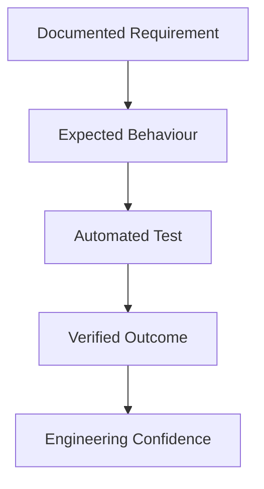

Every meaningful requirement should map to one or more tests.

Every significant defect discovered during implementation should result in a regression test before the defect is considered resolved.

---

## Core Principles

### Test Behaviour, Not Private Implementation

Tests should answer:

- What should happen?
- What should not happen?
- How should the application behave when dependencies fail?
- What value should the consumer receive?

Tests should avoid asserting private method calls or implementation details unless those details define an important external boundary.

---

### Keep Tests Deterministic

Tests must not depend on:

- Live CoinGecko responses.
- Real elapsed one-minute scheduler intervals.
- Real external network access.
- Shared development database state.
- Test execution order.
- Current market prices.
- System clock values unless time is controlled explicitly.

---

### Make Failure Cases First-Class

The core reliability requirement is graceful degradation.

Provider timeouts, malformed responses, cache misses, persistence failures, and missing data must receive the same testing discipline as successful requests.

---

### Keep Tests Readable

A test should describe the scenario in a way another developer can understand quickly.

Preferred style:

```ruby id="9pjvsn"
context "when the provider is unavailable" do
  it "preserves the last known stored price" do
    # ...
  end
end
```

Avoid vague examples such as:

```ruby id="rqwmqw"
it "works" do
  # ...
end
```

---

# 3. Quality Model

The test strategy validates several quality dimensions.

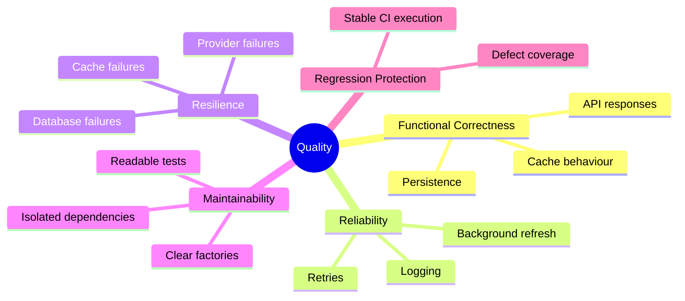

## Quality Dimensions

| Dimension              | Testing Objective                                                                             |
| ---------------------- | --------------------------------------------------------------------------------------------- |
| Functional correctness | Verify that valid inputs produce correct prices, records, cache entries, and API responses.   |
| Reliability            | Verify expected job execution, persistence ordering, cache updates, and retry handling.       |
| Resilience             | Verify provider failures do not remove or hide previously known valid prices.                 |
| Maintainability        | Keep tests readable, isolated, deterministic, and aligned with architecture.                  |
| Regression protection  | Preserve fixed behaviour through focused automated tests.                                     |
| Documentation accuracy | Verify that documented commands, routes, payloads, and expected flows reflect implementation. |

---

# 4. Test Architecture

The test suite is organized by the application boundaries defined in `ARCHITECTURE.md`.

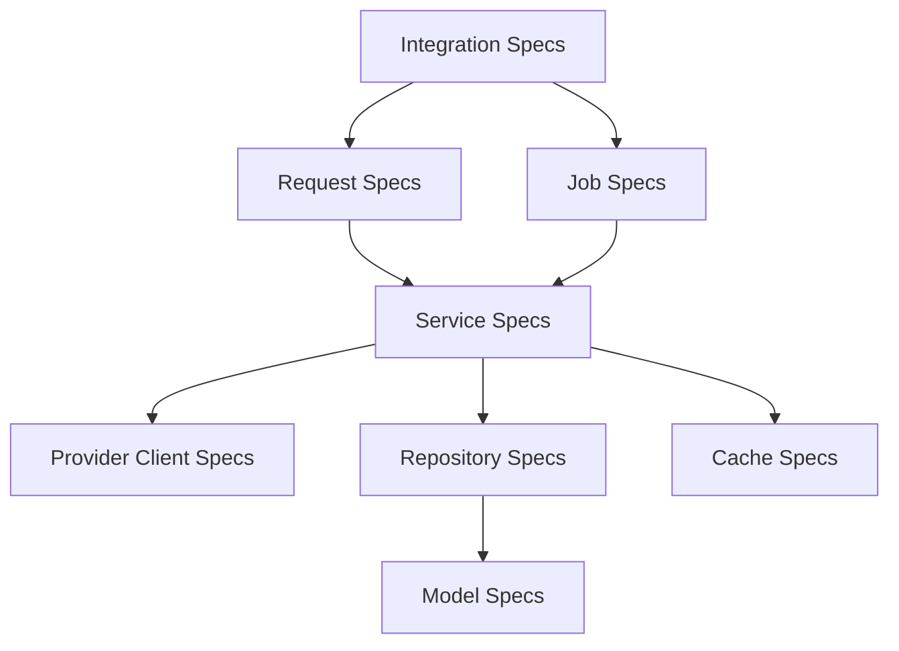

## Test Boundary Rule

Each test type should verify the responsibility owned by its corresponding layer.

| Layer              | Primary Test Boundary                                                        |
| ------------------ | ---------------------------------------------------------------------------- |
| Model              | Validations, normalization, persistence constraints.                         |
| Repository         | Lookup, upsert, persistence error behaviour.                                 |
| Cache abstraction  | Read, write, expiry-related behaviour, safe failure handling.                |
| Provider client    | Request construction, response parsing, timeout handling, error translation. |
| Query service      | Cache-first reads, database fallback, not-found behaviour.                   |
| Refresh service    | Provider-to-database-to-cache refresh flow and graceful degradation.         |
| Background job     | Delegation, arguments, retry configuration, lifecycle behaviour.             |
| Controller / route | HTTP request validation, response schema, status mapping, JSON errors.       |
| Integration flow   | Cross-layer behaviour for important end-to-end scenarios.                    |

---

# 5. Test Types and Ownership

## Model Specifications

Model specifications verify data integrity at the ActiveRecord boundary.

Required coverage:

- Required field validations.
- Positive decimal price validation.
- Symbol normalization behaviour.
- Currency and provider presence.
- `fetched_at` presence.
- Database-backed uniqueness behaviour where appropriate.

Target location:

```text id="ag4sm0"
spec/models/crypto_price_spec.rb
```

---

## Repository Specifications

Repository specifications verify persistence behaviour without leaking query details into services.

Required coverage:

- Find latest price by symbol, currency, and provider.
- Return `nil` when no record exists.
- Create a new current price.
- Update an existing current price.
- Preserve uniqueness constraints.
- Return persisted records.
- Surface controlled persistence failures where applicable.

Target location:

```text id="mkwrge"
spec/repositories/crypto_price_repository_spec.rb
```

---

## Cache Specifications

Cache specifications verify the cache abstraction independently of service orchestration.

Required coverage:

- Write a price entry.
- Read a stored price entry.
- Return an expected value on cache miss.
- Use stable cache-key construction.
- Handle expiry behaviour through controlled time or configuration.
- Handle cache errors according to the selected implementation strategy.

Target location:

```text id="4r87ye"
spec/cache/price_cache_spec.rb
```

---

## Provider Client Specifications

Provider-client specifications verify the boundary to CoinGecko.

Required coverage:

- Successful valid response parsing.
- Symbol-to-provider identifier mapping.
- Authentication configuration.
- Connection timeout handling.
- Read timeout handling.
- Invalid JSON handling.
- Unexpected response-schema handling.
- Missing required fields.
- Invalid price values.
- Retryable versus non-retryable error translation where applicable.
- Sensitive information exclusion from errors and logs.

Target location:

```text id="u1o06y"
spec/clients/coin_gecko_client_spec.rb
```

Tests must use mocked HTTP responses. They must never depend on live CoinGecko calls.

---

## Service Specifications

Service specifications verify application behaviour.

### Query Service

Required coverage:

- Cache hit returns the cached price.
- Cache miss with stored record returns persisted price.
- Cache miss with stored record repopulates cache.
- Cache miss with no stored record raises or returns the documented not-found result.
- Cache failure uses persistence fallback where the selected strategy supports it.
- Symbol normalization occurs consistently before lookup.

Target location:

```text id="gcj3oa"
spec/services/price_query_service_spec.rb
```

### Refresh Service

Required coverage:

- Valid provider response persists price.
- Successful persistence updates cache.
- Cache is updated from persisted data.
- Provider timeout preserves old database and cache values.
- Malformed provider response is not persisted.
- Persistence failure does not write unpersisted provider data to cache.
- Cache failure does not invalidate a successfully persisted value.
- Successful refresh reports predictable success information.
- Controlled provider failure reports predictable failure information.

Target location:

```text id="k6vv7r"
spec/services/price_refresh_service_spec.rb
```

---

## Job Specifications

Job specifications verify the background-job boundary.

Required coverage:

- Job delegates to `PriceRefreshService`.
- Job passes expected symbol and currency values.
- Job is enqueueable using the configured adapter.
- Retry configuration is present where supported by the selected adapter.
- Job behaviour remains thin and does not duplicate refresh logic.
- Controlled service failures are handled according to the job contract.

Target location:

```text id="6jqzst"
spec/jobs/price_refresh_job_spec.rb
```

---

## Request Specifications

Request specifications verify the public API contract.

Required coverage:

- `GET /prices/:symbol` returns `200 OK` with a valid cached price.
- `GET /prices/:symbol` returns persisted data after a cache miss.
- Symbol is normalized.
- Invalid symbol returns `400 Bad Request`.
- Unsupported symbol returns `422 Unprocessable Content`.
- Supported symbol without stored data returns `404 Not Found`.
- Response JSON contains expected fields and types.
- Timestamp format is ISO 8601.
- Error responses follow the documented envelope.
- Provider failure does not cause a public `500` when a prior stored price exists.
- Unexpected internal failures return a safe error response without implementation details.

Target location:

```text id="h0p03q"
spec/requests/prices_spec.rb
```

---

## Integration Specifications

Integration specifications verify important cross-layer flows.

Required coverage:

- Refresh job causes valid provider data to become available through the API.
- Cache miss can be recovered from persisted data.
- Provider failure after a successful refresh preserves API availability.
- Duplicate refresh execution does not create duplicate current records.
- A successful refresh updates both PostgreSQL and cache in the expected order.

Target location:

```text id="uukcfc"
spec/integration/
```

Integration tests should remain focused. They are not a replacement for unit, service, job, or request specifications.

---

# 6. RSpec Structure

The target test directory structure is:

```text id="cv99mo"
spec/
├── cache/
│   └── price_cache_spec.rb
├── clients/
│   └── coin_gecko_client_spec.rb
├── factories/
│   └── crypto_prices.rb
├── integration/
│   ├── price_refresh_to_api_spec.rb
│   └── provider_failure_fallback_spec.rb
├── jobs/
│   └── price_refresh_job_spec.rb
├── models/
│   └── crypto_price_spec.rb
├── repositories/
│   └── crypto_price_repository_spec.rb
├── requests/
│   └── prices_spec.rb
├── services/
│   ├── price_query_service_spec.rb
│   └── price_refresh_service_spec.rb
├── support/
│   ├── shared_contexts/
│   ├── shared_examples/
│   └── helpers/
└── rails_helper.rb
```

## Shared Support Code

Shared test helpers should be introduced only when repetition is meaningful and stable.

Appropriate uses:

- Shared provider-response fixtures.
- Shared examples for provider failure translation.
- Time-control helpers.
- JSON response parsing helpers.
- Common authentication or headers if introduced later.

Inappropriate uses:

- Abstracting one-line test setup.
- Hiding scenario meaning.
- Creating large helper modules that obscure behaviour.
- Replacing readable test intent with generic DSLs.

---

# 7. Test Data Strategy

## FactoryBot

FactoryBot is the preferred mechanism for constructing persisted test records.

The target factory should create valid data by default.

Example intended shape:

```ruby id="j0c1v6"
FactoryBot.define do
  factory :crypto_price do
    symbol { "btc" }
    price { BigDecimal("109283.12") }
    currency { "usd" }
    provider { "coingecko" }
    fetched_at { Time.current }
  end
end
```

The exact factory implementation may differ, but it must produce valid records without unnecessary setup.

---

## Factory Principles

Factories should:

- Produce valid records by default.
- Use realistic but clearly test-only values.
- Avoid random data unless randomness is necessary to the scenario.
- Allow explicit overrides.
- Avoid creating unrelated records automatically.
- Be linted as part of test setup verification.

Factories should not:

- Hide expensive database creation.
- Create external HTTP dependencies.
- Depend on current market prices.
- Depend on the wall clock when a deterministic time is better.

---

## Provider Response Fixtures

Provider responses should be represented through explicit fixture payloads or inline stubs.

Example valid provider payload:

```json id="w0nay8"
{
  "bitcoin": {
    "usd": 109283.12
  }
}
```

Example malformed provider payload:

```json id="64e3hr"
{
  "bitcoin": {
    "usd": null
  }
}
```

Fixtures should make the tested scenario obvious.

Avoid large copied provider payloads containing unrelated fields.

---

## Time Control

Time-sensitive tests must control time explicitly.

Relevant scenarios include:

- `fetched_at` assignment.
- Cache expiration.
- Timestamp serialization.
- Retry scheduling.
- Refresh ordering.

Acceptable strategies include Rails time helpers or a selected time-freezing library compatible with the final test stack.

Tests must not assert against the current wall clock without controlling it.

---

# 8. Mocking and Stubbing Principles

Mocks and stubs are useful at external boundaries.

They must not replace the behaviour under test.

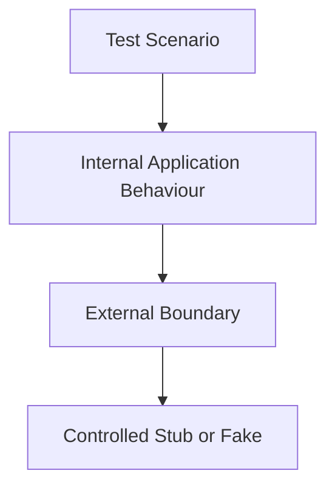

## Appropriate Stubbing Targets

| Boundary                  | Recommended Test Approach                                                          |
| ------------------------- | ---------------------------------------------------------------------------------- |
| CoinGecko HTTP calls      | Stub HTTP responses or use a controlled HTTP test adapter.                         |
| Current time              | Freeze or travel time.                                                             |
| Job queue                 | Use the test adapter or adapter-specific test helpers.                             |
| Cache store               | Use controlled cache configuration or test doubles for isolated cache-layer tests. |
| Logger                    | Capture structured log calls only when log output is part of the requirement.      |
| Environment configuration | Use controlled test configuration with cleanup.                                    |

## Avoid Stubbing

Avoid stubbing:

- The method under test.
- The primary service behaviour being verified.
- ActiveRecord behaviour in repository specifications when the test database can be used.
- Every collaboration simply to assert implementation call chains.
- Internal private methods.

## Mocking Rule

Prefer verifying outcomes over verifying the exact sequence of internal method calls.

For example:

Preferred:

```ruby id="6zmf6s"
it "returns the persisted price when the cache is empty" do
  # Arrange persisted record and cache miss
  # Invoke query service
  # Assert returned price and cache repopulation
end
```

Less valuable:

```ruby id="0zv49j"
it "calls repository.find_latest once" do
  # Assert implementation detail only
end
```

Interaction assertions are appropriate only when a boundary contract itself matters, such as ensuring a job delegates to the service layer rather than reimplementing refresh logic.

---

# 9. Required Test Scenarios

This section maps the key project requirements to required test behaviour.

## Functional Requirement Matrix

| Requirement                                         | Required Test Scenarios                                                                     |
| --------------------------------------------------- | ------------------------------------------------------------------------------------------- |
| `FR-001` — `GET /prices/:symbol`                    | Valid route, valid symbol, normalized symbol, request errors, response status.              |
| `FR-002` — Return cached price                      | Cache-hit query service and request specs.                                                  |
| `FR-003` — Retrieve price from CoinGecko            | Client successful-response and parsing specs.                                               |
| `FR-004` — Refresh every minute                     | Scheduler configuration verification and job enqueueing specs.                              |
| `FR-005` — Persist retrieved price                  | Refresh-service and repository specs.                                                       |
| `FR-006` — Serve latest known stored value          | Cache-miss database fallback specs.                                                         |
| `FR-007` — Preserve service during provider failure | Provider failure, fallback, and request specs.                                              |
| `FR-008` — Appropriate HTTP statuses                | Request specs for success, invalid, unsupported, missing, and unexpected failure scenarios. |
| `FR-009` — Consistent JSON errors                   | Request specs for documented error envelope and codes.                                      |

---

## Minimum Critical Scenarios

The following scenarios are mandatory before release.

### Scenario 1: Cache Hit

Given a valid cached Bitcoin price exists, when a consumer requests `/prices/btc`, then the API returns `200 OK` with the cached value.

---

### Scenario 2: Cache Miss With Persisted Fallback

Given no cached Bitcoin price exists but a valid persisted record exists, when a consumer requests `/prices/btc`, then the API returns `200 OK`, returns the persisted value, and repopulates cache.

---

### Scenario 3: No Historical Price

Given no cached or persisted Bitcoin price exists, when a consumer requests `/prices/btc`, then the API returns `404 Not Found` with the `price_not_found` error code.

---

### Scenario 4: Successful Refresh

Given CoinGecko returns a valid Bitcoin price, when the refresh service runs, then the application persists the price and updates cache from the persisted record.

---

### Scenario 5: Provider Failure With Historical Data

Given a valid Bitcoin price is already stored, when CoinGecko times out during a scheduled refresh, then the stored record remains unchanged and `/prices/btc` continues returning the last known price.

---

### Scenario 6: Malformed Provider Data

Given CoinGecko returns malformed or incomplete data, when the refresh service runs, then no invalid record is persisted, cache is not overwritten, and the failure is controlled.

---

### Scenario 7: Persistence Failure

Given CoinGecko returns valid data but persistence fails, when the refresh service runs, then cache is not updated with the unpersisted provider value.

---

### Scenario 8: Unsupported Symbol

Given a syntactically valid but unsupported symbol, when a consumer requests it, then the API returns `422 Unprocessable Content` with the `unsupported_symbol` error code.

---

### Scenario 9: Invalid Symbol

Given a malformed symbol, when a consumer requests it, then the API returns `400 Bad Request` with the `invalid_symbol` error code.

---

### Scenario 10: Duplicate Refresh Safety

Given multiple refresh executions run for the same symbol, currency, and provider, then the database retains one current record rather than duplicate records.

---

# 10. Request Contract Testing

Request specifications verify the public contract defined in `API.md`.

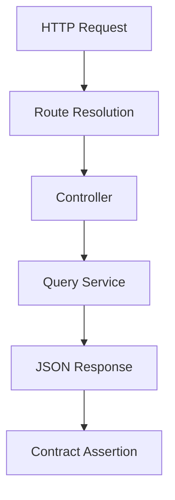

## Required Response Assertions

A successful price response must verify:

- HTTP status is `200`.
- Content type is JSON.
- `symbol` exists and is normalized.
- `price` exists and is numeric.
- `currency` exists and is normalized.
- `last_updated_at` exists and is an ISO 8601 timestamp.
- No internal fields are exposed.

An error response must verify:

- Documented HTTP status.
- JSON response content type.
- `error.code` exists.
- `error.message` exists.
- No raw exception, stack trace, or secret is exposed.

## JSON Schema Consideration

Version 1.0 may use direct response assertions instead of introducing a separate JSON Schema dependency.

If JSON Schema validation is introduced later, it must supplement rather than replace readable request specifications.

---

# 11. Fallback and Resilience Testing

Fallback behaviour is the most important reliability characteristic in the project.

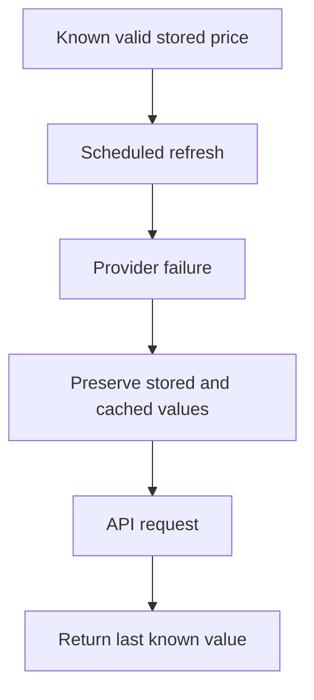

## Required Fallback Assertions

When the provider fails after a prior successful refresh:

- Existing `CryptoPrice` record remains unchanged.
- Existing cache value remains usable where cache behaviour permits.
- No blank or invalid replacement record is created.
- No unpersisted new value is written to cache.
- Public API request returns `200 OK` if a known price exists.
- Provider failure is observable through controlled logs or result behaviour.
- A future scheduled refresh remains possible.

## Resilience Test Design

Resilience tests should simulate at least:

| Failure Type                 | Test Method                                              |
| ---------------------------- | -------------------------------------------------------- |
| Connection timeout           | Stub provider client or HTTP adapter to raise a timeout. |
| Read timeout                 | Stub provider client or HTTP adapter to raise a timeout. |
| Network failure              | Raise a controlled network exception.                    |
| Invalid JSON                 | Return malformed JSON body.                              |
| Missing expected price field | Return incomplete provider payload.                      |
| Provider server error        | Return selected `5xx` response.                          |
| Provider rate limiting       | Return `429` response if supported by retry policy.      |
| Cache failure                | Make cache layer raise a controlled error.               |
| Persistence failure          | Make repository raise a controlled persistence error.    |

---

# 12. Background Job Testing

Background jobs are tested as orchestration boundaries.

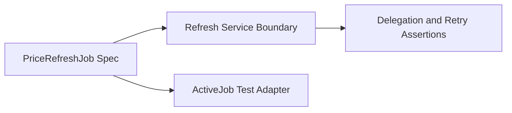

## Job Test Requirements

Job specs must verify:

- The job can be enqueued.
- The job receives expected serializable arguments.
- The job delegates to the refresh service.
- The job does not call persistence or provider clients directly.
- The job follows configured retry behaviour where supported.
- Controlled failures are surfaced or handled predictably.

## Scheduler Verification

The scheduler should not be tested by waiting for a real minute.

Instead, tests should verify the scheduler configuration or scheduling registration.

Examples of acceptable verification:

- Schedule definition includes the expected one-minute interval.
- Selected scheduler is configured to enqueue `PriceRefreshJob`.
- Scheduler configuration is loaded successfully in the intended environment.
- Configuration uses the expected symbols and quote currency.

The exact test approach depends on the selected scheduler library and must be documented after implementation.

---

# 13. Integration Testing

Integration tests verify high-value flows spanning multiple architectural layers.

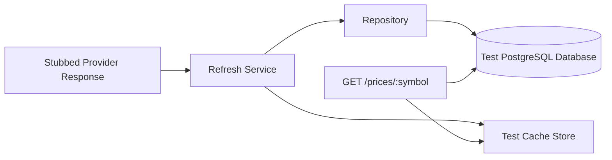

## Recommended Integration Scenarios

| Scenario                             | Boundaries Exercised                                                  |
| ------------------------------------ | --------------------------------------------------------------------- |
| Refresh creates API-visible price    | Provider client boundary, service, repository, cache, request path.   |
| Cache clear recovers from database   | Cache, repository, service, request path.                             |
| Provider outage preserves public API | Provider client failure, service fallback, persistence, request path. |
| Duplicate refresh remains safe       | Job or service, repository uniqueness, cache update.                  |
| Expired cache returns persisted data | Cache configuration, query service, repository, request response.     |

Integration tests should be limited to important workflows that are difficult to validate through a single lower-level test.

---

# 14. Coverage Strategy

## Coverage Target

The project target is:

```text id="4jh9qs"
At least 95% line coverage
```

Coverage is measured using SimpleCov once the test stack is configured.

## Coverage Rules

Coverage percentage is a signal, not a substitute for quality.

The project must not artificially increase coverage through meaningless assertions.

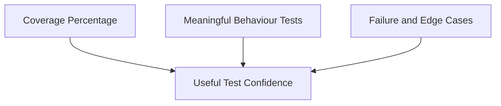

## Critical Components Requiring Full Behavioural Coverage

The following areas should approach complete meaningful coverage:

| Component               | Critical Behaviour                                                                   |
| ----------------------- | ------------------------------------------------------------------------------------ |
| `PriceQueryService`     | Cache hit, cache miss, persisted fallback, no stored value.                          |
| `PriceRefreshService`   | Success path, provider failure, persistence failure, cache failure.                  |
| `CoinGeckoClient`       | Valid parsing, timeout, malformed payload, error translation.                        |
| `PriceRefreshJob`       | Delegation and retry behaviour.                                                      |
| `PricesController`      | Success, invalid symbol, unsupported symbol, missing price, safe unexpected failure. |
| `CryptoPriceRepository` | Find and upsert behaviour.                                                           |
| `PriceCache`            | Read, write, miss, expiry-related behaviour.                                         |

## Coverage Threshold Enforcement

SimpleCov configuration should enforce the target threshold in CI once the implementation foundation is complete.

A coverage decrease requires:

1. Investigation.
2. A documented reason if temporary.
3. A plan to restore the expected threshold.
4. Approval before release.

---

# 15. Test Quality Standards

Every test should meet the following standards.

## Readability

Tests should use descriptive context and example names.

Good:

```ruby id="0e5kxq"
context "when no cached value exists but a stored value is available" do
  it "returns the stored value and repopulates cache" do
    # ...
  end
end
```

Avoid:

```ruby id="ng7sei"
it "returns value" do
  # ...
end
```

---

## Isolation

A test must clean up after itself or rely on transactional isolation.

Tests must not depend on:

- Data from another test.
- A manually populated development database.
- A running local scheduler.
- Network availability.
- Prior test ordering.

---

## Focus

Each test should validate one meaningful behaviour.

A test may contain multiple assertions when they describe one outcome, such as a response status, response payload, and associated cache update from a single request flow.

Tests should not combine unrelated behaviours merely to reduce file count.

---

## Maintainability

Test setup should be proportional to the scenario.

Use factories, helpers, and shared contexts only when they make intent clearer.

Avoid deeply nested setup that hides the condition under test.

---

## Failure Messages

Assertions should produce useful failure output.

When practical, include expected error code, symbol, or response field in failure context.

---

# 16. Local Test Execution

The exact commands become available after the Rails foundation and test tooling are configured.

## Run Entire Suite

```bash id="jco7d6"
bundle exec rspec
```

## Run One File

```bash id="wdjp4p"
bundle exec rspec spec/services/price_query_service_spec.rb
```

## Run One Example

```bash id="9je67a"
bundle exec rspec spec/services/price_query_service_spec.rb:42
```

## Run Model Tests

```bash id="q1zdl8"
bundle exec rspec spec/models
```

## Run Request Tests

```bash id="hnsuiu"
bundle exec rspec spec/requests
```

## Run Background Job Tests

```bash id="cv7b5c"
bundle exec rspec spec/jobs
```

## Run RuboCop

```bash id="sqhkzr"
bundle exec rubocop
```

## Run Brakeman

```bash id="cadnmw"
bundle exec brakeman
```

## Inspect Coverage

```bash id="xw0zmc"
open coverage/index.html
```

The final coverage-report command may differ by operating system.

---

# 17. Continuous Integration

Continuous integration validates the repository from a clean environment.

```mermaid id="dqo5av"
flowchart LR
    Push[Push or Pull Request]
    Install[Install Dependencies]
    PrepareDB[Prepare Test Database]
    Lint[Run RuboCop]
    Security[Run Brakeman]
    Specs[Run RSpec]
    Coverage[Verify SimpleCov Threshold]
    Result[Pass or Fail]

    Push --> Install
    Install --> PrepareDB
    PrepareDB --> Lint
    Lint --> Security
    Security --> Specs
    Specs --> Coverage
    Coverage --> Result
```

## Required CI Quality Gates

| Gate                    | Expected Result                                     |
| ----------------------- | --------------------------------------------------- |
| Dependency installation | `bundle install` completes successfully.            |
| Database preparation    | Test database is created and migrated successfully. |
| RSpec                   | Full suite passes.                                  |
| SimpleCov               | Coverage threshold is satisfied.                    |
| RuboCop                 | No unresolved lint violations.                      |
| Brakeman                | No unresolved security findings.                    |

CI must not require live CoinGecko access.

---

# 18. Debugging Failed Tests

## Investigate in This Order

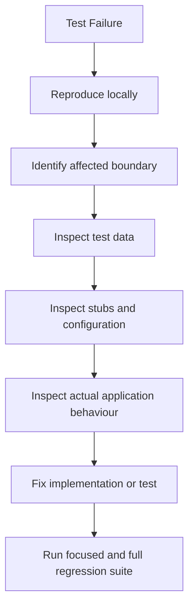

## Common Failure Categories

| Failure Type                         | Investigation Steps                                                                                  |
| ------------------------------------ | ---------------------------------------------------------------------------------------------------- |
| Unexpected `404` response            | Verify factory data, symbol normalization, support registry, and cache/database setup.               |
| Cache assertion failure              | Verify cache key, test-store configuration, expiry control, and write-after-persist ordering.        |
| Provider client failure              | Verify stubbed URL, headers, expected payload shape, timeout setup, and response parser assumptions. |
| Job not enqueued                     | Verify ActiveJob test adapter, job arguments, queue configuration, and scheduler registration.       |
| Database uniqueness failure          | Verify factory defaults, test cleanup, upsert implementation, and concurrent scenario setup.         |
| Flaky timestamp assertion            | Freeze time or compare timestamps using an acceptable tolerance.                                     |
| Test passes alone but fails in suite | Check shared state, environment variables, cache cleanup, database cleanup, and order dependency.    |

## Regression Rule

After fixing a failed test:

1. Run the focused example.
2. Run the relevant spec file.
3. Run the relevant spec directory.
4. Run the full test suite.
5. Re-run static analysis if production code changed.

---

# 19. Test Maintenance Requirements

This document and the test suite must be updated whenever any of the following changes:

- A public endpoint changes.
- A response field or error code changes.
- A new supported symbol is added with special behaviour.
- Cache strategy changes.
- Provider parsing or error translation changes.
- Retry behaviour changes.
- Scheduler implementation changes.
- Database schema or uniqueness scope changes.
- A production defect is fixed.
- A new architectural component is introduced.

## Required Test Change Workflow

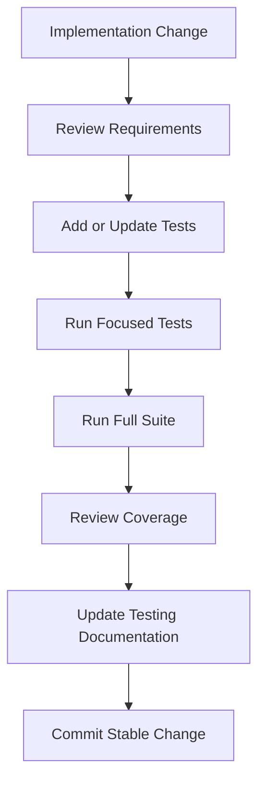

No production change is complete without appropriate automated verification.

---

# 20. Future Considerations

The following testing improvements are deliberately outside Version 1.0 scope.

| ID         | Consideration                              | Rationale                                                         |
| ---------- | ------------------------------------------ | ----------------------------------------------------------------- |
| FC-TST-001 | Mutation testing                           | Measures whether tests detect intentional code mutations.         |
| FC-TST-002 | Performance benchmarking                   | Establishes response-time and refresh-time baselines.             |
| FC-TST-003 | Load testing                               | Validates behaviour under concurrent request volume.              |
| FC-TST-004 | Consumer-driven contract testing           | Useful once independent API consumers exist.                      |
| FC-TST-005 | Chaos testing                              | Exercises resilience under randomized dependency failure.         |
| FC-TST-006 | Browser-based API documentation tests      | Useful if an interactive API portal is introduced.                |
| FC-TST-007 | Containerized integration test environment | Supports closer production-parity testing.                        |
| FC-TST-008 | Database migration compatibility testing   | Useful once production data and multiple deployed versions exist. |

These items should not be implemented unless the project scope is formally expanded.

---

# 21. Related Documentation

| Document                                                 | Relationship                                                                         |
| -------------------------------------------------------- | ------------------------------------------------------------------------------------ |
| [`PROJECT_SPECIFICATIONS.md`](PROJECT_SPECIFICATIONS.md) | Defines the requirements that automated tests must verify.                           |
| [`ARCHITECTURE.md`](ARCHITECTURE.md)                     | Defines component boundaries used to organize test ownership.                        |
| [`DATABASE.md`](DATABASE.md)                             | Defines model, migration, repository, uniqueness, and persistence test requirements. |
| [`API.md`](API.md)                                       | Defines request-spec contract expectations.                                          |
| [`BACKGROUND_JOBS.md`](BACKGROUND_JOBS.md)               | Defines job, scheduler, retry, and resilience test requirements.                     |
| [`ENGINEERING_JOURNAL.md`](ENGINEERING_JOURNAL.md)       | Records testing decisions and significant defect learnings.                          |
| [`JUNIOR_DEVELOPER_GUIDE.md`](JUNIOR_DEVELOPER_GUIDE.md) | Explains how a junior developer can implement and run the test suite from scratch.   |

---

# Testing Maintenance Statement

The test suite is a production asset.

It must remain synchronized with the implementation, project requirements, architecture, API contract, database design, and operational behaviour.

A passing suite that does not verify the intended behaviour is insufficient.

The project is considered ready for release only when the test suite is meaningful, deterministic, comprehensive for critical flows, and passing in both local development and continuous integration.
